# UML Arsitektur Sistem — Deployment Diagram

**Sistem:** enyx-enterprise  
**Tanggal:** 2026-08-29

---

## Diagram Deployment — Hubungan Antarperangkat Keras

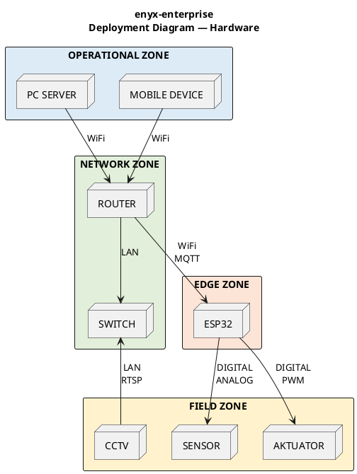

> **Tata letak vertikal (atas→bawah):** Baris 4 (atas) = PC Server & Mobile Device; Baris 3 = Router & Switch; Baris 2 = ESP32; Baris 1 (bawah) = CCTV, Sensor, Aktuator.

## Koneksi

| Dari | Ke | Protokol/Interface |
|------|-----|-------------------|
| PC SERVER → ROUTER | WiFi | — |
| MOBILE DEVICE → ROUTER | WiFi | — |
| ROUTER ↔ SWITCH | LAN | — |
| CCTV → SWITCH | LAN | RTSP |
| ROUTER ↔ ESP32 | WiFi | MQTT |
| ESP32 → SENSOR | — | Digital/Analog |
| ESP32 → AKTUATOR | — | Digital/PWM |

---

## Activity Diagram — Core Runtime ESP32 FreeRTOS

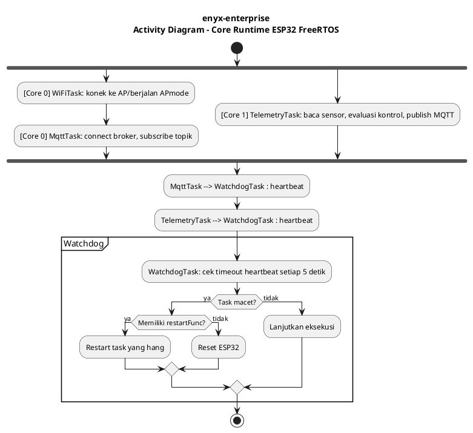

Core 0 menangani semua komponen jaringan dan pengawasan sistem (WiFiTask, MqttTask, WatchdogTask, SysMonitorTask). Core 1 dialokasikan untuk TelemetryTask yang bertugas membaca sensor secara periodik setiap 5 detik, memproses data GPIO, Modbus RS485, dan I2C, lalu memformatnya menjadi JSON sebelum diteruskan ke MqttTask. Hanya MqttTask dan TelemetryTask yang mengirim heartbeat ke WatchdogTask.

---

## Class Diagram — Factory Pattern & Registry ProtocolHandler

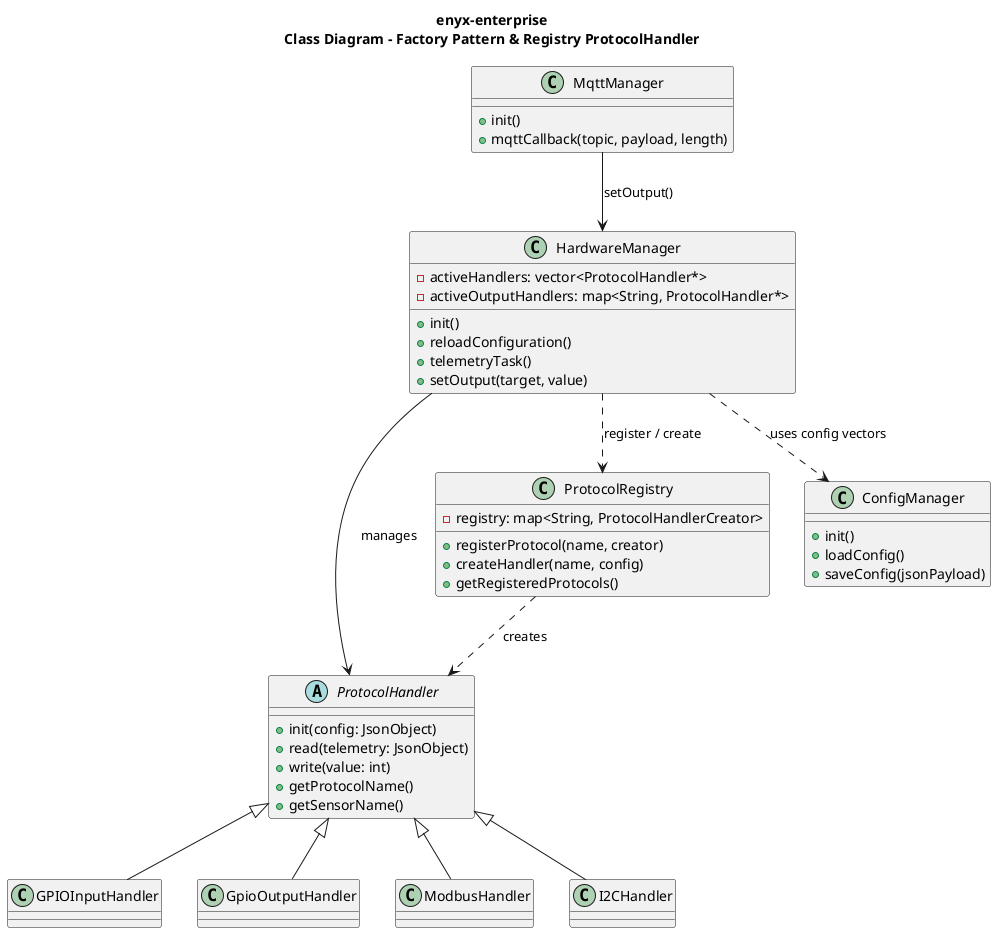

`ConfigManager` memuat `config.json` dari LittleFS saat boot dan memetakan elemen JSON ke dalam `std::vector` in-memory di namespace `Config`. Saat `HardwareManager::init()` dijalankan, semua handler didaftarkan ke `ProtocolRegistry` sebagai peta `String → lambda creator`. `TelemetryTask` mengiterasi `activeHandlers` dan memanggil `read()` untuk setiap sensor, sedangkan `MqttCallback` menerima perintah aktuator dan memanggil `HardwareManager::setOutput()`.

---

## Sequence Diagram — Telemetry Flow

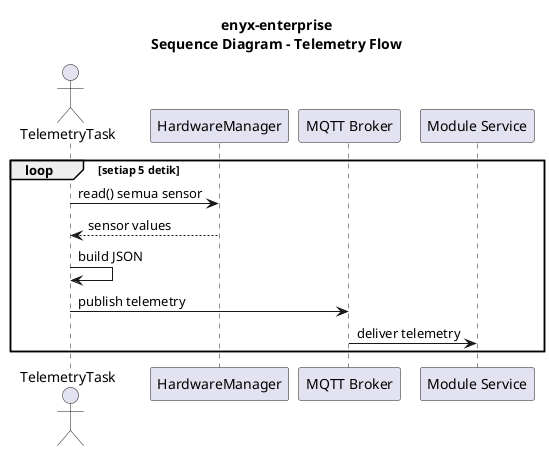

`TelemetryTask` di Core 1 membaca semua sensor melalui `activeHandlers` (GPIO, Modbus RS485, I2C), membentuk JSON, lalu mempublikasikan ke topik `smartfarm/{node_id}/telemetry` setiap 5 detik.

---

## Sequence Diagram — Actuator Command Flow

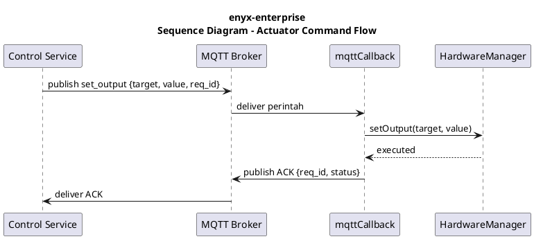

Control Service mengirim perintah ke topik `smartfarm/actuator/{node_id}`. Perintah diterima oleh `mqttCallback`, diparse, kemudian diteruskan ke `HardwareManager::setOutput()` yang pada akhirnya memanggil `write()` pada handler aktuator yang sesuai. Setelah eksekusi berhasil, ESP32 mengirim ACK ke topik `smartfarm/{node_id}/confirm`.

---

## Sequence Diagram — Adaptive Control Flow

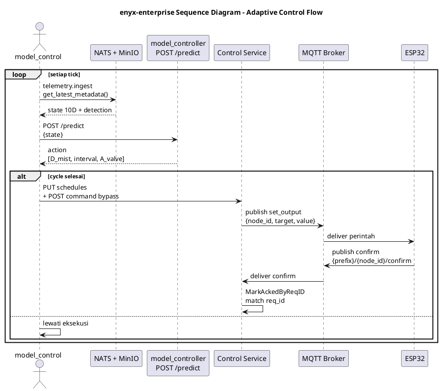

---

## Sequence Diagram — Control Service Command Flow

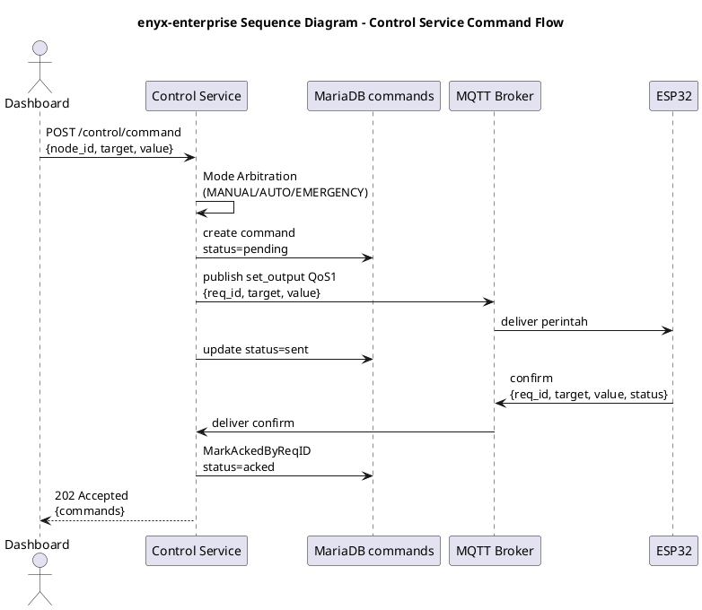

Dashboard mengirim perintah ke Control Service melalui `POST /control/command`. Control Service melakukan Mode Arbitration untuk memeriksa mode node (MANUAL/AUTO/EMERGENCY) dan memastikan perintah diizinkan. Perintah disimpan ke MariaDB dengan status `pending`, lalu dipublikasikan ke MQTT dengan QoS 1. ESP32 menerima dan mengeksekusi perintah, kemudian mengirim konfirmasi ke topik `{prefix}/{node_id}/confirm`. Control Service menerima konfirmasi, mencocokkan `req_id`, dan memperbarui status menjadi `acked`. Sweep worker secara periodik memeriksa perintah yang tidak mendapat konfirmasi dalam 8 detik dan mengubah statusnya menjadi `timeout`.

---

## State Machine Diagram — Command Lifecycle

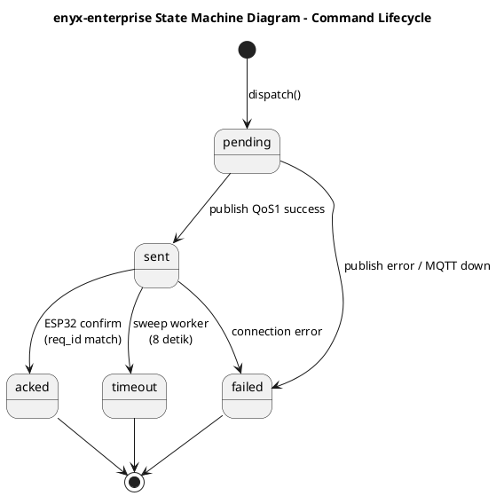

Setiap perintah kontrol melalui lima tahapan status transaksional: `pending` → `sent` → `acked`. Jika dalam 8 detik tidak ada respons, sweep worker mengubah status menjadi `timeout`. Jika terjadi gangguan koneksi/MQTT tidak tersedia, status langsung `failed`.

---

## Data Flow Diagrams

### Telemetry Pipeline

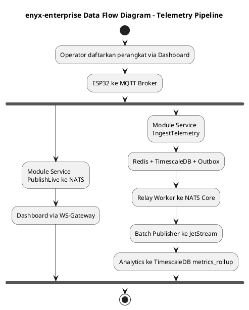

### Analytics Pipeline

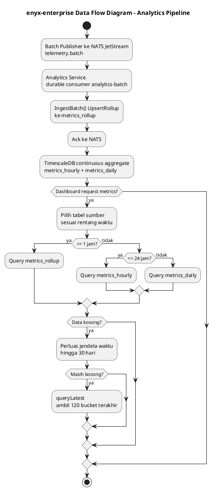

Saat dashboard meminta data grafik, sistem memilih tabel sumber secara otomatis: `metrics_rollup` untuk ≤1 jam, `metrics_hourly` untuk ≤24 jam, dan `metrics_daily` untuk >24 jam. Jika tidak ada data, sistem memperluas jendela pencarian secara bertingkat hingga 30 hari.

### ML/Stream Pipeline

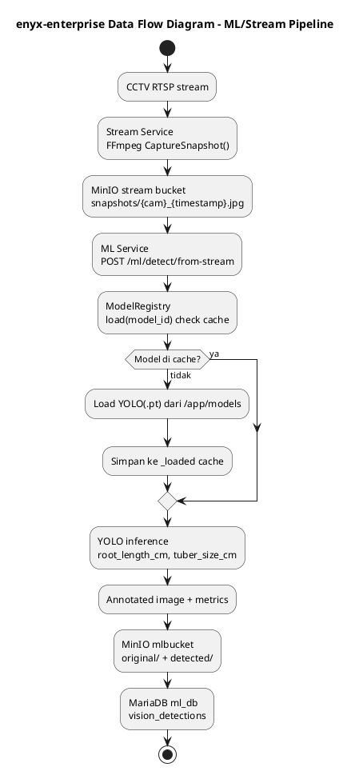

### RL Training Pipeline

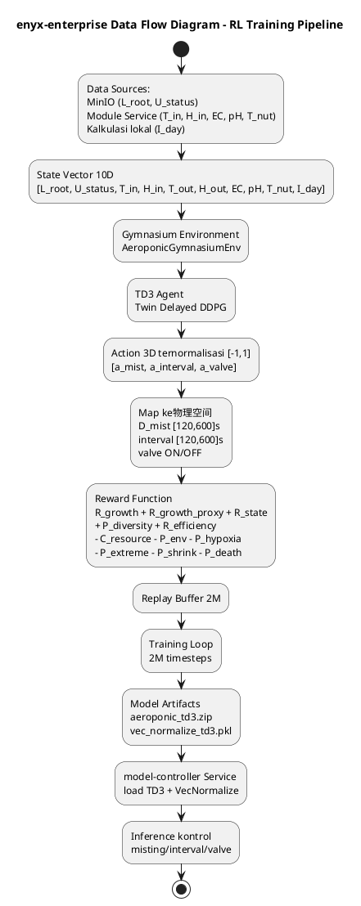

---

## Activity Diagram — Mode Arbitration

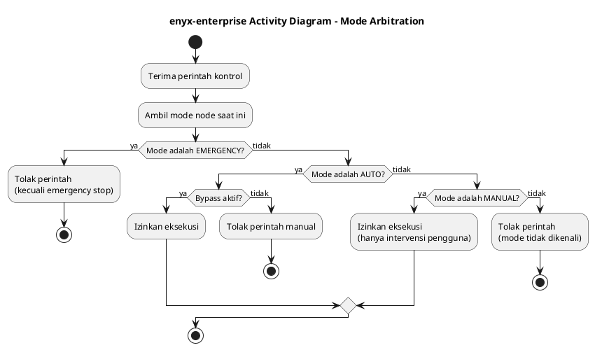

Sebelum perintah dieksekusi, Control Service melakukan Mode Arbitration untuk menghindari bentrok eksekusi: EMERGENCY tolak semua kecuali emergency stop; AUTO tolak perintah manual kecuali bypass aktif; MANUAL hanya izinkan intervensi manual.

---

## Activity Diagram — Scheduler Engine

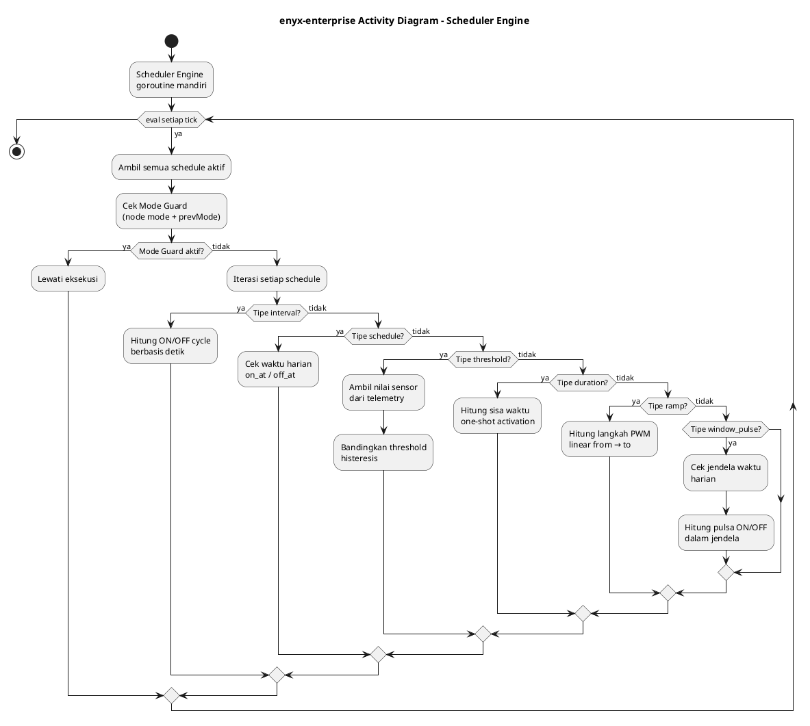

Scheduler Engine mengelola enam tipe penjadwalan: `interval` (siklus ON/OFF berbasis detik), `schedule` (waktu harian), `threshold` (histeresis sensor), `duration` (one-shot activation), `ramp` (transisi PWM linear), `window_pulse` (pulsa dalam jendela waktu harian).

---

## Class Diagram — Model Registry

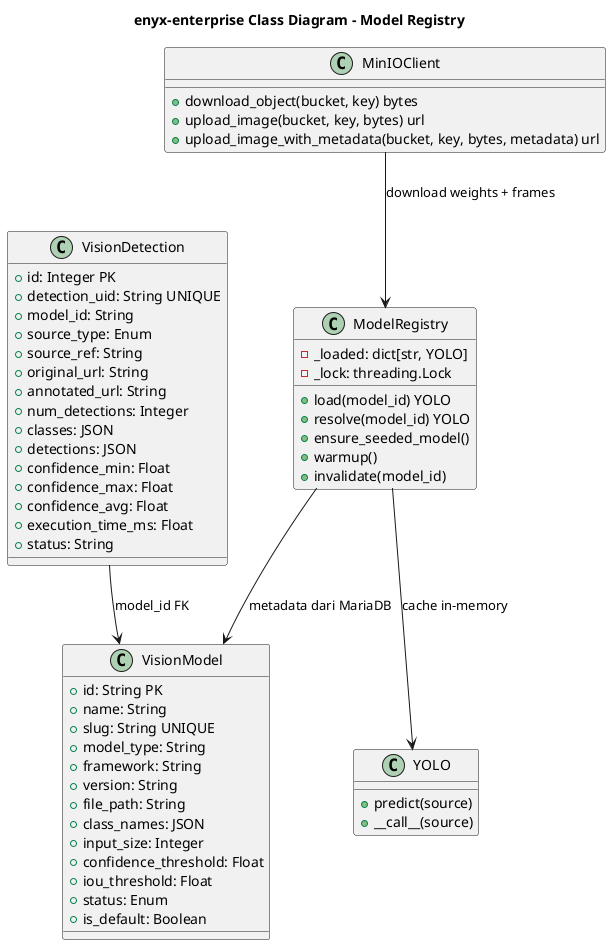

Dashboard memicu AI detect melalui `POST /streams/{id}/snapshot?detect=true`. Stream Service menangkap frame dari MediaMTX, mengunggahnya ke MinIO bucket `stream`, lalu memanggil ML Service `POST /ml/detect/from-stream`. ML Service mengunduh frame, memuat model YOLOv8 via `ModelRegistry` (dengan cache in-memory), menjalankan inferensi untuk mendeteksi akar dan umbi, mengukur panjang akar dalam cm, lalu menyimpan gambar original dan annotated ke MinIO `mlbucket`.

---

## Sequence Diagram — AI Detect Inference Flow

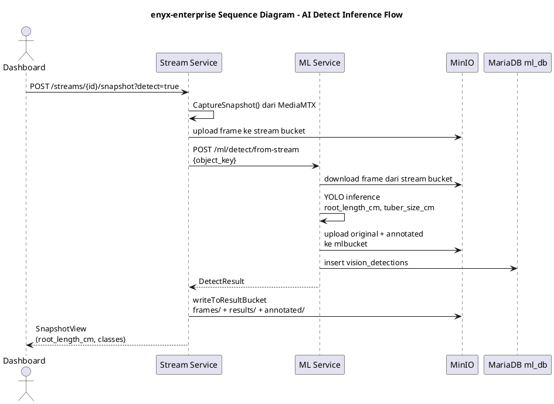
