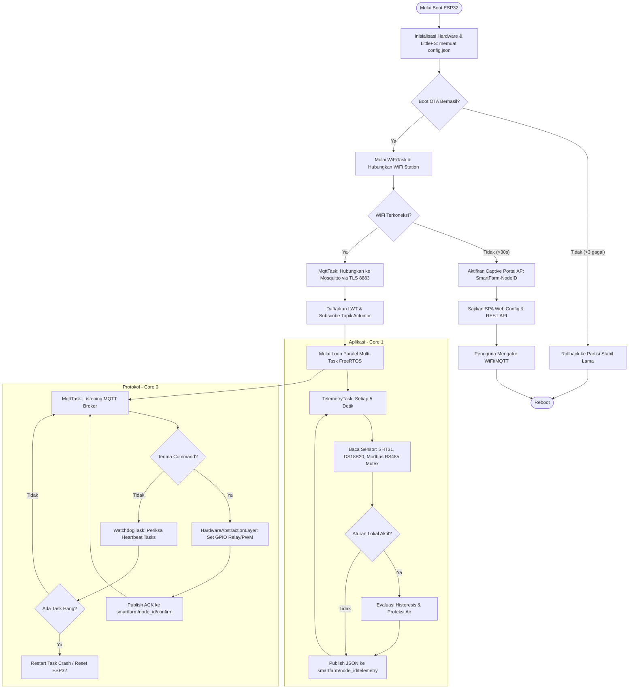
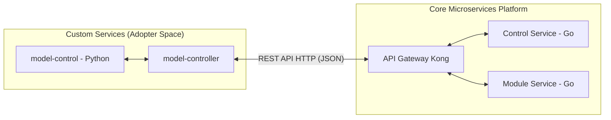
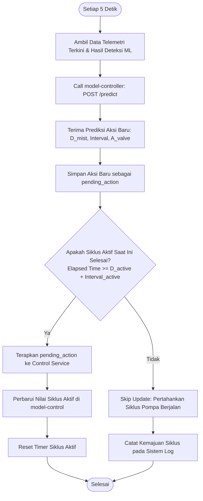

<!--
environment_details
Current time: 2026-08-03T19:21:31+07:00
Working directory: /home/almuzky/TA/Microservices
Workspace root folder: /home/almuzky/TA/Microservices
-->

# BAB III — METODE PENELITIAN DAN PERANCANGAN SISTEM

---

## 3.1 Metode Penelitian

### 3.1.1 Pendekatan dan Jenis Penelitian

Penelitian ini bersifat **terapan dan rekayasa sistem** (*applied engineering research*) yang bertujuan merancang, membangun, dan mengevaluasi sistem pemantauan serta kontrol lingkungan tanaman aeroponik berbasis arsitektur *microservice*. Metode yang digunakan mengikuti siklus *Design Science Research* (DSR) (Hevner et al., 2004), yang terdiri dari fase:

1. **Identifikasi masalah dan motivasi** — analisis kebutuhan pemantauan aeroponik presisi
2. **Pendefinisian tujuan solusi** — spesifikasi kebutuhan fungsional dan non-fungsional
3. **Perancangan dan pengembangan** — desain arsitektur, implementasi komponen
4. **Demonstrasi** — pengujian sistem secara integrasi
5. **Evaluasi** — pengukuran terhadap kriteria performa dan keberhasilan
6. **Komunikasi** — dokumentasi hasil dalam laporan ini

---

### 3.1.2 Tahapan Penelitian (Alur Kerja)

| Tahap | Kegiatan | Output |
|-------|----------|--------|
| 1. Studi Literatur | Kajian arsitektur microservice, IoT, reinforcement learning (TD3), sistem aeroponik | Dasar teori (Bab II) |
| 2. Analisis Kebutuhan | Identifikasi kebutuhan fungsional dan non-fungsional sistem | Spesifikasi kebutuhan (§3.2) |
| 3. Perancangan Arsitektur | Desain topologi layanan, protokol komunikasi, skema database | Diagram arsitektur (§3.3) |
| 4. Implementasi | Pembangunan microservices, firmware, dashboard, model AI | Kode sumber dan layanan berjalan |
| 5. Pengujian | Unit test, stress test, resilience test, uji integrasi end-to-end | Hasil pengujian (Bab IV) |
| 6. Evaluasi dan Analisis | Analisis kinerja, akurasi kontrol, reliabilitas | Pembahasan (Bab IV) |

---

### 3.1.3 Alat dan Bahan

**Perangkat Keras:**

| Komponen | Fungsi |
|----------|--------|
| Komputer Server / Host | Menjalankan seluruh kontainer Docker Compose (layanan backend, database, broker, monitoring) |
| ESP32 Microcontroller | Node sensor aeroponik — mengumpulkan data telemetri dan menjalankan aktuator |
| Sensor Lingkungan | Suhu, kelembapan, EC (Electrical Conductivity), pH, suhu larutan nutrisi |
| Aktuator | Pompa misting (pump/load1), valve nutrisi (valve/load2) |
| Kamera IP / ESP32-CAM | Sumber umpan visual (RTSP) untuk deteksi kondisi tanaman |

**Perangkat Lunak:**

| Kategori | Teknologi | Versi |
|----------|-----------|-------|
| Backend Services | Go | 1.26 |
| AI/ML Service | Python + FastAPI | 3.11 |
| Frontend Dashboard | React + Vite | 18.x |
| Container Orchestration | Docker Compose | v2.20+ |
| API Gateway | Kong | 3.6 |
| Message Broker (IoT) | Eclipse Mosquitto (MQTT) | 2.x |
| Event Bus (Inter-Service) | NATS JetStream | 2.10 |
| Database Relasional | MariaDB | 10.11 |
| Database Time-Series | TimescaleDB (PostgreSQL) | 2.17 |
| Cache | Redis | 7.x |
| Object Storage | MinIO | latest |
| Video Streaming | MediaMTX | latest |
| Monitoring | Prometheus + Grafana | 3.4 / 11.x |
| RL Framework | Stable-Baselines3 + PyTorch | latest |

---

## 3.2 Analisis Kebutuhan Sistem

### 3.2.1 Kebutuhan Fungsional

Berdasarkan permasalahan yang diidentifikasi (Bab I) dan studi literatur (Bab II), berikut kebutuhan fungsional yang harus dipenuhi sistem:

| Kode | Kebutuhan Fungsional | Prioritas |
|------|----------------------|-----------|
| KF-01 | Sistem dapat menerima data telemetri sensor dari node ESP32 secara berkala melalui protokol MQTT | P1 |
| KF-02 | Sistem menyimpan data telemetri dalam database time-series untuk analisis historis | P1 |
| KF-03 | Sistem menampilkan data telemetri secara real-time pada dashboard melalui koneksi WebSocket | P1 |
| KF-04 | Sistem mendukung autentikasi pengguna berbasis JWT dengan tiga tingkat akses (Admin, Operator, Viewer) | P1 |
| KF-05 | Sistem dapat mengirim perintah kontrol aktuator (pompa/valve) ke perangkat ESP32 melalui MQTT | P1 |
| KF-06 | Sistem mendukung mode kontrol manual, penjadwalan otomatis, dan kontrol berbasis AI (TD3) | P1 |
| KF-07 | Sistem mengevaluasi ambang batas sensor dan membangkitkan notifikasi peringatan secara otomatis | P1 |
| KF-08 | Sistem menyediakan analitik agregat data telemetri dengan resolusi berbeda (per jam, per hari) | P2 |
| KF-09 | Sistem mendukung streaming video dari kamera (RTSP → HLS/WebRTC) dan deteksi visual berbasis YOLO | P2 |
| KF-10 | Sistem mengontrol jadwal misting secara adaptif menggunakan model reinforcement learning (TD3) berdasarkan kondisi tanaman dan telemetri | P2 |
| KF-11 | Sistem menyediakan ekspor data telemetri dalam format CSV | P3 |
| KF-12 | Sistem mencatat audit trail setiap tindakan kritis ke dalam log terpusat | P2 |
| KF-13 | Sistem menangani kegagalan pengiriman pesan melalui mekanisme Dead Letter Queue (DLQ) | P2 |

### 3.2.2 Kebutuhan Non-Fungsional

| Kode | Kebutuhan Non-Fungsional | Tolok Ukur |
|------|--------------------------|------------|
| KNF-01 | Ketersediaan (Availability) | Sistem dapat di-restart secara otomatis bila terjadi kegagalan (restart policy: unless-stopped) |
| KNF-02 | Performa / Latensi | Latensi telemetri ESP32 → Dashboard ≤ 2 detik (p95); latensi REST via gateway ≤ 300 ms (p95) |
| KNF-03 | Skalabilitas | Arsitektur mendukung penambahan node sensor tanpa perubahan struktural layanan inti |
| KNF-04 | Keamanan | Autentikasi JWT pada semua protected route; enkripsi kredensial di variabel lingkungan; RBAC tiga level; isolasi jaringan Docker |
| KNF-05 | Isolasi Kegagalan | Kegagalan satu layanan tidak merambat ke layanan lain (bounded context + Database-per-Service) |
| KNF-06 | Keterpantauan (Observability) | Metrik Prometheus tersedia dari semua layanan; audit trail dapat dilacak berdasarkan correlation ID |
| KNF-07 | Kemudahan Pengelolaan | Seluruh infrastruktur diorkestrasi via docker-compose.yml tunggal; konfigurasi via variabel lingkungan (.env) |
| KNF-08 | Ketepatan Kontrol AI | Model TD3 menghasilkan jadwal misting yang menjaga kelembapan zona akar (H_in) ≥ 85% dari waktu berada dalam rentang [80%, 95%] |

---

## 3.3 Perancangan Arsitektur Sistem

Dengan kebutuhan yang telah terdefinisi, bagian ini menjelaskan bagaimana sistem dirancang untuk memenuhi kebutuhan tersebut. Arsitektur adalah "blue print" yang menghubungkan semua komponen.

### 3.3.1 Gambaran Umum Arsitektur

Sistem dirancang menggunakan **Arsitektur Microservice** dengan pola **Database-per-Service** dan komunikasi **Event-Driven** melalui NATS JetStream. Seluruh akses eksternal dikelola oleh satu **API Gateway** (Kong), sehingga klien hanya berinteraksi melalui satu titik masuk.

Secara topologis, sistem terdiri dari tujuh lapisan:

| Lapisan | Komponen Utama | Peran |
|---------|----------------|-------|
| Device Layer | ESP32 + Sensor/Aktuator | Pengumpulan data lingkungan dan eksekusi perintah fisik |
| Edge Layer | Mosquitto MQTT Broker | Penghubung antara perangkat IoT dan layanan backend |
| Ingestion Layer | Module Service | Penerimaan telemetri MQTT, penyimpanan, dan publikasi ke event bus |
| Processing Layer | Analytics, Alert, ML, Control, Stream | Pemrosesan data: agregasi, evaluasi threshold, inferensi AI, kontrol |
| Gateway Layer | Kong API Gateway | Satu titik masuk untuk semua traffic REST dan WebSocket |
| Presentation Layer | Dashboard (React) + WS-Gateway | Antarmuka pengguna real-time |
| Observability Layer | Prometheus + Grafana | Pemantauan kesehatan seluruh layanan |

Prinsip **single-responsibility** dan **Database-per-Service** menjamin bahwa setiap layanan dapat diskalakan, diperbarui, atau diganti secara independen tanpa mengganggu layanan lainnya.

Gambar arsitektur sistem dapat direpresentasikan dalam satu diagram berlapis (*layered diagram*) yang menunjukkan tujuh lapisan utama dan tiga jalur komunikasi. Diagram ini sebaiknya dibuat dalam format draw.io atau Word dengan susunan sebagai berikut: **Device Layer** (ESP32) mengirimkan data ke **Edge Layer** (Mosquitto), yang selanjutnya diteruskan ke **Ingestion Layer** (Module Service). Dari Module Service, data memisah menjadi dua aliran: (1) telemetri batch mengalir melalui **Processing Layer** (Analytics/Alert/Control/ML) untuk diproses, dan (2) data real-time diteruskan ke **Presentation Layer** (WS-Gateway + Dashboard). Semua akses REST dari dashboard melewati **Gateway Layer** (Kong). **Observability Layer** (Prometheus + Grafana) menjangkau seluruh lapisan melalui sidecar metrics. Tiga jalur komunikasi yang perlu digambarkan secara eksplisit adalah: *Jalur 1 — REST API* (panah dua arah antara Dashboard dan Kong, serta antara Kong dan setiap service), *Jalur 2 — WebSocket* (panah dari WS-Gateway ke Dashboard), dan *Jalur 3 — Event Bus NATS* (panah publish/subscribe antar service di Processing Layer).

### 3.3.2 Pola Komunikasi

Terdapat tiga jalur komunikasi utama yang digunakan secara konsisten dalam sistem:

**Jalur 1 — REST API (Request-Response):**
Semua operasi CRUD dan kueri mengalir dari Dashboard/Client → Kong → Service tujuan. Kong memvalidasi token JWT sebelum meneruskan permintaan. Setiap service juga memvalidasi JWT secara mandiri (defense-in-depth).

**Jalur 2 — Real-Time WebSocket:**
Data telemetri real-time mengalir dari NATS → WS-Gateway → Kong (route `/ws`) → Dashboard. WS-Gateway berperan sebagai jembatan dua arah antara NATS dan klien browser. Koneksi WebSocket diautentikasi dengan JWT pada fase handshake.

**Jalur 3 — Inter-Service Event Bus (NATS):**
Semua komunikasi antar-layanan dilakukan secara asinkron melalui NATS JetStream. Tidak ada panggilan HTTP langsung antar layanan backend (kecuali untuk operasi sinkron tertentu). Pola ini memastikan isolasi temporal antar layanan.

### 3.3.3 Rancangan Database (Database-per-Service)

Setiap layanan memiliki database terisolasi sesuai kebutuhan datanya. Prinsip ini mencegah coupling pada level data dan memungkinkan evolusi skema secara independen.

| Layanan | Database | Justifikasi Pemilihan |
|---------|----------|-----------------------|
| Auth | MariaDB (auth_db) | Data relasional: user, role, permission, refresh token |
| Module | MariaDB + TimescaleDB | Metadata perangkat (relasional) + telemetri time-series |
| Analytics | TimescaleDB (analytics_ts) | Khusus agregasi time-series dengan continuous aggregate |
| Control | MariaDB (control_db) | Riwayat perintah, jadwal, dan konfigurasi aktuator |
| Alert | MariaDB (alert_db) | Konfigurasi threshold dan riwayat alert |
| Notification | MariaDB (notification_db) | Log pengiriman notifikasi |
| Audit | MariaDB (audit_db) | Append-only audit trail |
| ML | MariaDB (ml_db) | Registri model YOLO dan metadata inferensi |
| Stream | MariaDB (stream_db) | Metadata stream kamera dan snapshot |
| Export | TimescaleDB (read) + Redis | Antrian pekerjaan ekspor + cache |
| Redis (shared) | 1 instance, multi-DB logis | Cache/ephemeral store (module=DB0, alert=DB1, dst.) |
| MinIO (shared) | 2 bucket: stream, mlbucket | Snapshot/recording (Stream) + hasil anotasi/model (ML) |

> **Catatan:** Konsolidasi Redis dan MinIO menjadi instance bersama tidak melanggar prinsip Database-per-Service, karena keduanya bersifat cache/ephemeral — bukan sumber kebenaran domain.

### 3.3.4 Rancangan Kontrak API dan Event

**Standar Respons REST:**
Semua layanan menggunakan format respons JSON yang seragam:
- Sukses: `{ "success": true, "data": <payload> }`
- Error: `{ "success": false, "error": { "code": "<KODE>", "message": "<pesan>" } }`

**Kontrak NATS Subject (Event Bus):**

| Subject | Publisher | Subscriber | Jenis |
|---------|-----------|------------|-------|
| telemetry.ingest | Module | Alert, WS-Gateway | Core NATS |
| telemetry.batch | Module | Analytics | JetStream |
| alert.triggered / alert.resolved | Alert | Notification, WS-Gateway | Core NATS |
| audit.log | Semua layanan | Audit | Core NATS |
| detection.result | ML Service | model-control | Core NATS |

**Kontrak MQTT Topic (Edge):**

| Topic | Arah | Penjelasan |
|-------|------|------------|
| smartfarm/<node_id>/telemetry | ESP32 → Mosquitto → Module | Data sensor periodik |
| smartfarm/actuator/<node_id> | Control → Mosquitto → ESP32 | Perintah aktuator |
| smartfarm/<node_id>/confirm | ESP32 → Mosquitto → Module/Control | Konfirmasi eksekusi perintah |

---

## 3.4 Perancangan Komponen Perangkat Keras

Arsitektur perangkat lunak hanya bermakna jika ada perangkat keras yang mengirimkan data nyata. Bagian ini menjelaskan sisi fisik sistem.

### 3.4.1 Topologi Jaringan Node Sensor

Node sensor aeroponik berbasis **ESP32** terhubung ke jaringan WiFi lokal dan berkomunikasi dengan broker MQTT (Mosquitto) di server. Setiap node secara periodik mempublikasikan data sensor dan berlangganan topik perintah aktuator.

**Sensor yang digunakan:**
- Sensor suhu dan kelembapan udara (dalam & luar): SHT31 (SensorTemp & Humidity, I2C, presisi ±0.2°C / ±2% RH)
- Sensor EC (Electrical Conductivity) larutan nutrisi
- Sensor pH larutan nutrisi
- Sensor suhu larutan nutrisi

Desain modular perangkat keras memungkinkan penambahan kategori sensor baru tanpa perlu menulis ulang firmware. Setiap jenis sensor memetakan nilai telemetrinya ke kolom MQTT yang terpisah, dan firmware ESP32 menggunakan registry sensor modular yang mendaftarkan driver sensor secara dinamis. Akibatnya, integrasi sensor baru hanya memerlukan penambahan driver dan skema MQTT, bukan perubahan arsitektur keseluruhan sistem.

**Aktuator yang dikendalikan:**
- Pompa misting (load1/pump) — dikontrol via sinyal on/off dengan jadwal interval
- Valve nutrisi (load2/valve) — dikontrol via perintah langsung on/off dari TD3 controller

### 3.4.2 Firmware ESP32

Firmware pada *aeroponic node* dirancang dengan pendekatan modular berbasis sistem operasi waktu nyata **FreeRTOS** pada mikrokontroler ESP32 dual-core. Desain ini bertujuan untuk membagi beban komputasi secara efisien dan memastikan keandalan eksekusi tugas fisik maupun komunikasi jaringan tanpa adanya pemblokiran (*non-blocking*).

#### A. Arsitektur Multi-Tasking FreeRTOS
Beban kerja firmware didistribusikan ke dalam **6 task FreeRTOS independen** yang dibagi berdasarkan core prosesor ESP32 sebagai berikut:

1. **WiFiTask (Core 0, Prioritas 2)**: Menangani siklus hidup koneksi Wi-Fi (sebagai client/Station) serta melayani *Captive Web Portal* (sebagai Access Point) jika jaringan Wi-Fi utama tidak tersedia atau membutuhkan konfigurasi ulang.
2. **MqttTask (Core 0, Prioritas 2)**: Mengelola koneksi persisten ke broker MQTT (Mosquitto), menangani proses *subscription* topik perintah aktuator, serta meneruskan pesan masuk ke antrean eksekusi perintah.
3. **WatchdogTask (Core 0, Prioritas 2)**: Berjalan sebagai task pengawas yang memantau detak jantung (*heartbeat*) dari semua task lain secara berkala. Jika suatu task berhenti mengirimkan heartbeat, watchdog akan merestart task tersebut secara asinkron atau memicu reset sistem.
4. **SysMonitorTask (Core 0, Prioritas 1)**: Memantau penggunaan memori heap, fragmentasi memori, dan memicu pembersihan memori atau restart otomatis jika tingkat memori bebas berada pada ambang batas kritis.
5. **TelemetryTask (Core 1, Prioritas 1)**: Mengatur pembacaan sensor berkala (setiap 5 detik), termasuk pemanggilan protokol Modbus RS485 dan pembacaan GPIO analog/digital, serta memformat data menjadi dokumen JSON sebelum dikirim ke broker.
6. **SerialTask (Core 1, Prioritas 1)**: Menyediakan antarmuka konfigurasi darurat berbasis CLI (*Command Line Interface*) melalui port USB serial.

#### B. Captive Web Portal Lokal
Untuk konfigurasi awal di lapangan tanpa koneksi internet, node memancarkan *Access Point* lokal (`SmartFarm-{NODE_ID}`). Ketika pengguna terhubung, DNS server lokal akan mengarahkan semua kueri HTTP ke web portal konfigurasi yang disimpan di memori flash internal ESP32 menggunakan sistem berkas **LittleFS**. Portal ini didesain menggunakan pustaka *ESPAsyncWebServer* yang aman dan asinkron sebagai *Single-Page Application* (SPA), dengan fitur-fitur berikut:

**1. Fitur Keamanan:**
- **Autentikasi Token**: REST API dilindungi menggunakan mekanisme Bearer Token untuk mencegah akses ilegal. Token disimpan di `localStorage` browser dan dikirim di setiap permintaan; jika menerima `401`, frontend menghapus token dan kembali ke layar login.
- **First-Time Password**: Node menghasilkan password admin acak pada boot pertama yang dicetak di antarmuka serial untuk meningkatkan keamanan bawaan (*secure by default*).
- **Login Rate Limiter**: Memblokir percobaan login setelah 5 kali kegagalan berturut-turut untuk mencegah serangan *brute force*.

**2. Fitur Status dan Monitoring:**
- **System Status (`/api/status`)**: Menampilkan status koneksi WiFi (Connected/Disconnected), alamat IP, kekuatan sinyal RSSI (dBm), status koneksi MQTT, firmware version, uptime, kecepatan CPU (MHz), dan utilisasi heap memory (free/total KB).
- **MQTT Live Logs**: Log aktivitas MQTT real-time dengan pewarnaan berbeda per tipe pesan (sukses, gagal, percobaan, pesan diterima), memudahkan debug koneksi broker tanpa serial monitor.
- **Telemetry Latest (`/api/telemetry/latest`)**: REST fallback yang menampilkan pembacaan sensor terkini (analog/digital inputs) untuk verifikasi cepat.
- **Device Info**: Menampilkan Node ID, firmware version, telemetry topic path, dan actuator topic path yang sedang digunakan.

**3. Fitur Konfigurasi Perangkat:**
- **Wi-Fi Config (`/api/wifi`)**: Ubah SSID, password, dan mendukung WPA2-Enterprise (EAP/PEAP) untuk jaringan kampus.
- **MQTT Config (`/api/mqtt`)**: Ubah broker address, port, topic prefix, kredensial MQTT, toggle TLS, dan interval telemetri.
- **Device Config (`/api/device`)**: Ubah Node ID perangkat.
- **Hardware Config (`/api/hardware`)**: Konfigurasi pin input/output dan definisi sensor Modbus — memungkinkan penambahan sensor baru tanpa ubah firmware.
- **Local Control Rules (`/api/local_control`)**: Definisi aturan edge-control berbasis threshold (input → output langsung di ESP32 tanpa MQTT) sebagai *safety net* saat jaringan putus.
- **Admin Account (`/api/account`)**: Ganti username dan password admin; invalidasi token aktif.

**4. Fitur Utilitas:**
- **Modbus Scanner (`/api/modbus/start_scan`, `/api/modbus/scan_reg`)**: Alat diagnostik untuk scan semua slave ID (1–247) pada baud rate tertentu dan baca register spesifik — memudahkan integrasi sensor RS485 baru.
- **OTA Firmware Update (`/api/ota`)**: Upload file `.bin` firmware baru dengan progress bar — pembaruan firmware jarak jauh.
- **Config Backup & Restore (`/api/config/export`, `/api/config/import`)**: Export `config.json` sebagai file backup atau import file konfigurasi baru untuk cloning antar node.
- **MQTT Discovery (`/api/publish_discovery`)**: Kirim sinyal discovery ke broker untuk registrasi otomatis perangkat.
- **Auto-Reconnect**: Setelah simpan konfigurasi + reboot, frontend otomatis ping `/api/status` tiap 2 detik dan reload halaman saat device online kembali.

#### C. Standar Komunikasi MQTT (Telemetri, Aktuator, Discovery, Status, Alert, Konfirmasi)
Seluruh komunikasi antara *aeroponic node* dengan backend sistem menggunakan protokol **MQTT 3.1.1/5.0** melalui broker Eclipse Mosquitto. Topik-topik dibangun dinamis berdasarkan konfigurasi `topic_prefix` (default: `smartfarm`) dan `node_id` unik per perangkat. Berikut standar komunikasi yang diimplementasikan:

**1. Topik MQTT:**

| Topik | Arah | Deskripsi |
|-------|------|-----------|
| `{prefix}/discovery` | ESP32 → Mosquitto | Sinyal discovery untuk registrasi otomatis node ke Module Service. |
| `{prefix}/status/{node_id}` | ESP32 → Mosquitto | LWT (Last Will Testament) dan status online/offline node. |
| `{prefix}/{node_id}/telemetry` | ESP32 → Mosquitto | Data telemetri sensor dan aktuator secara periodik (default setiap 5 detik). |
| `{prefix}/actuator/{node_id}` | Backend → ESP32 | Perintah kontrol aktuator (pompa, valve, dll). |
| `{prefix}/{node_id}/confirm` | ESP32 → Mosquitto | Konfirmasi eksekusi perintah aktuator dari backend. |
| `{prefix}/{node_id}/diagnostics` | ESP32 → Mosquitto | Data diagnostik sistem (heartbeat, kesehatan perangkat). |
| `{prefix}/{node_id}/alert` | ESP32 → Mosquitto | Notifikasi alert dari perangkat (misal: emergency shutdown). |

**2. Format Payload Telemetri (`{prefix}/{node_id}/telemetry`):**

Payload dikirim dalam format JSON dengan struktur hierarkis berikut:

```json
{
  "node_id": "node-01",
  "fw_version": "1.0.0",
  "network": {
    "ssid": "Nama-WiFi",
    "ip_address": "192.168.1.100",
    "wifi_rssi": -60
  },
  "device_info": {
    "uptime_s": 12345,
    "cpu_freq_mhz": 240,
    "free_heap_kb": 123,
    "flash_size_mb": 4
  },
  "connection_stats": {
    "mqtt_connected": true,
    "uptime_s": 12345
  },
  "telemetry": {
    "inputs": {
      "suhu_udara": 26.5,
      "kelembapan_udara": 68,
      "ec": 1.5,
      "ph": 6.2,
      "suhu_nutrisi": 24.0
    },
    "outputs": {
      "pump": 0,
      "valve": 1
    },
    "modbus": {
      "cwt1": {
        "temp": 25.5,
        "ph": 6.2
      }
    }
  }
}
```

Struktur payload ini dirancang modular:
- Bagian `network` dan `device_info` memberikan konteks kondisi perangkat.
- Bagian `telemetry.inputs` berisi pembacaan GPIO analog/digital berdasarkan konfigurasi `HardwareInputs`.
- Bagian `telemetry.outputs` berisi status outputs (DIGITAL/PWM) berdasarkan `HardwareOutputs`.
- Bagian `telemetry.modbus` berisi hasil polling sensor Modbus RS485 (EC, pH, suhu nutrisi, dll.) dengan nama sensor sesuai `HardwareModbus` config.

**3. Format Perintah Aktuator (`{prefix}/actuator/{node_id}`):**

Backend mengirim perintah kontrol dalam format JSON berikut:

```json
{
  "action": "set_output",
  "target": "pump",
  "value": 1,
  "req_id": "550e8400-e29b-41d4-a716-446655440000"
}
```

| Field | Tipe | Deskripsi |
|-------|------|-----------|
| `action` | string | Jenis aksi: `set_output` (saat ini satu-satunya yang didukung). |
| `target` | string | Nama output sesuai konfigurasi `HardwareOutputs` (misal: `pump`, `valve`). |
| `value` | int | Nilai yang akan diterapkan: `1` untuk ON, `0` untuk OFF. Untuk output PWM, nilai 0–255. |
| `req_id` | string (opsional) | UUID untuk korelasi dengan konfirmasi dari perangkat. |

**4. Format Konfirmasi Aktuator (`{prefix}/{node_id}/confirm`):**

ESP32 membalas eksekusi perintah dengan payload:

```json
{
  "req_id": "550e8400-e29b-41d4-a716-446655440000",
  "target": "pump",
  "value": 1,
  "status": "executed"
}
```

| Field | Tipe | Deskripsi |
|-------|------|-----------|
| `req_id` | string | UUID yang sama dengan perintah yang dikonfirmasi. |
| `target` | string | Nama output yang dieksekusi. |
| `value` | int | Nilai yang berhasil diterapkan. |
| `status` | string | Status eksekusi: `executed` (sukses). |

Mekanisme request-acknowledge-confirm ini menjamin bahwa setiap perintah kontrol memiliki siklus pelacakan lengkap untuk keandalan sistem.

**5. Format Discovery (`{prefix}/discovery`):**

Saat boot pertama atau setelah reboot, ESP32 mempublikasikan sinyal discovery:

```json
{
  "node_id": "esp32-001",
  "mac": "AA:BB:CC:DD:EE:FF",
  "ip": "192.168.1.100",
  "fw_version": "1.2.3",
  "status": "online"
}
```

Discovery dipublikasikan secara periodik setiap 60 detik untuk menangani race condition pada startup dan memastikan Module Service selalu mengetahui node yang aktif.

**6. Format Status/LWT (`{prefix}/status/{node_id}`):**

Last Will Testament (LWT) dan status online:

```json
{
  "status": "online",
  "mac": "AA:BB:CC:DD:EE:FF",
  "fw": "1.2.3",
  "ip": "192.168.1.100"
}
```

Jika ESP32 terputus secara tidak normal, Mosquitto akan otomatis mempublikasikan pesan LWT `{"status":"offline","mac":"..."}` ke topik yang sama.

**7. Format Alert (`{prefix}/{node_id}/alert`):**

Notifikasi alert dari perangkat:

```json
{
  "alert": "EMERGENCY_SHUTDOWN",
  "node_id": "node-01",
  "uptime_s": 12345
}
```

Alert ini dipicu otomatis oleh firmware saat emergency stop interrupt terdeteksi (misal: sensor ketinggian air mendeteksi tangki kosong).

**8. Konfigurasi Keamanan MQTT:**

- **TLS/SSL**: Mendukung koneksi aman via port 8883 dengan verifikasi CA certificate, client certificate, dan private key.
- **Authentication**: Mendukung username/password untuk autentikasi broker.
- **LWT (Last Will Testament)**: Membantu deteksi offline node secara otomatis.
- **Retained Messages**: Discovery dan status dipublikasikan dengan flag retained agar subscriber baru langsung menerima status terkini.

#### D. Arsitektur Modular Pembacaan Sensor (Configuration-Driven Input System)

Firmware ESP32 dirancang dengan arsitektur **configuration-driven** untuk pembacaan sensor, memungkinkan penambahan jenis sensor baru melalui konfigurasi JSON tanpa perlu mengubah kode sumber. Pendekatan ini memisahkan definisi perangkat keras dari logika pembacaan, sehingga sistem dapat beradaptasi dengan berbagai konfigurasi sensor aeroponik.

**1. Registry berbasis Vektor (Vector-Based Registry):**

Semua definisi input, output, dan sensor disimpan dalam `std::vector` global yang di-populate saat boot dari `config.json` di LittleFS:

```cpp
// Config.h
extern std::vector<InputPin> HardwareInputs;    // GPIO digital/analog
extern std::vector<OutputPin> HardwareOutputs;  // GPIO output (DIGITAL/PWM)
extern std::vector<ModbusSensor> HardwareModbus; // Sensor RS485 Modbus
extern std::vector<LocalControlRule> LocalControlRules; // Aturan edge control
```

Pada runtime, `HardwareManager::telemetryTask()` mengiterasi vektor-vektor ini untuk membaca setiap sensor dan menghasilkan payload JSON telemetri. Pendekatan ini menghilangkan kebutuhan *hardcoded* pin atau sensor-specific code di dalam loop utama.

**2. Penambahan Sensor GPIO (Digital/Analog) — Tanpa Perubahan Kode:**

Sensor berbasis GPIO (digital/analog) dapat ditambahkan sepenuhnya melalui `config.json`:

```json
{
  "hardware": {
    "inputs": [
      {
        "pin": 34,
        "type": "ANALOG",
        "pull": "NONE",
        "name": "soil_moisture",
        "invert": false,
        "debounce_ms": 0,
        "interrupt": "NONE",
        "analog_min": 0,
        "analog_max": 4095
      },
      {
        "pin": 15,
        "type": "DIGITAL",
        "pull": "UP",
        "name": "water_level",
        "invert": true,
        "interrupt": "FALLING"
      }
    ]
  }
}
```

Field yang tersedia:
- `pin`: Nomor GPIO ESP32.
- `type`: `"DIGITAL"` atau `"ANALOG"`.
- `pull`: `"UP"`, `"DOWN"`, atau `"NONE"` untuk internal pull resistor.
- `name`: Identifier unik yang digunakan di telemetry JSON dan MQTT topics.
- `invert`: Jika `true`, nilai LOW dibalik menjadi HIGH (berguna untuk sensor aktif-LOW).
- `debounce_ms`: Debounce time untuk input digital (0 = disabled).
- `interrupt`: `"RISING"`, `"FALLING"`, `"CHANGE"`, atau `"NONE"` untuk trigger interrupt.
- `analog_min` / `analog_max`: Rentang ADC untuk scaling (default 0–4095 untuk ESP32 12-bit ADC).

**3. Penambahan Sensor Modbus (RS485) — Tanpa Perubahan Kode:**

Sensor industri yang menggunakan protokol Modbus RTU (EC, pH, suhu nutrisi, NPK) dapat ditambahkan via konfigurasi:

```json
{
  "hardware": {
    "modbus": [
      {
        "name": "ph_sensor",
        "slave_id": 1,
        "baudrate": 9600,
        "registers": [
          {
            "address": 0,
            "name": "ph_value",
            "multiplier": 0.01,
            "type": "INPUT"
          }
        ]
      }
    ]
  }
}
```

Firmware melakukan **auto-baudrate switching** sebelum membaca setiap slave ID, sehingga beberapa sensor Modbus dengan baud rate berbeda dapat berbagi satu jalur RS485 fisik. Data Modbus muncul di payload telemetry di bawah `telemetry.modbus.{sensor_name}.{register_name}`.

**4. Dukungan Sensor I2C (DHT12, BME280, dll.) — Belum Diimplementasikan:**

Saat ini, arsitektur modular **hanya mendukung GPIO dan Modbus**. Sensor I2C seperti **DHT12**, **DHT22**, **BME280**, atau **SHT31** **belum diimplementasikan** secara penuh:

- `Config.h` mendefinisikan `PIN_DHT_SENSOR` (default GPIO 4) tetapi **tidak pernah digunakan** di kode pembacaan sensor.
- `platformio.ini` menyertakan library DHT (`Adafruit DHT sensor library`) sebagai dependensi, tetapi **tidak ada instansiasi atau pemanggilan** DHT di `HardwareManager.cpp`.
- `InputPin` struct **tidak memiliki field `type: "I2C"`** — hanya `"DIGITAL"` dan `"ANALOG"`.

Untuk menambahkan dukungan I2C, diperlukan perubahan kode:
1. Menambah nilai `"I2C"` pada field `type` di `InputPin`.
2. Menambah logika pembacaan I2C (melalui `Wire.h`) di `HardwareManager::telemetryTask()` dan `getSensorValueByName()`.
3. Menambah dependensi library sensor I2C spesifik (misal: `Adafruit_BME280`).

**5. Output Aktuator — Juga Configuration-Driven:**

Sama seperti input, aktuator (pompa, valve, fan) didefinisikan di `config.json`:

```json
{
  "hardware": {
    "outputs": [
      {
        "pin": 12,
        "type": "DIGITAL",
        "name": "pump"
      },
      {
        "pin": 13,
        "type": "DIGITAL",
        "name": "valve"
      }
    ]
  }
}
```

Control Service mengirim perintah `{"action":"set_output","target":"pump","value":1}` dan firmware mencari output dengan `target` sesuai `name` di `HardwareOutputs`. Ini memungkinkan nama output yang fleksibel tanpa hardcode pin di backend.

**6. Local Control Rules — Edge Computing Modular:**

Aturan kontrol lokal (edge rules) juga didefinisikan secara deklaratif di `config.json`:

```json
{
  "local_control": [
    {
      "name": "overheat_protection",
      "input_sensor": "suhu_udara",
      "output_target": "cooling_fan",
      "threshold_high": 30.0,
      "threshold_low": 25.0,
      "enabled": true
    }
  ]
}
```

Aturan ini dievaluasi di dalam `telemetryTask()` setelah pembacaan sensor, memungkinkan respons otomatis terhadap kondisi abnormal tanpa bergantung pada koneksi MQTT atau backend.

**7. Keunggulan dan Batasan Arsitektur Modular:**

| Aspek | Status | Deskripsi |
|-------|--------|-----------|
| Penambahan sensor GPIO | ✅ **Konfigurasi saja** | Digital/analog sensor ditambahkan via `config.json` tanpa upload firmware baru. |
| Penambahan sensor Modbus | ✅ **Konfigurasi saja** | Slave ID, baudrate, register address, dan multiplier ditambahkan via `config.json`. |
| Penambahan sensor I2C (DHT12, BME280) | ❌ **Perlu ubah kode** | Belum ada driver I2C generic; memerlukan penambahan library dan if/else branch di `HardwareManager.cpp`. |
| Penambahan protokol baru (SPI, 1-Wire) | ❌ **Perlu ubah kode** | Tidak ada factory pattern atau plugin registry untuk protocol handler baru. |
| Dynamic sensor discovery | ❌ **Tidak ada** | Sensor harus didaftarkan eksplisit di `config.json`; tidak ada auto-detection. |
| Sensor hot-swap | ❌ **Tidak ada** | Perubahan `config.json` memerlukan reboot ESP32 untuk diterapkan. |

**Kesimpulan:**

Arsitektur firmware ini mencapai modularitas pada lapisan **konfigurasi data** (pin assignment, sensor name, Modbus address) tetapi masih **monolithic pada lapisan protokol** (GPIO-only vs Modbus vs I2C). Penambahan sensor GPIO dan Modbus dapat dilakukan sepenuhnya via captive portal tanpa flashing ulang. Namun, untuk sensor berbasis protokol baru seperti DHT12/I2C, diperlukan perubahan kompilasi firmware. Ini adalah kompromi yang disengaja antara fleksibilitas konfigurasi dan kompleksitas implementasi pada constrained device seperti ESP32.

#### E. Logika Local Control Rules (Edge Computing)
- **Logika Histeresis**: Mencegah aktuator (seperti cooling fan) menyala-mati secara berulang akibat fluktuasi sensor yang tipis di sekitar ambang batas (*oscillation prevention*). Kipas pendingin dirancang aktif ketika suhu melampaui batas atas ($T_{high}$) dan hanya mati setelah suhu turun di bawah batas bawah ($T_{low}$).
- **Dry-Run Protection**: Pompa misting dirancang mati secara otomatis menggunakan interupsi tingkat perangkat keras (*hardware-level safety loop*) jika sensor ketinggian air mendeteksi tangki nutrisi kosong, guna mencegah kerusakan motor akibat berjalan tanpa cairan.

#### F. Protokol Modbus RS485 Mutex-Protected
Pembacaan sensor industri (seperti NPK tanah, EC, pH, suhu air) dikomunikasikan melalui bus RS485 menggunakan modul transceiver MAX485. Desain Modbus ini memiliki fitur:
- **Auto Baudrate Switching**: Memungkinkan ESP32 untuk berkomunikasi dengan berbagai sensor Modbus yang memiliki konfigurasi baudrate berbeda pada satu jalur bus fisik yang sama dengan mengganti baudrate serial UART secara dinamis sebelum memanggil alamat budak (*slave ID*) tertentu.
- **Mutex Protection**: Menggunakan objek *FreeRTOS Mutex* untuk melindungi bus serial RS485 dari akses bersamaan oleh beberapa task, menghindari korupsi data telemetri.

#### G. Dual-Partition OTA Update dengan Rollback Otomatis
Pembaruan firmware dari jarak jauh (*Over-The-Air*) menggunakan alokasi partisi ganda (*Dual Partition Scheme*): partisi aktif saat ini dan partisi target baru. Desain ketahanan mencakup:
- **Boot Counter di NVS**: Setelah menulis firmware baru dan melakukan restart, ESP32 mencatat jumlah boot sukses ke memori flash Non-Volatile Storage (NVS).
- **Auto Rollback**: Jika firmware baru mengalami crash berturut-turut sebanyak lebih dari 3 kali sebelum boot counter berhasil di-reset oleh task yang stabil, *bootloader* ESP32 akan mematikan partisi baru dan secara otomatis memuat partisi firmware stabil sebelumnya.

#### H. Alur Operasi Firmware
Operasi firmware secara keseluruhan mengikuti alur sekuensial dan asinkron seperti yang ditunjukkan pada diagram alir berikut:



Pemisahan tanggung jawab secara modular ini menjamin bahwa kegagalan satu komponen (seperti hilangnya sinyal WiFi) tidak akan memblokir pembacaan sensor fisik atau merusak aktuator pompa misting zona akar.

---

## 3.5 Perancangan Layanan Backend (Microservices)

Setelah arsitektur dan hardware terdefinisi, bagian ini menjelaskan rancangan masing-masing layanan yang membentuk sistem backend. Setiap layanan dirancang dengan prinsip single responsibility — satu layanan, satu domain bisnis.

Sistem backend terdiri dari **15 layanan** yang dikembangkan menggunakan bahasa Go dan Python. Masing-masing layanan mengikuti struktur direktori standar:

```
services/<nama-service>/
├── internal/
│   ├── config/      # Konfigurasi & environment variables
│   ├── model/       # Struct & DTO
│   ├── repository/  # Interaksi database
│   ├── service/     # Business logic
│   └── handler/     # HTTP handlers
├── main.go
├── Dockerfile
└── go.mod
```

Struktur direktori standar ini adalah manifestasi langsung dari prinsip *separation of concerns* pada tingkat kode. Karena setiap lapisan — konfigurasi, model, repository, service logic, dan handler — dipisahkan ke direktori masing-masing, pengembang dapat mengganti seluruh lapisan database (misal: mengganti MariaDB dengan PostgreSQL) hanya dengan memodifikasi layer repository, tanpa menyentuh logika bisnis di layer service. Demikian pula, pengujian unit dapat dilakukan secara terisolasi pada layer service dengan mock repository, dan deployment dapat diatur secara independen karena setiap service memiliki Dockerfile dan go.mod-nya sendiri. Pemisahan ini juga memudahkan penambahan layanan baru: cukup menyalakan *skeleton* direktori standar, mendefinisikan model dan repository, lalu menghubungkannya ke Kong dan NATS tanpa mengganggu layanan yang sudah berjalan.

### 3.5.1 Auth Service

**Domain:** Autentikasi, otorisasi, dan manajemen akun pengguna.

**Fungsi utama:**
- Registrasi akun, login dengan validasi kredensial, dan logout
- Penerbitan access token (JWT HS256, masa berlaku 15 menit) dan refresh token (rotasi + revokasi)
- Pengelolaan pengguna berbasis RBAC (Admin / Operator / Viewer)

**Poin desain kritis:**
- Semua protected route di layanan lain memvalidasi JWT menggunakan shared secret
- Refresh token disimpan dalam bentuk hash (SHA-256) di database, bukan teks biasa

Auth Service adalah fondasi keamanan seluruh ekosistem sistem. Tanpa layanan ini, tidak ada mekanisme yang mencegah akses tidak autorisasi ke data sensitif atau perintah kontrol fisik. Auth Service tidak hanya mengeluarkan token — ia juga menegakkan kebijakan akses berbasis peran (RBAC) yang memastikan pengguna dengan hak Viewer hanya dapat memantau data, sedangkan Admin memiliki kendali penuh atas konfigurasi sistem.

### 3.5.2 Module Service

**Domain:** Registrasi perangkat, onboarding node MQTT, dan ingest telemetri.

**Fungsi utama:**
- Menerima data telemetri dari Mosquitto dan menyimpan ke MariaDB (metadata) + TimescaleDB (time-series)
- Mekanisme discovery perangkat baru melalui MQTT
- Mempublikasikan event `telemetry.ingest` dan `telemetry.batch` ke NATS

Module Service adalah pintu masuk data dari dunia fisik ke sistem digital. Setiap bit telemetri yang dikirim ESP32 harus melewati tangan Module Service sebelum dapat diproses, dianalisis, atau ditampilkan. Posisi strategis ini menjadikannya sebagai *gateway* antara lapisan perangkat (Device Layer) dan lapisan pemrosesan (Processing Layer). Keandalan Module Service langsung memengaruhi kualitas data yang tersedia untuk seluruh sistem downstream.

### 3.5.2.1 Proses Discovery dan Pairing Perangkat

Proses onboarding perangkat IoT dari ESP32 hingga data siap ditampilkan di Analytics dan Control actuator terdiri dari empat fase berurutan yang dijelaskan berikut:

**Fase 1 — Discovery (Otomatis):**

Saat ESP32 berhasil terhubung ke WiFi dan MQTT broker, firmware otomatis mempublikasikan pesan *discovery* ke topik `{prefix}/discovery` (default: `smartfarm/discovery`) dengan payload:

```json
{
  "node_id": "esp32-001",
  "mac": "AA:BB:CC:DD:EE:FF",
  "ip": "192.168.1.100",
  "fw_version": "1.2.3",
  "status": "online"
}
```

Pesan ini dipublikasikan secara periodik setiap 60 detik untuk menangani *race condition* pada startup dan memastikan Module Service selalu mengetahui node yang aktif. Pesan discovery menggunakan flag **retained** di MQTT sehingga subscriber baru langsung menerima status terkini tanpa menunggu publish berikutnya.

Module Service menerima pesan discovery melalui wildcard subscription `{prefix}/#`. Setelah diterima, service menjalankan `HandleDiscovery` yang melakukan *upsert* ke tabel `nodes` di MariaDB: jika `node_id` belum dikenal, record baru dibuat dengan `paired=0` dan `module_id=NULL`; jika sudah ada, hanya field `mac`, `ip`, `fw_version`, `status`, dan `last_seen_at` yang diperbarui. Status node juga disimpan ke Redis dengan TTL 90 detik untuk akses cepat. Jika node baru, audit event `"node.discovered"` dipublikasikan ke NATS.

**Fase 2 — Pairing (Manual via Dashboard):**

Dashboard menampilkan daftar node yang belum dipasangkan (*unpaired*) melalui endpoint `GET /v1/nodes/discovered`. Admin atau Operator memilih node dan memasukkan `module_id` untuk memetakan node ke modul greenhouse/aeroponik tertentu. Setelah itu, dashboard mengirim `POST /v1/nodes/{node_id}/pair` dengan payload:

```json
{
  "module_id": "550e8400-e29b-41d4-a716-446655440000",
  "name": "Greenhouse A - Node 1"
}
```

Module Service memvalidasi bahwa `module_id` memang ada di tabel `modules`, kemudian menjalankan `UPDATE nodes SET module_id=?, paired=1, name=? WHERE node_id=?`. Node kini resmi dipasangkan ke modul tertentu dan siap untuk dikonfigurasi lebih lanjut.

**Fase 3 — Konfigurasi Tag Mapping (Sensor dan Aktuator):**

Setelah dipasangkan, node harus memiliki *tag mapping* agar data telemetri dan perintah aktuator dapat diinterpretasikan dengan benar oleh sistem.

- **Sensor Tags**: Dashboard mengirim `PUT /v1/nodes/{node_id}/tags` dengan array mapping yang menghubungkan kunci MQTT telemetri (misal: `telemetry.temp`, `telemetry.modbus.cwt1.ph`) ke nama metrik database (misal: `temperature`, `ph`), satuan, dan tipe data.
- **Actuator Tags**: Dashboard mengirim `POST /v1/nodes/{node_id}/actuators` untuk mendaftarkan nama output firmware (misal: `pump`, `valve`) sebagai *actuator tags* yang dapat dikontrol oleh Control Service.

Tag mapping disimpan di tabel `node_tags` di MariaDB dan di-cache oleh Module Service untuk akses cepat saat telemetry masuk.

**Fase 4 — Telemetri mengalir ke Analytics dan Control:**

Setelah pairing dan tag mapping selesai, alur data berjalan secara otomatis:

1. **Telemetri → Analytics**: ESP32 mempublikasikan data sensor secara periodik (default setiap 5 detik) ke topik `{prefix}/{node_id}/telemetry`. Module Service menerima, melakukan *tag resolution* (menguraikan nilai sesuai mapping yang tersimpan), menyimpan ke TimescaleDB (time-series), dan menerbitkan dua event ke NATS:
   - `telemetry.ingest`: per-reading event untuk Alert Service dan real-time processing.
   - `telemetry.batch`: agregasi 1-menit melalui JetStream yang dikonsumsi oleh Analytics Service untuk diolah menjadi continuous aggregate (per jam, per hari, per bulan).

2. **Control Aktuator → Penjadwalan**: Control Service secara proaktif memeriksa status pairing node dengan memanggil `GET /v1/nodes/{node_id}` ke Module Service. Hanya node dengan `paired=true` dan `module_id` terisi yang diizinkan menerima perintah. Control Service juga mengambil daftar actuator tags dari Module Service untuk mengetahui nama output apa saja yang dapat dikontrol. Setelah itu, *scheduler engine* di Control Service mengevaluasi jadwal yang aktif (interval, durasi, time-of-day, threshold, ramp, window-pulse) dan mempublikasikan perintah `set_output` ke topik `{prefix}/actuator/{node_id}`. ESP32 menerima, menjalankan perintah pada hardware, dan mengirim konfirmasi ke `{prefix}/{node_id}/confirm` yang dikorelasi kembali oleh Control Service menggunakan `req_id`.


### 3.5.3 Analytics Service

**Domain:** Agregasi dan kueri data time-series telemetri.

**Fungsi utama:**
- Berlangganan `telemetry.batch` dari NATS JetStream dan menyimpan ke TimescaleDB Analytics
- Menyediakan endpoint kueri agregat dengan berbagai resolusi (per jam, per hari, per bulan)
- Menggunakan fitur continuous aggregate TimescaleDB untuk performa kueri tinggi

**Detail Arsitektur dan Alur Data:**

Analytics Service berperan sebagai **pusat analitik historis** sistem. Berbeda dengan Module Service yang menangani data mentah secara *real-time*, Analytics Service fokus pada agregasi berinterval yang dioptimalkan untuk query performa tinggi.

**Input Contract — NATS JetStream `telemetry.batch`:**

Module Service menerbitkan batch agregasi 1-menit setiap 60 detik ke subject `telemetry.batch` menggunakan protokol JetStream. Payload berisi array `rows` dimana setiap row merepresentasikan agregasi satu `(node_id, metric)` selama 1 menit:

```json
{
  "window": "1m",
  "row_count": 2,
  "ts": 1689907200000,
  "rows": [
    {
      "node_id": "node-001",
      "module_id": "module-a",
      "metric": "temperature",
      "count": 60,
      "sum": 1470.0,
      "min": 22.0,
      "max": 26.0,
      "avg": 24.5,
      "last": 25.0,
      "first_ts": 1689903900000,
      "last_ts": 1689907500000
    }
  ]
}
```

**Proses Pemrosesan:**

1. Analytics Service membuat durable consumer `analytics-batch` pada JetStream stream `TELEMETRY_BATCH` dengan queue group `analytics` dan `DeliverAll()` — menjamin bahwa jika service restart, semua batch yang terlewat akan diputar ulang.
2. Setiap pesan batch di-ack secara manual hanya setelah seluruh row berhasil di-upsert ke database (idempoten via `ON CONFLICT (time, node_id, metric) DO UPDATE`).
3. Jika satu row gagal, service melanjutkan ke row berikutnya tanpa membuang seluruh batch.

**Output Contract — REST API (via Kong):**

Dashboard dan layanan lain mengakses data agregat melalui endpoint REST:
- `GET /v1/analytics/metrics?node_id=...&metric=...&interval=1h` — mengembalikan series time-series dengan field `t` (timestamp), `v` (last value), `min`, `max`, `avg`.
- `GET /v1/analytics/summary?node_id=...&metric=...` — mengembalikan ringkasan statistik (`count`, `min`, `max`, `avg`, `last`, `first_ts`, `last_ts`) untuk jendela waktu tertentu.
- `GET /v1/analytics/nodes` — mengembalikan daftar node yang memiliki telemetri beserta metrik yang tersedia.
- `GET /v1/analytics/export` — mengekspor data CSV dengan resolusi `raw` (1-menit), `hour` (per jam), atau `day` (per hari) untuk analisis eksternal.

**Database Schema:**

TimescaleDB (`analytics_ts`) menyimpan:
- `metrics_rollup`: hypertable utama dengan agregasi 1-menit, retention 30 hari.
- `metrics_hourly`: continuous aggregate yang menghitung rollup per jam secara otomatis.
- `metrics_daily`: continuous aggregate per hari untuk query jangka panjang.

**Keunggulan:**

Dengan continuous aggregate TimescaleDB, Analytics Service dapat menjawab pertanyaan kompleks — seperti "apakah kelembapan zona akar stabil selama 7 hari terakhir?" — dalam hitungan milidetik, bahkan atas data jutaan titik. Tanpa layanan ini, pengguna hanya melihat deretan angka sensor tanpa konteks tren atau pola.


### 3.5.4 Control Service

**Domain:** Pengelolaan perintah aktuator dan penjadwalan.

**Fungsi utama:**
- Menerima perintah dari Dashboard atau TD3 Controller dan mempublikasikan ke Mosquitto
- Mengelola tiga mode operasi: Manual, Otomatis (berbasis jadwal), dan Emergency
- Melacak siklus request-acknowledge-confirm perintah aktuator
- Menyimpan jadwal interval (on_sec/off_sec) untuk pompa yang dapat diperbarui oleh AI

**Detail Arsitektur dan Alur Data:**

Control Service adalah **otak eksekusi fisik** sistem. Setiap perintah yang keluar dari sistem — baik dari pengguna manusia maupun dari model TD3 — harus melewati Control Service untuk memastikan validasi, pencatatan, dan pelacakan siklus.

**1. Validasi Node dan Discovery:**

Sebelum menerima perintah atau membuat jadwal, Control Service memverifikasi bahwa node target benar-benar terpasang:
- Memanggil `GET /v1/nodes/{node_id}` ke Module Service untuk memeriksa `paired=true` dan `module_id` terisi.
- Memanggil `GET /v1/nodes/{node_id}/actuators` ke Module Service untuk mendapatkan daftar output yang tersedia (misal: `pump`, `valve`) beserta tag mapping-nya.
- Jika node belum dipasangkan, request ditolak dengan pesan `"node is not paired to a module"`.

**2. Command Lifecycle (Request → Send → ACK):**

Setiap perintah kontrol memiliki siklus hidup yang dilacak penuh:

| Tahap | Status | Deskripsi |
|-------|--------|-----------|
| 1. Create | `pending` | Service membuat record command di MariaDB dengan UUID `req_id`. |
| 2. Publish | `sent` | Service mempublikasikan pesan MQTT ke `{prefix}/actuator/{node_id}` dengan payload `{"action":"set_output","target":"pump","value":1,"req_id":"<uuid>"}`. |
| 3. ACK | `acked` | ESP32 mengeksekusi perintah dan membalas ke `{prefix}/{node_id}/confirm`. Control Service menerima, mencari command berdasarkan `req_id`, dan memperbarui status menjadi `acked`. |
| 4. Timeout | `timeout` | Jika tidak ada ACK dalam batas waktu, status berubah menjadi `timeout`. |
| 5. Failed | `failed` | Jika terjadi error saat publish MQTT, status menjadi `failed`. |

**Input Contract — REST API (via Kong):**

- `POST /v1/control/command` — Kirim perintah manual. Body: `{ "node_id": "node-1", "output": "pump", "type": "set_state", "value": 1, "duration_sec": 0, "targets": [], "bypass": false }`.
  - `type` dapat berupa: `set_state`, `set_level`, `toggle`, `pulse`, `emergency_stop`.
  - `bypass: true` memungkinkan perintah diterima meskipun node dalam mode `AUTO` — dirancang untuk layanan AI/TD3 yang perlu override output tanpa mengubah mode node.
- `GET /v1/control/commands` — Riwayat perintah dengan filter `node_id` dan `limit`.
- `POST /v1/control/schedules` — Buat jadwal otomatis baru.

**Input Contract — MQTT (dari firmware):**

Control Service berlangganan `{prefix}/{node_id}/confirm` untuk menerima konfirmasi eksekusi perintah dari ESP32:

```json
{
  "req_id": "550e8400-e29b-41d4-a716-446655440000",
  "target": "pump",
  "value": 1,
  "status": "executed"
}
```

**Output Contract — MQTT (ke firmware):**

Control Service mempublikasikan perintah aktuator ke `{prefix}/actuator/{node_id}` dengan QoS 1:

```json
{
  "action": "set_output",
  "target": "pump",
  "value": 1,
  "req_id": "550e8400-e29b-41d4-a716-446655440000"
}
```

**Scheduler Engine:**

Control Service memiliki *scheduler engine* bawaan yang mengevaluasi jadwal secara periodik setiap 15 detik. Jenis jadwal yang didukung:
- `interval`: ON untuk `on_sec`, OFF untuk `off_sec`, berulang.
- `duration`: ON untuk `duration_sec`, lalu OFF.
- `schedule`: Jadwal berbasis waktu harian (misal: 06:00–18:00).
- `threshold`: ON/OFF berdasarkan nilai sensor telemetri.
- `ramp`: Naikkan nilai secara bertahap.
- `window_pulse`: ON/OFF dalam jendela waktu tertentu.

Scheduler hanya menjalankan jadwal jika node dalam mode `AUTO`. Mode `MANUAL` mengizinkan perintah langsung dari dashboard. Mode `EMERGENCY` memaksa semua output OFF.

**3. Mode Operasi:**

| Mode | Perintah Manual | Jadwal | Deskripsi |
|------|-----------------|--------|-----------|
| `MANUAL` | ✅ Diizinkan | ❌ Ditolak | Operator mengontrol penuh. |
| `AUTO` | ❌ Ditolak (kecuali `bypass`) | ✅ Dieksekusi | Scheduler mengontrol aktuator. |
| `EMERGENCY` | ❌ Ditolak | ❌ Ditolak | Semua output dimatikan. |

Control Service adalah jembatan antara kehendak manusia/AI dan tindakan fisik pada perangkat. Tanpa layanan ini, tidak ada mekanisme yang terpercaya untuk mengendalikan aktuator sambil melacak setiap tindakan untuk audit dan debugging.

### 3.5.5 Alert Service

**Domain:** Evaluasi ambang batas sensor dan pembangkitan peringatan.

**Fungsi utama:**
- Berlangganan `telemetry.ingest` dan mengevaluasi kondisi sensor terhadap threshold
- Mempublikasikan `alert.triggered` / `alert.resolved` / `system.status` ke NATS
- Menyimpan riwayat alert di database

**Detail Arsitektur dan Alur Data:**

Alert Service berperan sebagai **sistem saraf sensorik** — mendeteksi kondisi abnormal dan memicu respons. Dengan mengevaluasi setiap data telemetri yang masuk, layanan ini mampu membedakan antara variasi normal dan kondisi yang memerlukan intervensi segera.

**Input Contract — NATS `telemetry.ingest`:**

Setiap pembacaan sensor yang diterima oleh Module Service diteruskan sebagai event `telemetry.ingest` ke NATS. Alert Service berlangganan subject ini menggunakan **queue group** `alert-workers` — memungkinkan beberapa instance Alert Service berjalan secara paralel untuk pembagian beban.

Format pesan yang dievaluasi:

```json
{
  "node_id": "node-1",
  "metric": "temperature",
  "value": 42.5,
  "ts": 1690000000000
}
```

**Proses Evaluasi Threshold:**

1. Service mencari threshold yang cocok untuk pasangan `(node_id, metric)` di database: pertama mencocokkan exact match, kemudian wildcard `("*", metric)` sebagai fallback.
2. Jika tidak ada threshold aktif yang ditemukan, pesan diabaikan.
3. Evaluasi: `value < min` atau `value > max` → **pelanggaran**.
4. Pada pelanggaran:
   - Jika belum ada alert aktif untuk `(node_id, metric)`, buat alert baru dengan status `active` dan publish `alert.triggered`.
   - Jika alert sudah aktif, perbarui nilai dan timestamp.
5. Pada nilai kembali ke rentang normal:
   - Jika ada alert aktif, ubah status menjadi `resolved` dan publish `alert.resolved`.

**Output Contracts — NATS:**

| Subject | Kondisi | Konsumen |
|---------|---------|----------|
| `alert.triggered` | Nilai melanggar threshold | Notification Service, WS-Gateway, Webhook Service |
| `alert.resolved` | Nilai kembali normal | Notification Service, WS-Gateway, Webhook Service |
| `system.status` | Status alert berubah | Dashboard (via WS-Gateway) |
| `audit.log` | Threshold dibuat/diubah/dihapus | Audit Service |

**Format `alert.triggered`:**

```json
{
  "msg_id": "uuid",
  "id": "alert-uuid",
  "node_id": "node-1",
  "metric": "temperature",
  "value": 42.5,
  "threshold_value": 40.0,
  "severity": "warning",
  "status": "active",
  "message": "[warning] node node-1 metric \"temperature\" value 42.5 above max 40",
  "triggered_at": "2026-07-21T04:00:00Z"
}
```

**Format `alert.resolved`:**

```json
{
  "msg_id": "uuid",
  "id": "alert-uuid",
  "node_id": "node-1",
  "metric": "temperature",
  "value": 35.0,
  "threshold_value": 40.0,
  "severity": "warning",
  "status": "resolved",
  "message": "[warning] node node-1 metric \"temperature\" value 35.0 above max 40",
  "triggered_at": "2026-07-21T04:00:00Z",
  "resolved_at": "2026-07-21T04:10:00Z"
}
```

**Manajemen Threshold:**

Admin dapat mengelola threshold melalui REST API:
- `POST /v1/thresholds` — Buat threshold baru untuk `(node_id, metric)` dengan `min`, `max`, dan `severity` (`info`, `warning`, `critical`).
- `GET /v1/thresholds` — Daftar threshold dengan filter opsional.
- `PUT /v1/thresholds/{id}` — Perbarui threshold (partial update).
- `DELETE /v1/thresholds/{id}` — Hapus threshold.

`node_id` mendukung wildcard `"*"` yang menerapkan threshold ke semua node untuk metrik tertentu.

**Database Schema:**

Tabel `thresholds` menyimpan aturan; tabel `alerts` menyimpan riwayat alert dengan field `status` (`active`, `resolved`, `acked`), `acked_by`, `acked_at`, dan relasi ke `threshold_id`. Kedua tabel berada di database terisolasi `alert_db`.

**Alur Notifikasi:**

Ketika alert dibuat/diselesaikan, Notification Service dan Webhook Service akan mengirimkan notifikasi ke Telegram/Email/Push sesuai konfigurasi pengguna. WS-Gateway meneruskan event ke Dashboard secara real-time. Output alert dikirimkan ke Notification Service untuk disebarkan ke pengguna, sekaligus ke WS-Gateway untuk ditampilkan secara real-time di dashboard.

### 3.5.6 Notification Service

**Domain:** Pengiriman notifikasi multi-saluran.

**Fungsi utama:**
- Berlangganan `alert.triggered` / `alert.resolved` dari NATS
- Mengirimkan notifikasi melalui Telegram, Email, dan Push Notification
- Menggunakan Redis (DB2) sebagai antrian pengiriman dan retry logic

**Detail Arsitektur dan Alur Data:**

Notification Service menjamin bahwa informasi kritis tidak hanya terdeteksi, tetapi juga sampai ke tangan pengguna yang tepat. Dengan mendukung berbagai saluran (Telegram, Email, Push), layanan ini mengurangi risiko single point of failure dalam komunikasi darurat.

**Input Contract — NATS:**

Notification Service berlangganan dua subject NATS:
- `alert.triggered` — Dipicu saat alert baru dibuat atau diperbarui.
- `alert.resolved` — Dipicu saat alert diselesaikan karena nilai kembali ke rentang normal.

Pesan alert yang diterima berisi `severity`, `message`, `node_id`, `metric`, dan `value`. Service memetakan severity ke prioritas pengiriman dan memilih saluran yang aktif.

**Proses Pengiriman:**

1. Saat event alert diterima, service membuat *job* pengiriman untuk setiap saluran yang diaktifkan (Telegram, Email, Push).
2. Job diserialisasi ke JSON dan di-*push* ke Redis list `webhook:queue` (logical DB 0) menggunakan `LPUSH`.
3. Worker goroutine berjalan secara konkuren, mengambil job dari Redis menggunakan `BRPOP` (blocking pop), dan mengirimkan notifikasi:
   - **Telegram**: Memanggil Bot API `sendMessage` ke chat ID target.
   - **Email**: Mengirim pesan plain-text RFC 822 via SMTP.
   - **Push**: Memanggil HTTP push gateway dengan Bearer token.
4. Setiap percobaan dicatat di tabel `notification_logs` di `notification_db`.
5. Jika pengiriman gagal, job dikembalikan ke Redis dengan counter `attempts` yang bertambah. Setelah batas maksimal percobaan, job ditandai `failed` dan tidak di-retry lagi.

**Keamanan:**

- Kredensial saluran (bot token, SMTP password, push server key) dienkripsi menggunakan AES-GCM sebelum disimpan di database.
- Secrets **tidak pernah** diekspos melalui API response atau log.

**Output Contract — REST API (via Kong):**

- `GET /v1/notifications/settings` — Mengembalikan konfigurasi saluran (tanpa secrets).
- `PUT /v1/notifications/settings` — Memperbarui konfigurasi saluran (secrets dienkripsi server-side).
- `GET /v1/notifications/logs` — Menampilkan riwayat pengiriman dengan filter `channel`, `status`, `limit`, `offset`.

**Database Schema:**

Tabel `notification_settings` (singleton) menyimpan konfigurasi per saluran:
- `telegram_enabled`, `telegram_target`, `telegram_secret` (AES-GCM encrypted).
- `email_enabled`, `email_target`, `email_secret`.
- `push_enabled`, `push_target`, `push_secret`.

Tabel `notification_logs` menyimpan riwayat setiap percobaan pengiriman dengan field `channel`, `target`, `subject`, `status` (`sent`, `failed`, `retrying`), `attempts`, `error`, dan `created_at`.

**Ketahanan:**

Antrian Redis memastikan bahwa pesan tidak hilang meskipun layanan pengiriman eksternal sementara tidak tersedia. Mekanisme retry dengan backoff mencegah spam ke saluran eksternal saat ada gangguan jaringan.

### 3.5.7 WS-Gateway

**Domain:** Jembatan NATS <-> WebSocket untuk data real-time.

**Fungsi utama:**
- Berlangganan subject NATS (`mqtt.>`, `system.status`, `alert.triggered`) dan push ke semua klien WebSocket
- Memvalidasi JWT pada fase handshake koneksi WebSocket
- Menerima pesan dari klien Dashboard dan mempublikasikannya ke NATS (arah outbound)

**Detail Arsitektur dan Alur Data:**

WS-Gateway adalah **satu-satunya titik** di mana dua dunia bertemu: dunia event asinkron (NATS) dan dunia koneksi persisten browser (WebSocket). Tanpa komponen ini, dashboard hanya bisa "melihat ke masa lalu" — data historis — tanpa pernah merasakan detak waktu nyata sistem.

**1. Koneksi WebSocket (Dashboard → WS-Gateway):**

Dashboard membuka koneksi WebSocket ke Kong di route `/ws`, yang diteruskan ke WS-Gateway (port internal 8090). Ada dua endpoint utama:

| Endpoint | Deskripsi |
|----------|-----------|
| `GET /ws/nodes/{node_id}/live` | Stream telemetry real-time untuk node tertentu. |
| `GET /ws/system-status` | Stream notifikasi sistem (alert, perubahan status). |

**Autentikasi:**

Karena browser tidak dapat mengatur custom header pada WebSocket upgrade request, WS-Gateway menerima token JWT melalui dua cara:
- Header `Authorization: Bearer <token>`.
- Query parameter `?token=<token>`.

Token divalidasi menggunakan shared JWT secret (HS256) yang sama dengan Auth Service. Claims yang diharapkan: `uid`, `username`, `roles`, `exp`, `iat`, `iss`.

**2. NATS Subscriptions (WS-Gateway → Dashboard):**

WS-Gateway berlangganan subject NATS berikut dan meneruskan payload mentah ke klien WebSocket:

| Subject | Publisher | Konten |
|---------|-----------|--------|
| `mqtt.>` (wildcard) | Module Service | Semua payload MQTT mentah dari semua node. |
| `system.status` | Alert Service | Event alert triggered/resolved. |
| `alert.triggered` | Alert Service | Alert baru. |

**3. Message Framing:**

Semua pesan dikirim sebagai **WebSocket TextMessage** berisi raw JSON bytes — tanpa envelope tambahan. WS-Gateway meneruskan exact payload yang diterbitkan ke NATS.

**4. Keamanan dan Ketahanan:**

- **Replay on connect**: Untuk `/ws/nodes/{node_id}/live`, payload terbaru yang di-cache dikirimkan segera setelah upgrade, sebelum live frames dimulai.
- **Ping/Pong**: WS-Gateway mengirim `PingMessage` setiap 25 detik. Client harus membalas dengan `PongMessage` untuk menjaga koneksi tetap hidup.
- **Slow client handling**: Jika buffer pengirim klien penuh (128 messages), frame NATS masuk di-drop dan peringatan dicatat. Ini mencegah satu klien lambat memblokir seluruh aliran NATS.
- **NATS auto-reconnect**: WS-Gateway mencoba reconnect hingga 10 kali dengan jeda 3 detik jika koneksi NATS terputus.

**5. Outbound (Dashboard → NATS):**

Selain meneruskan data dari NATS ke Dashboard, WS-Gateway juga menerima pesan dari klien Dashboard dan mempublikasikannya ke NATS (arah outbound). Ini memungkinkan dashboard mengirim perintah atau permintaan kontrol melalui jalur WebSocket sebagai alternatif REST.

WS-Gateway menerjemahkan aliran event yang tak terbatas dari NATS menjadi frame WebSocket yang ringan dan terstruktur untuk konsumsi frontend. Dengan pendekatan ini, dashboard mendapatkan data real-time tanpa perlu polling REST API secara periodik.

### 3.5.8 Stream Service dan MediaMTX

**Domain:** Pengelolaan stream video kamera dan snapshot.

**Fungsi utama:**
- Mendaftarkan dan mengelola jalur RTSP di MediaMTX
- Menyimpan snapshot dan rekaman video ke MinIO (bucket `stream`)
- Memicu proses deteksi AI pada snapshot yang diambil

**Detail Arsitektur dan Alur Data:**

Stream Service menghubungkan sensor visual dengan pipeline AI. Dengan mengelola stream video melalui MediaMTX dan menyimpan snapshot ke MinIO, layanan ini memastikan bahwa setiap momen penting dapat direkam dan dianalisis.

**1. Registrasi dan Manajemen Stream:**

Stream Service bertindak sebagai **metadata dan control plane** untuk MediaMTX:
- Saat pengguna mendaftarkan stream baru (`POST /v1/streams`), service menulis metadata ke MariaDB (`stream_db`) dan mendaftarkan jalur RTSP di MediaMTX.
- Setiap stream memiliki `source_rtsp` (URL kamera), `name` (path di MediaMTX), dan status (`ready`, `recording`, dll).
- Service mengekspos URL playback: `hls_url` untuk HLS dan `webrtc_url` untuk WebRTC.

**2. Capture Snapshot dan Rekaman:**

- **Snapshot**: Berdasarkan permintaan manual atau trigger otomatis (misal: dari Spray Automation Service setiap 8 jam), Stream Service mengambil frame dari MediaMTX dan menyimpannya ke MinIO bucket `stream`.
- **Rekaman Video**: Menggunakan ffmpeg untuk merekam klip dari stream RTSP dan mengunggah hasilnya ke MinIO.

**3. Integrasi dengan ML Service:**

Setelah snapshot diambil, Stream Service memicu deteksi AI dengan memanggil `POST /ml/detect` ke ML Service, meneruskan object key dari MinIO. ML Service menjalankan YOLO inference dan mengembalikan bounding boxes yang disimpan kembali ke MinIO bucket `ml`.

**4. Proksi MinIO:**

Karena bucket MinIO bersifat private, Stream Service menyediakan endpoint proksi yang mengautentikasi permintaan dan meneruskan objek dari MinIO ke dashboard dengan JWT yang valid.

**5. Self-Healing:**

Pada startup, Stream Service menjalankan periodic reconciliation untuk memastikan bahwa semua jalur yang terdaftar di database memang aktif di MediaMTX. Jika ada drift (misal: path hilang karena restart MediaMTX), service akan mendaftarkan ulang path tersebut secara otomatis.

**Input Contract — REST API (via Kong):**

- `POST /v1/streams` — Daftar stream baru. Body: `{ "name": "cam-01", "source_rtsp": "rtsp://...", "module_id": "...", "node_id": "..." }`.
- `GET /v1/streams` — Daftar semua stream dengan filter opsional `module_id`.
- `GET /v1/streams/{id}` — Detail stream termasuk `hls_url` dan `webrtc_url`.
- `POST /v1/streams/{id}/snapshot` — Ambil snapshot dan simpan ke MinIO.
- `POST /v1/streams/{id}/record` — Mulai rekaman video.
- `POST /v1/streams/{id}/stop-record` — Hentikan rekaman.

**Output Contract — NATS:**

Stream Service dapat memublikasikan event ke NATS untuk memicu pipeline downstream:
- Event snapshot siap → ML Service dijalankan.
- Event rekaman siap → notifikasi ke dashboard.

**Keamanan:**

- `source_rtsp` di-redact dalam respons API (kredensial disembunyikan).
- Proksi MinIO memerlukan JWT yang valid.
- Write routes memerlukan role `admin` atau `operator`.

Dengan arsitektur ini, pipeline visual menjadi loop penutup: kamera → MediaMTX → Stream Service → MinIO → ML Service → deteksi YOLO → hasil disimpan dan ditampilkan di dashboard.

### 3.5.9 ML Service (Vision API)

**Domain:** Registri model deteksi objek dan inferensi YOLOv8.

**Fungsi utama:**
- Mengelola daftar model YOLO yang tersedia
- Melakukan inferensi pada gambar dari MinIO (bucket `stream`)
- Mempublikasikan hasil deteksi (`detection.result`) ke NATS dan menyimpan metadata ke MinIO

**Detail Arsitektur dan Alur Data:**

ML Service memisahkan beban komputasi inferensi dari layanan-stream agar tidak menghambat aliran data video. Dengan menerbitkan hasil deteksi ke NATS, layanan ini memungkinkan kontrol berbasis visual — misalnya, mendeteksi ukuran akar untuk memperbarui estimasi pertumbuhan yang digunakan oleh TD3 Controller.

**1. Model Registry:**

ML Service mengelola daftar model YOLO yang tersedia melalui REST API:
- `POST /v1/ml/models` — Daftar model baru dengan metadata (name, slug, version, class_names, confidence_threshold, iou_threshold).
- `GET /v1/ml/models` — Daftar semua model dengan filter opsional `status_filter=active`.
- `GET /v1/ml/models/{model_id}` — Detail model termasuk path weights dan status `loaded`.
- `POST /v1/ml/models/{model_id}/weights` — Upload file `.pt` weights.
- `POST /v1/ml/models/{model_id}/activate` — Set model sebagai default (active).
- `DELETE /v1/ml/models/{model_id}` — Hapus model dari registry.

Model aktif disimpan di database `ml_db` (MariaDB) dan file weights disimpan di direktori lokal container. Saat service startup, model aktif dimuat ke memori untuk inferensi cepat.

**2. Inferensi:**

ML Service menerima permintaan inferensi melalui beberapa cara:
- **Multipart upload**: Dashboard mengunggah gambar langsung.
- **Base64 JSON**: Gambar dikodekan sebagai base64 di dalam JSON.
- **MinIO object key**: Service menerima referensi objek dari bucket `stream` dan memuatnya dari MinIO.

Proses inferensi:
1. Gambar di-load dan di-preprocess sesuai `input_size` model (default 640x640).
2. YOLOv8 menjalankan prediksi dengan `confidence_threshold` dan `iou_threshold` yang dikonfigurasi.
3. Hasil deteksi (bounding boxes, class IDs, confidence scores) dikembalikan sebagai JSON.

**3. Output Contract — NATS:**

Hasil deteksi diterbitkan ke subject `detection.result`:

```json
{
  "msg_id": "uuid",
  "model_id": "model-uuid",
  "source": "minio://stream/snapshots/cam-01-2026-07-21.jpg",
  "detections": [
    {
      "class": "plant",
      "confidence": 0.92,
      "bbox": [x1, y1, x2, y2]
    }
  ],
  "timestamp": "2026-07-21T04:30:00Z"
}
```

**4. Konsumen `detection.result`:**

- **Alert Service** (mendatang): Dapat menggunakan deteksi untuk memicu alert berbasis visual (misal: tanaman mati terdeteksi).
- **Spray Automation Service**: Mengonsumsi hasil deteksi untuk menganalisis panjang akar dan kondisi tanaman, kemudian menyesuaikan jadwal misting.
- **Dashboard**: Menampilkan bounding boxes pada gambar snapshot.

**5. Penyimpanan Artefak:**

- Gambar asli dan gambar dengan anotasi disimpan ke MinIO bucket `ml`.
- Setiap inference run dicatat di tabel `inference_runs` di `ml_db` dengan timestamp, model_id, dan jumlah deteksi.

ML Service memisahkan beban komputasi inferensi dari layanan-stream agar tidak menghambat aliran data video. Dengan menerbitkan hasil deteksi ke NATS, layanan ini memungkinkan kontrol berbasis visual — misalnya, mendeteksi ukuran akar untuk memperbarui estimasi pertumbuhan yang digunakan oleh TD3 Controller.

### 3.5.10 Layanan Pendukung

| Layanan | Fungsi Singkat |
|---------|----------------|
| Audit Service | Berlangganan `audit.log` dan menyimpan audit trail ke database |
| Export Service | Melayani ekspor data telemetri dalam format CSV dari TimescaleDB |
| DLQ Worker | Menangani pesan yang melewati batas retry NATS JetStream |
| Webhook Service | Dispatcher webhook ke endpoint eksternal dengan retry AES-GCM |
| Monitor Service | Menyediakan data sumber daya kontainer untuk halaman status di dashboard |

**1. Audit Service:**

Audit Service berjalan sebagai subscriber independen di NATS, merekam setiap event kritis ke database terpisah tanpa memengaruhi jalur data utama. Service menerima event dari subject `audit.log` yang dipublikasikan oleh seluruh layanan lain (Module, Control, Alert, Notification, dll.). Setiap event disimpan di tabel `audit_logs` di `audit_db` dengan struktur append-only — tidak ada update atau delete. Event yang diterima meliputi:
- `auth.login`, `auth.logout` — Aktivitas autentikasi pengguna.
- `node.discovered`, `node.paired`, `node.unpaired` — Siklus hidup perangkat IoT.
- `control.command.sent`, `control.command.acked`, `control.command.failed` — Eksekusi aktuator.
- `alert.threshold.created`, `alert.threshold.updated`, `alert.threshold.deleted` — Perubahan konfigurasi alert.

Audit Service juga mengekspos REST API untuk query log audit oleh admin:
- `GET /v1/audit/logs?event=auth.login&from=...&to=...&limit=50` — Riwayat dengan filter event, rentang waktu, dan pagination.

Untuk idempotenasi, service menggunakan tabel `processed_msgs` yang menyimpan `msg_id` NATS yang sudah diproses — mencegah duplikasi saat JetStream melakukan redelivery.

**2. Export Service:**

Export Service mengonsumsi data dari TimescaleDB (`module_ts`) dan menyajikannya sebagai file CSV, memisahkan beban analisis eksternal dari layer presentasi. Berbeda dengan Analytics Service yang menyediakan agregasi, Export Service mengekspor data mentah atau sudah diagregasi untuk keperluan penelitian atau analisis eksternal.

- `GET /v1/export/telemetry?node_id=...&metric=...&resolution=day` — Stream CSV dengan pagination berbasis cursor (keyset).
- Maksimum 5 juta baris per respons; pagination menggunakan cursor base64 dari header `X-Export-Next-Cursor`.
- Batas jendela waktu: maksimum 366 hari per request untuk mencegah abuse.
- Hanya role `admin` dan `operator` yang dapat mengakses.

**3. DLQ Worker (Dead Letter Queue):**

DLQ Worker memantau antrian *dead-letter* NATS JetStream dan menangani retry otomatis, menjamin bahwa kegagalan sementara tidak menghilangkan pesan penting. Worker ini berlangganan `MaxDeliver` advisories dari semua JetStream streams. Ketika pesan melebihi batas retry:
1. Worker mengambil pesan asli yang gagal.
2. Menerbitkannya ke DLQ JetStream stream khusus untuk persistensi.
3. Mencatat record di tabel `dlq_messages` di `audit_db` untuk investigasi.
4. Admin dapat melihat daftar pesan DLQ via `GET /v1/dlq/messages` dan melakukan replay manual.

**4. Webhook Service:**

Webhook Service bertindak sebagai dispatcher terpisah dengan enkripsi AES-GCM, memastikan integrasi eksternal tetap aman dan tidak mengganggu inti sistem. Service ini menerima payload webhook dari sistem eksternal melalui:
- HTTP POST ke endpoint `/v1/webhook/incoming`.
- NATS subject `webhook.delivery`.

Setelah menerima payload, service:
1. Mendeterminasi saluran pengiriman (Telegram, Email, atau HTTP webhook generik).
2. Mengambil kredensial terenkripsi dari database `webhook_db`.
3. Mendekripsi kredensial menggunakan AES-GCM.
4. Mengirimkan notifikasi ke target eksternal.
5. Mencatat hasil di tabel `webhook_logs`.

Webhook Service menggunakan Redis logical DB 4 sebagai antrian untuk memastikan bahwa pengiriman tidak hilang meskipun ada gangguan jaringan.

**5. Monitor Service:**

Monitor Service mengumpulkan metrik kontainer dan menyajikannya ke dashboard, memberikan visibilitas operasional tanpa menambahkan logika bisnis ke layanan lain. Service ini mengakses Docker daemon (atau metrics API) untuk mengumpulkan:
- Status kontainer (running, stopped, restarting).
- Penggunaan CPU dan memori per kontainer.
- Jumlah restart dan uptime.

Data disajikan melalui REST API yang dapat dikonsumsi oleh dashboard untuk halaman "System Status" atau "Service Health". Monitor Service berjalan dengan akses terbatas ke Docker socket dan tidak mengubah state kontainer — hanya membaca metrics.

Layanan pendukung ini menutupi kebutuhan operasional yang tidak termasuk dalam alur inti, namun krusial untuk keandalan dan kepatuhan sistem.

---

### 3.5.11 Skalabilitas Arsitektur: Kasus Penambahan Layanan Kustom (Adopter Perspective)

Keunggulan utama dari arsitektur microservices yang didecoupling secara ketat adalah tingkat skalabilitas dan ekstabilitas (*extensibility*) yang tinggi. Platform ini dirancang agar mudah diadopsi dan diperluas oleh pengembang pihak ketiga (*adopter*) yang ingin menambahkan fungsi mandiri atau algoritma kecerdasan buatan baru tanpa risiko merusak stabilitas layanan dasar (*core services*).

Sebagai studi kasus nyata kemudahan adopsi ini, dirancang integrasi dua layanan kustom baru untuk menguji algoritma kontrol alternatif: **model-control** dan **model-controller**. Kedua layanan ini bertindak sebagai entitas mandiri yang sepenuhnya terpisah dari sistem inti:
1. **model-control**: Layanan kustom berbasis Python yang mengelola pelatihan model pembelajaran penguatan (Reinforcement Learning) serta memproses keputusan logika kontrol berbasis AI secara otonom.
2. **model-controller**: Layanan perantara (*controller*) kustom yang bertindak sebagai jembatan untuk mengekspos API prediksi/kontrol model ke dunia luar dan berinteraksi dengan API Gateway Kong.



Meskipun platform dasar mendukung pertukaran pesan asinkron berlatensi rendah melalui broker NATS JetStream, untuk meminimalkan ambang batas pembelajaran (*entry barrier*) bagi adopter baru, integrasi sistem tambahan ini didesain menggunakan protokol **REST API (HTTP/JSON)** melalui API Gateway Kong. Adopter hanya perlu melakukan panggilan HTTP standar:
- Mengambil informasi node sensor aktif dari `GET /v1/module/nodes`.
- Mengirimkan keputusan durasi/interval misting baru ke `POST /v1/control/commands`.

Pendekatan integrasi berbasis REST API ini membuktikan bahwa adopter dapat menguji dan menerapkan algoritma kontrol kustom secara aman dan cepat tanpa perlu mempelajari atau memodifikasi kode internal layanan bawaan (*zero codebase regression*).

---

## 3.6 Perancangan Sistem Kontrol Berbasis AI (TD3)

Pembeda utama sistem ini adalah kemampuan adaptasi kontrol berbasis AI. Bagian ini menjelaskan bagaimana model TD3 dirancang, dilatih, dan diintegrasikan ke loop kontrol fisik.

### 3.6.1 Motivasi Penggunaan TD3

Sistem aeroponik memerlukan penyesuaian parameter misting yang responsif terhadap perubahan kondisi lingkungan. Pendekatan aturan statis (threshold-based) tidak mampu beradaptasi secara optimal terhadap variasi kondisi yang bersifat kontinu dan saling bergantung. Algoritma **Twin Delayed Deep Deterministic Policy Gradient (TD3)** dipilih karena:

- Dirancang untuk ruang aksi kontinu — sesuai dengan kontrol durasi dan interval misting
- Lebih stabil dibanding DDPG (overestimation bias diminimalkan lewat delayed actor update dan double critic)
- Telah terbukti efektif untuk masalah kontrol lingkungan dalam literatur

Sebelum memilih TD3, dua algoritma lain dievaluasi untuk konteks aeroponik khusus. **PPO** diuji terlebih dahulu karena kemudahannya dalam hyperparameter tuning, namun menunjukkan gejala *stuck local optimum*: clip_fraction mendekati nol dan panjang episode membeku di 90–94 langkah. Hal ini disebabkan oleh reward yang sangat jarang (sparse) setiap 720 langkah dalam episode 1.440 langkah, sehingga gradient policy tidak mendapatkan sinyal pembelajaran yang cukup sering. Sementara itu, **DDPG** memiliki bias overestimasi nilai Q yang masif pada critic tunggal, berisiko menginstruksikan aksi yang terlalu agresif pada lingkungan yang sudah memiliki feedback lingkungan yang tidak pasti. TD3 mengatasi kedua masalah tersebut secara bersamaan: twin critics mengurangi overestimasi, delayed policy update menstabilkan pembelajaran, dan target policy smoothing memperhalus eksplorasi di ruang aksi kontinu. Kombinasi ini membuat TD3 lebih sesuai untuk kontrol aeroponik yang membutuhkan stabilitas jangka panjang terhadap feedback lingkungan yang jarang dan tidak pasti.

### 3.6.2 Pemodelan Lingkungan (Gymnasium Simulator)

Agent TD3 dilatih menggunakan **simulator aeroponik** berbasis Gymnasium yang memodelkan:
- Dinamika kelembapan zona akar sebagai fungsi durasi dan interval misting
- Drift suhu, EC, dan pH seiring waktu dan siklus misting
- Variasi intensitas cahaya (solar index berdasarkan jam)
- **Domain Randomization** — variasi parameter fisik tiap episode untuk meningkatkan generalisasi

**Ruang Keadaan (State Space) — 10 Dimensi:**

| Dimensi | Variabel | Sumber Data (Deployment) |
|---------|----------|--------------------------|
| 1 | L_root — panjang akar (cm) | MinIO metadata deteksi ML |
| 2 | U_status — skor kondisi tanaman [0,1] | MinIO metadata deteksi ML |
| 3 | T_in — suhu dalam ruang | Telemetri Module Service |
| 4 | H_in — kelembapan dalam ruang | Telemetri Module Service |
| 5 | T_out — suhu luar ruang | Telemetri Module Service |
| 6 | H_out — kelembapan luar ruang | Telemetri Module Service |
| 7 | EC — electrical conductivity | Telemetri Module Service |
| 8 | pH — keasaman larutan nutrisi | Telemetri Module Service |
| 9 | T_nut — suhu larutan nutrisi | Telemetri Module Service |
| 10 | I_day — indeks intensitas matahari | Kalkulasi berdasarkan jam lokal |

**Ruang Aksi (Action Space) — 3 Dimensi:**

| Dimensi | Aksi Ternormalisasi [-1,1] | Rentang Fisik |
|---------|----------------------------|---------------|
| a_mist | Durasi misting | D_mist dalam [120, 600] detik |
| a_interval | Jeda antar misting | interval_sec dalam [120, 600] detik |
| a_valve | Buka/tutup valve | A_valve: 0=OFF, 1=ON (threshold: nilai >= 0 → ON) |

**Fungsi Reward:**

Fungsi reward dirancang untuk memprioritaskan pertumbuhan tanaman, stabilitas lingkungan, efisiensi sumber daya, dan eksplorasi aksi yang beragam. Total reward dihitung sebagai:

$$
R_{total} = R_{growth} + R_{growth\_proxy} + R_{state} + R_{joint\_tin\_o2} + P_{diversity} + R_{efficiency} - C_{resource} - P_{env} - P_{hypoxia} - P_{extreme} - P_{shrink} - P_{death}
$$

**Komponen Reward:**

1. **$R_{growth}$ — Reward Pertumbuhan Langsung:**
   $$R_{growth} = w_{growth} \times captured\_growth \times f_{Hin} \times f_T$$
   dengan $w_{growth} = 100.0$. Komponen ini memberikan reward besar ketika tanaman berhasil menangkap nutrisi (captured_growth) pada kondisi kelembapan dan suhu yang optimal. Faktor $f_{Hin}$ dan $f_T$ menormalkan reward berdasarkan kesesuaian lingkungan.

2. **$R_{growth\_proxy}$ — Reward Proksi Pertumbuhan (Dense Signal):**
   $$R_{growth\_proxy} = 0.3 \times limiting\_factor$$
   memberikan sinyal reward padat setiap langkah berdasarkan kondisi lingkungan yang mendukung pertumbuhan, tanpa harus menunggu penangkapan nutrisi aktual.

3. **$R_{state}$ — Reward Stabilitas Lingkungan:**
   $$R_{state} = R_{state}^{pH} + R_{state}^{EC} + R_{state}^{H_{in}} + R_{state}^{T_{in}} + R_{state}^{T_{root}} + R_{state}^{O2} + R_{state}^{joint} + R_{state}^{action}$$
   
   - pH: $+0.4$ jika pH $\in$ [5.5, 6.5]; $-0.4 \times \min(1.0, |pH - 6.0| / 1.0)$ jika di luar rentang
   - EC: $+0.4$ jika EC $\in$ [1.2, 2.0]; $-0.4 \times \min(1.0, |EC - 1.6| / 0.8)$ jika di luar rentang
   - H_in: $+0.4$ jika H_in $\geq$ 85%; $+0.2 \times (H_{in} - 80) / 5$ jika $80 \leq H_{in} < 85$; $-0.8 \times (85 - H_{in}) / 10$ jika H_in < 80%
   - T_in: $+0.6$ jika $T_{in}$ dalam rentang kurikulum (bergantung pada fase episode); $-0.6 \times \min(1.0, deviasi / lebar\_rentang)$ jika di luar
   - T_root: $+0.2$ jika $T_{root} \in$ [15, 22]; $-0.2 \times \min(1.0, deviasi / 10)$ jika di luar
   - O2 (fase $\geq$ 2): $+0.4$ jika O2_status $\geq$ 0.6; $-0.4 \times \min(1.0, (0.6 - O2\_status) / 0.4)$ jika di bawah
   - Action shaping: $+0.3 \times \min(1.0, (D_{mist} - 120) / 180)$ jika $D_{mist} \geq 120$; $+0.2 \times \min(1.0, (interval - 180) / 420)$ jika $interval \geq 180$; $-0.5$ jika $interval < 180$

4. **$R_{joint\_tin\_o2}$ — Bonus Bersama T_in dan O2 (Fase 3):**
   $$R_{joint\_tin\_o2} = \begin{cases} 0.8 & \text{jika } T_{in} \text{ OK dan } O2 \text{ OK} \\ 0.2 & \text{jika salah satu OK} \\ 0 & \text{jika keduanya buruk} \end{cases}$$

5. **$P_{diversity}$ — Penalti Mode Collapse:**
   $$P_{diversity} = P_{diversity}^{mist} + P_{diversity}^{interval} + P_{diversity}^{valve}$$
   
   - $P_{diversity}^{mist} = 0.4 + 0.8 \times \min(1.0, (\sigma_{mist} - 10) / 40)$ jika $\sigma_{mist} > 10$
   - $P_{diversity}^{interval} = 0.2 + 0.4 \times \min(1.0, (\sigma_{interval} - 15) / 30)$ jika $\sigma_{interval} > 15$
   - $P_{diversity}^{valve} = 0.2$ jika valve beralih minimal 1 kali dalam 10 aksi terakhir

6. **$R_{efficiency}$ — Reward Efisiensi (kondisional pada stabilitas):**
   $$R_{efficiency} = \begin{cases} 0.3 \times (300 - D_{mist}) / 180 & \text{jika } D_{mist} \leq 300 \\ 0.3 \times (interval_{sec} - 300) / 300 & \text{jika } interval \geq 300 \\ +0.6 & \text{jika } A_{valve} < 0.5 \text{ dan } D_{mist} < 300 \text{ dan } interval > 300 \end{cases}$$
   Hanya aktif jika semua kondisi stabilitas terpenuhi (EC, pH, H_in, T_in, dan O2 sesuai rentang).

7. **$C_{resource}$ — Biaya Sumber Daya:**
   $$C_{resource} = 0.01 + 0.15 \times (1 \text{ jika } A_{valve} \geq 0.5 \text{ else } 0)$$

8. **$P_{env}$ — Penalti Deviasi Lingkungan:**
   $$P_{env} = 0.05 \times (dev_{pH} + dev_{EC} + dev_{Hin})$$
   
   - $dev_{pH} = |pH - 6.0|$ jika $pH < 5.5$ atau $pH > 6.5$, else 0
   - $dev_{EC} = |EC - 1.6|$ jika $EC < 1.2$ atau $EC > 2.0$, else 0
   - $dev_{Hin} = \max(0, 85 - H_{in})$ jika $H_{in} < 85$, else 0

9. **$P_{hypoxia}$ — Penalti Hipoksia (Fase 3):**
   $$P_{hypoxia} = 5.0 \times \max(0, 1 - O2_{status}) \quad \text{( fase } \geq 3 \text{ saja; fase 1-2 = 0)}$$

10. **$P_{extreme}$ — Penalti Aksi Ekstrem:**
    $$P_{extreme} = 0.5 \quad \text{jika } A_{valve} \geq 0.5 \text{ dan } (D_{mist} \leq 120 \text{ atau } interval_{sec} \leq 120)$$

11. **$P_{shrink}$ — Penalti Penyusutan Akar:**
    $$P_{shrink} = w_{growth} \times (L_{root}^{prev} - L_{root}) \times 2.0 \quad \text{jika } L_{root} \text{ menyusut}$$

12. **$P_{death}$ — Penalti Kematian / Kondisi Kritis:**
    $$P_{death} = \begin{cases} w_{status} \times 5.0 & \text{jika tanaman mati} \\ w_{status} \times (0.3 - U_{status}) \times 3.0 & \text{jika } U_{status} < 0.3 \\ w_{status} \times (0.6 - U_{status}) \times 1.5 & \text{jika } U_{status} < 0.6 \\ 0 & \text{lainnya} \end{cases}$$

**Survival Bonuses:**

Selain reward komponen di atas, agent mendapatkan bonus kelangsungan hidup yang semakin besar seiring waktu:

- **+0.5** per langkah simulasi
- **+5.0** setiap 30 menit waktu simulasi
- **+20.0** pada milestone 3 jam
- **+50.0** pada milestone 6 jam
- **+100.0** pada milestone 12 jam
- **+200.0** pada milestone 18 jam
- **+10.0** jika berhasil menyelesaikan episode penuh tanpa terminated

**Early Termination Penalties:**

Jika episode dihentikan prematur (kondisi tanaman kritis sebelum batas waktu episode):
- **$-0.5 \times remaining\_ratio$** — kehilangan bonus kelangsungan hidup yang tersisa (dinormalisasi)
- **$-w_{growth} \times (1.0 + L_{root}/100.0)$** — penalti tumbuh yang lebih berat untuk tanaman yang sudah lebih berkembang

### 3.6.3 Proses Pelatihan

Model dilatih menggunakan **Stable-Baselines3** pada environment Gymnasium kustom dengan total **2,000,000 timestep**. Konfigurasi hyperparameter ditentukan secara eksperimental untuk menyeimbangkan stabilitas pembelajaran dan eksplorasi:

| Hyperparameter | Nilai |
|----------------|-------|
| Total timesteps | 2,000,000 |
| Learning rate | $10^{-4}$ (linear schedule) |
| Buffer size | 2,000,000 |
| Learning starts | 100,000 |
| Batch size | 256 |
| Tau ($\tau$) | 0.005 |
| Gamma ($\gamma$) | 0.995 |
| Policy delay | 2 |
| Target policy noise ($\sigma$) | 0.2 |
| Target noise clip | 0.3 |
| Action noise sigma | [0.1, 0.18, 0.2] |
| Device | CPU |
| Hardware | CPU training (Intel/AMD x86_64) |

Model disimpan dalam format `aeroponic_td3.zip` bersama statistik normalisasi `vec_normalize_td3.pkl`. Curriculum weather scaling diterapkan secara bertahap dari 0.0 hingga 1.0 seiring progresi pelatihan untuk meningkatkan generalisasi terhadap variasi iklim.

Hasil pelatihan yang dicapai:

| Metrik | Nilai |
|--------|-------|
| Mean Episode Reward | 6.671 |
| Episode Length | 150 siklus |
| D_mist Coefficient of Variation | 0.33 |
| Interval CV | 0.20 |
| Penggunaan A_valve | 50.1% |

### 3.6.4 Arsitektur Deployment Model TD3

Model TD3 di-deploy sebagai dua layanan terpisah (prinsip Single Responsibility):

**1. model-controller (Pure Inference Service):**
- FastAPI + Stable-Baselines3 + PyTorch
- Menerima vektor state 10D via `POST /predict`
- Mengembalikan aksi: D_mist, interval_sec, A_valve
- Stateless — tidak menyimpan state antar prediksi

**2. model-control (Scheduler/Orchestrator):**
- FastAPI + threading + NATS subscriber
- Mengumpulkan telemetri dari cache (subscribe `telemetry.ingest`)
- Mengambil metadata kondisi tanaman dari MinIO (bucket `mlbucket`)
- Memanggil model-controller/predict secara periodik
- Memperbarui jadwal pompa via Control Service API
- Mengirim perintah langsung ke valve via Control Service

**Mekanisme Cycle-Boundary Update:**

Untuk mencegah *mid-cycle schedule reset* (keadaan di mana jadwal aktuator terus di-reset sebelum satu siklus ON/OFF selesai akibat model AI berjalan setiap 5 detik), diimplementasikan mekanisme *Cycle-Boundary* seperti yang ditunjukkan pada diagram alir berikut:



---

## 3.7 Perancangan Dashboard (Frontend)

Seluruh informasi dari sistem backend hanya bernilai jika dapat diakses dan dioperasikan dengan mudah oleh pengguna.

### 3.7.1 Teknologi Frontend

Dashboard dikembangkan menggunakan:
- React 18 dengan Vite sebagai build tool
- Tailwind CSS untuk gaya antarmuka
- WebSocket untuk data telemetri real-time
- REST API melalui Kong untuk operasi CRUD

### 3.7.2 Halaman Utama dan Fungsionalitas

| Halaman | Fungsionalitas |
|---------|----------------|
| Login / Auth | Autentikasi pengguna, manajemen sesi JWT |
| Dashboard Utama | Ringkasan status semua node, alert aktif |
| Node Detail | Telemetri real-time via WebSocket, grafik historis, status aktuator |
| Control Panel | Pemilihan mode (Manual/Otomatis/Emergency), perintah aktuator, manajemen jadwal |
| Analytics | Kueri data historis, visualisasi grafik agregat |
| Live View | Player streaming video HLS/WebRTC, galeri snapshot, hasil deteksi AI |
| Alerts | Riwayat peringatan, konfigurasi threshold, notifikasi |
| Audit Log | Riwayat tindakan sistem (Admin only) |
| Pengaturan Akun | Manajemen profil dan akun pengguna |

---

## 3.8 Perancangan Infrastruktur dan Keamanan

### 3.8.1 Orkestrasi dengan Docker Compose

Seluruh komponen sistem dikelola melalui satu file `docker-compose.yml` yang mendefinisikan:
- 15 layanan aplikasi
- 12 instance database (8x MariaDB, 2x TimescaleDB, 1x Redis, 1x MinIO)
- Infrastruktur pendukung (NATS, Mosquitto, MediaMTX, Prometheus, Grafana, Kong, dll.)
- Jaringan internal private `iot-net` yang mengisolasi seluruh kontainer

### 3.8.2 Strategi Keamanan Berlapis

| Lapisan | Mekanisme | Detail |
|---------|-----------|--------|
| Jaringan | Isolasi Docker Network | Hanya Kong yang terekspos ke host; semua layanan di jaringan private |
| API Gateway | Rate Limiting + CORS | 20 req/menit untuk auth publik; whitelist origin CORS |
| Autentikasi | JWT HS256 | Access token 15 menit, refresh token dengan rotasi |
| Otorisasi | RBAC | Tiga level: Admin, Operator, Viewer — divalidasi per endpoint |
| Database | Isolasi Kredensial | Setiap layanan hanya mengetahui kredensial database miliknya |
| Storage | Scoped Access Key | MinIO: access key ter-scoping per bucket per layanan |
| MQTT | ACL Mosquitto | Kontrol akses per topik per perangkat |
| Event Bus | NATS ACL | Kontrol akses per subject per pengguna |
| WebSocket | JWT pada Handshake | Token divalidasi sebelum koneksi WebSocket diterima |

---

## 3.9 Perancangan Pengujian

Perancangan pengujian ditetapkan sejak fase desain agar hasil yang diperoleh di Bab IV dapat dievaluasi secara objektif dan terukur.

### 3.9.1 Strategi Pengujian

| Jenis Pengujian | Cakupan | Alat |
|-----------------|---------|------|
| Unit Test | Logika bisnis tiap layanan (layer service/repository) | Go testing, pytest |
| Integrasi API | Endpoint HTTP via Kong (/v1/...), validasi format respons | Python requests, script otomatis |
| Stress Test | Throughput dan latensi di bawah beban bertahap (*breakpoint testing*) | Skrip Python (`stress_test.py`) |
| Resilience Test | Kegagalan layanan, *chaos engineering* terkontrol | Skrip Python (`resilience_test.py`) |
| Pengujian Model AI | Evaluasi kinerja TD3: reward, keragaman aksi, 5 skenario cuaca | evaluate_td3.py, stress_test.py |
| Pengujian Visual/UI | Tata letak, UX, interaksi dashboard | Manual oleh pengguna |

Pengujian beban (*stress test*) menggunakan metodologi *breakpoint testing* untuk mencari kapasitas maksimum sistem dan mendeteksi titik jenuh (*knee point*). Pengujian dilakukan dengan menaikkan beban concurrency pengguna dan target *Requests Per Second* (RPS) secara bertahap dalam lima tingkatan beban:
1. **Level 1**: Concurrency = 5 pengguna, Target RPS = 10 req/s.
2. **Level 2**: Concurrency = 10 pengguna, Target RPS = 50 req/s.
3. **Level 3**: Concurrency = 20 pengguna, Target RPS = 100 req/s.
4. **Level 4**: Concurrency = 40 pengguna, Target RPS = 250 req/s.
5. **Level 5**: Concurrency = 60 pengguna, Target RPS = 500 req/s.

Metodologi ini sengaja dirancang selaras dengan pengujian keandalan sistem (*resilience testing*), di mana kegagalan komponen (seperti matinya layanan tertentu atau diskoneksi broker) disimulasikan saat sistem beroperasi guna mengukur waktu pemulihan (*self-healing*) dan memastikan tidak adanya efek domino (*cascading failure*).

### 3.9.2 Kriteria Keberhasilan

| Kriteria | Target |
|----------|--------|
| Unit test pass rate | ≥ 95% dengan known failures yang didokumentasikan |
| API response format | Seluruh respons mengikuti standar wrapper { success, data/error } |
| Latensi telemetri end-to-end | <= 2 detik (p95) |
| Latensi REST API | <= 300 ms (p95) |
| Model TD3 — Mean Episode Reward | > 5.000 |
| Pipeline alert end-to-end | Alert triggered → Notifikasi terkirim dalam <= 30 detik |

Target ini diset karena sistem yang melibatkan I/O, jaringan, dan integrasi database secara alami menghasilkan flaky test yang sulit dihilangkan sepenuhnya. Known failures yang telah didokumentasikan dengan jelas dianggap dapat diterima selama tidak menimbulkan *breaking change* pada alur bisnis inti.

---

## Ringkasan Bab III

Bab ini telah menjelaskan secara sistematis seluruh aspek perancangan sistem:

1. **Metode penelitian** berbasis Design Science Research dengan enam tahap iteratif
2. **Kebutuhan sistem** terdiri dari 13 kebutuhan fungsional dan 8 kebutuhan non-fungsional
3. **Arsitektur microservice** dengan 7 lapisan topologi, 3 jalur komunikasi, dan prinsip Database-per-Service
4. **Perancangan hardware** — node ESP32 dengan sensor lingkungan dan aktuator
5. **Perancangan 15 layanan backend** dengan domain dan tanggung jawab yang terisolasi
6. **Sistem kontrol AI berbasis TD3** — dari simulator Gymnasium hingga arsitektur deployment dua layanan
7. **Dashboard React** sebagai antarmuka tunggal pemantauan dan kontrol
8. **Infrastruktur dan keamanan** berlapis via Docker Compose + Kong + NATS ACL + MQTT ACL

Rancangan ini menjadi dasar implementasi yang diuraikan hasilnya pada **Bab IV**.
