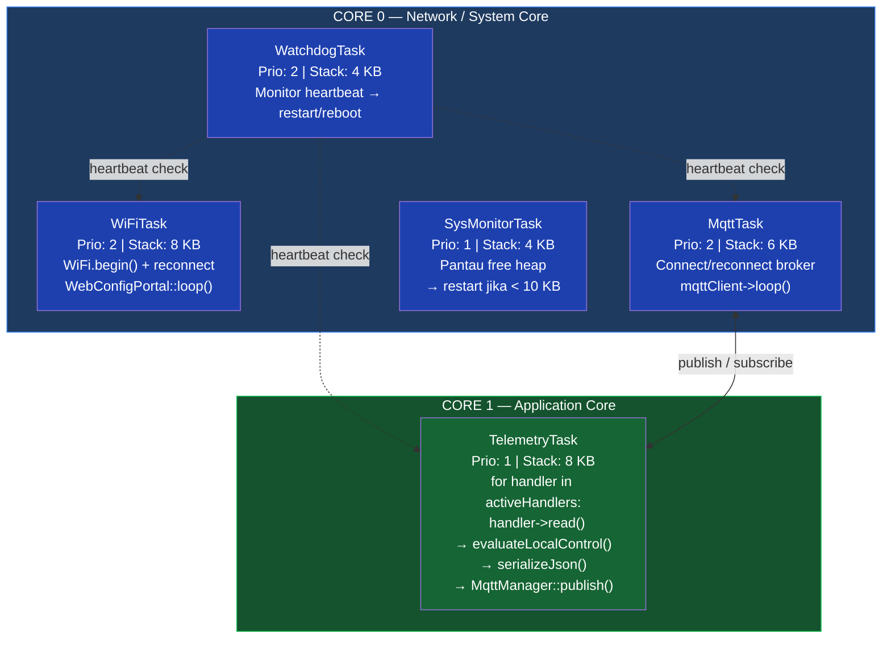
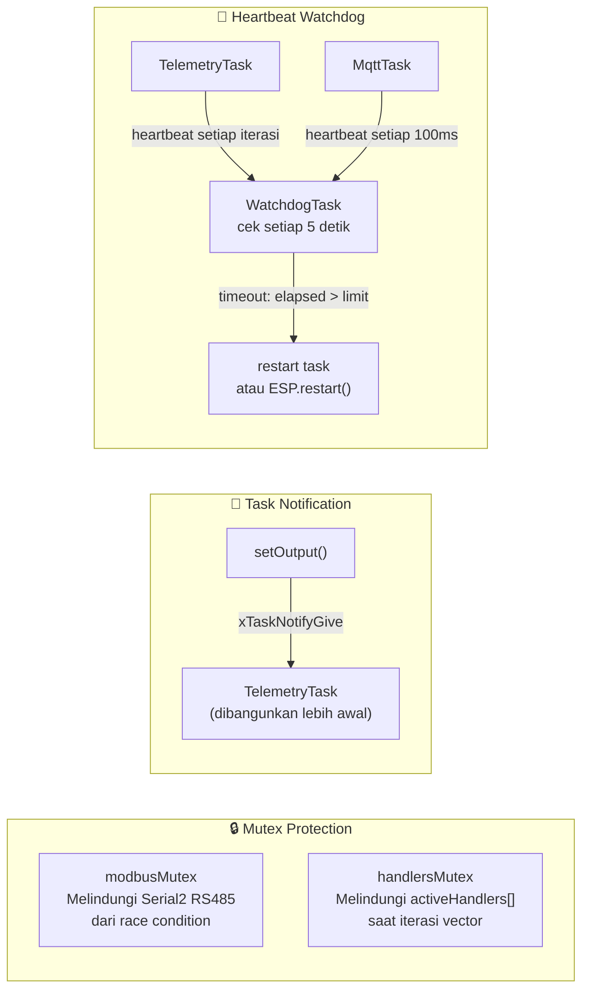
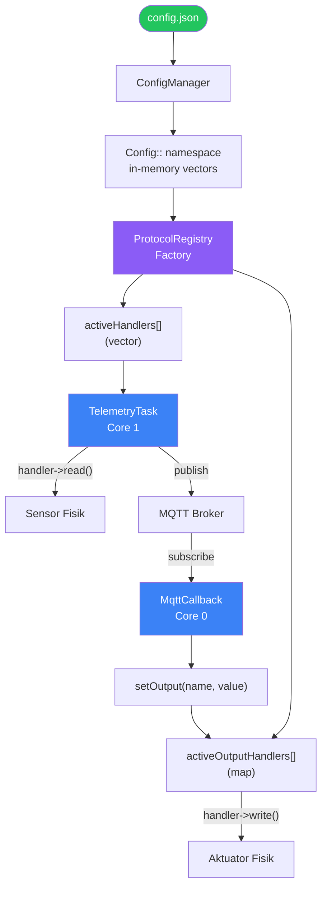
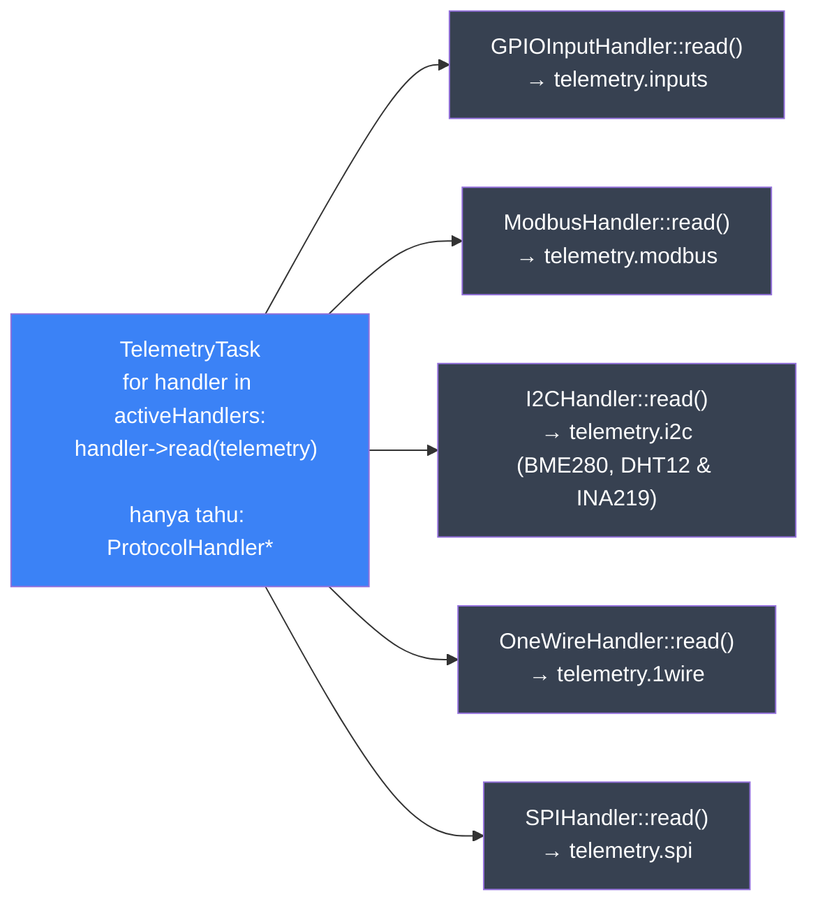
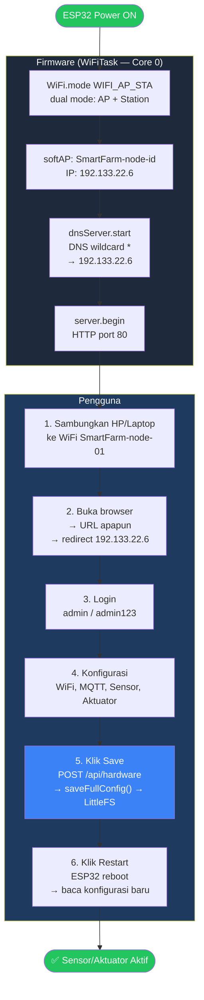
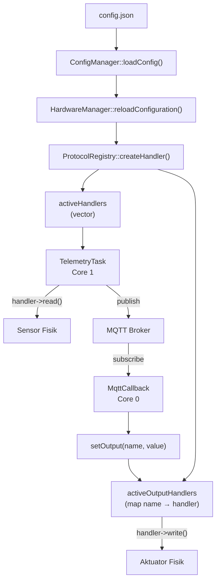
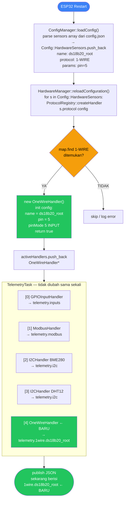
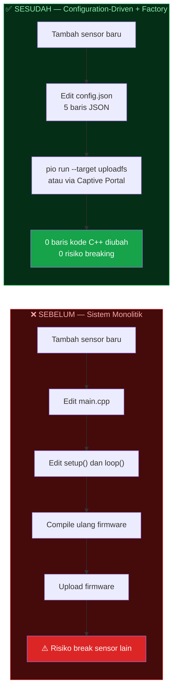
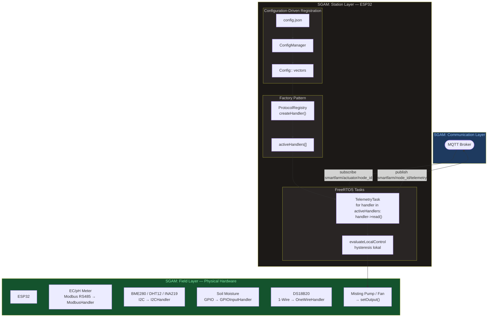

# Firmware Aeroponic Node — Dokumentasi Teknis (Bab III & IV)

> **Basis kode:** [`firmware/aeroponic-node/`](file:///home/almuzky/TA/Microservices/firmware/aeroponic-node/)  
> **Platform:** ESP32 · **RTOS:** FreeRTOS · **Framework:** Arduino via PlatformIO  
> **Lapisan SGAM:** Component Layer (T-1)

---

## Daftar Isi

- [3.x.1 FreeRTOS Task Mapping (Dual-Core)](#3x1-freertos-task-mapping-dual-core)
- [3.x.2 Desain Modular I/O — Factory Pattern & Registry](#3x2-desain-modular-io--factory-pattern--registry)
  - [3.x.2.1 Konfigurasi config.json (Tidak Ada Hardcode)](#3x21-konfigurasi-configjson-tidak-ada-hardcode)
  - [3.x.2.2 Kontrak ProtocolHandler (Interface Abstrak)](#3x22-kontrak-protocolhandler-interface-abstrak)
  - [3.x.2.3 ProtocolRegistry — Factory Dinamis](#3x23-protocolregistry--factory-dinamis)
  - [3.x.2.4 Vector Registry activeHandlers](#3x24-vector-registry-activehandlers)
  - [3.x.2.5 Implementasi Handler Nyata](#3x25-implementasi-handler-nyata)
- [3.x.3 Antarmuka Konfigurasi Mandiri — Captive Web Portal](#3x3-antarmuka-konfigurasi-mandiri--captive-web-portal)
- [3.x.4 Alur Telemetri & Aktuator](#3x4-alur-telemetri--aktuator)
- [4.x Pembuktian Modularitas — Skenario Penambahan Sensor (T-1)](#4x-pembuktian-modularitas--skenario-penambahan-sensor-t-1)

---

## 3.x.1 FreeRTOS Task Mapping (Dual-Core)

### Mengapa FreeRTOS?

ESP32 memiliki dua core Xtensa LX6 yang berjalan pada 240 MHz. FreeRTOS memungkinkan firmware menjalankan **banyak task secara concurrent** — sensor dibaca, MQTT dijaga, dan portal web dilayani **secara bersamaan**, tanpa blocking satu sama lain. Tanpa FreeRTOS, sistem akan sekuensial dan tidak responsif.

### Pemetaan Task ke Dual-Core



> **Alasan pemisahan core:** WiFi stack ESP32 berjalan di Core 0. TelemetryTask di Core 1 agar pembacaan sensor tidak terganggu oleh network interrupt.

### Tabel Lima FreeRTOS Task

| Task | File Sumber | Core | Priority | Stack | Tanggung Jawab Utama |
|------|-------------|------|----------|-------|----------------------|
| `WatchdogTask` | [`TaskWatchdog.cpp`](file:///home/almuzky/TA/Microservices/firmware/aeroponic-node/src/core/TaskWatchdog.cpp) | 0 | **2** | 4 KB | Monitor heartbeat tiap task; restart atau reboot jika timeout |
| `WiFiTask` | [`NetworkManager.cpp`](file:///home/almuzky/TA/Microservices/firmware/aeroponic-node/src/protocols/NetworkManager.cpp) | 0 | **2** | 8 KB | Manage koneksi WiFi (reconnect otomatis) + serve Captive Portal |
| `MqttTask` | [`MqttManager.cpp`](file:///home/almuzky/TA/Microservices/firmware/aeroponic-node/src/protocols/MqttManager.cpp) | 0 | **2** | 6 KB | Connect/reconnect broker MQTT; loop callback; publish discovery |
| `SysMonitorTask` | [`SystemMonitor.cpp`](file:///home/almuzky/TA/Microservices/firmware/aeroponic-node/src/core/SystemMonitor.cpp) | 0 | 1 | 4 KB | Pantau free heap; restart ESP32 jika < 10 KB |
| `TelemetryTask` | [`HardwareManager.cpp`](file:///home/almuzky/TA/Microservices/firmware/aeroponic-node/src/core/HardwareManager.cpp) | **1** | 1 | 8 KB | Baca sensor via `activeHandlers[]`; publish JSON telemetry; evaluasi local control |

### Pembuatan Task di Kode

```cpp
// main.cpp — semua task dibuat dari setup(), loop() hanya idle
void setup() {
    checkBootHealth();        // OTA rollback guard
    TaskWatchdog::init();     // → xTaskCreatePinnedToCore(watchdogTask, Core 0, Prio 2)
    ConfigManager::init();    // baca config.json dari LittleFS
    SystemMonitor::init();    // → xTaskCreatePinnedToCore(monitorTask, Core 0, Prio 1)
    NetworkManager::init();   // → xTaskCreatePinnedToCore(wifiTask,    Core 0, Prio 2)
    MqttManager::init();      // → xTaskCreatePinnedToCore(mqttTask,    Core 0, Prio 2)
    HardwareManager::init();  // → ProtocolRegistry + reloadConfiguration()
                              // → xTaskCreatePinnedToCore(telemetryTask, Core 1, Prio 1)
}

void loop() {
    vTaskDelay(1000 / portTICK_PERIOD_MS);  // ← main task dibiarkan idle
}                                            //   FreeRTOS Scheduler mengatur sisanya
```

### Mekanisme Sinkronisasi Antar-Task



---

## 3.x.2 Desain Modular I/O — Factory Pattern & Registry

### Filosofi Desain

Pada sistem monolitik konvensional, setiap sensor baru membutuhkan modifikasi `main.cpp`, `loop()`, dan semua logika pembacaan. Firmware ini menggunakan **tiga lapisan abstraksi** agar sistem bisa dinamis untuk menambahkan sensor atau aktuator:

1. **Configuration** — `config.json` → `ConfigManager` → `Config:: namespace`
2. **Factory/Registry** — `ProtocolRegistry` + `activeHandlers[]` + `activeOutputHandlers[]`
3. **Consumer** — `TelemetryTask` (Core 1, sensor) dan `MqttCallback` (Core 0, aktuator)



| Lapisan | Komponen | Peran |
|---------|----------|-------|
| **Configuration** | `config.json` → `ConfigManager` → `Config:: namespace` | Semua hardware dideklarasi di JSON, diparsing ke vector in-memory. Pengguna hanya mengubah file config, bukan kode. |
| **Factory/Registry** | `ProtocolRegistry` + `activeHandlers[]` + `activeOutputHandlers[]` | Membuat instance handler sesuai protokol di config. Sensor disimpan di vector, aktuator di map untuk lookup by name. |
| **Consumer** | `TelemetryTask` (Core 1, sensor) dan `MqttCallback` (Core 0, aktuator) | `TelemetryTask`: iterasi `activeHandlers[]` → `handler->read()` polimorfik. `MqttCallback`: parse MQTT → `setOutput()` → `activeOutputHandlers.find(name)->write()`. Keduanya tidak tahu tipe konkret handler. |

---

### 3.x.2.1 Konfigurasi config.json (Tidak Ada Hardcode)

File [`data/config.json`](file:///home/almuzky/TA/Microservices/firmware/aeroponic-node/data/config.json) adalah **satu-satunya tempat** mendaftarkan sensor dan aktuator. Tidak ada PIN, tipe sensor, atau alamat I2C yang ditulis di kode C++.

**Struktur lengkap `hardware` section:**

```json
{
  "hardware": {

    "inputs": [
      {
        "pin": 34,
        "type": "ANALOG",
        "pull": "NONE",
        "name": "soil_moisture",
        "invert": false,
        "debounce_ms": 0,
        "interrupt": "NONE",
        "analog_min": 0,
        "analog_max": 4095
      },
      {
        "pin": 13,
        "type": "DIGITAL",
        "pull": "UP",
        "name": "float_switch",
        "invert": true,
        "debounce_ms": 50,
        "interrupt": "CHANGE"
      }
    ],

    "outputs": [
      { "pin": 26, "type": "DIGITAL", "name": "misting_pump",    "protocol": "GPIO_OUT" },
      { "pin": 27, "type": "PWM",     "name": "cooling_fan",   "protocol": "GPIO_OUT" },
      { "pin": 25, "type": "DIGITAL", "name": "nutrient_valve","protocol": "GPIO_OUT" }
    ],

    "modbus": [
      {
        "name": "ec_ph_sensor",
        "slave_id": 1,
        "baudrate": 9600,
        "registers": [
          { "address": 0, "name": "ec_value",   "multiplier": 0.01, "type": "HOLDING" },
          { "address": 1, "name": "ph_value",   "multiplier": 0.01, "type": "HOLDING" },
          { "address": 2, "name": "temp_water", "multiplier": 0.1,  "type": "HOLDING" }
        ]
      }
    ],

    "sensors": [
      {
        "name": "bme280_atas",
        "protocol": "I2C",
        "type": "BME280",
        "address": "0x76",
        "sda_pin": "21",
        "scl_pin": "22"
      },
      {
        "name": "dht12_akar",
        "protocol": "I2C",
        "type": "DHT12",
        "address": "0x5C",
        "sda_pin": "21",
        "scl_pin": "22"
      },
      {
        "name": "power_monitor",
        "protocol": "I2C",
        "type": "INA219",
        "address": "0x40",
        "sda_pin": "21",
        "scl_pin": "22"
      }
    ]
  },

  "local_control": [
    {
      "name": "overheat_protection",
      "input_sensor": "bme280_atas_temp",
      "output_target": "cooling_fan",
      "threshold_high": 32.0,
      "threshold_low": 28.0,
      "enabled": true
    }
  ]
}
```

**Bagaimana `ConfigManager` mem-parse array ini ke vector:**

```cpp
// ConfigManager.cpp — loadConfig() [baris 163–232]
// hardware.inputs[] → Config::HardwareInputs (vector<InputPin>)
for (JsonObject input : doc["hardware"]["inputs"].as<JsonArray>()) {
    Config::InputPin pin;
    pin.pin         = input["pin"].as<uint8_t>();
    pin.type        = input["type"].as<String>();   // "ANALOG" | "DIGITAL"
    pin.pull        = input["pull"].as<String>();   // "UP" | "DOWN" | "NONE"
    pin.name        = input["name"].as<String>();
    pin.invert      = input["invert"] | false;
    pin.debounce_ms = input["debounce_ms"] | 0;
    pin.interrupt   = input["interrupt"] | "NONE";
    pin.analog_min  = input["analog_min"] | 0;
    pin.analog_max  = input["analog_max"] | 4095;
    Config::HardwareInputs.push_back(pin);          // ← push ke vector
}

// hardware.outputs[] → Config::HardwareOutputs (vector<OutputPin>)
for (JsonObject output : doc["hardware"]["outputs"].as<JsonArray>()) {
    Config::OutputPin pin;
    pin.pin  = output["pin"].as<uint8_t>();
    pin.type = output["type"].as<String>();         // "DIGITAL" | "PWM"
    pin.name = output["name"].as<String>();
    Config::HardwareOutputs.push_back(pin);
}

// hardware.modbus[] → Config::HardwareModbus (vector<ModbusSensor>)
for (JsonObject m : doc["hardware"]["modbus"].as<JsonArray>()) {
    Config::ModbusSensor ms;
    ms.name     = m["name"].as<String>();
    ms.slave_id = m["slave_id"].as<uint8_t>();
    ms.baudrate = m["baudrate"].as<uint32_t>();
    for (JsonObject r : m["registers"].as<JsonArray>()) {
        Config::ModbusRegister reg;
        reg.address    = r["address"].as<uint16_t>();
        reg.name       = r["name"].as<String>();
        reg.multiplier = r["multiplier"].as<float>();
        reg.type       = r["type"].as<String>();    // "HOLDING" | "INPUT"
        ms.registers.push_back(reg);
    }
    Config::HardwareModbus.push_back(ms);
}

// hardware.sensors[] → Config::HardwareSensors (vector<GenericSensor>)
// GenericSensor fleksibel: semua param masuk std::map<String,String>
for (JsonObject s : doc["hardware"]["sensors"].as<JsonArray>()) {
    Config::GenericSensor sensor;
    sensor.name     = s["name"].as<String>();
    sensor.protocol = s["protocol"].as<String>();  // "I2C" | "1-WIRE" | "SPI"
    for (JsonPair pair : s) {                       // semua kunci lain → params
        String key = pair.key().c_str();
        if (key != "name" && key != "protocol")
            sensor.params[key] = pair.value().as<String>();
    }
    Config::HardwareSensors.push_back(sensor);
}
```

**Struct definisi di `Config.h`:**

```cpp
// Config.h — struct definitions (namespace Config)
struct InputPin {
    uint8_t pin;
    String type;        // "DIGITAL" | "ANALOG"
    String pull;        // "UP" | "DOWN" | "NONE"
    String name;        // nama unik → key di JSON telemetry
    uint16_t debounce_ms;
    String interrupt;   // "RISING" | "FALLING" | "CHANGE" | "NONE"
    uint16_t analog_min, analog_max;
    bool invert;
};

struct OutputPin {
    uint8_t pin;
    String type;        // "DIGITAL" | "PWM"
    String name;        // nama unik → digunakan setOutput(name, value)
};

struct ModbusRegister {
    uint16_t address;
    String name;
    float multiplier;   // nilai raw × multiplier = nilai fisik
    String type;        // "HOLDING" | "INPUT"
};

struct ModbusSensor {
    String name;
    uint8_t slave_id;
    uint32_t baudrate;
    std::vector<ModbusRegister> registers;  // banyak register per slave
};

struct GenericSensor {
    String name;
    String protocol;                        // "I2C" | "1-WIRE" | "SPI"
    std::map<String, String> params;        // fleksibel: address, type, pin, dsb
};

// Vector Registry yang diisi dari config.json
extern std::vector<InputPin>         HardwareInputs;
extern std::vector<OutputPin>        HardwareOutputs;
extern std::vector<ModbusSensor>     HardwareModbus;
extern std::vector<GenericSensor>    HardwareSensors;
extern std::vector<LocalControlRule> LocalControlRules;
```

> **Kunci modularitas:** Sensor/aktuator **tidak di-hardcode** di kode C++. Seluruh daftar perangkat keras hidup di `config.json` dan direpresentasikan sebagai `std::vector<>` di runtime.

---

### 3.x.2.2 Kontrak ProtocolHandler (Interface Abstrak)

[`ProtocolHandler.h`](file:///home/almuzky/TA/Microservices/firmware/aeroponic-node/src/core/ProtocolHandler.h) mendefinisikan **kontrak** yang harus dipenuhi semua handler sensor:

```cpp
// ProtocolHandler.h — kontrak abstrak (interface)
class ProtocolHandler {
public:
    virtual ~ProtocolHandler() {}

    // Inisialisasi hardware berdasarkan konfigurasi JSON
    // Dipanggil sekali saat reloadConfiguration()
    virtual bool init(const JsonObject& config) = 0;

    // Baca nilai sensor dan tulis ke JSON telemetry
    // Dipanggil setiap interval dari TelemetryTask
    virtual bool read(JsonObject& telemetry) = 0;

    // Tulis nilai aktuator ke pin fisik
    // Dipanggil saat perintah aktuator masuk (MQTT / local control / emergency)
    virtual bool write(int value) { return false; }

    // Kembalikan nama protokol: "GPIO", "I2C", "MODBUS", "1-WIRE", "SPI", "GPIO_OUT"
    virtual String getProtocolName() = 0;

    // Kembalikan nama unik sensor dari config
    virtual String getSensorName() = 0;
};
```

**Mengapa ini penting?** `TelemetryTask` hanya memanggil `handler->read(telemetry)`. Ia tidak perlu tahu apakah sensor itu BME280, EC Meter Modbus, atau sensor analog biasa. Ini adalah prinsip **Open/Closed**: terbuka untuk ekstensi (tambah tipe baru), tertutup untuk modifikasi (loop utama tidak berubah).



---

### 3.x.2.3 ProtocolRegistry — Factory Dinamis

[`ProtocolHandler.cpp`](file:///home/almuzky/TA/Microservices/firmware/aeroponic-node/src/core/ProtocolHandler.cpp) mengimplementasikan Factory Pattern menggunakan **singleton map**:

```cpp
// ProtocolHandler.cpp — Factory Registry
typedef ProtocolHandler* (*ProtocolHandlerCreator)();

class ProtocolRegistry {
private:
    // Singleton map: nama protokol → fungsi pembuat handler
    static std::map<String, ProtocolHandlerCreator>& getRegistry() {
        static std::map<String, ProtocolHandlerCreator> registry;
        return registry;
    }

public:
    // Daftarkan creator function untuk protokol tertentu
    static void registerProtocol(const String& name, ProtocolHandlerCreator creator) {
        getRegistry()[name] = creator;
    }

    // Buat handler berdasarkan nama protokol + inisialisasi dengan config
    static ProtocolHandler* createHandler(const String& name, const JsonObject& config) {
        auto& reg = getRegistry();
        auto it = reg.find(name);
        if (it != reg.end()) {
            ProtocolHandler* handler = it->second();    // panggil creator → new Handler()
            if (handler->init(config)) return handler;  // init berhasil → kembalikan
            delete handler;                             // init gagal → bersihkan
        }
        return nullptr;                                 // protokol tidak dikenal
    }
};
```

**Pendaftaran protokol di `HardwareManager::init()`** — ini dilakukan **satu kali** saat boot:

```cpp
// HardwareManager.cpp — init() [baris 264–268]
// Daftarkan 5 protokol dengan lambda creator function
ProtocolRegistry::registerProtocol("GPIO",
    []() -> ProtocolHandler* { return new GPIOInputHandler(); });

ProtocolRegistry::registerProtocol("MODBUS",
    []() -> ProtocolHandler* { return new ModbusHandler(); });

ProtocolRegistry::registerProtocol("I2C",
    []() -> ProtocolHandler* { return new I2CHandler(); });

ProtocolRegistry::registerProtocol("GPIO_OUT",
    []() -> ProtocolHandler* { return new GpioOutputHandler(); });
```

**Visualisasi Map Registry setelah `init()`:**

```
ProtocolRegistry (std::map<String, CreatorFn>):
┌──────────┬───────────────────────────────────────────────────┐
│ "GPIO"   │ lambda → new GPIOInputHandler()                   │
│ "MODBUS" │ lambda → new ModbusHandler()                      │
│ "I2C"    │ lambda → new I2CHandler()                         │
│ "GPIO_OUT" │ lambda → new GpioOutputHandler()                │
└──────────┴───────────────────────────────────────────────────┘

Untuk menambah protokol baru (misal: "UART"):
  1. Buat class UARTHandler : public ProtocolHandler { ... }
  2. Tambah satu baris: registerProtocol("UART", []() { return new UARTHandler(); })
  3. Tambah entry di config.json: { "protocol": "UART", ... }
  → Tidak ada perubahan pada TelemetryTask atau main.cpp
```

---

### 3.x.2.4 Vector Registry activeHandlers

```cpp
// HardwareManager.cpp — deklarasi
std::vector<ProtocolHandler*> activeHandlers;
```

`reloadConfiguration()` mengosongkan dan mengisi ulang vector ini setiap kali konfigurasi berubah. Dilindungi `handlersMutex` agar aman dari race condition dengan `TelemetryTask`:

```cpp
// HardwareManager.cpp — reloadConfiguration() [baris 95–193]
void HardwareManager::reloadConfiguration() {
    xSemaphoreTake(handlersMutex, portMAX_DELAY);  // kunci mutex

    // 1. Hapus semua handler lama (mendukung hot-swap)
    for (auto h : activeHandlers) delete h;
    activeHandlers.clear();

    // 2. GPIO: dari Config::HardwareInputs
    for (const auto& hw : Config::HardwareInputs) {
        StaticJsonDocument<512> cdoc;
        JsonObject obj = cdoc.to<JsonObject>();
        obj["pin"] = hw.pin;  obj["type"] = hw.type;
        obj["name"] = hw.name;  obj["invert"] = hw.invert;
        // ... isi semua field ...
        ProtocolHandler* h = ProtocolRegistry::createHandler("GPIO", obj);
        if (h) activeHandlers.push_back(h);
    }

    // 3. Modbus: dari Config::HardwareModbus
    for (const auto& ms : Config::HardwareModbus) {
        // ... bangun JsonObject dari struct ...
        ProtocolHandler* h = ProtocolRegistry::createHandler("MODBUS", obj);
        if (h) activeHandlers.push_back(h);
    }

    // 4. Generic (I2C/1-Wire/SPI): dari Config::HardwareSensors
    for (const auto& s : Config::HardwareSensors) {
        // JsonObject dibangun dari s.params (map<String,String>)
        ProtocolHandler* h = ProtocolRegistry::createHandler(s.protocol, obj);
        if (h) {
            activeHandlers.push_back(h);
            Serial.printf("Registered Sensor: %s (Protocol: %s)\n",
                          s.name.c_str(), s.protocol.c_str());
        }
    }

    xSemaphoreGive(handlersMutex);  // lepas mutex
}
```

**Snapshot vector setelah boot (berdasarkan config.json contoh di atas):**

```
activeHandlers (std::vector<ProtocolHandler*>):
┌─────┬──────────────────────────────────────────────────────┐
│ [0] │ GPIOInputHandler { pin=34, name="soil_moisture" }    │
│ [1] │ GPIOInputHandler { pin=13, name="float_switch"  }    │
│ [2] │ ModbusHandler    { name="ec_ph_sensor", slave_id=1 } │
│ [3] │ I2CHandler       { name="bme280_atas",  addr=0x76  } │
│ [4] │ I2CHandler       { name="dht12_akar",   addr=0x5C  } │
│ [5] │ I2CHandler       { name="power_monitor", type=INA219, addr=0x40 } │
└─────┴──────────────────────────────────────────────────────┘
Ukuran vector = jumlah sensor aktif (dinamis, bergantung config.json)
```

---

### 3.x.2.5 Implementasi Handler Nyata

Selanjutnya adalah handler untuk menangani protokol komunikasi sensor. Semua implementasi ada di [`ProtocolHandlers.cpp`](file:///home/almuzky/TA/Microservices/firmware/aeroponic-node/src/core/ProtocolHandlers.cpp):

#### GPIOInputHandler

Handler untuk menangani pembacaan sensor pada pin GPIO, baik analog maupun digital.

```cpp
bool GPIOInputHandler::read(JsonObject& telemetry) {
    JsonObject inputs = telemetry["inputs"];
    if (inputs.isNull()) inputs = telemetry.createNestedObject("inputs");

    float val = 0;
    if (type == "ANALOG") {
        val = analogRead(pin);          // ADC 12-bit → 0–4095
        inputs[name] = val;
    } else {
        int dval = digitalRead(pin);
        if (invert) dval = !dval;       // inversi logika jika diperlukan
        inputs[name] = dval;
        val = dval;
    }
    HardwareManager::latestSensorValues[name] = val;  // cache untuk local control
    return true;
}
```

Output: `telemetry.inputs.soil_moisture = 2048`

#### ModbusHandler (RS485)

Handler untuk menangani pembacaan sensor dengan protokol komunikasi MODBUS RS485.

```cpp
bool ModbusHandler::read(JsonObject& telemetry) {
    JsonObject modbusDev = telemetry["modbus"].createNestedObject(name);

    xSemaphoreTake(HardwareManager::modbusMutex, pdMS_TO_TICKS(1000));
    if (HardwareManager::currentBaud != baudrate) {
        Serial2.begin(baudrate, SERIAL_8N1,
                      Config::PIN_RS485_RX, Config::PIN_RS485_TX);
    }
    HardwareManager::node.begin(slave_id, Serial2);

    for (const auto& reg : registers) {
        uint8_t result = (reg.type == "INPUT")
            ? HardwareManager::node.readInputRegisters(reg.address, 1)
            : HardwareManager::node.readHoldingRegisters(reg.address, 1);

        if (result == HardwareManager::node.ku8MBSuccess) {
            float val = HardwareManager::node.getResponseBuffer(0) * reg.multiplier;
            modbusDev[reg.name] = val;
            HardwareManager::latestSensorValues[reg.name] = val;  // cache
        }
        vTaskDelay(10 / portTICK_PERIOD_MS);  // yield antar register
    }
    xSemaphoreGive(HardwareManager::modbusMutex);
    return true;
}
```

Output: `telemetry.modbus.ec_ph_sensor.ec_value = 1.85`

#### I2CHandler (BME280, DHT12 & INA219)

BME280 menggunakan **driver custom `LightBME280`** yang ditulis langsung di firmware — tidak memerlukan library eksternal. Driver ini melakukan kompensasi kalibrator `dig_T1/T2/T3` dan `dig_H1..H6` sesuai datasheet Bosch. Sensor INA219 (power monitor) menggunakan library `Adafruit_INA219` yang di-deklarasikan di `platformio.ini` dan di-include di `ProtocolHandlers.h`:

```cpp
bool I2CHandler::read(JsonObject& telemetry) {
    JsonObject devObj = telemetry["i2c"].createNestedObject(name);

    if (type == "INA219" && ina219) {
        float busVoltage   = ina219->getBusVoltage_V();     // tegangan bus (V)
        float shuntVoltage = ina219->getShuntVoltage_mV();  // tegangan shunt (mV)
        float current     = ina219->getCurrent_mA();        // arus beban (mA)
        float power       = ina219->getPower_mW();          // daya (mW)
        devObj["bus_voltage_v"]  = busVoltage;
        devObj["shunt_voltage_mv"] = shuntVoltage;
        devObj["current_ma"]      = current;
        devObj["power_mw"]        = power;
        HardwareManager::latestSensorValues[name + "_bus_voltage"] = busVoltage;
        HardwareManager::latestSensorValues[name + "_current"]     = current;
        HardwareManager::latestSensorValues[name + "_power"]       = power;
        HardwareManager::latestSensorValues[name] = current;

    } else if (type == "BME280" && bme) {
        float temp  = bme->getTemperature();  // kompensasi via dig_T1/T2/T3
        float humid = bme->getHumidity();     // kompensasi via dig_H1..H6
        devObj["temperature"] = temp;
        devObj["humidity"]    = humid;
        HardwareManager::latestSensorValues[name + "_temp"]     = temp;
        HardwareManager::latestSensorValues[name + "_humidity"] = humid;

    } else if (type == "DHT12") {
        Wire.requestFrom(address, (uint8_t)5);
        // 5 byte: H_int, H_dec, T_int, T_dec, Checksum
        // Validasi checksum sebelum menerima nilai
        if (((h_int + h_dec + t_int + t_dec) & 0xFF) == checksum) {
            devObj["temperature"] = t_int + (t_dec * 0.1f);
            devObj["humidity"]    = h_int + (h_dec * 0.1f);
        } else {
            devObj["error"] = "checksum_error";
        }
    }
    return true;
}
```

Output: `telemetry.i2c.power_monitor.bus_voltage_v = 5.02`, `telemetry.i2c.power_monitor.current_ma = 142.6`, `telemetry.i2c.power_monitor.power_mw = 716.0`

> **Catatan INA219:** Sensor `power_monitor` (type `INA219`, address `0x40`) sudah terdaftar secara nyata di [`data/config.json`](file:///home/almuzky/TA/Microservices/firmware/aeroponic-node/data/config.json). Saat `reloadConfiguration()` membuat instance `I2CHandler`, `init()` membaca `type == "INA219"` lalu menginstansiasi `Adafruit_INA219` dan memanggil `ina219->begin()` — tanpa ada baris kode baru di `main.cpp` maupun `TelemetryTask`.

#### Tabel Semua Handler

| Handler | Protokol | Sensor yang Didukung | Output JSON Key |
|---------|----------|----------------------|-----------------|
| `GPIOInputHandler` | GPIO | Sensor analog (kelembapan), switch digital | `telemetry.inputs.<name>` |
| `ModbusHandler` | RS485/Modbus RTU | Sensor EC, pH, suhu air (perangkat industri) | `telemetry.modbus.<device>.<register>` |
| `I2CHandler` | I²C | BME280 (suhu+kelembapan udara), DHT12, INA219 (bus voltage, shunt voltage, arus, daya) | `telemetry.i2c.<name>.temperature/humidity` · `telemetry.i2c.<name>.bus_voltage_v/current_ma/power_mw` |
| `OneWireHandler` | 1-Wire | DS18B20 (suhu akar) — skeleton tersedia | `telemetry.1wire.<name>.temperature` |
| `SPIHandler` | SPI | MAX31865 (RTD) — skeleton tersedia | `telemetry.spi.<name>.value` |
| `GpioOutputHandler` | GPIO_OUT | Aktuator GPIO/PWM generik (pompa, katup, fan) — menerima perintah via `handler->write(value)` | — (output, bukan sensor telemetry) |

---

## 3.x.3 Antarmuka Konfigurasi Mandiri — Captive Web Portal

### Apa itu Captive Web Portal?

**Captive Web Portal** adalah mekanisme di mana ESP32 menjalankan **Access Point (AP) Wi-Fi sekaligus HTTP server miniatur** di dalam firmware-nya sendiri. Saat pengguna menghubungkan perangkat (HP/laptop) ke AP tersebut dan membuka browser, **semua permintaan DNS diarahkan ke IP ESP32** (`192.133.22.6`) melalui DNS *wildcard* — sehingga browser otomatis menampilkan halaman konfigurasi tanpa perlu tahu alamat IP yang benar.

Teknik ini lazim digunakan di router Wi-Fi publik (hotel, bandara) untuk halaman login, namun di sini dimanfaatkan sebagai **antarmuka konfigurasi mandiri berbasis web** yang berjalan langsung di mikrokontroler ESP32 tanpa infrastruktur server eksternal.

**Komponen utama yang membentuk Captive Portal pada firmware ini:**

| Komponen | Peran |
|----------|-------|
| `WiFi.softAP()` | Menyalakan AP dengan SSID dinamis `SmartFarm-<node_id>` |
| `DNSServer` | DNS wildcard `*` → seluruh domain diarahkan ke IP ESP32 |
| `WebServer` (port 80) | HTTP server yang melayani halaman UI dan 18 endpoint REST API |
| `LittleFS` | Filesystem flash internal ESP32 untuk menyimpan file HTML/JS/CSS dan `config.json` |
| `checkAuthToken()` | Middleware Bearer token untuk memproteksi endpoint sensitif |

**Kapan portal aktif?** Portal berjalan terus-menerus di `WiFiTask` (Core 0) selama ESP32 hidup. Artinya pengguna dapat mengakses portal **kapan saja** — baik saat awal setup maupun saat mengubah konfigurasi sensor di lapangan — tanpa kabel USB atau software tambahan.

### Konteks (Keterkaitan ke RM-5)

Captive Web Portal menjawab **RM-5 (User Experience)**: pengguna awam dapat mengkonfigurasi seluruh sistem — WiFi, MQTT, sensor, aktuator, Modbus — tanpa perlu kabel USB atau software khusus. Cukup hubungkan ke WiFi ESP32 dan buka browser.

### Cara Kerja



### Kode `startAP()`

```cpp
// WebConfigPortal.cpp — startAP() [baris 141–187]
void WebConfigPortal::startAP() {
    WiFi.softAPConfig(apIP, apIP, IPAddress(255, 255, 255, 0));

    String apName = "SmartFarm-" + Config::NODE_ID;
    WiFi.softAP(apName.c_str());         // nama AP dinamis dari NODE_ID

    dnsServer.start(DNS_PORT, "*", apIP); // DNS wildcard → captive portal

    // Daftarkan semua endpoint REST
    server.on("/",                         HTTP_GET,  handleRoot);
    // ... static files ...
    server.on("/api/login",                HTTP_POST, handleApiLogin);
    server.on("/api/fullconfig",           HTTP_GET,  handleApiFullConfigGet);
    server.on("/api/wifi",                 HTTP_POST, handleApiWifiPost);
    server.on("/api/mqtt",                 HTTP_POST, handleApiMqttPost);
    server.on("/api/device",               HTTP_POST, handleApiDevicePost);
    server.on("/api/hardware",             HTTP_POST, handleApiHardwarePost);
    server.on("/api/hardware/discover",    HTTP_GET,  handleApiHardwareDiscover);
    server.on("/api/modbus/start_scan",    HTTP_POST, handleApiModbusStartScan);
    server.on("/api/modbus/scan_reg",      HTTP_GET,  handleApiModbusScanReg);
    server.on("/api/account",              HTTP_POST, handleApiAccountPost);
    server.on("/api/status",               HTTP_GET,  handleApiStatusGet);
    server.on("/api/ota",                  HTTP_POST, handleApiOtaUpdate);
    server.on("/api/publish_discovery",    HTTP_POST, handleApiPublishDiscovery);
    server.on("/api/config/export",        HTTP_GET,  handleApiConfigExport);
    server.on("/api/config/import",        HTTP_POST, handleApiConfigImport);
    server.on("/api/telemetry/latest",     HTTP_GET,  handleApiTelemetryLatest);
    server.on("/api/local_control",        HTTP_POST, handleApiLocalControlPost);
    server.on("/api/local_control",        HTTP_GET,  handleApiLocalControlGet);
    server.on("/api/root/health",          HTTP_GET,  handleHealth);

    server.begin();
    Serial.printf("Captive Portal: SSID='SmartFarm-%s' IP=%s\n",
                  Config::NODE_ID.c_str(), apIP.toString().c_str());
}
```

### Tabel Endpoint REST Portal

| Endpoint | Method | Fungsi |
|----------|--------|--------|
| `/api/login` | POST | Login admin → generate Bearer token |
| `/api/fullconfig` | GET | Ambil seluruh konfigurasi saat ini (JSON) |
| `/api/wifi` | POST | Simpan SSID + password WiFi |
| `/api/mqtt` | POST | Simpan server, port, credentials MQTT |
| `/api/device` | POST | Ubah NODE_ID, fw_version |
| `/api/hardware` | POST | **Daftarkan sensor/aktuator baru** (inputs/outputs/modbus/sensors) |
| `/api/hardware/discover` | GET | I2C scan → deteksi perangkat yang terhubung |
| `/api/modbus/start_scan` | POST | Scan Modbus slave ID 1–247 |
| `/api/modbus/scan_reg` | GET | Baca satu register Modbus |
| `/api/account` | POST | Ganti admin username/password |
| `/api/status` | GET | Status WiFi, MQTT, heap, uptime |
| `/api/ota` | POST | Upload firmware baru (OTA) |
| `/api/publish_discovery` | POST | Paksa kirim discovery ke MQTT broker |
| `/api/config/export` | GET | Download config.json |
| `/api/config/import` | POST | Upload config.json |
| `/api/telemetry/latest` | GET | Baca telemetry terakhir tanpa MQTT |
| `/api/local_control` | GET/POST | Kelola aturan edge control |
| `/api/root/health` | GET | Health check (liveness probe) |

### Antarmuka Web Portal

File [`data/index.html`](file:///home/almuzky/TA/Microservices/firmware/aeroponic-node/data/index.html), [`data/script.js`](file:///home/almuzky/TA/Microservices/firmware/aeroponic-node/data/script.js), dan [`data/style.css`](file:///home/almuzky/TA/Microservices/firmware/aeroponic-node/data/style.css) disimpan di flash ESP32 via **LittleFS** dan disajikan oleh `WebServer` internal. Portal terdiri dari satu halaman tunggal (*Single Page Application*) dengan sidebar navigasi yang berpindah antar **10 halaman/menu** tanpa reload.

#### Halaman Login

Halaman pertama yang muncul saat portal dibuka. Menampilkan logo SmartFarm, field **Username** dan **Password**, serta tombol **Sign In**. Setelah autentikasi berhasil via `POST /api/login`, server mengembalikan Bearer token yang disimpan di memori browser dan disertakan di setiap request API berikutnya. Seluruh tampilan dashboard tersembunyi hingga login berhasil.

#### Sidebar Navigasi

Sidebar vertikal di sisi kiri menampilkan 10 menu utama. Pada layar kecil (mobile), sidebar menjadi menu *hamburger* yang dapat dibuka/tutup. Menu yang aktif ditandai dengan highlight. Di bagian bawah sidebar terdapat link **Admin Account** dan tombol **Logout**.

#### Menu 1 — Status

Halaman utama (default saat login). Menampilkan tiga kelompok informasi:

| Panel | Informasi yang Ditampilkan |
|-------|---------------------------|
| **System Status** | Wi-Fi Status, MQTT Status, IP Address, RSSI, CPU Speed, Uptime, Free Heap |
| **MQTT Integration Info** | Telemetry topic (`smartfarm/<node_id>/telemetry`), Actuator topic, contoh payload JSON aktuator |
| **MQTT Live Logs** | Terminal *real-time* (dark background, monospace font) yang menampilkan log MQTT terakhir dari perangkat |

Terdapat tombol **Refresh** untuk memperbarui status, dan tombol **Send Discovery Signal** (kuning) untuk memaksa ESP32 menerbitkan pesan discovery ke MQTT broker.

#### Menu 2 — Device

Berisi dua kartu konfigurasi:

- **Device Identity**: Field **Node ID** (alphanumerik + underscore/dash) yang menentukan nama unik perangkat. Digunakan sebagai bagian dari SSID AP dan MQTT topic. Tombol **Save & Reboot** menyimpan dan merestart ESP32.
- **Backup & Restore**: Tombol **Download Backup** untuk mengekspor `config.json` saat ini sebagai file, dan form **Upload Backup File (.json)** untuk mengimpor konfigurasi dari file backup. Berguna untuk kloning konfigurasi ke perangkat lain.

#### Menu 3 — Wi-Fi

Form konfigurasi koneksi jaringan dengan dua mode:

- **Wi-Fi Standar (WPA2-Personal)**: Field SSID dan Password jaringan tujuan.
- **WPA2-Enterprise (Eduroam)**: Field tambahan Identity (email/username institusi) dan Eduroam Password — memungkinkan ESP32 terhubung ke jaringan kampus/perusahaan yang menggunakan 802.1X. Tombol **Save & Reboot** menyimpan dan merestart.

#### Menu 4 — MQTT

Form konfigurasi koneksi broker MQTT:

| Field | Keterangan |
|-------|-----------|
| Broker Server | Hostname atau IP broker MQTT |
| Port | Port broker (umumnya 1883) |
| Topic Prefix | Prefix topic, misal `smartfarm` |
| MQTT Username | Opsional, kosongkan untuk broker publik |
| MQTT Password | Opsional |
| Telemetry Interval (ms) | Interval pengiriman data sensor (minimum 1000 ms) |

#### Menu 5 — GPIO

Halaman manajemen sensor (input) dan aktuator (output) berbasis **GPIO**. Antarmuka berbasis **baris dinamis** yang dapat ditambah atau dihapus:

- **Input Section**: Setiap baris mewakili satu sensor GPIO/analog/digital. Pengguna mengisi PIN, nama, tipe (ANALOG/DIGITAL), pull (UP/DOWN/NONE), dan opsi lanjutan (invert, debounce, interrupt). Tombol **+ Add Input** menambah baris baru.
- **Output Section**: Setiap baris mewakili satu aktuator GPIO. Pengguna mengisi PIN, nama, tipe output (DIGITAL/PWM), dan protokol. Tombol **+ Add Output** menambah baris baru.
- Tombol **Save & Reboot All GPIO** di bawah mengirim semua konfigurasi GPIO via `POST /api/hardware` → `saveFullConfig()` → LittleFS → ESP32 reboot dengan konfigurasi baru.

> **Catatan:** Sensor I2C (INA219, BME280, DHT12) **tidak** dikelola di halaman ini, melainkan di halaman **I2C** (Menu 7) terpisah.

#### Menu 6 — Modbus

Halaman dua fungsi sekaligus — alat diagnosa dan konfigurasi sensor Modbus RS485:

- **Modbus Scanner Tool**: Alat debug untuk mendeteksi perangkat Modbus yang terhubung secara fisik.
  - **Scan All IDs**: Memindai seluruh Slave ID (1–247) pada baudrate yang dipilih.
  - **Scan Regs**: Membaca register tertentu (range alamat awal–akhir, tipe HOLDING/INPUT) dari Slave ID yang ditentukan.
  - Hasil scan ditampilkan di kotak terminal scrollable.
- **Sensor Configurations**: Form baris dinamis untuk mendaftarkan sensor Modbus. Setiap sensor memiliki nama, Slave ID, baudrate, dan daftar register (alamat, nama, multiplier, tipe). Tombol **+ Add Modbus Sensor** menambah entry baru.

#### Menu 7 — I2C

Halaman khusus untuk mendaftarkan **sensor I2C** secara mandiri (terpisah dari GPIO). Setiap baris mewakili satu sensor I2C dengan field:

| Field | Keterangan |
|-------|-----------|
| Sensor Name | Nama unik (misal: `power_monitor`) → key di `telemetry.i2c.<name>` |
| Sensor Type | `INA219` (bus voltage, arus, daya) · `BME280` (suhu + kelembapan) · `DHT12` (suhu + kelembapan) |
| I2C Address | Alamat 7-bit (misal `0x40` untuk INA219, `0x76` BME280, `0x5C` DHT12) |
| SDA Pin | Pin SDA (default `21`) |
| SCL Pin | Pin SCL (default `22`) |

Tombol **+ Add I2C Sensor** menambah baris baru; tombol **Save & Reboot All I2C** mengirim `sensors[]` via `POST /api/hardware` (payload `sensors`) → `saveFullConfig()` → `HardwareManager::reloadConfiguration()` melakukan hot-swap `I2CHandler` tanpa mengubah kode inti. Data tersimpan di `config.json` (`hardware.sensors[]`) dan diproses oleh `I2CHandler` (`ProtocolHandlers.cpp`).

#### Menu 8 — Local Control

Halaman konfigurasi aturan **edge computing** — logika kontrol yang berjalan langsung di ESP32 tanpa memerlukan koneksi MQTT. Setiap aturan (rule) memiliki:

| Field | Keterangan |
|-------|-----------|
| Rule Name | Nama unik aturan (misal: `overheat_protection`) |
| Input Sensor | Nama sensor yang dibaca sebagai trigger |
| Output Target | Nama aktuator yang dikendalikan |
| Threshold High | Nilai ambang batas atas (aktuator ON saat nilai ≥ ini) |
| Threshold Low | Nilai ambang batas bawah (aktuator OFF saat nilai ≤ ini) |
| Enabled | Toggle aktif/nonaktif aturan |

Berguna sebagai *safety net* ketika jaringan terputus — misalnya menyalakan kipas pendingin secara lokal jika suhu melebihi batas tanpa menunggu perintah dari server.

#### Menu 9 — Firmware Update (OTA)

Halaman upload firmware baru secara *Over-the-Air* tanpa kabel USB:

- Form upload file `.bin` (hasil kompilasi PlatformIO).
- **Progress bar** animasi yang menampilkan persentase upload secara real-time.
- Status teks di bawah progress bar (`Uploading...`, `Success`, dst.).
- Setelah upload selesai, ESP32 otomatis reboot dengan firmware baru. Jika upload gagal, firmware lama tetap berjalan (OTA rollback guard).

#### Menu 10 — Admin Account

Form sederhana untuk mengubah kredensial login portal:

- Field **New Username** dan **New Password**.
- Tombol **Update Credentials & Reboot** (merah/danger) — menyimpan kredensial baru via `POST /api/account` dan merestart ESP32. Setelah reboot, login menggunakan username dan password baru.

#### Reboot Overlay

Saat ESP32 sedang reboot (setelah Save & Reboot dari menu manapun), portal menampilkan **overlay fullscreen** dengan animasi *spinner* dan pesan *"Rebooting device, please wait..."* — halaman akan otomatis tersambung kembali setelah ESP32 online, tanpa perlu menutup atau merefresh browser secara manual.

### Keamanan Portal

```cpp
// checkAuthToken() — dipanggil di awal setiap endpoint sensitif
bool WebConfigPortal::checkAuthToken() {
    if (!server.hasHeader("Authorization")) return false;
    String authHeader = server.header("Authorization");
    if (!authHeader.startsWith("Bearer ")) return false;
    String reqToken = authHeader.substring(7);
    return (reqToken == Config::AUTH_TOKEN && Config::AUTH_TOKEN.length() > 0);
}

// handleApiLogin() — rate limiter per IP (GAP #4)
if (attempt.attempts >= Config::MAX_LOGIN_ATTEMPTS) {
    attempt.blockUntil = millis() + Config::LOGIN_BLOCK_TIME_MS;  // blokir 30 detik
    server.send(429, "application/json", "{\"error\":\"Too many attempts\"}");
}
```

### Cara Portal Menyimpan Sensor Baru

Saat pengguna POST ke `/api/hardware`, portal memanggil `saveFullConfig()` → **serialize ulang seluruh `Config::` namespace ke JSON** → tulis ke LittleFS:

```cpp
// WebConfigPortal.cpp — saveFullConfig() [baris 29–119]
static bool saveFullConfig() {
    DynamicJsonDocument doc(8192);
    // Serialize Config::HardwareInputs → JSON array "inputs"
    JsonArray inputs = hardware.createNestedArray("inputs");
    for (const auto& pin : Config::HardwareInputs) {
        JsonObject p = inputs.createNestedObject();
        p["pin"] = pin.pin;  p["name"] = pin.name;  // dst
    }
    // Serialize HardwareOutputs, HardwareModbus, HardwareSensors, LocalControlRules
    // ... (pola yang sama) ...

    String out;
    serializeJson(doc, out);
    return ConfigManager::saveConfig(out);  // tulis ke /config.json di LittleFS
}
```

---

## 3.x.4 I/O System: Dua Arah yang Sama (Baca vs Tulis)

Sensor (input) dan aktuator (output) **bukan sistem terpisah**. Keduanya:
- Didaftarkan di **`config.json` yang sama** (`hardware.inputs[]` dan `hardware.outputs[]`)
- Di-instantiate oleh **`HardwareManager::reloadConfiguration()` yang sama**
- Mendapatkan instance dari **`ProtocolRegistry` factory yang sama**
- Diturunkan dari **`ProtocolHandler` base class yang sama**

Satu-satunya perbedaan adalah **arah data dan method yang dipanggil**:

| Aspek | Sensor (Input) | Aktuator (Output) |
|-------|----------------|-------------------|
| `config.json` | `hardware.inputs[]` | `hardware.outputs[]` |
| Struct | `Config::InputPin` | `Config::OutputPin{protocol}` |
| Registry | `activeHandlers` (vector) | `activeOutputHandlers` (map `name → handler`) |
| Method | `handler->read(telemetry)` | `handler->write(value)` |
| Pemicu | Periodik: `TelemetryTask` setiap interval | Event-driven: MQTT command / local control / emergency |
| MQTT | **Publish** `smartfarm/<node_id>/telemetry` | **Subscribe** `smartfarm/actuator/<node_id>` |
| Feedback | Data sensor masuk → telemetry JSON | Konfirmasi `status:"executed"` ke topic confirm |
| Handler contoh | `GPIOInputHandler`, `I2CHandler`, `ModbusHandler` | `GpioOutputHandler` |

**Mengapa registry aktuator berupa `map`, bukan `vector`?**
- **Sensor (vector):** `TelemetryTask` melakukan iterasi keseluruhan daftar setiap interval → panggil `handler->read()` untuk semua sensor. Vector cocok untuk sequential iteration.
- **Aktuator (map):** `setOutput()` menerima `targetName` (string) → harus lookup by name langsung. Map memberikan pencarian `O(log n)` berdasarkan nama aktuator, tanpa perlu loop mencari.

### 3.x.4.1 Overall Diagram



### 3.x.4.2 Common Foundation

**Config structs** — [`Config.h`](file:///home/almuzky/TA/Microservices/firmware/aeroponic-node/include/Config.h):
```cpp
struct InputPin  { uint8_t pin; String type; String name; /* ... */ };
struct OutputPin { uint8_t pin; String type; String name; String protocol; };
```

**Config parsing** — [`ConfigManager.cpp`](file:///home/almuzky/TA/Microservices/firmware/aeroponic-node/src/core/ConfigManager.cpp):
```cpp
// inputs → HardwareInputs (vector)
for (JsonObject input : doc["hardware"]["inputs"])
    Config::HardwareInputs.push_back({...});
// outputs → HardwareOutputs (vector)
for (JsonObject output : doc["hardware"]["outputs"])
    Config::HardwareOutputs.push_back({output["pin"], output["type"], output["name"], output["protocol"]});
```

**ProtocolHandler contract** — [`ProtocolHandler.h`](file:///home/almuzky/TA/Microservices/firmware/aeroponic-node/src/core/ProtocolHandler.h):
```cpp
class ProtocolHandler {
public:
    virtual bool init(const JsonObject& config) = 0;
    virtual bool read(JsonObject& telemetry) = 0;   // sensor
    virtual bool write(int value) { return false; }  // actuator
    virtual String getProtocolName() = 0;
    virtual String getSensorName() = 0;
};
```

**Registry & factory** — [`HardwareManager.cpp`](file:///home/almuzky/TA/Microservices/firmware/aeroponic-node/src/core/HardwareManager.cpp) · `init()`:

Saat booting, setiap protokol didaftarkan **sekali** ke `ProtocolRegistry` (singleton map). Pendaftaran ini hanya terjadi di `init()` dan tidak diulang lagi.
```cpp
ProtocolRegistry::registerProtocol("GPIO",     [](){ return new GPIOInputHandler(); });
ProtocolRegistry::registerProtocol("MODBUS",   [](){ return new ModbusHandler(); });
ProtocolRegistry::registerProtocol("I2C",      [](){ return new I2CHandler(); });
ProtocolRegistry::registerProtocol("GPIO_OUT", [](){ return new GpioOutputHandler(); });
```

`reloadConfiguration()` membuat instance dari config dan menyimpannya di `activeHandlers` (sensor) atau `activeOutputHandlers` (aktuator).

### 3.x.4.3 Sensor: `activeHandlers` Vector & TelemetryTask

Untuk sensor menggunakan vektor registry. Registri vektor digunakan karena `TelemetryTask` melakukan **batch iteration** terhadap semua sensor secara berurutan setiap interval — tidak ada pencarian by name, cukup iterasi sequentially untuk membaca semua sensor dan memasukkan hasilnya ke JSON telemetry. Vector juga mempertahankan urutan konfigurasi, sehingga output telemetry konsisten.

**`activeHandlers`** adalah `std::vector<ProtocolHandler*>` yang menjadi **runtime registry** untuk semua sensor aktif. Vector ini dibuat dan diisi oleh `HardwareManager::reloadConfiguration()` setiap kali konfigurasi berubah — misalnya saat Web Portal menyimpan `config.json` baru atau saat boot. Karena `TelemetryTask` berjalan di Core 1 secara periodik, akses ke `activeHandlers` dilindungi `handlersMutex` agar aman dari race condition.

Berikut implementasinya:

```cpp
// HardwareManager.cpp — deklarasi
std::vector<ProtocolHandler*> activeHandlers;

// HardwareManager.cpp — reloadConfiguration() [baris 95–193]
void HardwareManager::reloadConfiguration() {
    xSemaphoreTake(handlersMutex, portMAX_DELAY);  // kunci mutex

    // 1. Hapus semua handler lama (mendukung hot-swap)
    for (auto h : activeHandlers) delete h;
    activeHandlers.clear();

    // 2. GPIO: dari Config::HardwareInputs
    for (const auto& hw : Config::HardwareInputs) {
        StaticJsonDocument<512> cdoc;
        JsonObject obj = cdoc.to<JsonObject>();
        obj["pin"] = hw.pin;  obj["type"] = hw.type;
        obj["name"] = hw.name;  obj["invert"] = hw.invert;
        // ... isi semua field ...
        ProtocolHandler* h = ProtocolRegistry::createHandler("GPIO", obj);
        if (h) activeHandlers.push_back(h);
    }

    // 3. Modbus: dari Config::HardwareModbus
    for (const auto& ms : Config::HardwareModbus) {
        // ... bangun JsonObject dari struct ...
        ProtocolHandler* h = ProtocolRegistry::createHandler("MODBUS", obj);
        if (h) activeHandlers.push_back(h);
    }

    // 4. Generic (I2C/1-Wire/SPI): dari Config::HardwareSensors
    for (const auto& s : Config::HardwareSensors) {
        // JsonObject dibangun dari s.params (map<String,String>)
        ProtocolHandler* h = ProtocolRegistry::createHandler(s.protocol, obj);
        if (h) {
            activeHandlers.push_back(h);
            Serial.printf("Registered Sensor: %s (Protocol: %s)\n",
                          s.name.c_str(), s.protocol.c_str());
        }
    }

    xSemaphoreGive(handlersMutex);  // lepas mutex
}
```

**Snapshot vector setelah boot** (berdasarkan `config.json` contoh):

```
activeHandlers (std::vector<ProtocolHandler*>):
┌─────┬──────────────────────────────────────────────────────┐
│ [0] │ GPIOInputHandler { pin=34, name="soil_moisture" }    │
│ [1] │ GPIOInputHandler { pin=13, name="float_switch"  }    │
│ [2] │ ModbusHandler    { name="ec_ph_sensor", slave_id=1 } │
│ [3] │ I2CHandler       { name="bme280_atas",  addr=0x76  } │
│ [4] │ I2CHandler       { name="dht12_akar",   addr=0x5C  } │
│ [5] │ I2CHandler       { name="power_monitor", type=INA219, addr=0x40 } │
└─────┴──────────────────────────────────────────────────────┘

Ukuran vector = jumlah sensor aktif (dinamis, bergantung config.json)
```

Vector ini kemudian **di-iterasi sequentially** oleh `TelemetryTask` setiap interval — sesuai alasan kenapa sensor menggunakan `vector` (batch iteration), bukan `map`.

Dari `activeHandlers`, `TelemetryTask` memanggil `handler->read(telemetry)` untuk setiap sensor, memasukkan hasilnya ke JSON telemetry, lalu publish ke MQTT.

### 3.x.4.4 Aktuator: `activeOutputHandlers` Map & MQTT → `write()`

Untuk aktuator, protokol registry menggunakan **map** karena `setOutput()` menerima `targetName` (string) dan perlu **lookup by name** secara langsung — map memberikan pencarian `O(log n)` tanpa loop. Sensor menggunakan vector karena di-iterasi batch, aktuator menggunakan map karena diakses per-name.

Sama seperti sensor, aktuator melewati abstraksi `ProtocolHandler` + `ProtocolRegistry`. Perbedaannya: kontrak handler ditambahkan method `write(int value)`, dan instance disimpan di `activeOutputHandlers` (map `name → handler`), terpisah dari `activeHandlers[]` milik sensor.

**`activeOutputHandlers` diisi saat `reloadConfiguration()`** — sama seperti sensor, proteksi oleh `handlersMutex`:

```cpp
// HardwareManager.cpp — deklarasi
std::map<String, ProtocolHandler*> activeOutputHandlers;

// Dalam reloadConfiguration():
for (const auto& hw : Config::HardwareOutputs) {
    StaticJsonDocument<256> cdoc;
    JsonObject obj = cdoc.to<JsonObject>();
    obj["pin"] = hw.pin; obj["type"] = hw.type;
    obj["name"] = hw.name; obj["protocol"] = hw.protocol;
    ProtocolHandler* h = ProtocolRegistry::createHandler(hw.protocol, obj);
    if (h) {
        activeOutputHandlers[hw.name] = h;         // ← simpan di map
        int oldVal = outputStates.count(hw.name) ? outputStates[hw.name] : 0;
        h->write(oldVal);   // restore last known state
        Serial.printf("Registered Output: %s (Protocol: %s)\n",
                      hw.name.c_str(), hw.protocol.c_str());
    }
}
```

**Snapshot map setelah boot:**

```
activeOutputHandlers (std::map<String, ProtocolHandler*>):
┌──────────────────┬──────────────────────────────────────────────────────┐
│ "mist_pump"      │ GpioOutputHandler { pin=5,  type="DIGITAL" }          │
│ "cooling_fan"    │ GpioOutputHandler { pin=18, type="PWM"     }          │
└──────────────────┴──────────────────────────────────────────────────────┘

Ukuran map = jumlah aktuator aktif (dinamis, bergantung config.json)
```

**Alur eksekusi aktuator:**

1. `MqttManager` subscribe `smartfarm/actuator/<node_id>`
2. `mqttCallback` parse `{action, target, value}`
3. `setOutput(target, value)` → `activeOutputHandlers.find(target)->write(value)`
4. `outputStates[target] = value` + `xTaskNotifyGive(telemetryTaskHandle)`
5. `TelemetryTask` publish feedback + confirm `status:"executed"`

**`setOutput()` implementation** — [`HardwareManager.cpp`](file:///home/almuzky/TA/Microservices/firmware/aeroponic-node/src/core/HardwareManager.cpp):
```cpp
bool setOutput(String targetName, int value) {
    auto it = activeOutputHandlers.find(targetName);
    if (it != activeOutputHandlers.end()) {
        it->second->write(value);
        outputStates[targetName] = value;
        if (telemetryTaskHandle != NULL)
            xTaskNotifyGive(telemetryTaskHandle);
        return true;
    }
    return false;
}
```

**`GpioOutputHandler::write()`** — [`ProtocolHandlers.cpp`](file:///home/almuzky/TA/Microservices/firmware/aeroponic-node/src/core/ProtocolHandlers.cpp):
```cpp
bool GpioOutputHandler::write(int value) {
    if (type == "PWM") analogWrite(pin, constrain(value, 0, 255));
    else digitalWrite(pin, value > 0 ? HIGH : LOW);
    return true;
}
```

---

## 4.x Pembuktian Modularitas — Skenario Penambahan Sensor (T-1)

### Pernyataan T-1 (Tujuan Penelitian)

> *"Membangun firmware berbasis FreeRTOS dengan pendekatan configuration-driven dan factory pattern, sehingga penambahan sensor atau aktuator baru cukup dilakukan melalui file konfigurasi **tanpa mengubah kode inti program**."*

### Skenario Uji: Tambah Sensor DS18B20 (Suhu Akar, 1-Wire)

**Kondisi awal:** Firmware sudah berjalan dengan BME280 dan EC Meter Modbus.

**Target:** Tambahkan sensor suhu akar DS18B20 di pin GPIO 5 (1-Wire protocol).

---

#### Langkah yang Dilakukan Pengguna

**Cara 1 — Edit file langsung (via kode editor):**

```diff
--- a/firmware/aeroponic-node/data/config.json
+++ b/firmware/aeroponic-node/data/config.json
     "sensors": [
       {
         "name": "bme280_atas",
         "protocol": "I2C",
         "type": "BME280",
         "address": "0x76",
         "sda_pin": "21",
         "scl_pin": "22"
       },
       {
         "name": "dht12_akar",
         "protocol": "I2C",
         "type": "DHT12",
         "address": "0x5C",
         "sda_pin": "21",
         "scl_pin": "22"
-      }
+      },
+      {
+        "name": "ds18b20_root",
+        "protocol": "1-WIRE",
+        "pin": "5"
+      }
     ]
```

Lalu upload: `pio run --target uploadfs` → ESP32 restart.

**Cara 2 — Via Captive Portal (zero-touch, tanpa kabel) — untuk sensor I2C:**

```
1. Hubungkan ke WiFi "SmartFarm-node-01"
2. Buka 192.133.22.6 di browser
3. Login → Menu "I2C"
4. Klik "+ Add I2C Sensor"
5. Isi: Name="power_monitor", Type="INA219", Address="0x40", SDA="21", SCL="22"
6. Klik "Save & Reboot All I2C" → POST /api/hardware (payload sensors) → otomatis update config.json
7. ESP32 reboot dengan sensor baru (hot-swap I2CHandler)
```

> **Catatan:** Sensor non-I2C (misal 1-WIRE / DS18B20) belum memiliki UI dedicated; tetap ditambahkan via edit langsung `config.json` (Cara 1) lalu `pio run --target uploadfs`.

---

#### Alur Otomatis Setelah Restart



---

#### Verifikasi: File yang Diubah

| File | Diubah? | Keterangan |
|------|---------|------------|
| `main.cpp` | ❌ **TIDAK** | Entry point tidak disentuh |
| `HardwareManager.cpp` | ❌ **TIDAK** | TelemetryTask loop tidak berubah |
| `ProtocolHandler.cpp` | ❌ **TIDAK** | Registry tidak berubah |
| `ProtocolHandlers.cpp` | ❌ **TIDAK** | OneWireHandler sudah ada |
| `MqttManager.cpp` | ❌ **TIDAK** | Publish logic tidak berubah |
| `NetworkManager.cpp` | ❌ **TIDAK** | WiFi tidak berubah |
| `data/config.json` | ✅ **YA** | Hanya tambah 4 baris JSON |

#### Metrik Modularitas

| Metrik | Nilai | Keterangan |
|--------|-------|------------|
| Baris kode C++ yang diubah | **0 baris** | Tidak ada kode inti yang disentuh |
| File kode C++ yang dimodifikasi | **0 file** | Hanya JSON yang berubah |
| Baris JSON yang ditambahkan | **5 baris** | Satu entry di `sensors[]` |
| Waktu konfigurasi | **< 2 menit** | Via portal atau text editor |
| Risiko breaking sensor lain | **0** | Handler terisolasi, mutex melindungi vector |
| Re-compile firmware diperlukan? | **Tidak** | Upload JSON saja (`pio uploadfs`) |

---

#### Contoh Nyata: Sensor INA219 (`power_monitor`)

Skenario DS18B20 di atas adalah ilustrasi. Pada firmware yang sebenarnya, **sensor INA219 sudah ditambahkan sebagai bukti nyata klaim T-1** — tanpa menyentuh satu baris pun kode C++ inti:

- **`data/config.json`** → entry `power_monitor` (I2C, type `INA219`, address `0x40`, SDA 21, SCL 22).
- **`platformio.ini`** → dependency `adafruit/Adafruit INA219 @ ^1.2.1` (library sudah tersedia).
- **`I2CHandler`** (`ProtocolHandlers.cpp`) → `init()` mendeteksi `type == "INA219"` dan menginstansiasi `Adafruit_INA219`, `read()` mengekstrak `bus_voltage_v`, `shunt_voltage_mv`, `current_ma`, `power_mw` ke `telemetry.i2c.power_monitor`.

Hasil telemetri yang dipublikasikan:

```json
"i2c": {
  "power_monitor": {
    "bus_voltage_v": 5.02,
    "shunt_voltage_mv": 12.4,
    "current_ma": 142.6,
    "power_mw": 716.0
  }
}
```

| Langkah | Diubah? | Keterangan |
|---------|---------|------------|
| `data/config.json` | ✅ **YA** | Tambah entry `power_monitor` (INA219) |
| `platformio.ini` | ✅ **YA** | Tambah 1 baris `lib_deps` (hanya saat library belum ada) |
| `main.cpp` / `HardwareManager.cpp` / `ProtocolHandler.cpp` | ❌ **TIDAK** | Tidak diubah — `I2CHandler` sudah mendukung `INA219` |
| `ProtocolHandlers.cpp` | ❌ **TIDAK** | Handler INA219 sudah ada (factory-ready) |

Ini mengonfirmasi klaim T-1: penambahan sensor baru cukup melalui konfigurasi (+ library di `lib_deps`), **tanpa modifikasi kode inti**.

---

### Klaim Modularitas T-1 Terbukti



### Pemetaan ke SGAM Component Layer



---

## Referensi Teknis

### Dokumen Internal Proyek

| Dokumen | Relevansi |
|---------|-----------|
| [`firmware/aeroponic-node/src/core/HardwareManager.cpp`](file:///home/almuzky/TA/Microservices/firmware/aeroponic-node/src/core/HardwareManager.cpp) | `activeHandlers[]`, `activeOutputHandlers`, `reloadConfiguration()`, `setOutput()` |
| [`firmware/aeroponic-node/src/core/ProtocolHandler.h`](file:///home/almuzky/TA/Microservices/firmware/aeroponic-node/src/core/ProtocolHandler.h) | Kontrak abstrak `ProtocolHandler` (interface) |
| [`firmware/aeroponic-node/src/core/ProtocolHandler.cpp`](file:///home/almuzky/TA/Microservices/firmware/aeroponic-node/src/core/ProtocolHandler.cpp) | `ProtocolRegistry` factory singleton (std::map registry) |
| [`firmware/aeroponic-node/src/core/ProtocolHandlers.cpp`](file:///home/almuzky/TA/Microservices/firmware/aeroponic-node/src/core/ProtocolHandlers.cpp) | Implementasi handler: GPIO, Modbus, I2C, 1-Wire, SPI, GPIO_OUT |
| [`firmware/aeroponic-node/src/core/ConfigManager.cpp`](file:///home/almuzky/TA/Microservices/firmware/aeroponic-node/src/core/ConfigManager.cpp) | Parsing `config.json` → namespace `Config::` vectors |
| [`firmware/aeroponic-node/src/protocols/MqttManager.cpp`](file:///home/almuzky/TA/Microservices/firmware/aeroponic-node/src/protocols/MqttManager.cpp) | MQTT client, LWT, callback aktuator, publish telemetri |
| [`firmware/aeroponic-node/src/protocols/NetworkManager.cpp`](file:///home/almuzky/TA/Microservices/firmware/aeroponic-node/src/protocols/NetworkManager.cpp) | WiFiTask, reconnect, Captive Portal HTTP server |
| [`firmware/aeroponic-node/src/core/WebConfigPortal.cpp`](file:///home/almuzky/TA/Microservices/firmware/aeroponic-node/src/core/WebConfigPortal.cpp) | Captive Portal, 18 endpoint REST, `/api/hardware` |
| [`firmware/aeroponic-node/data/config.json`](file:///home/almuzky/TA/Microservices/firmware/aeroponic-node/data/config.json) | Konfigurasi hardware tunggal (inputs/outputs/modbus/sensors) |
| [`docs/integration-guides/module.md`](file:///home/almuzky/TA/Microservices/docs/integration-guides/module.md) | Kontrak MQTT Module Service, NATS downstream subscription |
| [`docs/integration-guides/control.md`](file:///home/almuzky/TA/Microservices/docs/integration-guides/control.md) | Payload perintah aktuator, format ACK, lifecycle perintah |

### Referensi Akademis dan Teknis

| Referensi | Relevansi |
|-----------|-----------|
| Espressif Systems (2024). *ESP-IDF FreeRTOS (SMP) — Dual-Core Task Mapping.* docs.espressif.com | Panduan resmi FreeRTOS SMP pada ESP32: `xTaskCreatePinnedToCore()`, PRO_CPU/APP_CPU, mutex, spinlock, task notification |
| FreeRTOS (2024). *FreeRTOS Kernel — Task Creation and Synchronization.* freertos.org | Dokumentasi kernel FreeRTOS: task control block, mutex, queue, task notification untuk komunikasi antar-task |
| Espressif Systems (2024). *Arduino-ESP32 — I2C, SPI, GPIO API Documentation.* docs.espressif.com | API resmi Arduino ESP32 untuk I2C (`Wire`), SPI (`SPIClass`), GPIO (`pinMode`, `digitalWrite`, `analogRead`) |
| Espressif Systems (2024). *ESP-IDF 1-Wire Bus Driver.* docs.espressif.com | Driver resmi 1-Wire untuk ESP32 (RMT/UART backend), digunakan untuk DS18B20 |
| PlatformIO (2024). *Espressif 32 Platform Documentation.* docs.platformio.org | Konfigurasi PlatformIO untuk ESP32: framework Arduino, upload filesystem LittleFS, build flags |
| Bosch Sensortec (2022). *BME280 — Combined Humidity, Pressure and Temperature Sensor Datasheet.* BST-BME280-DS001-24 | Spesifikasi teknis BME280: interface I²C/SPI, register map, kompensasi kalibrasi `dig_T1/T2/T3`, `dig_H1..H6` |
| Analog Devices / Maxim Integrated (2019). *DS18B20 — Programmable Resolution 1-Wire Digital Thermometer Datasheet.* Rev. 6 | Spesifikasi DS18B20: 1-Wire protocol, unique 64-bit ROM, parasit power, resolusi 9–12 bit |
| Modicon (Schneider Electric) (1979/2006). *Modbus Application Protocol Specification v1.1b.* modbus.org | Standar protokol Modbus: function code 0x03/0x04 (HOLDING/INPUT register), RTU framing, CRC-16 |
| HiveMQ (2024). *MQTT Essentials: Complete Series.* hivemq.com | Panduan teknis MQTT komprehensif — QoS, LWT, Retain, bridging |
| ISO/IEC 20922:2016 — *Information technology — Message Queuing Telemetry Transport (MQTT) v3.1.1* | Standar protokol MQTT internasional |
| Jeddou Sidna, M., et al. (2020). *Comparison of IoT Protocols: MQTT, CoAP, and HTTP.* ACM | Perbandingan efisiensi protokol IoT — justifikasi pemilihan MQTT untuk edge device |
| Matic, M., et al. (2021). *Analysis of MQTT Protocol for IoT Applications.* IEEE ICCE | Analisis karakteristik performa MQTT di lingkungan embedded |
| Espressif Systems (2024). *ESP-IDF Programming Guide: FreeRTOS Tasks, Mutex, and Synchronization.* docs.espressif.com | Panduan resmi sinkronisasi FreeRTOS pada ESP32: mutex, task notification, queue, watchdog |
| Knolleary (2023). *PubSubClient MQTT Library Documentation.* github.com/knolleary/pubsubclient | Dokumentasi library MQTT C++ untuk Arduino/ESP32 — `connect()`, LWT, `setBufferSize()` |
| ArduinoJson (2024). *ArduinoJson 7 — Efficient JSON Serialization for Embedded C++.* arduinojson.org | Dokumentasi library ArduinoJson: `JsonDocument`, `serializeJson()`, `deserializeJson()` untuk ESP32 |
| bigcpp.com (2024). *Factory Pattern — Registry Factory in Modern C++.* bigcpp.com | Referensi teknis Factory Pattern: registry map, creator function, Meyers singleton, self-registering plugin |
| teiniker/teiniker-lectures-embedded-softwaredesign (2024). *Software Design Patterns for Embedded C++.* github.com | Kumpulan contoh design patterns untuk embedded C++: Factory, Strategy, Observer, State Machine |
| MDPI Sensors (2024). *Implementation of a Universal Framework Using Design Patterns for Application Development on Microcontrollers.* mdpi.com | Paper akademis: penerapan SOLID principles dan design patterns pada microcontroller — factory, service locator, HAL abstraction |
| Grenning, J.W. (2012). *SOLID Design for Embedded C.* wingman-sw.com | Paper: aplikasi prinsip SOLID (terutama Open/Closed dan Dependency Inversion) pada embedded C — pola modular tanpa RTTI |
| Espressif Systems (2024). *Arduino-ESP32 — Captive Portal & WiFi AP Documentation.* docs.espressif.com | Dokumentasi resmi ESP32 Arduino: `WiFi.softAP()`, `DNSServer`, captive portal, DHCP Option 114 |
| CDFER (2023). *Captive-Portal-ESP32 — Cross Platform Captive Portal.* github.com/CDFER/Captive-Portal-ESP32 | Implementasi captive portal ESP32 production-ready: DNS wildcard, HTTPS workaround, multi-platform testing |

| Sub-Bab | Isi Utama | Bukti Kode |
|---------|-----------|------------|
| **3.x.1** FreeRTOS Task Mapping | 5 Task di 2 Core, mutex, notification | `main.cpp`, `TaskWatchdog.cpp` |
| **3.x.2** Desain Modular I/O | `config.json` → ConfigManager → Registry → Vector | `ProtocolHandler.cpp`, `HardwareManager.cpp` |
| **3.x.3** Captive Portal | Zero-touch onboarding, 18 endpoint REST | `WebConfigPortal.cpp` |
| **3.x.4** Alur Telemetri & Aktuator | `TelemetryTask` + `mqttCallback` → `setOutput()` | `HardwareManager.cpp`, `MqttManager.cpp` |
| **4.x** Pembuktian Modularitas | 5 baris JSON = sensor baru, 0 baris kode C++ berubah | Diff `config.json` + tabel verifikasi |
