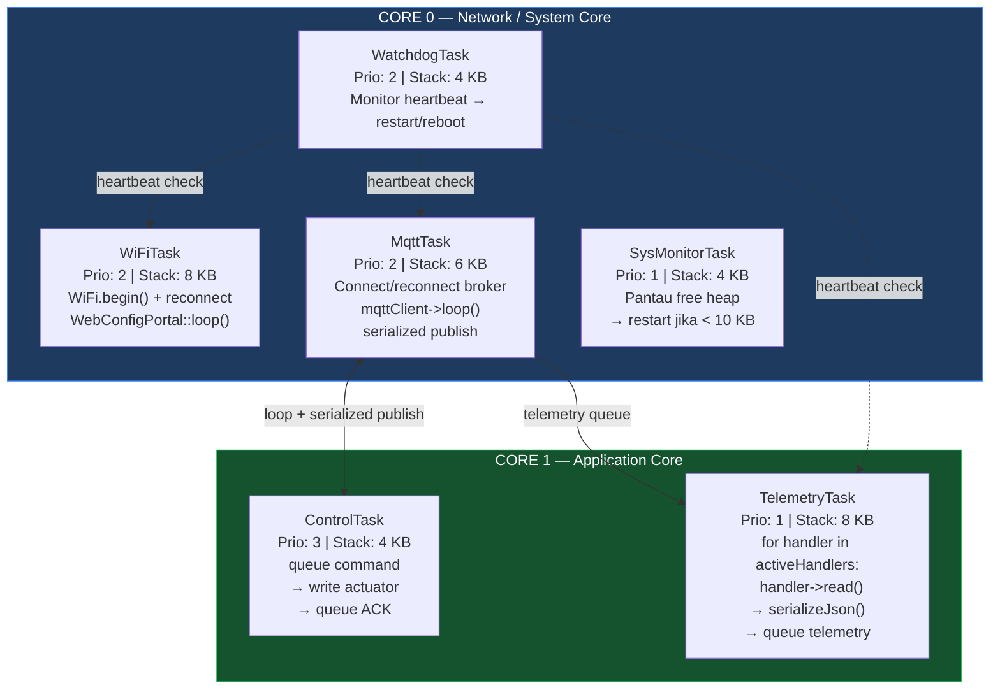
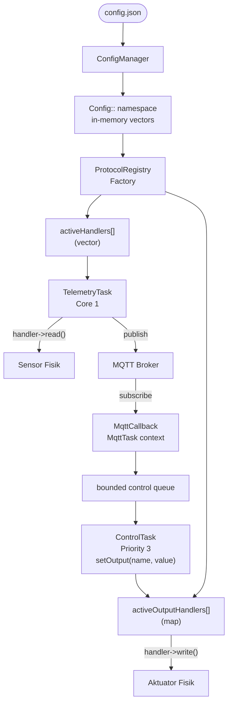
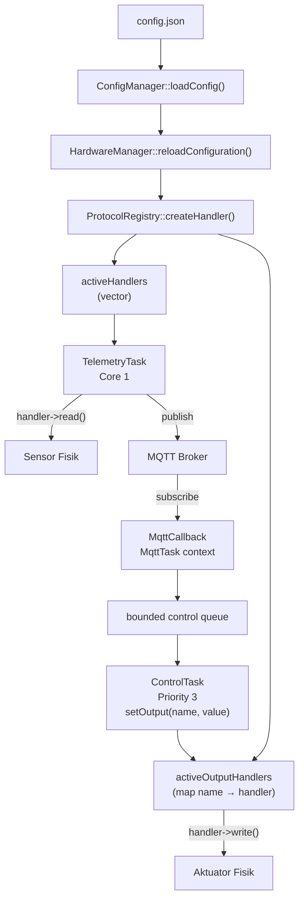
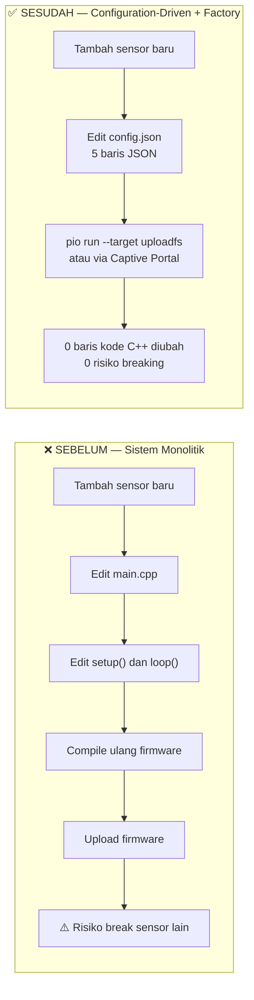
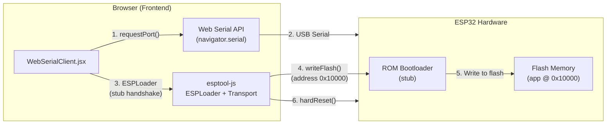

# Firmware Aeroponic Node — Dokumentasi Teknis (Bab III & IV)

> **Basis kode:** [`firmware/node/`](file:///home/almuzky/TA/Microservices/firmware/node/)  
> **Platform:** ESP32 · **RTOS:** FreeRTOS · **Framework:** Arduino via PlatformIO  
> **Lapisan SGAM:** Component Layer (T-1)

---

## 3.x.1 FreeRTOS Task Mapping (Dual-Core)

### Pemetaan Task ke Dual-Core



> **Alasan pemisahan core:** WiFi stack ESP32 berjalan di Core 0. TelemetryTask di Core 1 agar pembacaan sensor tidak terganggu oleh network interrupt.

### Tabel Enam FreeRTOS Task

| Task | File Sumber | Core | Priority | Stack | Tanggung Jawab Utama |
|------|-------------|------|----------|-------|----------------------|
| `WatchdogTask` | [`TaskWatchdog.cpp`](file:///home/almuzky/TA/Microservices/firmware/node/src/core/TaskWatchdog.cpp) | 0 | **2** | 4 KB | Placeholder watchdog; registry tugas saat ini kosong (no-op) |
| `WiFiTask` | [`NetworkManager.cpp`](file:///home/almuzky/TA/Microservices/firmware/node/src/protocols/NetworkManager.cpp) | 0 | **2** | 8 KB | Manage koneksi WiFi (reconnect otomatis) + serve Captive Portal |
| `MqttTask` | [`MqttManager.cpp`](file:///home/almuzky/TA/Microservices/firmware/node/src/protocols/MqttManager.cpp) | **1** | **2** | 6 KB | Connect/reconnect broker MQTT; loop callback; serialize all MQTT publish operations |
| `ControlTask` | [`HardwareManager.cpp`](file:///home/almuzky/TA/Microservices/firmware/node/src/core/HardwareManager.cpp) | **1** | **3** | 4 KB | Consume bounded actuator commands, write outputs, emergency stop, queue ACK |
| `SysMonitorTask` | [`SystemMonitor.cpp`](file:///home/almuzky/TA/Microservices/firmware/node/src/core/SystemMonitor.cpp) | 0 | 1 | 4 KB | Pantau free heap; restart ESP32 jika < 10 KB |
| `TelemetryTask` | [`HardwareManager.cpp`](file:///home/almuzky/TA/Microservices/firmware/node/src/core/HardwareManager.cpp) | **1** | 1 | 8 KB | Baca sensor via `activeHandlers[]`; queue JSON telemetry |
| `ModbusScanTask` | [`HardwareManager.cpp`](file:///home/almuzky/TA/Microservices/firmware/node/src/core/HardwareManager.cpp) | **1** | 2 | 4 KB | Background async Modbus ID scan (dibuat/dihapus per request scan) |

### Mekanisme Sinkronisasi Antar-Task

```mermaid
flowchart LR
    subgraph MUTEX["🔒 Mutex Protection"]
        MM["modbusMutex\nMelindungi Serial2 RS485"]
        HM["handlersMutex\nMelindungi sensor registry"]
        OM["outputMutex\nMelindungi actuator map/write"]
        TM["telemetryMutex\nMelindungi latestTelemetryJson"]
    end
    subgraph NOTIF["📢 Task Notification"]
        SO["ControlTask setOutput()"] -->|xTaskNotifyGive| TT["TelemetryTask"]
    end
    subgraph HB["💓 Heartbeat Watchdog"]
        TELE2["TelemetryTask"] -->|heartbeat (no-op)| WDT["WatchdogTask\nregistry kosong"]
        MQTTT["MqttTask"] -->|heartbeat setiap 100ms (no-op)| WDT
        WDT -.->|tidak ada aksi| RST["restart task\natau ESP.restart()"]
    end
```

---

## 3.x.2 Desain Modular I/O — Factory Pattern & Registry

Firmware menggunakan **tiga lapisan abstraksi** agar sistem bisa dinamis:

1. **Configuration** — `config.json` → `ConfigManager` → `Config:: namespace`
2. **Factory/Registry** — `ProtocolRegistry` + `activeHandlers[]` + `activeOutputHandlers[]`
3. **Consumer** — `TelemetryTask` (Core 1, sensor) dan `ControlTask` (Core 1, aktuator)



| Lapisan | Komponen | Peran |
|---------|----------|-------|
| **Configuration** | `config.json` → `ConfigManager` → `Config:: namespace` | Semua hardware dideklarasi di JSON, diparsing ke vector in-memory. |
| **Factory/Registry** | `ProtocolRegistry` + `activeHandlers[]` + `activeOutputHandlers[]` | Membuat instance handler sesuai protokol di config. Sensor di vector, aktuator di map. |
| **Consumer** | `TelemetryTask` (Core 1, sensor) dan `ControlTask` (Core 1, aktuator) | Keduanya tidak tahu tipe konkret handler. |

### 3.x.2.1 Konfigurasi config.json (Tidak Ada Hardcode)

File [`data/config.json`](file:///home/almuzky/TA/Microservices/firmware/node/data/config.json) adalah **satu-satunya tempat** mendaftarkan sensor dan aktuator.

```json
{
  "hardware": {
    "inputs": [
      { "pin": 34, "type": "ANALOG", "pull": "NONE", "name": "soil_moisture", "invert": false, "debounce_ms": 0, "interrupt": "NONE", "analog_min": 0, "analog_max": 4095 },
      { "pin": 13, "type": "DIGITAL", "pull": "UP", "name": "float_switch", "invert": true, "debounce_ms": 50, "interrupt": "CHANGE" }
    ],
    "outputs": [
      { "pin": 26, "type": "DIGITAL", "name": "misting_pump",    "protocol": "GPIO_OUT" },
      { "pin": 27, "type": "PWM",     "name": "cooling_fan",   "protocol": "GPIO_OUT" },
      { "pin": 25, "type": "DIGITAL", "name": "nutrient_valve","protocol": "GPIO_OUT" }
    ],
    "modbus": [
      {
        "name": "ec_ph_sensor", "slave_id": 1, "baudrate": 9600,
        "registers": [
          { "address": 0, "name": "ec_value",   "multiplier": 0.01, "type": "HOLDING" },
          { "address": 1, "name": "ph_value",   "multiplier": 0.01, "type": "HOLDING" },
          { "address": 2, "name": "temp_water", "multiplier": 0.1,  "type": "HOLDING" }
        ]
      }
    ],
    "sensors": [
      { "name": "bme280_atas", "protocol": "I2C", "type": "BME280", "address": "0x76", "sda_pin": "21", "scl_pin": "22" },
      { "name": "dht12_akar",  "protocol": "I2C", "type": "DHT12",  "address": "0x5C", "sda_pin": "21", "scl_pin": "22" },
      { "name": "power_monitor", "protocol": "I2C", "type": "INA219", "address": "0x40", "sda_pin": "21", "scl_pin": "22" }
    ]
  }
}
```

### 3.x.2.2 Kontrak ProtocolHandler (Interface Abstrak)

[`ProtocolHandler.h`](file:///home/almuzky/TA/Microservices/firmware/node/src/core/ProtocolHandler.h) mendefinisikan kontrak yang harus dipenuhi semua handler:

```cpp
class ProtocolHandler {
public:
    virtual ~ProtocolHandler() {}
    virtual bool init(const JsonObject& config) = 0;
    virtual bool read(JsonObject& telemetry) = 0;
    virtual bool write(int value) { return false; }
    virtual String getProtocolName() = 0;
    virtual String getSensorName() = 0;
};
```

### 3.x.2.3 ProtocolRegistry — Factory Dinamis

[`ProtocolHandler.cpp`](file:///home/almuzky/TA/Microservices/firmware/node/src/core/ProtocolHandler.cpp) mengimplementasikan Factory Pattern menggunakan **singleton map**:

```cpp
typedef ProtocolHandler* (*ProtocolHandlerCreator)();
class ProtocolRegistry {
    static std::map<String, ProtocolHandlerCreator>& getRegistry() {
        static std::map<String, ProtocolHandlerCreator> registry;
        return registry;
    }
public:
    static void registerProtocol(const String& name, ProtocolHandlerCreator creator) {
        getRegistry()[name] = creator;
    }
    static ProtocolHandler* createHandler(const String& name, const JsonObject& config) {
        auto& reg = getRegistry();
        auto it = reg.find(name);
        if (it != reg.end()) {
            ProtocolHandler* handler = it->second();
            if (handler->init(config)) return handler;
            delete handler;
        }
        return nullptr;
    }
};
```

Pendaftaran protokol di `HardwareManager::init()` — dilakukan **satu kali** saat boot:

```cpp
ProtocolRegistry::registerProtocol("GPIO",         []() -> ProtocolHandler* { return new GPIOInputHandler(); });
ProtocolRegistry::registerProtocol("MODBUS",       []() -> ProtocolHandler* { return new ModbusHandler(); });
ProtocolRegistry::registerProtocol("MODBUS_TCP",   []() -> ProtocolHandler* { return new ModbusTCPHandler(); });
ProtocolRegistry::registerProtocol("I2C",          []() -> ProtocolHandler* { return new I2CHandler(); });
ProtocolRegistry::registerProtocol("GPIO_OUT",     []() -> ProtocolHandler* { return new GpioOutputHandler(); });
ProtocolRegistry::registerProtocol("PCF8575_OUT",  []() -> ProtocolHandler* { return new Pcf8575OutputHandler(); });
ProtocolRegistry::registerProtocol("PCF8575_IN",   []() -> ProtocolHandler* { return new Pcf8575InputHandler(); });
```

### 3.x.2.4 Vector Registry activeHandlers

`reloadConfiguration()` mengosongkan dan mengisi ulang vector ini setiap kali konfigurasi berubah. Dilindungi `handlersMutex`:

```cpp
void HardwareManager::reloadConfiguration() {
    xSemaphoreTake(handlersMutex, portMAX_DELAY);
    for (auto h : activeHandlers) delete h;
    activeHandlers.clear();

    for (auto& kv : activeOutputHandlers) delete kv.second;
    activeOutputHandlers.clear();
    outputStates.clear();
    latestSensorValues.clear();

    // ... rebuild outputs under outputMutex ...

    xSemaphoreGive(handlersMutex);
    if (outputMutex) xSemaphoreGive(outputMutex);
    Logger::hardware("Hardware Handlers Reloaded Successfully.");
}
```

Snapshot vector setelah boot:
```
activeHandlers (std::vector<ProtocolHandler*>):
[0] GPIOInputHandler { pin=34, name="soil_moisture" }
[1] GPIOInputHandler { pin=13, name="float_switch"  }
[2] ModbusHandler    { name="ec_ph_sensor", slave_id=1 }
[3] I2CHandler       { name="bme280_atas",  addr=0x76  }
[4] I2CHandler       { name="dht12_akar",   addr=0x5C  }
[5] I2CHandler       { name="power_monitor", type=INA219, addr=0x40 }
```

### 3.x.2.5 Implementasi Handler Nyata

Semua implementasi ada di [`ProtocolHandlers.cpp`](file:///home/almuzky/TA/Microservices/firmware/node/src/core/ProtocolHandlers.cpp):

**GPIOInputHandler:**
```cpp
bool GPIOInputHandler::read(JsonObject& telemetry) {
    JsonObject inputs = telemetry["inputs"];
    if (inputs.isNull()) inputs = telemetry.createNestedObject("inputs");
    if (type == "ANALOG") {
        inputs[name] = analogRead(pin);
    } else {
        int dval = digitalRead(pin);
        if (invert) dval = !dval;
        inputs[name] = dval;
    }
    HardwareManager::latestSensorValues[name] = val;
    return true;
}
```

**ModbusHandler (RS485):**
```cpp
bool ModbusHandler::read(JsonObject& telemetry) {
    JsonObject modbusDev = telemetry["modbus"].createNestedObject(name);
    xSemaphoreTake(HardwareManager::modbusMutex, pdMS_TO_TICKS(1000));
    HardwareManager::node.begin(slave_id, Serial2);
    for (const auto& reg : registers) {
        uint8_t result = (reg.type == "INPUT")
            ? HardwareManager::node.readInputRegisters(reg.address, 1)
            : HardwareManager::node.readHoldingRegisters(reg.address, 1);
        if (result == HardwareManager::node.ku8MBSuccess) {
            float val = HardwareManager::node.getResponseBuffer(0) * reg.multiplier;
            modbusDev[reg.name] = val;
        }
        vTaskDelay(10 / portTICK_PERIOD_MS);
    }
    xSemaphoreGive(HardwareManager::modbusMutex);
    return true;
}
```

**ModbusTCPHandler (Modbus TCP):**
```cpp
bool ModbusTCPHandler::read(JsonObject& telemetry) {
    JsonObject modbusDev = telemetry["modbus"].createNestedObject(name);
    if (ip_address == "" || port == 0) return false;
    xSemaphoreTake(HardwareManager::modbusMutex, pdMS_TO_TICKS(1000));
    HardwareManager::node.begin(ip_address, port);
    for (const auto& reg : registers) {
        uint8_t result = (reg.type == "INPUT")
            ? HardwareManager::node.readInputRegisters(reg.address, 1)
            : HardwareManager::node.readHoldingRegisters(reg.address, 1);
        if (result == HardwareManager::node.ku8MBSuccess) {
            float val = HardwareManager::node.getResponseBuffer(0) * reg.multiplier;
            modbusDev[reg.name] = val;
        }
        vTaskDelay(10 / portTICK_PERIOD_MS);
    }
    xSemaphoreGive(HardwareManager::modbusMutex);
    return true;
}
```
> **Catatan:** `baudrate` diabaikan untuk `transport: "TCP"`. Diperlukan `ip_address` dan `port` (default 502).

**Tabel Semua Handler:**

| Handler | Protokol | Sensor yang Didukung | Output JSON Key |
|---------|----------|----------------------|-----------------|
| `GPIOInputHandler` | GPIO | Sensor analog, switch digital | `telemetry.inputs.<name>` |
| `ModbusHandler` | RS485/Modbus RTU | EC, pH, suhu air | `telemetry.modbus.<device>.<register>` |
| `ModbusTCPHandler` | Modbus TCP | sensor Modbus via TCP | `telemetry.modbus.<device>.<register>` |
| `I2CHandler` | I²C | BME280, DHT12, INA219 | `telemetry.i2c.<name>` (lihat catatan INA219) |
| `Pcf8575InputHandler` | PCF8575_IN | Switch digital, pelampung air via I2C expander | `telemetry.inputs.<name>` |
| `Pcf8575OutputHandler` | PCF8575_OUT | Relay/aktuator via I2C expander | — (output, bukan sensor telemetry) |
| `GpioOutputHandler` | GPIO_OUT | Aktuator GPIO/PWM | — (output, bukan sensor telemetry) |

> **Catatan INA219:** `telemetry.i2c.<name>` berisi field: `bus_voltage_v`, `shunt_voltage_mv`, `current_ma`, `power_mw`.

---

## 3.x.3 Antarmuka Konfigurasi Mandiri — Captive Web Portal

**Captive Web Portal** adalah ESP32 yang menjalankan **Access Point (AP) Wi-Fi + HTTP server miniatur** di dalam firmware. Saat pengguna menghubungkan perangkat ke AP tersebut, **semua permintaan DNS diarahkan ke IP ESP32** (`192.133.22.6`) melalui DNS *wildcard*.

| Komponen | Peran |
|----------|-------|
| `WiFi.softAP()` | Menyalakan AP dengan SSID dinamis `ENYX-ENTERPRISE-<node_id>` |
| `DNSServer` | DNS wildcard `*` → seluruh domain diarahkan ke IP ESP32 |
| `WebServer` (port 80) | HTTP server yang melayani halaman UI dan 19 endpoint REST API |
| `LittleFS` | Filesystem flash internal ESP32 untuk menyimpan file HTML/JS/CSS dan `config.json` |
| `checkAuthToken()` | Middleware Bearer token untuk memproteksi endpoint sensitif |

### Kode `startAP()`

```cpp
void WebConfigPortal::startAP() {
    WiFi.softAPConfig(apIP, apIP, IPAddress(255, 255, 255, 0));
    String apName = "ENYX-ENTERPRISE-" + Config::NODE_ID;
    WiFi.softAP(apName.c_str());
    dnsServer.start(DNS_PORT, "*", apIP);
    server.on("/",                         HTTP_GET,  handleRoot);
    server.on("/api/login",                HTTP_POST, handleApiLogin);
    server.on("/api/fullconfig",           HTTP_GET,  handleApiFullConfigGet);
    server.on("/api/wifi",                 HTTP_POST, handleApiWifiPost);
    server.on("/api/mqtt",                 HTTP_POST, handleApiMqttPost);
    server.on("/api/device",               HTTP_POST, handleApiDevicePost);
    server.on("/api/hardware",             HTTP_POST, handleApiHardwarePost);
    server.on("/api/hardware/discover",    HTTP_GET,  handleApiHardwareDiscover);
    server.on("/api/modbus/start_scan",    HTTP_POST, handleApiModbusStartScan);
    server.on("/api/modbus/cancel_scan",   HTTP_POST, handleApiModbusCancelScan);
    server.on("/api/modbus/scan_status",   HTTP_GET,  handleApiModbusScanStatus);
    server.on("/api/modbus/scan_reg",      HTTP_GET,  handleApiModbusScanReg);
    server.on("/api/modbus/scan_reg_batch",HTTP_POST, handleApiModbusScanRegBatch);
    server.on("/api/account",              HTTP_POST, handleApiAccountPost);
    server.on("/api/status",               HTTP_GET,  handleApiStatusGet);
    server.on("/api/ota",                  HTTP_POST, handleApiOtaUpdate, handleApiOtaUpload);
    server.on("/api/publish_discovery",    HTTP_POST, handleApiPublishDiscovery);
    server.on("/api/config/export",        HTTP_GET,  handleApiConfigExport);
    server.on("/api/config/import",        HTTP_POST, handleApiConfigImport);
    server.on("/api/telemetry/latest",     HTTP_GET,  handleApiTelemetryLatest);
    server.on("/api/root/health",          HTTP_GET,  handleHealth);
    server.begin();
}
```

### Tabel Endpoint REST Portal

| Endpoint | Method | Fungsi |
|----------|--------|--------|
| `/` | GET | Serve UI portal (`index.html`) |
| `/style.css` | GET | Static CSS |
| `/script.js` | GET | Static JS |
| `/logo.svg` | GET | Static logo |
| `/favicon.svg` | GET | Static favicon |
| `/api/login` | POST | Login admin → generate Bearer token |
| `/api/fullconfig` | GET | Ambil seluruh konfigurasi saat ini (JSON) |
| `/api/wifi` | POST | Simpan SSID + password WiFi |
| `/api/mqtt` | POST | Simpan server, port, credentials MQTT |
| `/api/device` | POST | Ubah NODE_ID, fw_version |
| `/api/hardware` | POST | **Daftarkan sensor/aktuator baru** (inputs/outputs/modbus/sensors) |
| `/api/hardware/discover` | GET | I2C scan → deteksi perangkat yang terhubung |
| `/api/modbus/start_scan` | POST | Scan Modbus slave ID 1–247 |
| `/api/modbus/cancel_scan` | POST | Cancel ongoing Modbus scan |
| `/api/modbus/scan_status` | GET | Ambil status scan Modbus yang sedang berjalan |
| `/api/modbus/scan_reg` | GET | Baca satu register Modbus |
| `/api/modbus/scan_reg_batch` | POST | Baca batch register Modbus |
| `/api/account` | POST | Ganti admin username/password |
| `/api/status` | GET | Status WiFi, MQTT, heap, uptime |
| `/api/ota` | POST | Upload firmware baru (OTA) |
| `/api/publish_discovery` | POST | Paksa kirim discovery ke MQTT broker |
| `/api/config/export` | GET | Download config.json |
| `/api/config/import` | POST | Upload config.json |
| `/api/telemetry/latest` | GET | Baca telemetry terakhir tanpa MQTT |
| `/api/root/health` | GET | Health check (liveness probe) |

### Cara Portal Menyimpan Sensor Baru

Saat pengguna POST ke `/api/hardware`, portal memanggil `saveFullConfig()` → serialize ulang seluruh `Config::` namespace ke JSON → tulis ke LittleFS.

---

## 3.x.4 Alur Telemetri & Aktuator

### 3.x.4.1 I/O System: Dua Arah yang Sama

Sensor (input) dan aktuator (output) **bukan sistem terpisah**. Keduanya:
- Didaftarkan di **`config.json` yang sama** (`hardware.inputs[]` dan `hardware.outputs[]`)
- Di-instantiate oleh **`HardwareManager::reloadConfiguration()` yang sama**
- Mendapatkan instance dari **`ProtocolRegistry` factory yang sama**

| Aspek | Sensor (Input) | Aktuator (Output) |
|-------|----------------|-------------------|
| `config.json` | `hardware.inputs[]` | `hardware.outputs[]` |
| Registry | `activeHandlers` (vector) | `activeOutputHandlers` (map `name → handler`) |
| Method | `handler->read(telemetry)` | `handler->write(value)` |
| Pemicu | Periodik: `TelemetryTask` | Event-driven: MQTT command / local control |
| MQTT | **Publish** `<prefix>/<node_id>/telemetry` | **Subscribe** `<prefix>/actuator/<node_id>` |
| MQTT (ACK) | — | **Publish** `<prefix>/<node_id>/confirm` untuk ACK/NACK perintah aktuator |
| MQTT (Discovery) | **Publish** `<prefix>/discovery` setiap 60 detik dan saat koneksi broker | — |

**Mengapa registry aktuator berupa `map`, bukan `vector`?** `setOutput()` menerima `targetName` (string) → harus lookup by name langsung. Map memberikan pencarian `O(log n)` berdasarkan nama aktuator.

### 3.x.4.2 MQTT Topics Contract

| Kategori | Topic | Arah | Deskripsi |
|----------|-------|------|-----------|
| Telemetry | `<prefix>/<node_id>/telemetry` | Node → Broker | Data sensor + status aktuator + info device |
| Actuator | `<prefix>/actuator/<node_id>` | Broker → Node | Perintah kontrol aktuator |
| Confirm | `<prefix>/<node_id>/confirm` | Node → Broker | ACK/NACK perintah aktuator (`req_id`, `target`, `value`, `status`, `error`) |
| Discovery | `<prefix>/discovery` | Node → Broker | Auto-discovery signal (dikirim setiap 60 detik dan setelah koneksi broker) |
| Status | `<prefix>/status/<node_id>` | Node → Broker | LWT online/offline |

### 3.x.4.2 Overall Diagram



### 3.x.4.3 Aktuator: `activeOutputHandlers` Map & MQTT → `write()`

Aktuator menggunakan **map** karena `setOutput()` menerima `targetName` (string) dan perlu **lookup by name** secara langsung.

Alur eksekusi aktuator:
1. `MqttManager` subscribe `smartfarm/actuator/<node_id>`
2. `mqttCallback` memvalidasi dan memasukkan `{action, target, value, req_id}` ke bounded queue
3. `ControlTask` priority 3 memanggil `setOutput(target, value)` → `activeOutputHandlers.find(target)->write(value)`
4. `outputStates[target] = value` + `xTaskNotifyGive(telemetryTaskHandle)`
5. `ControlTask` memasukkan ACK hasil aktual ke publish queue; hanya `MqttTask` menyentuh `PubSubClient`

**`setOutput()` implementation** — [`HardwareManager.cpp`](file:///home/almuzky/TA/Microservices/firmware/node/src/core/HardwareManager.cpp):
```cpp
OutputResult setOutputResult(String targetName, int value) {
    if (!outputMutex) return OutputResult::Busy;
    if (xSemaphoreTake(outputMutex, pdMS_TO_TICKS(50)) != pdTRUE) return OutputResult::Busy;

    auto it = activeOutputHandlers.find(targetName);
    if (it != activeOutputHandlers.end()) {
        bool written = it->second->write(value);
        if (!written) {
            xSemaphoreGive(outputMutex);
            return OutputResult::HandlerFailed;
        }
        outputStates[targetName] = value;
        xSemaphoreGive(outputMutex);
        if (telemetryTaskHandle != NULL) xTaskNotifyGive(telemetryTaskHandle);
        return OutputResult::Success;
    }
    xSemaphoreGive(outputMutex);
    return OutputResult::NotFound;
  }
**ModbusTCPHandler (Modbus TCP):**
```cpp
bool ModbusTCPHandler::read(JsonObject& telemetry) {
    JsonObject modbusDev = telemetry["modbus"].createNestedObject(name);
    if (ip_address == "" || port == 0) return false;
    xSemaphoreTake(HardwareManager::modbusMutex, pdMS_TO_TICKS(1000));
    HardwareManager::node.begin(ip_address, port);
    // read registers via TCP, same schema as RTU
    xSemaphoreGive(HardwareManager::modbusMutex);
    return true;
}
```
> **Catatan:** `baudrate` diabainkan untuk `transport: "TCP"`. Diperlukan `ip_address` dan `port` (default 502).

---

## 3.x.5 Kontrak Penyimpanan: NVS Namespace & config.json

Firmware menggunakan dua lapisan penyimpanan yang berbeda dengan kontrak yang jelas:

| Lapisan | Lokasi | Jenis Data | Tujuan |
|---------|--------|-----------|--------|
| **NVS** (`Preferences`) | Flash ESP32 (partition NVS) | Kredensial & state volatil | Menyimpan data sensitif yang tidak boleh diekspor |
| **LittleFS** (`config.json`) | Flash ESP32 (partition SPIFFS/LittleFS) | Konfigurasi non-sensitif | File konfigurasi yang dapat diekspor/diimpor |

### 3.x.5.1 NVS Namespace `creds` — Kontrak Kunci

Namespace: `creds`  
Fungsi: Menyimpan semua kredensial sensitif. Data di sini **tidak pernah** diekspor via `/api/config/export`.

| Key NVS | Tipe | Deskripsi | Sumber Write |
|---------|------|-----------|-------------|
| `admin_user` | string | Username admin web UI | Web UI `/api/account`, migrasi dari config.json |
| `admin_pass` | string | Password admin web UI | Web UI `/api/account`, migrasi dari config.json |
| `auth_token` | string | Bearer token untuk API auth | Generated saat login `/api/login` |
| `wifi_ssid` | string | SSID WiFi Station | Web UI `/api/wifi`, migrasi dari config.json |
| `wifi_pass` | string | Password WiFi Station | Web UI `/api/wifi`, migrasi dari config.json |
| `ent_enabled` | bool ("1"/"0") | Flag enable WiFi Enterprise (WPA2-ENT) | Web UI `/api/wifi` |
| `ent_user` | string | Username WiFi Enterprise | Web UI `/api/wifi` |
| `ent_pass` | string | Password WiFi Enterprise | Web UI `/api/wifi` |
| `ent_ca` | string | CA certificate WiFi Enterprise | Web UI `/api/wifi` |
| `ent_cert` | string | Client certificate WiFi Enterprise | Web UI `/api/wifi` |
| `ent_key` | string | Client private key WiFi Enterprise | Web UI `/api/wifi` |
| `mqtt_user` | string | Username broker MQTT | Web UI `/api/mqtt`, migrasi dari config.json |
| `mqtt_pass` | string | Password broker MQTT | Web UI `/api/mqtt`, migrasi dari config.json |
| `has_creds` | bool | Flag penanda bahwa kredensial sudah ada di NVS | Set otomatis oleh `CredentialManager::writeString()` |

> **Kontrak NVS:** Setiap kali ada write ke keys di atas, `has_creds` harus di-set ke `true`. Saat `clearCredentials()`, semua keys di atas di-remove beserta `has_creds`.

### 3.x.5.1.1 Security Constants

| Constant | Nilai | Deskripsi |
|----------|-------|-----------|
| `MAX_LOGIN_ATTEMPTS` | 5 | Jumlah percobaan login maksimal sebelum IP diblokir |
| `LOGIN_BLOCK_TIME_MS` | 30000 | Durasi blokir IP setelah melebihi batas login (30 detik) |

### 3.x.5.2 NVS Namespace `ota` — Kontrak Kunci

Namespace: `ota`  
Fungsi: Menyimpan state boot health untuk OTA rollback.

| Key NVS | Tipe | Deskripsi | Sumber Write |
|---------|------|-----------|-------------|
| `boot_count` | int | Jumlah boot beruntun tanpa sukses | `checkBootHealth()` di `main.cpp` |
| `healthy` | bool | Flag bahwa boot setelah OTA sudah sehat | `checkBootHealth()` di `main.cpp` |

> **Kontrak Boot Health:**  
> - `boot_count <= 2` → reset ke 0, set `healthy = true`  
> - `boot_count > 3` → rollback firmware otomatis, reset `boot_count = 0`

### 3.x.5.3 config.json — Kontrak Key & Struktur

File: `/config.json` di LittleFS  
Fungsi: Menyimpan seluruh konfigurasi non-sensitif. File ini **bisa diekspor/diimpor** via web UI.

```json
{
  "device": {
    "node_id": "",
    "fw_version": "1.0.0",
    "description": "Node Control and Sensor Acquisition"
  },
  "protocols": {
    "wifi": {
      "ssid": "SMARTGRID AP",
      "auto_reconnect": true
    },
    "mqtt": {
      "server": "167.205.44.103",
      "port": 1883,
      "topic_prefix": "smartgrid",
      "use_tls": false,
      "telemetry_interval_ms": 5000
    }
  },
  "hardware": {
    "inputs": [],
    "outputs": [],
    "modbus": [],
    "sensors": []
  }
}
```

> **Catatan:** File `data/config.json` yang disertakan dalam firmware **tidak mengandung** field sensitif. `protocols.wifi.password`, `protocols.wifi.ent_*`, dan `protocols.mqtt.user/pass` **tidak ditulis kembali** ke `config.json` setelah migrasi ke NVS. `security.credentials_encrypted` dan `protocols.wifi.auto_reconnect` ditulis oleh portal tetapi **tidak dibaca** oleh firmware saat ini. `saveFullConfig()` hanya menulis `security.credentials_encrypted = false` ke config.json; `admin_user`, `admin_pass`, dan `auth_token` tidak pernah disimpan di LittleFS.

#### 3.x.5.3.1 Kontrak Top-Level Key

| Key Path | Tipe | Wajib | Deskripsi |
|----------|------|-------|-----------|
| `device.node_id` | string | Ya | Unique identifier node (MAC address atau custom) |
| `device.fw_version` | string | Tidak | Versi firmware saat ini |
| `device.description` | string | Tidak | Deskripsi human-readable node |
| `security.credentials_encrypted` | bool | Tidak | Placeholder untuk encrypted credential storage (selalu `false` di implementasi saat ini) |
| `protocols.wifi.ssid` | string | Ya | SSID jaringan WiFi |
| `protocols.wifi.password` | string | Tidak | Password WiFi — hanya digunakan saat migrasi awal dari config.json ke NVS; tidak ditulis kembali setelah migrasi |
| `protocols.wifi.auto_reconnect` | bool | Tidak | **Write-only:** ditulis untuk kompatibilitas; firmware selalu enable auto-reconnect |
| `protocols.wifi.ent_enabled` | bool | Tidak | Enable WiFi Enterprise (default: false) |
| `protocols.wifi.ent_username` | string | Tidak | Username WiFi Enterprise |
| `protocols.wifi.ent_password` | string | Tidak | Password WiFi Enterprise — hanya dibaca saat migrasi awal; disimpan di NVS setelahnya |
| `protocols.wifi.ent_ca_cert` | string | Tidak | CA cert WiFi Enterprise — hanya dibaca saat migrasi awal; disimpan di NVS setelahnya |
| `protocols.wifi.ent_client_cert` | string | Tidak | Client cert WiFi Enterprise — hanya dibaca saat migrasi awal; disimpan di NVS setelahnya |
| `protocols.wifi.ent_client_key` | string | Tidak | Client key WiFi Enterprise — hanya dibaca saat migrasi awal; disimpan di NVS setelahnya |
| `protocols.mqtt.server` | string | Ya | Hostname/IP broker MQTT |
| `protocols.mqtt.port` | int | Ya | Port broker MQTT (default: 1883) |
| `protocols.mqtt.topic_prefix` | string | Tidak | Prefix topik MQTT (default: "smartfarm") |
| `protocols.mqtt.use_tls` | bool | Tidak | Enable TLS untuk MQTT (default: false) |
| `protocols.mqtt.telemetry_interval_ms` | uint32 | Tidak | Interval publish telemetry dalam ms (default: 5000) |
| `protocols.mqtt.mqtt_disconnect_emergency_stop` | bool | Tidak | Emergency stop saat MQTT disconnect (default: true) |
| `hardware.inputs` | array | Tidak | Daftar sensor input |
| `hardware.outputs` | array | Tidak | Daftar aktuator output |
| `hardware.modbus` | array | Tidak | Daftar sensor Modbus RTU/TCP |
| `hardware.sensors` | array | Tidak | Daftar sensor generik (I2C, 1-Wire, SPI) |
| `hardware.rs485_rx` | uint8 | Tidak | Pin GPIO RX RS485 (default: 16) |
| `hardware.rs485_tx` | uint8 | Tidak | Pin GPIO TX RS485 (default: 17; ESP32-S3: 15) |
| `hardware.rs485_de` | uint8 | Tidak | Pin GPIO DE RS485 (default: 255 = auto) |
| `hardware.rs485_parity` | uint8 | Tidak | Parity RS485: 0=None, 1=Even, 2=Odd (default: 0) |
| `hardware.i2c_sda_pin` | uint8 | Tidak | Pin GPIO SDA I2C (default: 21, ESP32-S3: 8) |
| `hardware.i2c_scl_pin` | uint8 | Tidak | Pin GPIO SCL I2C (default: 22, ESP32-S3: 9) |

#### 3.x.5.3.2 Kontrak Hardware Input Pin

| Field | Tipe | Wajib | Deskripsi |
|-------|------|-------|-----------|
| `pin` | uint8 | Ya | Nomor pin GPIO |
| `type` | string | Ya | `"DIGITAL"` atau `"ANALOG"` |
| `pull` | string | Tidak | `"UP"`, `"DOWN"`, `"NONE"` (default: `"NONE"`) |
| `name` | string | Ya | Nama unik sensor |
| `invert` | bool | Tidak | Balikkan logic (default: false) |
| `debounce_ms` | uint16 | Tidak | Waktu debounce dalam ms (default: 0) |
| `interrupt` | string | Tidak | `"RISING"`, `"FALLING"`, `"CHANGE"`, `"NONE"` (default: `"NONE"`) |
| `analog_min` | uint16 | Tidak | **Dibatasi:** nilai disimpan ke struct tapi tidak digunakan untuk scaling pada read path (default: 0) |
| `analog_max` | uint16 | Tidak | **Dibatasi:** nilai disimpan ke struct tapi tidak digunakan untuk scaling pada read path (default: 4095) |
| `protocol` | string | Tidak | Protocol handler: `"GPIO"`, `"PCF8575_IN"` (default: `"GPIO"`) |
| `i2c_addr` | uint8 | Tidak | Alamat I2C untuk PCF8575 (default: 0x20) |

#### 3.x.5.3.3 Kontrak Hardware Output Pin

| Field | Tipe | Wajib | Deskripsi |
|-------|------|-------|-----------|
| `pin` | uint8 | Ya | Nomor pin GPIO |
| `type` | string | Ya | `"DIGITAL"` atau `"PWM"` |
| `name` | string | Ya | Nama unik aktuator |
| `protocol` | string | Tidak | Protocol handler: `"GPIO_OUT"`, `"PCF8575_OUT"` (default: `"GPIO_OUT"`) |
| `i2c_addr` | uint8 | Tidak | Alamat I2C untuk PCF8575 (default: 0x20) |
| `active_low` | bool | Tidak | Logic active-low untuk relay (default: true) |

#### 3.x.5.3.4 Kontrak Modbus Sensor

| Field | Tipe | Wajib | Deskripsi |
|-------|------|-------|-----------|
| `name` | string | Ya | Nama unik perangkat Modbus |
| `slave_id` | uint8 | Ya | ID slave Modbus (1-247) |
| `baudrate` | uint32 | Ya | Baudrate serial (default: 9600); **diabaikan** untuk `transport: "TCP"` |
| `transport` | string | Tidak | `"RTU"` atau `"TCP"` (default: `"RTU"`) |
| `ip_address` | string | Tidak | IP address untuk Modbus TCP |
| `port` | uint16 | Tidak | Port Modbus TCP (default: 502) |
| `registers` | array | Ya | Daftar register |

**Kontrak Modbus Register:**

| Field | Tipe | Wajib | Deskripsi |
|-------|------|-------|-----------|
| `address` | uint16 | Ya | Alamat register (0 = register 40001) |
| `name` | string | Ya | Nama register |
| `multiplier` | float | Ya | Faktor scaling (default: 1.0) |
| `type` | string | Ya | `"HOLDING"` atau `"INPUT"` |
| `length` | uint8 | Tidak | Jumlah register (1 atau 2) (default: 1) |
| `data_type` | string | Tidak | `"UINT16"`, `"INT16"`, `"FLOAT32"`, `"INT32"`, `"UINT32"` (default: `"UINT16"`) |

#### 3.x.5.3.5 Kontrak Generic Sensor

| Field | Tipe | Wajib | Deskripsi |
|-------|------|-------|-----------|
| `name` | string | Ya | Nama unik sensor |
| `protocol` | string | Ya | Protocol handler: `"I2C"`, `"1-WIRE"`, `"SPI"` |
| `params` | map | Tidak | Parameter tambahan spesifik protocol (key-value pairs) |

### 3.x.5.4 Aturan Migrasi Credential config.json → NVS

1. Saat boot (`ConfigManager::init()`), jika NVS namespace `creds` **tidak memiliki** `has_creds = true`:
   - Baca `security.*` dan `protocols.wifi.password`, `protocols.wifi.ent_*`, `protocols.mqtt.user/pass` dari `config.json`
   - Simpan ke NVS namespace `creds` via `CredentialManager::saveCredentials()`
   - Set `has_creds = true`
2. Setelah migrasi, config.json **tetap menyimpan** nilai non-sensitif (`ssid`, `ent_enabled`, dll) untuk fallback, tetapi password sensitif **tidak ditulis kembali** ke config.json.
3. Saat import config.json via `/api/config/import`, kredensial yang ada di payload **disaring** dan dimigrasikan ke NVS, bukan disimpan ke LittleFS.
4. `/api/config/export` **tidak pernah** mengembalikan field credential.

### 3.x.5.5 Dilarang Mengubah Key Berikut Tanpa ADR

Key berikut adalah **kontrak stabil** dan tidak boleh diubah nama, tipe, atau semantics-nya tanpa pembuatan ADR baru:

**NVS keys:** `admin_user`, `admin_pass`, `auth_token`, `wifi_ssid`, `wifi_pass`, `ent_enabled`, `ent_user`, `ent_pass`, `ent_ca`, `ent_cert`, `ent_key`, `mqtt_user`, `mqtt_pass`, `has_creds`

**config.json keys:** `device.node_id`, `device.fw_version`, `protocols.wifi.*`, `protocols.mqtt.*`, `hardware.inputs`, `hardware.outputs`, `hardware.modbus`, `hardware.sensors`, `hardware.rs485_rx`, `hardware.rs485_tx`, `hardware.rs485_de`, `hardware.rs485_parity`, `hardware.i2c_sda_pin`, `hardware.i2c_scl_pin`

---

## 4.x Pembuktian Modularitas — Skenario Penambahan Sensor (T-1)

### Pernyataan T-1

> *"Membangun firmware berbasis FreeRTOS dengan pendekatan configuration-driven dan factory pattern, sehingga penambahan sensor atau aktuator baru cukup dilakukan melalui file konfigurasi **tanpa mengubah kode inti program**."*

### Skenario Uji: Tambah Sensor DS18B20 (Suhu Akar, 1-Wire)

**Kondisi awal:** Firmware sudah berjalan dengan BME280 dan EC Meter Modbus.  
**Target:** Tambahkan sensor suhu akar DS18B20 di pin GPIO 5 (1-Wire protocol).

**Cara 1 — Edit file langsung (via kode editor):**

```diff
--- a/firmware/node/data/config.json
+++ b/firmware/node/data/config.json
      "sensors": [
        { "name": "bme280_atas", "protocol": "I2C", "type": "BME280", "address": "0x76", "sda_pin": "21", "scl_pin": "22" },
        { "name": "dht12_akar",  "protocol": "I2C", "type": "DHT12",  "address": "0x5C", "sda_pin": "21", "scl_pin": "22" }
-      }
+      },
+      {
+        "name": "ds18b20_root",
+        "protocol": "1-WIRE",
+        "pin": "5"
+      }
      ]
```

Lalu upload: `pio run --target uploadfs` → ESP32 restart.

**Cara 2 — Via Captive Portal (zero-touch, tanpa kabel):**
```
1. Hubungkan ke WiFi "ENYX-ENTERPRISE-<node_id>"
2. Buka 192.133.22.6 di browser
3. Login → Menu "I2C"
4. Klik "+ Add I2C Sensor"
5. Isi: Name="power_monitor", Type="INA219", Address="0x40", SDA="21", SCL="22"
6. Klik "Save & Reboot All I2C" → POST /api/hardware (payload sensors) → otomatis update config.json
7. ESP32 reboot dengan sensor baru (hot-swap I2CHandler)
```

### Verifikasi: File yang Diubah

| File | Diubah? | Keterangan |
|------|---------|------------|
| `main.cpp` | ❌ **TIDAK** | Entry point tidak disentuh |
| `HardwareManager.cpp` | ❌ **TIDAK** | TelemetryTask loop tidak berubah |
| `ProtocolHandler.cpp` | ❌ **TIDAK** | Registry tidak berubah |
| `ProtocolHandlers.cpp` | ❌ **TIDAK** | OneWireHandler belum diimplementasi |
| `MqttManager.cpp` | ❌ **TIDAK** | Publish logic tidak berubah |
| `data/config.json` | ✅ **YA** | Hanya tambah 4 baris JSON |

### Metrik Modularitas

| Metrik | Nilai | Keterangan |
|--------|-------|------------|
| Baris kode C++ yang diubah | **0 baris** | Tidak ada kode inti yang disentuh |
| File kode C++ yang dimodifikasi | **0 file** | Hanya JSON yang berubah |
| Baris JSON yang ditambahkan | **5 baris** | Satu entry di `sensors[]` |
| Waktu konfigurasi | **< 2 menit** | Via portal atau text editor |
| Re-compile firmware diperlukan? | **Tidak** | Upload JSON saja (`pio uploadfs`) |

### Contoh Nyata: Sensor INA219 (`power_monitor`)

Sensor INA219 sudah ditambahkan sebagai bukti nyata klaim T-1 — tanpa menyentuh satu baris pun kode C++ inti:
- **`data/config.json`** → entry `power_monitor` (I2C, type `INA219`, address `0x40`)
- **`platformio.ini`** → dependency `adafruit/Adafruit INA219 @ ^1.2.1`
- **`I2CHandler`** (`ProtocolHandlers.cpp`) → `init()` mendeteksi `type == "INA219"` dan menginstansiasi `Adafruit_INA219`

### Klaim Modularitas T-1 Terbukti



---

## Referensi Teknis

### Dokumen Internal Proyek

| Dokumen | Relevansi |
|---------|-----------|
| [`firmware/node/src/core/HardwareManager.cpp`](file:///home/almuzky/TA/Microservices/firmware/node/src/core/HardwareManager.cpp) | `activeHandlers[]`, `activeOutputHandlers`, `reloadConfiguration()`, `setOutput()` |
| [`firmware/node/src/core/ProtocolHandler.h`](file:///home/almuzky/TA/Microservices/firmware/node/src/core/ProtocolHandler.h) | Kontrak abstrak `ProtocolHandler` (interface) |
| [`firmware/node/src/core/ProtocolHandler.cpp`](file:///home/almuzky/TA/Microservices/firmware/node/src/core/ProtocolHandler.cpp) | `ProtocolRegistry` factory singleton (std::map registry) |
| [`firmware/node/src/core/ProtocolHandlers.cpp`](file:///home/almuzky/TA/Microservices/firmware/node/src/core/ProtocolHandlers.cpp) | Implementasi handler: GPIO, Modbus, I2C, 1-Wire, SPI, GPIO_OUT |
| [`firmware/node/src/core/ConfigManager.cpp`](file:///home/almuzky/TA/Microservices/firmware/node/src/core/ConfigManager.cpp) | Parsing `config.json` → namespace `Config::` vectors |
| [`firmware/node/src/protocols/MqttManager.cpp`](file:///home/almuzky/TA/Microservices/firmware/node/src/protocols/MqttManager.cpp) | MQTT client, LWT, callback aktuator, publish telemetri |
| [`firmware/node/src/protocols/NetworkManager.cpp`](file:///home/almuzky/TA/Microservices/firmware/node/src/protocols/NetworkManager.cpp) | WiFiTask, reconnect, Captive Portal HTTP server |
| [`firmware/node/src/protocols/WebConfigPortal.cpp`](file:///home/almuzky/TA/Microservices/firmware/node/src/protocols/WebConfigPortal.cpp) | Captive Portal, 19 endpoint REST, `/api/hardware` |
| [`firmware/node/data/config.json`](file:///home/almuzky/TA/Microservices/firmware/node/data/config.json) | Konfigurasi hardware tunggal (inputs/outputs/modbus/sensors) |
| [`docs/integration-guides/module.md`](file:///home/almuzky/TA/Microservices/docs/integration-guides/module.md) | Kontrak MQTT Module Service, NATS downstream subscription |
| [`docs/integration-guides/control.md`](file:///home/almuzky/TA/Microservices/docs/integration-guides/control.md) | Payload perintah aktuator, format ACK, lifecycle perintah |

---

## 5. Frontend Firmware Tool — WebSerial Configurator

### 5.1 Overview

**WebSerial Configurator** adalah antarmuka frontend berbasis web untuk melakukan:
- **Serial monitor** — membaca output serial ESP32 secara real-time via USB
- **Firmware flashing** — menulis file `.bin` firmware ke ESP32 menggunakan `esptool-js` melalui WebSerial API

Tool ini berjalan sepenuhnya di browser tanpa instalasi driver atau software tambahan, memanfaatkan **Web Serial API** (Chromium/Edge) dan library **`esptool-js`** v0.6.

> **Basis kode frontend:** [`dashboard/src/components/WebSerial/WebSerialClient.jsx`](file:///C:/Users/ThinkPad/enyx-enterprise/dashboard/src/components/WebSerial/WebSerialClient.jsx)  
> **Route:** `/configurator`  
> **Package:** `esptool-js@^0.6.0` (tercatat di [`dashboard/package.json`](file:///C:/Users/ThinkPad/enyx-enterprise/dashboard/package.json))

---

### 5.2 Cara Akses

| Metode | Deskripsi |
|--------|-----------|
| **URL langsung** | Buka `http://<host>/configurator` |
| **Browser back/forward** | Navigasi browser didukung via `popstate` handler di App.jsx |
| **Logout dari dashboard** | Tombol "Back to Home" pada halaman configurator mengembalikan ke landing page |

Configurator **tidak memerlukan autentikasi dashboard** — halaman ini dapat diakses secara publik (tanpa login) agar teknisi dapat melakukan flashing even jika backend unavailable.

---

### 5.3 Arsitektur Komponen



---

### 5.4 Fitur

#### 5.4.1 Serial Monitor (Read)

| Fitur | Detail |
|-------|--------|
| **Connect USB** | Membuka port serial via `navigator.serial.requestPort()` |
| **Baud rate** | 115200 bps (konsisten dengan firmware Serial.begin(115200)) |
| **Signal control** | DTR/RTS di-set ke `false` agar ESP32 masuk mode normal run |
| **Real-time log** | Output serial di-decoded sebagai teks, ditambahkan timestamp `HH:MM:SS.mmm ->` |
| **Auto-scroll** | Log otomatis scroll ke bawah saat entry baru datang |
| **Disconnect** | Menutup port serial dan membatalkan reader |

#### 5.4.2 Firmware Flashing (Write)

| Fitur | Detail |
|-------|--------|
| **File input** | Menerima file `.bin` via `<input type="file" accept=".bin">` |
| **Port reuse** | Jika serial monitor terbuka, tool otomatis menutup port sebelum flashing |
| **ESP stub** | `ESPLoader` memuat stub bootloader dari ESP32 ROM |
| **Flash address** | `0x10000` (offset standard untuk aplikasi ESP32) |
| **Flash options** | `flashSize: 'keep'`, `flashMode: 'keep'`, `flashFreq: 'keep'` — mempertahankan konfigurasi existing |
| **Compression** | `compress: true` untuk mempercepat transfer |
| **Progress bar** | Real-time progress persentase (`reportProgress` callback) |
| **Auto reset** | `hardReset()` dijalankan setelah flashing selesai |

---

### 5.5 Alur Penggunaan

#### 5.5.1 Serial Monitor

```
1. Buka http://<host>/configurator
2. Klik "Connect USB Device"
3. Browser memunculkan dialog pemilihan port USB — pilih port ESP32
4. Output serial muncul di panel kanan dengan timestamp
5. Klik "Disconnect" untuk menutup port
```

#### 5.5.2 Firmware Flashing

```
1. Putuskan koneksi serial monitor jika masih terbuka (tombol "Disconnect")
2. Klik area file picker, pilih file firmware .bin
3. Klik "Upload Firmware (.bin)"
4. Browser meminta pemilihan port USB lagi — pilih port ESP32 yang sama
5. esptool memuat stub, menulis flash, dan mereset perangkat
6. Progress bar menampilkan persentase flashing
7. Setelah selesai, log menampilkan "Flashing Complete! Resetting device..."
8. ESP32 reboot dengan firmware baru
```

---

### 5.6 Dependensi Teknis

| Komponen | Versi | Peran |
|----------|-------|-------|
| **Web Serial API** | Built-in (Chrome 89+, Edge 89+) | API browser untuk akses port USB serial |
| **esptool-js** | ^0.6.0 | Library JavaScript untuk ESP flashing (port dari esptool Python) |
| **lucide-react** | — | Ikon: `Usb`, `UploadCloud`, `TerminalSquare`, `AlertTriangle`, `Network` |

**Browser requirement:** WebSerial API hanya didukung di Chromium-based browsers (Chrome, Edge). Tidak didukung di Firefox, Safari.

---

### 5.7 Kontrak & Batasan

| Aspek | Detail |
|-------|--------|
| **Flash address** | `0x10000` — hardcoded untuk aplikasi ESP32 (tidak untuk factory partition atau bootloader) |
| **Flash options** | `keep` — mempertahankan flash size, mode, dan frequency yang sudah ada di chip |
| **Serial cleanup** | Komponen melakukan cleanup reader dan port pada unmount (`useEffect` cleanup) |
| **No concurrent flash+serial** | Tool tidak mendukung serial monitor dan flashing bersamaan — user harus disconnect terlebih dahulu |
| **Single file** | Hanya mendukung flashing satu file `.bin` per operasi (tidak multi-partition) |

---

### 5.8 Integrasi dengan Captive Portal

WebSerial Configurator **berbeda** dengan Captive Portal yang berjalan di ESP32:

| Aspek | WebSerial Configurator | Captive Portal |
|--------|------------------------|----------------|
| **Lokasi** | Frontend browser | ESP32 AP + HTTP server |
| **Akses** | USB serial langsung | WiFi (SoftAP) |
| **Tujuan** | Flash firmware, debug serial | Konfigurasi WiFi/MQTT/hardware |
| **Autentikasi** | Tidak ada (public) | Bearer token (`checkAuthToken`) |
| **Kapan dipakai** | Development, troubleshooting | Onboarding node baru |

> **Catatan:** Captive Portal juga menyediakan endpoint `/api/ota` untuk OTA wireless, sedangkan WebSerial Configurator digunakan untuk flashing awal atau recovery via USB.

---

### 5.9 File Referensi Frontend

| File | Peran |
|------|-------|
| [`dashboard/src/components/WebSerial/WebSerialClient.jsx`](file:///C:/Users/ThinkPad/enyx-enterprise/dashboard/src/components/WebSerial/WebSerialClient.jsx) | Komponen utama configurator |
| [`dashboard/src/App.jsx`](file:///C:/Users/ThinkPad/enyx-enterprise/dashboard/src/App.jsx) | Routing `view === 'webserial'` → render WebSerialClient |
| [`dashboard/package.json`](file:///C:/Users/ThinkPad/enyx-enterprise/dashboard/package.json) | Dependency `esptool-js@^0.6.0` |
