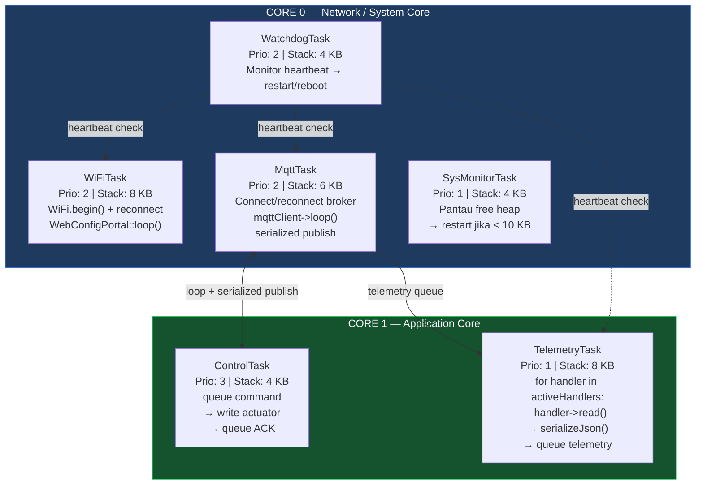
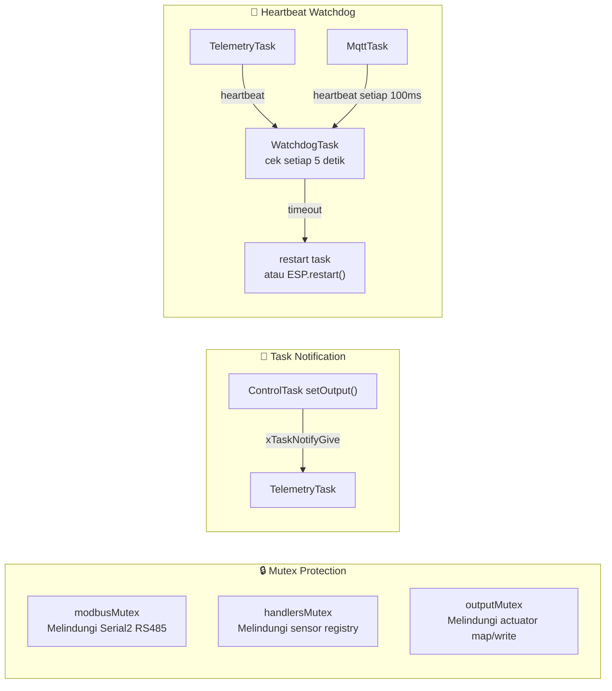
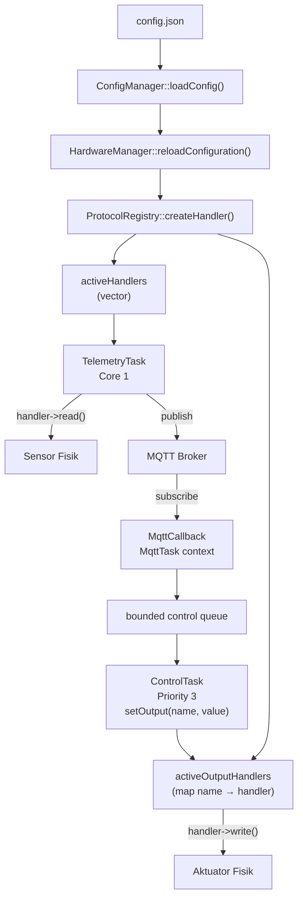
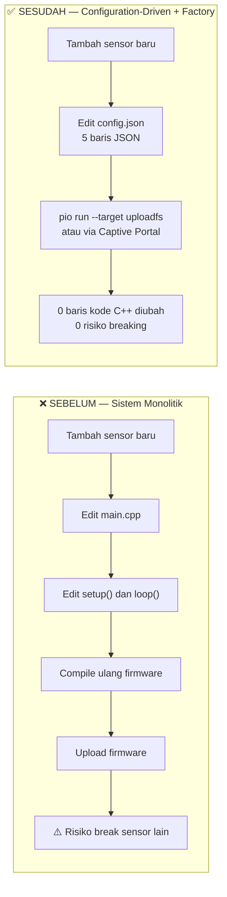

# Firmware Aeroponic Node — Dokumentasi Teknis (Bab III & IV)

> **Basis kode:** [`firmware/node/`](file:///home/almuzky/TA/Microservices/firmware/node/)  
> **Platform:** ESP32 · **RTOS:** FreeRTOS · **Framework:** Arduino via PlatformIO  
> **Lapisan SGAM:** Component Layer (T-1)

---

## 3.x.1 FreeRTOS Task Mapping (Dual-Core)

### Pemetaan Task ke Dual-Core



> **Alasan pemisahan core:** WiFi stack ESP32 berjalan di Core 0. TelemetryTask di Core 1 agar pembacaan sensor tidak terganggu oleh network interrupt.

### Tabel Enam FreeRTOS Task

| Task | File Sumber | Core | Priority | Stack | Tanggung Jawab Utama |
|------|-------------|------|----------|-------|----------------------|
| `WatchdogTask` | [`TaskWatchdog.cpp`](file:///home/almuzky/TA/Microservices/firmware/node/src/core/TaskWatchdog.cpp) | 0 | **2** | 4 KB | Monitor heartbeat tiap task; restart atau reboot jika timeout |
| `WiFiTask` | [`NetworkManager.cpp`](file:///home/almuzky/TA/Microservices/firmware/node/src/protocols/NetworkManager.cpp) | 0 | **2** | 8 KB | Manage koneksi WiFi (reconnect otomatis) + serve Captive Portal |
| `MqttTask` | [`MqttManager.cpp`](file:///home/almuzky/TA/Microservices/firmware/node/src/protocols/MqttManager.cpp) | **1** | **2** | 6 KB | Connect/reconnect broker MQTT; loop callback; serialize all MQTT publish operations |
| `ControlTask` | [`HardwareManager.cpp`](file:///home/almuzky/TA/Microservices/firmware/node/src/core/HardwareManager.cpp) | **1** | **3** | 4 KB | Consume bounded actuator commands, write outputs, emergency stop, queue ACK |
| `SysMonitorTask` | [`SystemMonitor.cpp`](file:///home/almuzky/TA/Microservices/firmware/node/src/core/SystemMonitor.cpp) | 0 | 1 | 4 KB | Pantau free heap; restart ESP32 jika < 10 KB |
| `TelemetryTask` | [`HardwareManager.cpp`](file:///home/almuzky/TA/Microservices/firmware/node/src/core/HardwareManager.cpp) | **1** | 1 | 8 KB | Baca sensor via `activeHandlers[]`; queue JSON telemetry |

### Mekanisme Sinkronisasi Antar-Task



---

## 3.x.2 Desain Modular I/O — Factory Pattern & Registry

Firmware menggunakan **tiga lapisan abstraksi** agar sistem bisa dinamis:

1. **Configuration** — `config.json` → `ConfigManager` → `Config:: namespace`
2. **Factory/Registry** — `ProtocolRegistry` + `activeHandlers[]` + `activeOutputHandlers[]`
3. **Consumer** — `TelemetryTask` (Core 1, sensor) dan `ControlTask` (Core 1, aktuator)


| Lapisan | Komponen | Peran |
|---------|----------|-------|
| **Configuration** | `config.json` → `ConfigManager` → `Config:: namespace` | Semua hardware dideklarasi di JSON, diparsing ke vector in-memory. |
| **Factory/Registry** | `ProtocolRegistry` + `activeHandlers[]` + `activeOutputHandlers[]` | Membuat instance handler sesuai protokol di config. Sensor di vector, aktuator di map. |
| **Consumer** | `TelemetryTask` (Core 1, sensor) dan `ControlTask` (Core 1, aktuator) | Keduanya tidak tahu tipe konkret handler. |

### 3.x.2.1 Konfigurasi config.json (Tidak Ada Hardcode)

File [`data/config.json`](file:///home/almuzky/TA/Microservices/firmware/node/data/config.json) adalah **satu-satunya tempat** mendaftarkan sensor dan aktuator.

```json
{
  "hardware": {
    "inputs": [
      { "pin": 34, "type": "ANALOG", "pull": "NONE", "name": "soil_moisture", "invert": false, "debounce_ms": 0, "interrupt": "NONE", "analog_min": 0, "analog_max": 4095 },
      { "pin": 13, "type": "DIGITAL", "pull": "UP", "name": "float_switch", "invert": true, "debounce_ms": 50, "interrupt": "CHANGE" }
    ],
    "outputs": [
      { "pin": 26, "type": "DIGITAL", "name": "misting_pump",    "protocol": "GPIO_OUT" },
      { "pin": 27, "type": "PWM",     "name": "cooling_fan",   "protocol": "GPIO_OUT" },
      { "pin": 25, "type": "DIGITAL", "name": "nutrient_valve","protocol": "GPIO_OUT" }
    ],
    "modbus": [
      {
        "name": "ec_ph_sensor", "slave_id": 1, "baudrate": 9600,
        "registers": [
          { "address": 0, "name": "ec_value",   "multiplier": 0.01, "type": "HOLDING" },
          { "address": 1, "name": "ph_value",   "multiplier": 0.01, "type": "HOLDING" },
          { "address": 2, "name": "temp_water", "multiplier": 0.1,  "type": "HOLDING" }
        ]
      }
    ],
    "sensors": [
      { "name": "bme280_atas", "protocol": "I2C", "type": "BME280", "address": "0x76", "sda_pin": "21", "scl_pin": "22" },
      { "name": "dht12_akar",  "protocol": "I2C", "type": "DHT12",  "address": "0x5C", "sda_pin": "21", "scl_pin": "22" },
      { "name": "power_monitor", "protocol": "I2C", "type": "INA219", "address": "0x40", "sda_pin": "21", "scl_pin": "22" }
    ]
  }
}
```

### 3.x.2.2 Kontrak ProtocolHandler (Interface Abstrak)

[`ProtocolHandler.h`](file:///home/almuzky/TA/Microservices/firmware/node/src/core/ProtocolHandler.h) mendefinisikan kontrak yang harus dipenuhi semua handler:

```cpp
class ProtocolHandler {
public:
    virtual ~ProtocolHandler() {}
    virtual bool init(const JsonObject& config) = 0;
    virtual bool read(JsonObject& telemetry) = 0;
    virtual bool write(int value) { return false; }
    virtual String getProtocolName() = 0;
    virtual String getSensorName() = 0;
};
```

### 3.x.2.3 ProtocolRegistry — Factory Dinamis

[`ProtocolHandler.cpp`](file:///home/almuzky/TA/Microservices/firmware/node/src/core/ProtocolHandler.cpp) mengimplementasikan Factory Pattern menggunakan **singleton map**:

```cpp
typedef ProtocolHandler* (*ProtocolHandlerCreator)();
class ProtocolRegistry {
    static std::map<String, ProtocolHandlerCreator>& getRegistry() {
        static std::map<String, ProtocolHandlerCreator> registry;
        return registry;
    }
public:
    static void registerProtocol(const String& name, ProtocolHandlerCreator creator) {
        getRegistry()[name] = creator;
    }
    static ProtocolHandler* createHandler(const String& name, const JsonObject& config) {
        auto& reg = getRegistry();
        auto it = reg.find(name);
        if (it != reg.end()) {
            ProtocolHandler* handler = it->second();
            if (handler->init(config)) return handler;
            delete handler;
        }
        return nullptr;
    }
};
```

Pendaftaran protokol di `HardwareManager::init()` — dilakukan **satu kali** saat boot:

```cpp
ProtocolRegistry::registerProtocol("GPIO",         []() -> ProtocolHandler* { return new GPIOInputHandler(); });
ProtocolRegistry::registerProtocol("MODBUS",       []() -> ProtocolHandler* { return new ModbusHandler(); });
ProtocolRegistry::registerProtocol("MODBUS_TCP",   []() -> ProtocolHandler* { return new ModbusTCPHandler(); });
ProtocolRegistry::registerProtocol("I2C",          []() -> ProtocolHandler* { return new I2CHandler(); });
ProtocolRegistry::registerProtocol("GPIO_OUT",     []() -> ProtocolHandler* { return new GpioOutputHandler(); });
ProtocolRegistry::registerProtocol("PCF8575_OUT",  []() -> ProtocolHandler* { return new Pcf8575OutputHandler(); });
ProtocolRegistry::registerProtocol("PCF8575_IN",   []() -> ProtocolHandler* { return new Pcf8575InputHandler(); });
```

### 3.x.2.4 Vector Registry activeHandlers

`reloadConfiguration()` mengosongkan dan mengisi ulang vector ini setiap kali konfigurasi berubah. Dilindungi `handlersMutex`:

```cpp
void HardwareManager::reloadConfiguration() {
    xSemaphoreTake(handlersMutex, portMAX_DELAY);
    for (auto h : activeHandlers) delete h;
    activeHandlers.clear();

    for (auto& kv : activeOutputHandlers) delete kv.second;
    activeOutputHandlers.clear();
    outputStates.clear();
    latestSensorValues.clear();

    // ... rebuild outputs under outputMutex ...

    xSemaphoreGive(handlersMutex);
    if (outputMutex) xSemaphoreGive(outputMutex);
    Logger::hardware("Hardware Handlers Reloaded Successfully.");
}
```

Snapshot vector setelah boot:
```
activeHandlers (std::vector<ProtocolHandler*>):
[0] GPIOInputHandler { pin=34, name="soil_moisture" }
[1] GPIOInputHandler { pin=13, name="float_switch"  }
[2] ModbusHandler    { name="ec_ph_sensor", slave_id=1 }
[3] I2CHandler       { name="bme280_atas",  addr=0x76  }
[4] I2CHandler       { name="dht12_akar",   addr=0x5C  }
[5] I2CHandler       { name="power_monitor", type=INA219, addr=0x40 }
```

### 3.x.2.5 Implementasi Handler Nyata

Semua implementasi ada di [`ProtocolHandlers.cpp`](file:///home/almuzky/TA/Microservices/firmware/node/src/core/ProtocolHandlers.cpp):

**GPIOInputHandler:**
```cpp
bool GPIOInputHandler::read(JsonObject& telemetry) {
    JsonObject inputs = telemetry["inputs"];
    if (inputs.isNull()) inputs = telemetry.createNestedObject("inputs");
    if (type == "ANALOG") {
        inputs[name] = analogRead(pin);
    } else {
        int dval = digitalRead(pin);
        if (invert) dval = !dval;
        inputs[name] = dval;
    }
    HardwareManager::latestSensorValues[name] = val;
    return true;
}
```

**ModbusHandler (RS485):**
```cpp
bool ModbusHandler::read(JsonObject& telemetry) {
    JsonObject modbusDev = telemetry["modbus"].createNestedObject(name);
    xSemaphoreTake(HardwareManager::modbusMutex, pdMS_TO_TICKS(1000));
    HardwareManager::node.begin(slave_id, Serial2);
    for (const auto& reg : registers) {
        uint8_t result = (reg.type == "INPUT")
            ? HardwareManager::node.readInputRegisters(reg.address, 1)
            : HardwareManager::node.readHoldingRegisters(reg.address, 1);
        if (result == HardwareManager::node.ku8MBSuccess) {
            float val = HardwareManager::node.getResponseBuffer(0) * reg.multiplier;
            modbusDev[reg.name] = val;
        }
        vTaskDelay(10 / portTICK_PERIOD_MS);
    }
    xSemaphoreGive(HardwareManager::modbusMutex);
    return true;
}
```

**Tabel Semua Handler:**

| Handler | Protokol | Sensor yang Didukung | Output JSON Key |
|---------|----------|----------------------|-----------------|
| `GPIOInputHandler` | GPIO | Sensor analog, switch digital | `telemetry.inputs.<name>` |
| `ModbusHandler` | RS485/Modbus RTU | EC, pH, suhu air | `telemetry.modbus.<device>.<register>` |
| `I2CHandler` | I²C | BME280, DHT12, INA219 | `telemetry.i2c.<name>.temperature/humidity` |
| `OneWireHandler` | 1-Wire | DS18B20 — skeleton tersedia | `telemetry.1wire.<name>.temperature` |
| `SPIHandler` | SPI | MAX31865 — skeleton tersedia | `telemetry.spi.<name>.value` |
| `GpioOutputHandler` | GPIO_OUT | Aktuator GPIO/PWM | — (output, bukan sensor telemetry) |

---

## 3.x.3 Antarmuka Konfigurasi Mandiri — Captive Web Portal

**Captive Web Portal** adalah ESP32 yang menjalankan **Access Point (AP) Wi-Fi + HTTP server miniatur** di dalam firmware. Saat pengguna menghubungkan perangkat ke AP tersebut, **semua permintaan DNS diarahkan ke IP ESP32** (`192.133.22.6`) melalui DNS *wildcard*.

| Komponen | Peran |
|----------|-------|
| `WiFi.softAP()` | Menyalakan AP dengan SSID dinamis `ENYX-ENTERPRISE-<node_id>` |
| `DNSServer` | DNS wildcard `*` → seluruh domain diarahkan ke IP ESP32 |
| `WebServer` (port 80) | HTTP server yang melayani halaman UI dan 19 endpoint REST API |
| `LittleFS` | Filesystem flash internal ESP32 untuk menyimpan file HTML/JS/CSS dan `config.json` |
| `checkAuthToken()` | Middleware Bearer token untuk memproteksi endpoint sensitif |

### Kode `startAP()`

```cpp
void WebConfigPortal::startAP() {
    WiFi.softAPConfig(apIP, apIP, IPAddress(255, 255, 255, 0));
    String apName = "ENYX-ENTERPRISE-" + Config::NODE_ID;
    WiFi.softAP(apName.c_str());
    dnsServer.start(DNS_PORT, "*", apIP);
    server.on("/",                         HTTP_GET,  handleRoot);
    server.on("/api/login",                HTTP_POST, handleApiLogin);
    server.on("/api/fullconfig",           HTTP_GET,  handleApiFullConfigGet);
    server.on("/api/wifi",                 HTTP_POST, handleApiWifiPost);
    server.on("/api/mqtt",                 HTTP_POST, handleApiMqttPost);
    server.on("/api/device",               HTTP_POST, handleApiDevicePost);
    server.on("/api/hardware",             HTTP_POST, handleApiHardwarePost);
    server.on("/api/hardware/discover",    HTTP_GET,  handleApiHardwareDiscover);
    server.on("/api/modbus/start_scan",    HTTP_POST, handleApiModbusStartScan);
    server.on("/api/modbus/cancel_scan",   HTTP_POST, handleApiModbusCancelScan);
    server.on("/api/modbus/scan_reg",      HTTP_GET,  handleApiModbusScanReg);
    server.on("/api/modbus/scan_reg_batch",HTTP_POST, handleApiModbusScanRegBatch);
    server.on("/api/account",              HTTP_POST, handleApiAccountPost);
    server.on("/api/status",               HTTP_GET,  handleApiStatusGet);
    server.on("/api/ota",                  HTTP_POST, handleApiOtaUpdate, handleApiOtaUpload);
    server.on("/api/publish_discovery",    HTTP_POST, handleApiPublishDiscovery);
    server.on("/api/config/export",        HTTP_GET,  handleApiConfigExport);
    server.on("/api/config/import",        HTTP_POST, handleApiConfigImport);
    server.on("/api/telemetry/latest",     HTTP_GET,  handleApiTelemetryLatest);
    server.on("/api/root/health",          HTTP_GET,  handleHealth);
    server.begin();
}
```

### Tabel Endpoint REST Portal

| Endpoint | Method | Fungsi |
|----------|--------|--------|
| `/api/login` | POST | Login admin → generate Bearer token |
| `/api/fullconfig` | GET | Ambil seluruh konfigurasi saat ini (JSON) |
| `/api/wifi` | POST | Simpan SSID + password WiFi |
| `/api/mqtt` | POST | Simpan server, port, credentials MQTT |
| `/api/device` | POST | Ubah NODE_ID, fw_version |
| `/api/hardware` | POST | **Daftarkan sensor/aktuator baru** (inputs/outputs/modbus/sensors) |
| `/api/hardware/discover` | GET | I2C scan → deteksi perangkat yang terhubung |
| `/api/modbus/start_scan` | POST | Scan Modbus slave ID 1–247 |
| `/api/modbus/cancel_scan` | POST | Cancel ongoing Modbus scan |
| `/api/modbus/scan_reg` | GET | Baca satu register Modbus |
| `/api/modbus/scan_reg_batch` | POST | Baca batch register Modbus |
| `/api/account` | POST | Ganti admin username/password |
| `/api/status` | GET | Status WiFi, MQTT, heap, uptime |
| `/api/ota` | POST | Upload firmware baru (OTA) |
| `/api/publish_discovery` | POST | Paksa kirim discovery ke MQTT broker |
| `/api/config/export` | GET | Download config.json |
| `/api/config/import` | POST | Upload config.json |
| `/api/telemetry/latest` | GET | Baca telemetry terakhir tanpa MQTT |
| `/api/root/health` | GET | Health check (liveness probe) |

### Cara Portal Menyimpan Sensor Baru

Saat pengguna POST ke `/api/hardware`, portal memanggil `saveFullConfig()` → serialize ulang seluruh `Config::` namespace ke JSON → tulis ke LittleFS.

---

## 3.x.4 Alur Telemetri & Aktuator

### 3.x.4.1 I/O System: Dua Arah yang Sama

Sensor (input) dan aktuator (output) **bukan sistem terpisah**. Keduanya:
- Didaftarkan di **`config.json` yang sama** (`hardware.inputs[]` dan `hardware.outputs[]`)
- Di-instantiate oleh **`HardwareManager::reloadConfiguration()` yang sama**
- Mendapatkan instance dari **`ProtocolRegistry` factory yang sama**

| Aspek | Sensor (Input) | Aktuator (Output) |
|-------|----------------|-------------------|
| `config.json` | `hardware.inputs[]` | `hardware.outputs[]` |
| Registry | `activeHandlers` (vector) | `activeOutputHandlers` (map `name → handler`) |
| Method | `handler->read(telemetry)` | `handler->write(value)` |
| Pemicu | Periodik: `TelemetryTask` | Event-driven: MQTT command / local control |
| MQTT | **Publish** `smartfarm/<node_id>/telemetry` | **Subscribe** `smartfarm/actuator/<node_id>` |

**Mengapa registry aktuator berupa `map`, bukan `vector`?** `setOutput()` menerima `targetName` (string) → harus lookup by name langsung. Map memberikan pencarian `O(log n)` berdasarkan nama aktuator.

### 3.x.4.2 Overall Diagram



### 3.x.4.3 Aktuator: `activeOutputHandlers` Map & MQTT → `write()`

Aktuator menggunakan **map** karena `setOutput()` menerima `targetName` (string) dan perlu **lookup by name** secara langsung.

Alur eksekusi aktuator:
1. `MqttManager` subscribe `smartfarm/actuator/<node_id>`
2. `mqttCallback` memvalidasi dan memasukkan `{action, target, value, req_id}` ke bounded queue
3. `ControlTask` priority 3 memanggil `setOutput(target, value)` → `activeOutputHandlers.find(target)->write(value)`
4. `outputStates[target] = value` + `xTaskNotifyGive(telemetryTaskHandle)`
5. `ControlTask` memasukkan ACK hasil aktual ke publish queue; hanya `MqttTask` menyentuh `PubSubClient`

**`setOutput()` implementation** — [`HardwareManager.cpp`](file:///home/almuzky/TA/Microservices/firmware/node/src/core/HardwareManager.cpp):
```cpp
OutputResult setOutputResult(String targetName, int value) {
    if (!outputMutex) return OutputResult::Busy;
    if (xSemaphoreTake(outputMutex, pdMS_TO_TICKS(50)) != pdTRUE) return OutputResult::Busy;

    auto it = activeOutputHandlers.find(targetName);
    if (it != activeOutputHandlers.end()) {
        bool written = it->second->write(value);
        if (!written) {
            xSemaphoreGive(outputMutex);
            return OutputResult::HandlerFailed;
        }
        outputStates[targetName] = value;
        xSemaphoreGive(outputMutex);
        if (telemetryTaskHandle != NULL) xTaskNotifyGive(telemetryTaskHandle);
        return OutputResult::Success;
    }
    xSemaphoreGive(outputMutex);
    return OutputResult::NotFound;
}
```

---

## 4.x Pembuktian Modularitas — Skenario Penambahan Sensor (T-1)

### Pernyataan T-1

> *"Membangun firmware berbasis FreeRTOS dengan pendekatan configuration-driven dan factory pattern, sehingga penambahan sensor atau aktuator baru cukup dilakukan melalui file konfigurasi **tanpa mengubah kode inti program**."*

### Skenario Uji: Tambah Sensor DS18B20 (Suhu Akar, 1-Wire)

**Kondisi awal:** Firmware sudah berjalan dengan BME280 dan EC Meter Modbus.  
**Target:** Tambahkan sensor suhu akar DS18B20 di pin GPIO 5 (1-Wire protocol).

**Cara 1 — Edit file langsung (via kode editor):**

```diff
--- a/firmware/node/data/config.json
+++ b/firmware/node/data/config.json
      "sensors": [
        { "name": "bme280_atas", "protocol": "I2C", "type": "BME280", "address": "0x76", "sda_pin": "21", "scl_pin": "22" },
        { "name": "dht12_akar",  "protocol": "I2C", "type": "DHT12",  "address": "0x5C", "sda_pin": "21", "scl_pin": "22" }
-      }
+      },
+      {
+        "name": "ds18b20_root",
+        "protocol": "1-WIRE",
+        "pin": "5"
+      }
      ]
```

Lalu upload: `pio run --target uploadfs` → ESP32 restart.

**Cara 2 — Via Captive Portal (zero-touch, tanpa kabel):**
```
1. Hubungkan ke WiFi "ENYX-ENTERPRISE-<node_id>"
2. Buka 192.133.22.6 di browser
3. Login → Menu "I2C"
4. Klik "+ Add I2C Sensor"
5. Isi: Name="power_monitor", Type="INA219", Address="0x40", SDA="21", SCL="22"
6. Klik "Save & Reboot All I2C" → POST /api/hardware (payload sensors) → otomatis update config.json
7. ESP32 reboot dengan sensor baru (hot-swap I2CHandler)
```

### Verifikasi: File yang Diubah

| File | Diubah? | Keterangan |
|------|---------|------------|
| `main.cpp` | ❌ **TIDAK** | Entry point tidak disentuh |
| `HardwareManager.cpp` | ❌ **TIDAK** | TelemetryTask loop tidak berubah |
| `ProtocolHandler.cpp` | ❌ **TIDAK** | Registry tidak berubah |
| `ProtocolHandlers.cpp` | ❌ **TIDAK** | OneWireHandler sudah ada |
| `MqttManager.cpp` | ❌ **TIDAK** | Publish logic tidak berubah |
| `data/config.json` | ✅ **YA** | Hanya tambah 4 baris JSON |

### Metrik Modularitas

| Metrik | Nilai | Keterangan |
|--------|-------|------------|
| Baris kode C++ yang diubah | **0 baris** | Tidak ada kode inti yang disentuh |
| File kode C++ yang dimodifikasi | **0 file** | Hanya JSON yang berubah |
| Baris JSON yang ditambahkan | **5 baris** | Satu entry di `sensors[]` |
| Waktu konfigurasi | **< 2 menit** | Via portal atau text editor |
| Re-compile firmware diperlukan? | **Tidak** | Upload JSON saja (`pio uploadfs`) |

### Contoh Nyata: Sensor INA219 (`power_monitor`)

Sensor INA219 sudah ditambahkan sebagai bukti nyata klaim T-1 — tanpa menyentuh satu baris pun kode C++ inti:
- **`data/config.json`** → entry `power_monitor` (I2C, type `INA219`, address `0x40`)
- **`platformio.ini`** → dependency `adafruit/Adafruit INA219 @ ^1.2.1`
- **`I2CHandler`** (`ProtocolHandlers.cpp`) → `init()` mendeteksi `type == "INA219"` dan menginstansiasi `Adafruit_INA219`

### Klaim Modularitas T-1 Terbukti



---

## Referensi Teknis

### Dokumen Internal Proyek

| Dokumen | Relevansi |
|---------|-----------|
| [`firmware/node/src/core/HardwareManager.cpp`](file:///home/almuzky/TA/Microservices/firmware/node/src/core/HardwareManager.cpp) | `activeHandlers[]`, `activeOutputHandlers`, `reloadConfiguration()`, `setOutput()` |
| [`firmware/node/src/core/ProtocolHandler.h`](file:///home/almuzky/TA/Microservices/firmware/node/src/core/ProtocolHandler.h) | Kontrak abstrak `ProtocolHandler` (interface) |
| [`firmware/node/src/core/ProtocolHandler.cpp`](file:///home/almuzky/TA/Microservices/firmware/node/src/core/ProtocolHandler.cpp) | `ProtocolRegistry` factory singleton (std::map registry) |
| [`firmware/node/src/core/ProtocolHandlers.cpp`](file:///home/almuzky/TA/Microservices/firmware/node/src/core/ProtocolHandlers.cpp) | Implementasi handler: GPIO, Modbus, I2C, 1-Wire, SPI, GPIO_OUT |
| [`firmware/node/src/core/ConfigManager.cpp`](file:///home/almuzky/TA/Microservices/firmware/node/src/core/ConfigManager.cpp) | Parsing `config.json` → namespace `Config::` vectors |
| [`firmware/node/src/protocols/MqttManager.cpp`](file:///home/almuzky/TA/Microservices/firmware/node/src/protocols/MqttManager.cpp) | MQTT client, LWT, callback aktuator, publish telemetri |
| [`firmware/node/src/protocols/NetworkManager.cpp`](file:///home/almuzky/TA/Microservices/firmware/node/src/protocols/NetworkManager.cpp) | WiFiTask, reconnect, Captive Portal HTTP server |
| [`firmware/node/src/protocols/WebConfigPortal.cpp`](file:///home/almuzky/TA/Microservices/firmware/node/src/protocols/WebConfigPortal.cpp) | Captive Portal, 19 endpoint REST, `/api/hardware` |
| [`firmware/node/data/config.json`](file:///home/almuzky/TA/Microservices/firmware/node/data/config.json) | Konfigurasi hardware tunggal (inputs/outputs/modbus/sensors) |
| [`docs/integration-guides/module.md`](file:///home/almuzky/TA/Microservices/docs/integration-guides/module.md) | Kontrak MQTT Module Service, NATS downstream subscription |
| [`docs/integration-guides/control.md`](file:///home/almuzky/TA/Microservices/docs/integration-guides/control.md) | Payload perintah aktuator, format ACK, lifecycle perintah |
