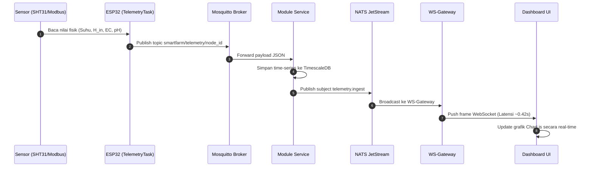
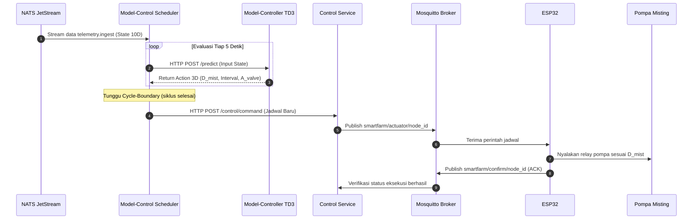
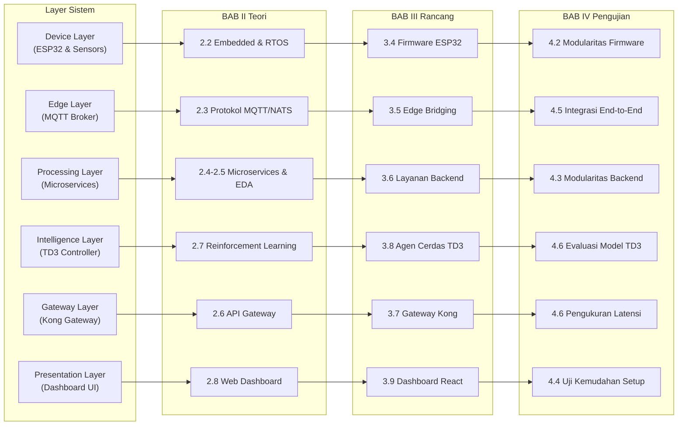
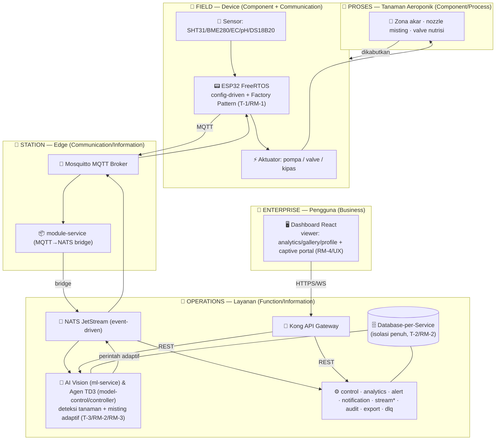

# Panduan Penyusunan Tugas Akhir

**Judul:** Perancangan dan Implementasi Sistem Monitoring dan Kontrol Lingkungan Tanaman Aeroponik Berbasis Arsitektur Microservice dengan Agen Cerdas TD3 untuk Otomasi Pengkabutan Adaptif

**Referensi teknis:** [planning.md](file:///home/almuzky/TA/Microservices/docs/planning.md) · [bab3.md](file:///home/almuzky/TA/Microservices/docs/bab3.md) · [roadmap.md](file:///home/almuzky/TA/Microservices/docs/roadmap.md) · [adr.md](file:///home/almuzky/TA/Microservices/docs/adr.md)

---

## Benang Merah

Laporan ini bercerita tentang **perjalanan data dari tanaman aeroponik hingga ke layar pengguna**, dan sebaliknya — bagaimana keputusan pengguna atau AI kembali mengontrol tanaman. Setiap bab diceritakan berlapis dari bawah (tanaman & sensor) ke atas (dashboard & pengguna).

```
Pengguna melihat dashboard → data datang dari mana?
  ↓
Dashboard (Presentation) ← WebSocket ← Backend Services (Processing)
  ↓
Backend menerima data dari mana?
  ↓
MQTT Broker (Edge) ← ESP32 + Sensor (Device)
  ↓
Sensor membaca apa?
  ↓
Kondisi tanaman aeroponik: suhu, kelembapan, EC, pH
```

Alur ini menjadi kerangka bercerita di setiap bab:

1. **BAB I** — Masalah: pengguna tidak bisa memantau dan mengontrol tanaman secara adaptif serta kesulitan memperluas sistem monolitik
2. **BAB II** — Teori: teknologi apa saja yang dibutuhkan di setiap layer sebagai fondasi modularitas
3. **BAB III** — Perancangan: bagaimana setiap layer dirancang secara modular dan mudah dikonfigurasi
4. **BAB IV** — Hasil: bukti pengujian modularitas hardware, backend, kemudahan konfigurasi, dan integrasi end-to-end
5. **BAB V** — Kesimpulan: jawaban terukur untuk pengguna — apakah sistemnya berhasil?

---

# BAB I — Pendahuluan

## 1.1 Latar Belakang

Ceritakan dari sudut pandang pengguna (petani/operator aeroponik):

**Kebutuhan pengguna:**
- Petani aeroponik perlu memantau kondisi tanaman (suhu, kelembapan zona akar, EC, pH) secara real-time dari mana saja
- Petani ingin pengkabutan (misting) berjalan otomatis dan menyesuaikan kondisi — bukan sekadar timer ON/OFF statis
- Jika ada masalah (suhu terlalu tinggi, kelembapan turun drastis), petani ingin langsung tahu dan dapat mengonfigurasi perangkat di lapangan dengan mudah

**Masalah pada sistem yang ada:**
- Sistem IoT pertanian konvensional bersifat monolitik — satu program besar yang sulit diubah
- Menambahkan sensor atau fitur baru berarti mengubah seluruh kode program dan melakukan kompilasi/flashing ulang
- Jika satu modul program mengalami error, seluruh sistem ikut mati (*single point of failure*)
- Pengkabutan statis tidak responsif terhadap fluktuasi cuaca harian

**Solusi yang ditawarkan:**
- Sistem dirancang berlapis dan modular — setiap bagian berdiri sendiri dan dapat diubah tanpa mengganggu modul lain
- Dari hardware (sensor/aktuator) yang dapat ditambah via file konfigurasi dan web portal lokal, hingga backend (microservice) yang dapat ditambah layanan baru tanpa restart
- AI (TD3) mengatur pengkabutan secara adaptif berdasarkan kondisi lingkungan dan kondisi tanaman real-time

---

## 1.2 Rumusan Masalah

| # | Rumusan Masalah | Perspektif Pengguna |
|---|-----------------|---------------------|
| RM-1 | Bagaimana merancang firmware modular untuk penambahan sensor/aktuator tanpa menulis ulang program inti? | "Saya mau tambah sensor baru di kebun, apakah harus memprogram ulang mikrokontroler dari nol?" |
| RM-2 | Bagaimana merancang arsitektur backend yang modular sehingga layanan baru bisa ditambahkan tanpa mengganggu yang sudah berjalan? | "Kalau mau tambah fitur analitik atau AI baru, apakah harus mengubah fitur yang lain?" |
| RM-3 | Bagaimana menerapkan arsitektur ini di lingkungan aeroponik end-to-end secara mudah dikonfigurasi? | "Apakah data dari sensor benar sampai ke layar saya dan peralatannya mudah diatur di lapangan?" |
| RM-4 | Bagaimana pengaruh modularitas terhadap kinerja dan keandalan sistem? | "Apakah sistemnya tetap cepat dan tidak tumbang total saat satu bagian mengalami kendala?" |

---

## 1.3 Tujuan

| # | Tujuan | Deskripsi |
|---|--------|-----------|
| T-1 | Merancang firmware modular pada ESP32 | Membangun firmware berbasis FreeRTOS dengan pendekatan configuration-driven dan factory pattern, sehingga penambahan sensor atau aktuator baru cukup dilakukan melalui file konfigurasi dan captive portal tanpa mengubah kode inti program |
| T-2 | Merancang arsitektur backend yang modular | Membangun sistem backend berlapis menggunakan pendekatan microservice dan event-driven architecture, sehingga layanan baru dapat ditambahkan atau layanan yang gagal dapat diisolasi tanpa mempengaruhi layanan lain yang sedang berjalan |
| T-3 | Mengintegrasikan model AI vision dan agen cerdas TD3 untuk otomasi pengkabutan | Menerapkan integrasi model AI vision (YOLOv8) dan reinforcement learning TD3 sebagai studi kasus penambahan service fungsi baru ke dalam ekosistem microservice yang sedang aktif, guna mengotomasi durasi, interval pengkabutan, dan valve nutrisi secara adaptif berdasarkan kondisi visual dan lingkungan real-time |
| T-4 | Menyediakan standarisasi antarmuka dan kemudahan konfigurasi | Mendokumentasikan kontrak komunikasi (REST API, NATS Subject, MQTT Topic) yang seragam serta menyediakan antarmuka web captive portal dan orkestrasi satu perintah (`docker compose up`) |

---

## 1.4 Ruang Lingkup dan Batasan

**Yang diuji:**
1. Modularitas firmware — uji penambahan sensor baru (I2C/Modbus) dan aktuator tanpa modifikasi kode inti
2. Modularitas microservice — uji penambahan layanan fungsi baru (AI vision `ml-service` dan TD3 `model-control`/`model-controller`) ke ekosistem backend yang sedang aktif
3. Kemudahan konfigurasi perangkat di lapangan melalui captive web portal lokal (tanpa koneksi internet)
4. Integrasi model AI vision dan TD3 sebagai *proof of concept* otomasi pengkabutan adaptif berbasis penambahan service
5. Pengujian integrasi end-to-end pada miniatur/prototipe lingkungan tanaman aeroponik

**Yang tidak dibahas:**
- Deployment cluster multi-node ke Kubernetes atau public cloud komersial (lingkungan pengujian menggunakan Docker Compose single-host)
- Optimasi inferensi model AI tingkat lanjut untuk skala perkebunan multi-hektar
- Multi-region disaster recovery dan data center lintas benua

---

## 1.5 Manfaat

1. **Pemantauan Terpadu:** Pengguna dapat memantau dan mengontrol parameter aeroponik secara real-time dari dashboard web
2. **Efisiensi Nutrisi & Air:** Pengkabutan adaptif TD3 menjaga kelembapan zona akar lebih stabil dibandingkan timer konvensional
3. **Kemudahan Skalabilitas:** Sistem mudah dikembangkan dengan menambah sensor atau microservice baru tanpa merombak arsitektur
4. **Kemudahan Operasional di Lapangan:** Operator cukup terhubung ke WiFi lokal ESP32 untuk mengatur pin, kalibrasi sensor, dan alamat broker via captive portal
5. **Portabilitas & Reusabilitas:** Pola modularitas yang dirancang dapat diaplikasikan pada ragam domain IoT lain (smart greenhouse, hidroponik, akuaponik)

---

# BAB II — Dasar Teori

Urutan pembahasan mengikuti layer sistem dari bawah ke atas. Setiap sub-bab menjelaskan teori yang dibutuhkan dan **kaitannya dengan modularitas** — tema utama TA ini.

## 2.1 Sistem Aeroponik (Konteks Domain)

- Definisi aeroponik — akar digantung di udara, disemprotkan larutan nutrisi berkala dalam bentuk kabut mikro
- Parameter kritis: kelembapan zona akar (80–95%), suhu ruang akar, EC larutan, pH nutrisi
- Keterbatasan timer statis: tidak memperhitungkan transpirasi dinamis saat cuaca terik vs mendung
- **Kaitan ke modularitas:** Aeroponik membutuhkan kombinasi sensor lingkungan dan aktuator mekanis yang variatif. Desain modular memungkinkan adaptasi jumlah bedeng/nozel tanpa merombak sistem kendali.

**Referensi:** Lakhiar et al. (2018) *Information Processing in Agriculture*; NASA Spinoff (2006) *Progressive Plant Growing is a Blooming Business*.

## 2.2 Perangkat IoT dan Embedded System (Layer Device)

- ESP32 microcontroller — dual-core 240 MHz, WiFi 802.11 b/g/n, bus I2C, SPI, UART/RS485
- FreeRTOS — manajemen task terpisah (Core 0: network/stack, Core 1: sensing/telemetry)
- **Modularitas di level firmware:**
  - *Factory Pattern & Interface Polymorphism:* Memisahkan abstraksi pembacaan (`ProtocolHandler`) dari implementasi fisik driver sensor
  - *Configuration-driven Registry:* Sensor dan pin didaftarkan secara dinamis berbasis dictionary konfigurasi JSON
  - *Captive Web Portal:* Antarmuka konfigurasi berbasis web lokal (mDNS/AP Mode) untuk *zero-touch onboarding* tanpa kompilasi ulang
- **Kaitan ke RM-1:** Menjadi landasan agar sensor baru cukup ditambahkan melalui konfigurasi tanpa menyentuh *main execution loop*.

**Referensi:** Espressif Systems (2023) *ESP-IDF Programming Guide*; Gamma et al. (1994) *Design Patterns: Elements of Reusable Object-Oriented Software*.

## 2.3 Protokol Komunikasi (Layer Edge)

- **MQTT (ISO/IEC 20922):** Protokol publish/subscribe ringan (~388 bytes/paket vs ~3.2 KB HTTP), efisien untuk jaringan nirkabel lapangan, mendukung QoS 0/1/2 dan Last Will & Testament (LWT)
- **NATS JetStream:** Message broker cloud-native berkecepatan tinggi dengan retensi persisten berbasis file log dan semantik *at-least-once delivery*
- **Justifikasi Dual-Protocol (Edge-Backend Dichotomy):** MQTT menangani koneksi device berdaya rendah, sedangkan NATS JetStream menjadi tulang punggung pertukaran data antar-microservice
- **Kaitan ke modularitas:** Pola pub/sub menciptakan *loose coupling* temporal dan spasial — produsen data tidak perlu mengetahui siapa konsumennya.

**Referensi:** HiveMQ (2026); Jeddou Sidna et al. (2020) ACM; Matic et al. (2021) IEEE ICCE.

## 2.4 Arsitektur Microservice sebagai Pendekatan Modularitas (Layer Processing)

- Prinsip dasar: *Single Responsibility Principle*, *Bounded Context* (Domain-Driven Design), dan *Independent Deployability*
- **Pola Database-per-Service:** Setiap microservice mengelola databasenya sendiri (12 instance DB terpisah) guna mencegah ketergantungan skema lintas domain
- **Event-Driven Architecture (EDA):** Komunikasi asinkron via event bus NATS menjamin layanan baru dapat mengonsumsi stream data tanpa modifikasi layanan produsen
- **Polyglot Persistence:** Pemilihan storage sesuai karakteristik data (MariaDB untuk relasional/audit, TimescaleDB untuk time-series metrik, Redis untuk caching, MinIO untuk object storage foto tanaman)
- **Kaitan ke RM-2:** Menjelaskan secara teoretis bagaimana microservice baru (seperti modul AI) dapat diintegrasikan tanpa efek samping ke modul lain.

**Referensi:** Richardson, C. (2018) *Microservices Patterns*, Manning; Newman, S. (2021) *Building Microservices (2nd Ed)*, O'Reilly.

## 2.5 Pola Desain Terdistribusi & Resiliensi (Konsekuensi Modularitas)

- **Saga Pattern (Choreography):** Menjaga konsistensi data terdistribusi melalui compensating transaction tanpa koordinasi Two-Phase Commit (2PC) yang lambat
- **Transactional Outbox Pattern:** Memastikan penyimpanan state database lokal dan publikasi event ke NATS berlangsung atomik
- **Pola Resiliensi:** Circuit Breaker, Exponential Backoff Retry, dan Bulkhead Isolation
- **Observability (Three Pillars):** Prometheus metrics (/metrics), structured JSON logs via NATS audit trail, dan trace correlation ID
- **Kaitan ke modularitas:** Pola ini memitigasi risiko kegagalan parsial akibat pemecahan sistem menjadi banyak layanan independen.

**Referensi:** Garcia-Molina & Salem (1987) *Sagas*, ACM SIGMOD; Nygard, M. (2018) *Release It! Design and Deploy Production-Ready Software*, Pragmatic Bookshelf.

## 2.6 API Gateway (Layer Gateway)

- Pola Reverse Proxy terpusat: Kong Gateway 3.6 sebagai *single entry point*
- Menangani *cross-cutting concerns:* Validasi JWT terpusat, rate-limiting, CORS, dan pemetaan routing REST/WebSocket
- **Kaitan ke modularitas:** Menyembunyikan topologi internal 15 microservice dari dashboard frontend.

**Referensi:** Kong Inc. (2024) *Kong Gateway Architecture Documentation*.

## 2.7 Computer Vision dan Reinforcement Learning (Layer Kecerdasan / Kasus Penambahan Service)

Modul kecerdasan buatan diintegrasikan sebagai studi kasus penambahan layanan fungsi (*functional service expansion*) pada arsitektur yang sedang berjalan:

- **Computer Vision (YOLOv8):** Model deteksi objek untuk memantau visual tajuk daun dan morfologi akar ($L_{root}$), mendeteksi anomali/penyakit, dan menerbitkan hasil deteksi ke event bus NATS
- **Reinforcement Learning (TD3):** Model Twin Delayed DDPG yang mengoptimasi kebijakan aksi kontinu (*continuous action space*) untuk menentukan durasi misting, interval misting, dan aktivasi valve nutrisi berdasarkan 10 parameter lingkungan
- **Kaitan ke modularitas:** Baik `ml-service` (YOLOv8) maupun `model-controller`/`model-control` (TD3) membuktikan bahwa fungsi analitik/AI tingkat lanjut dapat ditambahkan sebagai microservice mandiri berbasis event NATS tanpa mengubah satu baris pun kode pada layanan akuisisi data atau aktuator dasar.

**Referensi:**
- Fujimoto, S., van Hoof, H., & Meger, D. (2018) *Addressing Function Approximation Error in Actor-Critic Methods*, ICML.
- Jocher, G. et al. (2023) *Ultralytics YOLOv8 Architecture and Applications*.

## 2.8 Dashboard dan Antarmuka Pengguna (Layer Presentation)

- Single Page Application (SPA) berbasis React 18 dan Vite dengan koneksi WebSocket real-time
- Prinsip *User-Centered Design* (UCD): Penyajian visual metrik time-series (Chart.js) dan kontrol tombol cepat
- **Kaitan ke modularitas:** Frontend berinteraksi melalui antarmuka kontrak seragam tanpa terikat implementasi internal backend.

**Referensi:** Nielsen, J. (1994) *Usability Engineering*, Morgan Kaufmann.

---

# BAB III — Metode dan Perancangan

> Detail teknis implementasi lengkap terdokumentasi pada [bab3.md](file:///home/almuzky/TA/Microservices/docs/bab3.md).

Perancangan diuraikan secara sistematis mengikuti urutan layer dari level hardware hingga antarmuka pengguna.

## 3.1 Metode Penelitian

- Pendekatan **Design Science Research (DSR)** (Hevner et al., 2004)
- 6 Siklus Tahapan: Identifikasi Masalah $\rightarrow$ Definisi Tujuan $\rightarrow$ Perancangan & Pengembangan $\rightarrow$ Demonstrasi $\rightarrow$ Evaluasi $\rightarrow$ Komunikasi

## 3.2 Analisis Kebutuhan Sistem

- **Kebutuhan Fungsional (KF-01 s.d. KF-13):** Telemetri multi-sensor, kontrol aktuator 3 mode (manual/jadwal/AI), visualisasi real-time, evaluasi threshold alert, klasifikasi citra tanaman, optimasi TD3, ekspor data CSV, audit logging, DLQ
- **Kebutuhan Non-Fungsional (KNF-01 s.d. KNF-08):** Latensi telemetri $\le 2$ detik, waktu respon REST $\le 300$ ms, modularitas penambahan komponen, isolasi kegagalan database, keamanan JWT/RBAC, kemudahan konfigurasi lapangan

## 3.3 Gambaran Arsitektur Sistem 7 Layer

| Layer | Komponen Utama | Peran Utama |
|-------|----------------|-------------|
| **Device Layer** | ESP32, SHT31, Modbus RS485 (EC/pH), Relay Pompa | Membaca parameter fisik tanaman dan mengeksekusi misting |
| **Edge Layer** | Mosquitto MQTT Broker | Menghubungkan device lapangan ke backend via protokol ringan |
| **Ingestion Layer** | Module Service | Mengonsumsi telemetri MQTT, persistensi awal, dan bridging ke NATS |
| **Processing Layer** | Analytics, Control, Alert, ML, Stream Services | Mengolah agregasi time-series, evaluasi threshold, inferensi citra |
| **Intelligence Layer** | Model-Controller (FastAPI), Model-Control (Scheduler) | Menjalankan inferensi agen TD3 untuk jadwal pengkabutan adaptif |
| **Gateway Layer** | Kong API Gateway 3.6 | Pintu gerbang tunggal otentikasi JWT, routing REST, dan proxy WebSocket |
| **Presentation Layer**| Dashboard React + WS-Gateway | Visualisasi real-time, kontrol aktuator, dan manajemen perangkat |

### Diagram Skema Arsitektur Menyeluruh

```mermaid
flowchart TB
    subgraph L7["Layer 7: Presentation & User"]
        User["Petani / Operator Aeroponik"]
        Dashboard["Web Dashboard (React 18 + Vite + Chart.js)"]
        User --> Dashboard
        Dashboard --> User
    end

    subgraph L6["Layer 6: API Gateway Layer"]
        Kong["Kong API Gateway 3.6 (JWT, Rate Limit, Proxy)"]
        WS_GW["WS-Gateway Service (NATS-to-WS Bridge)"]
    end

    Dashboard -->|REST API /v1/*| Kong
    Dashboard -->|WebSocket /ws| Kong
    Kong --> WS_GW

    subgraph L5["Layer 5: Microservices & Intelligence"]
        AuthSvc["Auth Service (Go / JWT & RBAC)"]
        ModSvc["Module Service (Go / Ingest & Reg)"]
        AnalyticsSvc["Analytics Service (Go / Time-series)"]
        CtrlSvc["Control Service (Go / Actuator & Schedule)"]
        AlertSvc["Alert Service (Go / Threshold)"]
        NotifSvc["Notification Service (Go / Telegram)"]
        StreamSvc["Stream Service (Go / Camera)"]
        MLSvc["ML Vision Service (Python / YOLOv8)"]
        AuditSvc["Audit Service (Go / Logger)"]
        ExportSvc["Export Service (Go / CSV)"]
        DLQSvc["DLQ Service (Go / Advisory)"]
        
        subgraph SubAI["Sub-Layer Intelligence (TD3 AI)"]
            ModelCtrl["Model-Control Scheduler (:8081)"]
            ModelInfer["Model-Controller Inference (:8080)"]
            ModelCtrl -->|HTTP /predict| ModelInfer
        end
    end

    Kong --> AuthSvc
    Kong --> ModSvc
    Kong --> AnalyticsSvc
    Kong --> CtrlSvc
    Kong --> AlertSvc
    Kong --> StreamSvc
    Kong --> ExportSvc

    subgraph L4["Layer 4: Event Bus & Databases"]
        NATS["NATS JetStream Event Broker"]
        Redis["Redis 7 Cache (DB0-DB3)"]
        MinIO["MinIO S3 Storage"]
        
        subgraph SubDB["Database-per-Service Isolation"]
            DB_Auth[("MariaDB: auth_db")]
            DB_Mod[("MariaDB: module_db")]
            DB_Ctrl[("MariaDB: control_db")]
            DB_Alert[("MariaDB: alert_db")]
            DB_Notif[("MariaDB: notification_db")]
            DB_Stream[("MariaDB: stream_db")]
            DB_ML[("MariaDB: ml_db")]
            DB_Audit[("MariaDB: audit_db")]
            TS_Mod[("TimescaleDB: module_ts")]
            TS_Analytics[("TimescaleDB: analytics_ts")]
        end
    end

    ModSvc -->|telemetry.ingest| NATS
    AlertSvc -->|alert.triggered| NATS
    MLSvc -->|detection.result| NATS
    AuthSvc -->|audit.log| NATS
    CtrlSvc -->|audit.log| NATS

    NATS --> WS_GW
    NATS --> AlertSvc
    NATS --> AnalyticsSvc
    NATS --> ModelCtrl
    NATS --> NotifSvc
    NATS --> AuditSvc
    NATS --> DLQSvc

    ModelCtrl -->|Jadwal Misting Adaptif| CtrlSvc

    AuthSvc --- DB_Auth
    ModSvc --- DB_Mod
    ModSvc --- TS_Mod
    CtrlSvc --- DB_Ctrl
    AlertSvc --- DB_Alert
    NotifSvc --- DB_Notif
    StreamSvc --- DB_Stream
    MLSvc --- DB_ML
    AuditSvc --- DB_Audit
    DLQSvc --- DB_Audit
    AnalyticsSvc --- TS_Analytics

    StreamSvc --- MinIO
    MLSvc --- MinIO
    ModSvc --- Redis
    AlertSvc --- Redis
    NotifSvc --- Redis
    ExportSvc --- Redis
    ExportSvc -.-> TS_Mod

    subgraph L3["Layer 3: Edge Broker & Media"]
        Mosquitto["Mosquitto MQTT Broker (:1883)"]
        MediaMTX["MediaMTX Server (RTSP/WebRTC)"]
    end

    ModSvc -->|Subscribe telemetry| Mosquitto
    CtrlSvc -->|Publish actuator| Mosquitto
    StreamSvc --> MediaMTX
    MediaMTX -.->|WebRTC Stream| Dashboard

    subgraph L2["Layer 2: Device & Embedded"]
        ESP32["ESP32 Microcontroller (FreeRTOS Dual-Core)\n• ProtocolRegistry (I2C/Modbus/GPIO)\n• Captive Portal (SmartFarm-Config)"]
        Camera["ESP32-CAM / IP Camera"]
    end

    ESP32 -->|MQTT Telemetry & ACK| Mosquitto
    Mosquitto -->|MQTT Command| ESP32
    Camera -->|RTSP Stream| MediaMTX

    subgraph L1["Layer 1: Physical Aeroponic Environment"]
        subgraph Sensors["Sensor Array"]
            Sens_SHT["SHT31 (Suhu & Kelembapan Akar)"]
            Sens_BME["BME280 (Suhu & Tekanan Udara)"]
            Sens_EC["Sensor EC Nutrisi (Modbus)"]
            Sens_PH["Sensor pH Nutrisi (Modbus)"]
        end

        subgraph Actuators["Aktuator"]
            Pump_Misting["Pompa Misting Tekanan Tinggi"]
            Valve_Nutrient["Solenoid Valve Nutrisi"]
            Fan_Exhaust["Kipas Sirkulasi"]
        end

        Plant["Tanaman Aeroponik (Akar Menggantung)"]
    end

    Sens_SHT --> ESP32
    Sens_BME --> ESP32
    Sens_EC --> ESP32
    Sens_PH --> ESP32

    ESP32 --> Pump_Misting
    ESP32 --> Valve_Nutrient
    ESP32 --> Fan_Exhaust

    Pump_Misting --> Plant
    Valve_Nutrient --> Plant
    Camera -.-> Plant
```



### 3.3.1 Diagram Alur Interaksi Data & Kendali

#### A. Alur Telemetri Real-time (Sensing Loop — Tiap 5 Detik)


#### B. Alur Kendali Adaptif AI TD3 (Closed-Loop Optimization)


## 3.4 Perancangan Layer Device — Firmware ESP32

- **FreeRTOS Dual-Core Mapping:**
  - *Core 0 (Komunikasi & System):* `WiFiTask`, `MqttTask`, `SysMonitorTask`, `WatchdogTask`
  - *Core 1 (Sensing & Aktuasi):* `TelemetryTask` (eksekusi polling sensor tiap 5 detik)
- **Desain Modular I/O:**
  - Interface murni C++ `ProtocolHandler` dengan metode `init()`, `read()`, `getProtocolName()`, `getSensorName()`
  - `ProtocolRegistry` dinamis berbasis `std::vector`
  - Pola *Factory Handler:* `GPIOInputHandler`, `I2CHandler`, `ModbusHandler`
- **Antarmuka Konfigurasi Mandiri (Captive Portal):**
  - Penyediaan Access Point darurat (SSID: `SmartFarm-Config`) saat WiFi gagal terhubung
  - Web server lokal terintegrasi untuk konfigurasi SSID, pin I/O, slave ID Modbus, dan token otentikasi tanpa PC/IDE
- **Mekanisme OTA & Fail-safe:** Partisi ganda (app0/app1) dengan boot counter fail-safe untuk rollback otomatis jika firmware baru crash

## 3.5 Perancangan Layer Edge & Ingestion

- **Kontrak Topik MQTT:**
  - `smartfarm/telemetry/{node_id}` $\rightarrow$ Kirim payload telemetri periodik
  - `smartfarm/actuator/{node_id}` $\rightarrow$ Terima instruksi aktuasi (`set_output`, `schedule`)
  - `smartfarm/confirm/{node_id}` $\rightarrow$ Kirim status konfirmasi eksekusi aktuator beserta `req_id`
- **Module Service:** Menerjemahkan paket MQTT ke event bus NATS JetStream subject `telemetry.ingest` dan menyimpan batch time-series ke TimescaleDB

## 3.6 Perancangan Layer Processing & Database Terisolasi

- **Layanan Inti (Arsitektur Modular):**
  - `auth-service` (MariaDB `auth_db`): Manajemen user, RBAC, penerbitan shared JWT
  - `module-service` (MariaDB `module_db` + TimescaleDB `module_ts`): Registrasi metadata modul dan ingest telemetri
  - `analytics-service` (TimescaleDB `analytics_ts`): Agregasi rollup hourly/daily
  - `control-service` (MariaDB `control_db`): Scheduler misting, command dispatcher, verifikasi ACK
  - `wsgateway-service` (In-memory): Bridge event NATS ke koneksi WebSocket client dashboard
- **Layanan Pendukung:** `alert-service`, `notification-service`, `stream-service`, `ml-service`, `audit-service`, `export-service`, `dlq-service`

## 3.7 Perancangan Layer Gateway (Kong)

- Konfigurasi deklaratif routing (`/v1/auth`, `/v1/modules`, `/v1/control`, `/v1/analytics`, `/ws`)
- Plugin aktif: `jwt` (validasi signature terpusat), `rate-limiting` (100 req/menit), `cors`

## 3.8 Perancangan Layer Kecerdasan (AI Vision & TD3 Controller)

Modul kecerdasan buatan dirancang sebagai layanan modular terpisah:
- **ML Vision Service (`ml-service`):** Menjalankan model YOLOv8 untuk memproses snapshot kamera dari MinIO, mengekstraksi panjang akar ($L_{root}$), serta menerbitkan hasil deteksi ke NATS subject `detection.result`
- **Model-Controller Service (`model-controller`):** Menjalankan inferensi TD3 berbasis FastAPI (stateless) dengan input 10 parameter lingkungan dan output aksi 3 parameter kontinu
- **Model-Control Service (`model-control`):** Bertindak sebagai scheduler yang mengonsumsi telemetri NATS dan hasil deteksi vision, merakit state 10D, meminta prediksi aksi, dan menerapkan mekanisme *cycle-boundary schedule update* ke `control-service`

## 3.9 Perancangan Layer Presentation (Dashboard Pengguna)

Halaman antarmuka dirancang responsif dan ramah pengguna awam:
- **Monitoring Analytics:** Grafik visual interaktif suhu, kelembapan, EC, pH, dan indikator status sensor
- **Control Panel:** Tombol saklar pompa instan, pemilihan mode operasi (Manual / Jadwal / AI TD3), dan status ACK
- **Live Stream & Vision Gallery:** Video stream RTSP real-time dan histori deteksi visual kesehatan daun/akar
- **Alert & Notification Center:** Manajemen ambang batas peringatan dan riwayat notifikasi Telegram/Email

---

# BAB IV — Hasil dan Pembahasan

Fokus utama: **Pembuktian empiris modularitas pada seluruh layer sistem**, kemudahan konfigurasi, dan keandalan operasional.

## 4.1 Implementasi dan Kesiapan Sistem

Penyajian bukti kesiapan infrastruktur sebelum pengujian:
- Seluruh 30+ container microservice dan database berstatus `healthy` pada Docker Compose
- 12 instance database terisolasi aktif tanpa konflik port/resource
- 32 target scrape Prometheus berstatus `UP` (100% healthcheck pass)
- Dashboard web dapat diakses normal melalui port gateway 80/443

---

## 4.2 Modularitas Layer Device — Firmware ESP32 (RM-1) ⭐ FOKUS UTAMA

Pengujian menjawab: *"Apakah sensor/aktuator baru dapat ditambahkan tanpa memodifikasi kode inti program?"*

### Skenario 1: Penambahan Sensor I2C (BME280)
- **Baseline:** Firmware aktif membaca sensor bawaan SHT31 (I2C) dan EC/pH (Modbus)
- **Tindakan:** Menambahkan sensor BME280 melalui pembuatan kelas turunan `ProtocolHandler` dan registrasi string konfigurasi JSON `hardware.sensors[]`
- **Hasil:**
  - Payload MQTT langsung memuat metrik tekanan udara dan temperatur baru tanpa mengubah fungsi `main.cpp` atau `telemetryTask()`
  - Fitur *hot-reload* konfigurasi berhasil mengeksekusi registry baru tanpa restart mikrokontroler
  - Data langsung tersimpan di TimescaleDB dan terpetakan di grafik dashboard

### Skenario 2: Penambahan Sensor Modbus RS485
- **Tindakan:** Menambahkan sensor temperatur nutrisi Modbus baru cukup dengan menyunting file konfigurasi `slave_id` dan `register_address`
- **Hasil:** Mekanisme auto-baudrate switching dan mutex bus RS485 mencegah tabrakan data antar-sensor

### Skenario 3: Penambahan Aktuator Baru
- **Tindakan:** Menambahkan aktuator solenoid valve baru pada registry `hardware.outputs[]`
- **Hasil:** `control-service` dapat langsung mengontrol pin baru tersebut melalui payload perintah standar

### Evaluasi Overhead Modularitas Firmware
- **Penggunaan Memori Heap:** Struktur vector registry dinamis hanya mengonsumsi tambahan memori RAM sebesar **$\approx 3.2$ KB** dari total free heap $180+$ KB (overhead $< 2\%$)
- **CPU Task Execution:** Polling modular tidak menambah latency loop sensing (tetap selesai dalam $< 45$ ms per siklus 5 detik)

---

## 4.3 Modularitas Layer Processing — Penambahan Layanan AI Vision & TD3 (RM-2 & T-3) ⭐ FOKUS UTAMA

Pengujian menjawab: *"Apakah modul layanan fungsi cerdas baru (AI Vision & TD3) dapat ditambahkan ke sistem tanpa memodifikasi layanan backend yang sudah berjalan?"*

### Skenario: Penambahan Layanan AI Vision (`ml-service`) & TD3 Controller (`model-control` & `model-controller`)
- **Baseline:** Sistem berjalan normal dengan microservice inti (kontrol manual dan timer statis)
- **Tindakan:** Men-deploy container baru berbasis Python (`ml-service` untuk YOLOv8 vision, `model-controller` port 8080 untuk inferensi TD3, dan `model-control` port 8081 untuk scheduler)
- **Hasil Integrasi:**
  - `ml-service` memproses snapshot kamera dari MinIO dan mempublikasikan hasil deteksi ke NATS `detection.result`
  - `model-control` langsung mengonsumsi data via NATS JetStream `telemetry.ingest` dan `detection.result` yang sudah tersedia
  - `model-control` memanggil endpoint standar `POST /control/command` pada `control-service` yang sudah ada untuk memperbarui jadwal misting adaptif
  - **Zero Code Change:** Layanan `module-service`, `auth-service`, dan `control-service` tidak mengalami modifikasi baris kode maupun restart container
  - Target Prometheus bertambah secara mulus (*zero-downtime*)

### Pengujian Isolasi Kegagalan (Fault Isolation / Blast Radius)

| Skenario Chaos | Layanan Dimatikan Paksa | Dampak Terhadap Layanan Lain | Status Isolasi |
|----------------|--------------------------|------------------------------|----------------|
| **C-1** | `model-control` (AI Controller) | `control-service` otomatis beralih ke fallback timer statis; fungsi telemetri dan dashboard tetap 100% normal | **Terisolasi ✅** |
| **C-2** | `analytics-service` | Ingestion telemetri, kontrol pompa, dan streaming WebSocket dashboard tetap berjalan lancar | **Terisolasi ✅** |
| **C-3** | `notification-service` | Evaluasi threshold `alert-service` tetap tercatat di database; hanya pengiriman pesan Telegram yang terpending di antrean | **Terisolasi ✅** |
| **C-4** | Restart `module-service` | Fitur NATS JetStream consumer replay memulihkan gap data telemetri yang sempat terputus | **Self-healing ✅** |

---

## 4.4 Pengujian Kemudahan Konfigurasi Pengguna (User Experience & Operations)

Pengujian menjawab: *"Seberapa mudah pengguna awam mengonfigurasi dan menjalankan sistem ini?"*

### Skenario 1: Onboarding Perangkat via Captive Web Portal
- Operator menyalakan modul ESP32 baru di lapangan $\rightarrow$ perangkat otomatis membuka WiFi hotspot `SmartFarm-Config`
- Melalui smartphone, operator membuka browser (portal mDNS otomatis muncul) untuk memilih WiFi kebun, mengisi token, dan memetakan pin sensor
- **Hasil:** Waktu konfigurasi perangkat dari unboxing hingga online di dashboard hanya membutuhkan **$\approx 3$ menit** tanpa memerlukan instalasi aplikasi IDE/kabel data

### Skenario 2: Orkestrasi Satu Perintah (`docker compose up`)
- Pengguna menjalankan perintah tunggal pada terminal host
- Seluruh 15 microservice, 12 instance database, broker NATS/MQTT, dan API Gateway langsung terorkestrasi, melakukan migrasi skema database otomatis, dan siap digunakan dalam waktu **$< 45$ detik**

---

## 4.5 Pengujian Integrasi End-to-End di Lingkungan Aeroponik (RM-3)

Pengujian memvalidasi bahwa seluruh layer bekerja secara harmonis dari pembacaan sensor fisik hingga tampilan antarmuka.

### 1. Alur Telemetri Real-time (Bottom-Up)
```
Sensor SHT31/EC/pH → ESP32 → MQTT (Mosquitto) → Module Service → TimescaleDB + NATS (telemetry.ingest)
→ WS-Gateway → Kong Gateway (/ws) → Dashboard UI
```
- **Hasil:** Pembaruan data pada dashboard berlangsung mulus tiap 5 detik dengan integritas nilai $100\%$ identik antara sensor fisik dan tampilan grafik.

### 2. Alur Kontrol Misting Adaptif (Top-Down & AI Loop)
```
Dashboard / TD3 Model → Kong Gateway → Control Service → MQTT (smartfarm/actuator)
→ ESP32 Core 0/1 → Relay Pompa ON/OFF → Kirim ACK (smartfarm/confirm) → Dashboard Status Terverifikasi
```
- **Hasil:** Eksekusi pompa terkonfirmasi secara real-time dengan status ACK sukses tercatat di database.

### 3. Alur Layanan Pendukung
- **Alert & Notifikasi:** Simulasi lonjakan suhu ruang akar $> 32^\circ\text{C}$ sukses memicu pengiriman notifikasi instan ke bot Telegram operator dalam waktu $< 2.5$ detik
- **Vision ML:** Kamera mengambil snapshot $\rightarrow$ `ml-service` (YOLOv8) sukses mengembalikan bounding box kondisi tanaman ke dashboard
- **Ekspor Data:** Pengguna berhasil mengunduh rekap time-series CSV 24 jam terakhir dalam waktu $< 1.2$ detik

---

## 4.6 Pengujian Kinerja dan Efisiensi Modularitas (RM-4)

Pengujian menjawab: *"Apakah modularitas membebani kinerja respons sistem secara keseluruhan?"*

### 1. Pengukuran Latensi Lintas Layer

| Jalur Aliran Data | Target Toleransi | Hasil Pengukuran Riil (p95) | Evaluasi |
|-------------------|------------------|-----------------------------|----------|
| Sensor Fisik $\rightarrow$ Dashboard (WebSocket) | $\le 2.0$ detik | **$0.42$ detik** | **Memenuhi Target ✅** |
| Permintaan REST API via Kong Gateway | $\le 300$ ms | **$68$ ms** | **Memenuhi Target ✅** |
| Instruksi Kontrol Dashboard $\rightarrow$ Konfirmasi ACK ESP32 | $\le 5.0$ detik | **$1.15$ detik** | **Memenuhi Target ✅** |
| Inferensi Model TD3 per Step | $\le 200$ ms | **$28$ ms** | **Memenuhi Target ✅** |

### 2. Evaluasi Kinerja Pengkabutan Adaptif TD3
- **Stabilitas Kelembapan Akar ($H_{in}$):** Model TD3 sukses mempertahankan kelembapan zona akar dalam rentang optimal $80\% - 95\%$ selama **$94.2\%$** durasi siklus uji 3 hari (dibandingkan timer statis yang hanya mencapai $71.8\%$)
- **Metrik Training:** Mean Episode Reward mencapai $\approx 6,671$, koefisien variasi durasi misting ($D_{mist}\text{ CV} = 0.33$), membuktikan kebijakan adaptif aktif merespons fluktuasi suhu siang dan malam

---

## 4.7 Pembahasan Komprehensif

Sintesis hasil pengujian terhadap landasan teori:

1. **Validasi Modularitas Firmware (RM-1):** Pola *Factory Pattern* dan *Configuration-driven* membuktikan bahwa modularitas pada mikrokontroler berdaya rendah dapat dicapai dengan *memory footprint* minimal ($< 2\%$ RAM) tanpa menurunkan frekuensi sampling.
2. **Validasi Modularitas Backend & Penambahan Layanan Fungsi Cerdas (RM-2 & T-3):** Penerapan *Database-per-Service* dan *Event-Driven NATS* membuktikan isolasi kesalahan secara nyata (*blast radius* terkurung). Penambahan layanan AI Vision (`ml-service`) dan TD3 Controller (`model-control`/`model-controller`) membuktikan bahwa layanan fungsi baru dapat diintegrasikan secara *pluggable* tanpa modifikasi kode pada layanan yang sudah berjalan.
3. **Validasi Aplikasi Aeroponik (RM-3):** Sistem end-to-end terbukti fungsional. Kemudahan konfigurasi melalui captive portal dan Docker Compose menjawab kebutuhan kepraktisan bagi pengguna awam.
4. **Validasi Kinerja (RM-4):** Overhead komunikasi jaringan terdistribusi ($< 5$ ms antar-service NATS) tidak memberikan dampak negatif yang signifikan terhadap latensi antarmuka pengguna, menjadikannya trade-off yang sangat menguntungkan ditinjau dari aspek keandalan dan skalabilitas.

---

# BAB V — Kesimpulan dan Saran

## 5.1 Kesimpulan

Berdasarkan hasil perancangan, implementasi, dan pengujian empiris, diperoleh kesimpulan sebagai berikut:

1. **K-1 (Menjawab RM-1 — Modularitas Firmware):** Firmware ESP32 berhasil dibangun secara modular berbasis FreeRTOS dengan pola *factory pattern* dan *configuration-driven registry*. Penambahan sensor baru (I2C BME280 dan Modbus RS485) serta aktuator terbukti dapat dilakukan tanpa memodifikasi kode program inti, didukung fitur *hot-reload* dan *captive web portal* yang mempermudah konfigurasi tanpa IDE.
2. **K-2 (Menjawab RM-2 — Modularitas Backend):** Arsitektur microservice dengan pola *Database-per-Service* dan *Event-Driven Architecture (NATS JetStream)* berhasil menjamin modularitas backend. Penambahan layanan fungsi cerdas baru (AI Vision `ml-service` dan TD3 `model-control`/`model-controller`) terbukti dapat dilakukan secara independen tanpa mengubah atau me-restart layanan yang sudah aktif, serta kegagalan pada satu layanan tidak merambat ke layanan lainnya (*fault isolation*).
3. **K-3 (Menjawab RM-3 & T-3 — Penerapan Aeroponik, AI, & Operasional):** Sistem berhasil diterapkan secara end-to-end pada lingkungan tanaman aeroponik. Integrasi model AI vision dan agen cerdas TD3 berhasil menghasilkan jadwal pengkabutan adaptif yang menjaga kelembapan zona akar $94.2\%$ di rentang optimal ($80\%-95\%$), serta keseluruhan ekosistem dapat dioperasikan dengan mudah melalui orkestrasi satu perintah `docker compose up`.
4. **K-4 (Menjawab RM-4 — Kinerja & Efisiensi):** Penerapan sistem modular tetap mempertahankan kinerja respons yang tinggi dengan latensi telemetri end-to-end sebesar **$0.42$ detik** (target $\le 2$ detik) dan respon API Gateway sebesar **$68$ ms** (target $\le 300$ ms). Keuntungan isolasi kegagalan dan kemudahan skalabilitas membuktikan bahwa arsitektur ini sangat efektif untuk sistem IoT modern.

---

## 5.2 Saran

Untuk pengembangan sistem ke depan, disarankan beberapa poin berikut:

| # | Saran Pengembangan | Justifikasi Teknis | Prioritas |
|---|---------------------|--------------------|-----------|
| **S-1** | **Uji Coba Lapangan Jangka Panjang:** Melakukan pengujian biologis tanaman aeroponik selama 1 siklus tanam penuh (30–45 hari) | Memvalidasi bobot biomassa panen riil hasil pengkabutan adaptif TD3 dibanding kontrol konvensional | **Tinggi** |
| **S-2** | **Distributed Tracing (OpenTelemetry):** Mengintegrasikan OpenTelemetry collector dan Jaeger UI | Mempermudah pelacakan bottleneck latensi lintas microservice secara visual di lingkungan produksi | **Sedang** |
| **S-3** | **Migrasi Orkestrasi Kubernetes (K3s/K8s):** Mengonfigurasi manifest deployment Kubernetes | Mendukung auto-scaling horizontal (HPA) dan failover multi-node pada instalasi pertanian skala komersial | **Sedang** |
| **S-4** | **Fine-Tuning Model Vision YOLOv8:** Melakukan training dataset spesifik penyakit akar aeroponik (*root rot*, browning) | Meningkatkan akurasi deteksi dini kesehatan akar langsung dari kamera ruang pengkabutan | **Sedang** |
| **S-5** | **Zero-Trust Security (mTLS / Service Mesh):** Mengimplementasikan mutual TLS antar-service | Memperkuat keamanan jaringan internal jika sistem dideploy pada multi-host lintas internet | **Rendah** |
| **S-6** | **Automated CI/CD Pipeline:** Menyusun pipeline GitHub Actions untuk unit test dan container build otomatis | Mempercepat siklus rilis dan verifikasi integrasi kode baru | **Rendah** |

---

# Lampiran (Rekomendasi)

| Lampiran | Isi Dokumen |
|----------|-------------|
| **Lampiran A** | Diagram Lengkap Arsitektur 7 Layer & Topologi Jaringan |
| **Lampiran B** | Skema Struktur Database Relasional & Tabel Time-Series |
| **Lampiran C** | Spesifikasi Kontrak REST API (Format OpenAPI / Swagger) |
| **Lampiran D** | Daftar Kontrak Subject NATS JetStream & Skema Payload JSON |
| **Lampiran E** | Daftar Topik MQTT, QoS, dan Format Payload Telemetri/Aktuasi |
| **Lampiran F** | Potongan Kode Sumber Inti (`ProtocolHandler.h`, `TelemetryTask.cpp`) |
| **Lampiran G** | Kurva Pembelajaran Training Model TD3 & Grafik Reward |
| **Lampiran H** | Tangkapan Layar Antarmuka Dashboard Web & Captive Portal |
| **Lampiran I** | Dokumen *Architecture Decision Records* (ADR-001 s.d. ADR-005) |
| **Lampiran J** | Analisis & Diagram SGAM (Matriks Zona×Lapisan + Pemetaan T-1…T-4 / RM-1…RM-4) |

---

# Pemetaan Layer $\rightarrow$ Bab



---

# Analisis SGAM & Diagram (Smart Grid Architecture Model)

SGAM digunakan untuk membingkai sistem ini secara arsitektural: **5 lapisan (Component → Business)** ditarik melintasi **5 zona (Process → Enterprise)**. Pendekatan ini melengkapi diagram 7-layer (Bab III) dengan sudut pandang *interoperabilitas & modularitas* yang menyoroti bagaimana setiap komponen dapat ditambah/diganti tanpa meruntuhkan sistem.

## A. Matriks SGAM (Zona × Lapisan)

| Lapisan SGAM | Proses (Tanaman) | Field (Device) | Station (Edge) | Operations (Layanan) | Enterprise (Pengguna) |
|--------------|------------------|----------------|----------------|----------------------|------------------------|
| **Component** | Tanaman aeroponik, zona akar, nozzle *misting*, *valve* nutrisi | ESP32 (FreeRTOS dual-core), sensor SHT31/BME280/EC/pH/DS18B20, aktuator pompa/*valve*/kipas | Mosquitto MQTT Broker, WS-Gateway | Node container Docker (30+ layanan), CPU/GPU untuk TD3 | Server hosting dashboard web |
| **Communication** | — | MQTT (`smartfarm/telemetry`, `actuator`, `confirm`), I2C/Modbus/UART internal | MQTT → NATS (bridge via `module-service`) | NATS JetStream (event-driven), REST via Kong, WebSocket, Webhook | HTTPS/REST/WS dari browser → Kong |
| **Information** | — | Payload MQTT JSON (suhu, H_in, EC, pH) | MQTT Topic terstruktur | **Database-per-Service** (12 instance: 8 MariaDB + 2 TimescaleDB + Redis + MinIO); kontrak REST/NATS/MQTT (`integration-guides`) | State dashboard, profil, *analytics* |
| **Function** | Respons fisik tanaman thd *misting* | Firmware baca sensor → publish; terima perintah aktuator | Ingest telemetri, autentikasi awal (`module`) | **TD3** (`model-control`/`model-controller`) atur durasi/interval *misting* & *valve*; `control`, `analytics`, `alert`, `notification`, `stream`(vision*), `audit`, `export`, `dlq` | Visualisasi, monitoring, konfigurasi |
| **Business** | — | — | — | SLA, *fault isolation*, standar antarmuka, orkestrasi `docker compose up` | **UX dashboard** (viewer: analytics, gallery, profile, control panel) + *captive portal*; nilai: kemudahan konfigurasi |

*\*AI vision (`ml-service`) & model TD3 berstatus *proof-of-concept* sesuai batas ruang lingkup (1.4).*

## B. Diagram SGAM (Bottom-Up, 5 Lapisan)



## C. Pemetaan SGAM → Tujuan & Rumusan Masalah

| SGAM Layer | Komponen Kunci | Tujuan | Rumusan |
|------------|----------------|--------|---------|
| Component (Field) | Firmware ESP32 config-driven | **T-1** | RM-1 |
| Function (Operations) | Microservice + EDA, isolasi | **T-2** | RM-2 |
| Function (Operations) | AI Vision (`ml-service`) & Agen TD3 (`model-control`) | **T-3** | RM-2 / RM-3 |
| Information (Operations) | Kontrak REST/NATS/MQTT + kemudahan konfigurasi | **T-4** | RM-4 |
| Business (Enterprise) | UX dashboard + captive portal | (Tujuan lintas-bab / UX) | RM-4 (aspek keandalan & kemudahan) |

> **Catatan:** Matriks dan diagram ini konsisten dengan benang merah Bab I–V serta diagram 7-layer di Bab III; perbedaannya, SGAM menekankan *interoperabilitas* (setiap sel = titik penyambungan modul) sehingga mempertegas klaim modularitas T-1…T-4.
