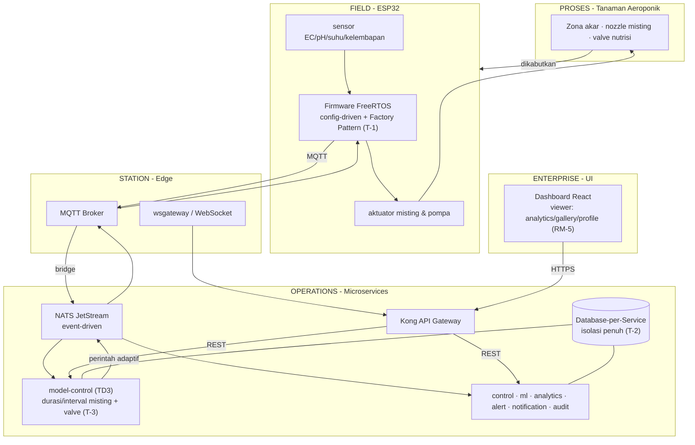

# Panduan Penyusunan Tugas Akhir (TA) — `guide_ta_kilo.md`

> **Catatan Pembimbing (User-Oriented):** Laporan ini harus dibaca oleh orang awam sekalipun bisa paham dan tertarik. Kunci penyajiannya adalah **membangun cerita dari bawah ke atas**, persis seperti cara kita melihat sebuah sistem nyata: mulai dari benda fisik di kebun (sensor, pompa), naik ke cara mereka berbicara (komunikasi), lalu ke data yang dihasilkan (informasi), ke otak pengendali (fungsi), hingga akhirnya ke layar yang dipakai pengguna (antarmuka). Kerangka yang dipakai adalah **SGAM layer** (Smart Grid Architecture Model) yang disesuaikan untuk sistem aeroponik.

---

## Cara Membaca Panduan Ini (Benang Merah Bottom-Up)

Lima bab disusun agar setiap bab menelusuri **lima lapisan SGAM** dari dasar ke puncak:

| Urut | Lapisan SGAM | Yang dibahas (dari bawah ke atas) |
|------|-------------|-----------------------------------|
| 1 | **Component / Physical (Hardware)** | ESP32, sensor (EC, pH, suhu, kelembapan), aktuator *misting*/pompa, firmware modular |
| 2 | **Communication** | MQTT (device↔edge), NATS JetStream (antar-layanan), REST via API Gateway (Kong) |
| 3 | **Information** | Model data, *Database-per-Service*, kontrak API, NATS Subject, MQTT Topic |
| 4 | **Function** | Logika mikrolayanan: simulator, agen TD3 (kontrol adaptif), penjadwalan, pemantauan |
| 5 | **Business / User Interface** | Dashboard (React), *user experience*, peran *viewer*, analytics, gallery, profile |

**Alur cerita (red thread):** Setiap bab melewati kelima lapisan di atas secara berurutan — **Hardware dulu, UI paling atas**. Pembaca diajak "naik tangga" dari besi & kabel sampai ke layar yang membuat pengguna awam jatuh cinta pada sistem ini.

---

## Bab 1 — Latar Belakang (dari sudut pandang pengguna)

### Tujuan Bab Ini
Membuat pembaca awam **merasa perlu** dan **tertarik**. Mulailah dari pengalaman nyata orang biasa, lalu naikkan ke masalah sistemik.

### 1.1 Cerita Pengguna (User Experience Motivation)
Buka dengan skenario umum: seorang pembudidaya ingin tanaman sehat tanpa harus menjadi ahli kimia. Ia butuh sistem yang:
- **Mengukur sendiri** lingkungan (kelembapan akar, suhu, EC, pH) — *lapisan Component*.
- **Berbicara otomatis** antar alat tanpa kabel rumit — *lapisan Communication*.
- **Menampilkan info** yang mudah dipahami — *lapisan Information*.
- **Mengatur sendiri** kapan disemprot (misting) — *lapisan Function*.
- **Dikonfigurasi sendiri** dengan mudah: menambah sensor/aktuator cukup lewat *file* konfigurasi, tanpa menulis kode program — *lapisan Component*.
- **Dilihat dari HP/layar** dengan bahasa yang ramah — *lapisan Business/UI*.

### 1.2 Konteks Industri & Motivasi
- **Aeroponik** butuh **presisi tinggi** (kelembapan zona akar, suhu, EC, pH) dan **efisiensi nutrisi & air**.
- Sistem konvensional **monolitik**: sulit diperluas, rentan *single point of failure*, tidak adaptif.

### 1.3 Masalah Utama (naik dari bawah ke atas)
1. **Component**: menambah sensor/aktuator pada sistem monolitik butuh ubah seluruh kode.
2. **Communication/Function**: satu komponen rusak meruntuhkan sistem (tidak ada isolasi).
3. **Function**: *misting* pakai *timer* statis, tidak responsif terhadap suhu/kelembapan/tanaman.
4. **Information/Business**: antarmuka antar komponen tidak standar → integrasi & kolaborasi sulit, UI tidak ramah.

### 1.4 Rumusan Masalah
Berdasarkan 1.3, rumusan masalah disusun naik dari lapisan bawah ke atas agar selaras dengan benang merah SGAM:

- **RM-1 (Component):** Bagaimana merancang *firmware* modular berbasis *configuration-driven* (ESP32) agar penambahan sensor/aktuator baru dapat dilakukan tanpa mengubah kode inti sistem?
- **RM-2 (Communication & Function / Modularitas):** Bagaimana menyusun sistem menjadi komponen-komponen yang **modular & terisolasi** (Database-per-Service, NATS JetStream, MQTT, Kong) sehingga setiap layanan bersifat *plug-and-play*—dapat ditambah, dilepas, atau diganti tanpa meruntuhkan sistem—dan kegagalan satu modul tidak merambat ke modul lain (*single point of failure*)?
- **RM-3 (Function / Kontrol):** Bagaimana mengintegrasikan model AI vision dan agen TD3 untuk membangun otomasi pengkabutan (*misting*) yang adaptif secara *real-time*—menyesuaikan durasi, interval pengkabutan, dan *valve* nutrisi dari kondisi visual & lingkungan tanaman—sebagai pengganti penjadwalan *timer* statis, sekaligus membuktikan bahwa layanan fungsi baru tersebut dapat ditambahkan tanpa mengganggu layanan lain?
- **RM-4 (Information / Standar):** Bagaimana menyediakan standarisasi antarmuka antar komponen (REST API, NATS Subject, MQTT Topic) yang terdokumentasi, sehingga setiap modul dapat saling berkomunikasi via format yang konsisten dan terprediksi (menjawab T-4)?
- **RM-5 (Business / User Experience):** Bagaimana merancang antarmuka pengguna yang ramah sehingga orang awam dapat dengan mudah mengonfigurasi, memantau, dan mengoperasikan sistem? *(Tujuan lintas-bab yang menyilang ke RM-1…RM-4; didukung kemudahan konfigurasi T-1 dan konsistensi kontrak T-4, bukan T terpisah.)*

### 1.5 Tujuan Penelitian (T-1 … T-4, sesuai referensi)
- **T-1 — Merancang *firmware* modular pada ESP32:** Membangun *firmware* berbasis FreeRTOS dengan pendekatan *configuration-driven* dan *factory pattern*, sehingga penambahan sensor atau aktuator baru cukup dilakukan melalui *file* konfigurasi tanpa mengubah kode inti program.
- **T-2 — Merancang arsitektur *backend* yang modular:** Membangun sistem *backend* berlapis menggunakan pendekatan *microservice* dan *event-driven architecture*, sehingga layanan baru dapat ditambahkan atau layanan yang gagal dapat diisolasi tanpa mempengaruhi layanan lain yang sedang berjalan.
- **T-3 — Mengintegrasikan model AI vision dan agen cerdas TD3 untuk otomasi pengkabutan sebagai kasus penambahan *service* fungsi:** Mengintegrasikan model AI vision (deteksi kondisi tanaman) bersama agen *reinforcement learning* TD3 yang mengatur durasi, interval pengkabutan, dan *valve* nutrisi secara adaptif berdasarkan kondisi visual & lingkungan *real-time* — diajukan sebagai studi kasus penambahan layanan fungsi baru ke ekosistem *microservice* yang sedang aktif tanpa mengubah layanan lain.
- **T-4 — Menyediakan standarisasi antarmuka antar komponen:** Mendokumentasikan kontrak komunikasi (REST API, NATS Subject, MQTT Topic) yang seragam agar setiap komponen sistem dapat saling berkomunikasi melalui format yang konsisten dan terprediksi.

### 1.6 Batasan (Scope) Penelitian
Agar fokus terjaga, penelitian dibatasi sebagai berikut:
- **Lingkungan uji:** Sistem diujikan dalam **lingkungan aeroponik** (bukan lahan terbuka/tanah).
- **Uji modularitas firmware:** Dibuktikan dengan **menambahkan satu sensor baru** ke *firmware* ESP32 tanpa mengubah kode inti.
- **Uji modularitas microservice:** Dibuktikan dengan **menambahkan satu *service* algoritma kontrol yang kompleks** ke dalam sistem tanpa meruntuhkan layanan lain.
- **AI vision & model:** Model (termasuk *AI vision*) digunakan **sebatas keperluan pengujian** dan **belum dioptimalkan performanya secara langsung di lapangan**; hasil di lapangan bersifat evaluatif, bukan produksi.

> **Catatan Pembimbing:** Batasan di atas harus konsisten dengan skenario uji (Bab 3) dan pembuktian (Bab 4). Jangan klaim performa lapangan yang belum diuji.

*(T-1…T-4 menjawab RM-1…RM-4; RM-5 adalah tujuan lintas-bab yang didukung T-1 & T-4. Semua akan dibuktikan di Bab 4.)*

> **Catatan Pembimbing:** Pastikan pembaca awam bisa menjawab "kenapa saya peduli?" di akhir Bab 1. Gunakan bahasa sehari-hari di bagian 1.1.

---

## Bab 2 — Dasar Teori (disusun per lapisan SGAM)

### Tujuan Bab Ini
Fondasi konseptual, **dijelaskan lapis demi lapis dari hardware ke UI** agar awam mengikuti naik dari bawah.

### 2.1 Component Layer — Hardware & Firmware Modular (T-1)
- Aeroponik: akar di udara, disemprot nutrisi berkala. Variabel: kelembapan akar, suhu, EC, pH.
- **Firmware modular ESP32 (T-1)**: berbasis **FreeRTOS** dengan pendekatan **configuration-driven & Factory Pattern** — sensor/aktuator baru cukup didaftarkan via *file* konfigurasi, tanpa ubah kode inti program. **Bagi pengguna, ini berarti kemudahan konfigurasi murni: cukup mengisi/ mengedit berkas konfigurasi (nama, tipe, pin, satuan) untuk menambah perangkat, tanpa perlu memahami atau menyentuh kode**.

### 2.2 Communication Layer — Cara Komponen Modular Berbicara
- **MQTT** untuk device↔edge (ringan, cocok IoT) dan **NATS JetStream** untuk antar-layanan (event-driven, handal) — keduanya memungkinkan tiap modul **terhubung tanpa tahu detail internal modul lain** (loose coupling).
- **REST + Kong** sebagai gerbang API terpusat (aman, terukur). *Catatan pembagian lapisan*: Kong berada di **batas Communication ↔ Business/Information** — ia meneruskan permintaan eksternal ke kontrak REST internal (Information) namun bukan pembawa pesan antar-modul seperti MQTT/NATS. Fasilitasi **penambahan/penggantian modul** tanpa mengubah konsumen.
- *Kunci modularitas*: komunikasi berbasis *contract*, sehingga sebuah modul dapat dilepas/diganti asalkan mematuhi kontrak yang sama.

### 2.3 Information Layer — Data & Kontrak Antarmuka Modular (T-4)
- **Database-per-Service** (isolasi data, tanpa query lintas-DB) — setiap modul memilikinya sendiri sehingga **satu modul dapat ditambah/dilepas tanpa merusak data modul lain**.
- **Standarisasi antarmuka antar komponen (T-4)**: kontrak komunikasi **REST API, NATS Subject, MQTT Topic** yang seragam & terdokumentasi, agar setiap komponen saling berkomunikasi via format yang konsisten dan terprediksi — menjadi "soket" tempat modul baru dipasang.

### 2.4 Function Layer — Komponen Fungsional yang Modular (T-2 & T-3)
- **Arsitektur backend modular berlapis** (T-2): **microservice + event-driven architecture** (NATS/MQTT) disusun sebagai **komponen fungsional yang modular & *plug-and-play***: logika terpisah (simulator, kontrol, pemantauan) sehingga layanan baru (mis. algoritma kontrol kompleks) dapat **ditambahkan** dan layanan yang gagal dapat **diisolasi tanpa memengaruhi layanan lain**.
- **Integrasi AI vision + TD3 untuk otomasi pengkabutan** (T-3): model AI vision menyediakan umpan balik kondisi tanaman (deteksi visual), sementara agen TD3 belajar mengatur **durasi, interval pengkabutan, dan *valve* nutrisi** secara adaptif (bukan timer). *Observation* (10D, tanpa `T_root`), *action* (continuous), *reward* memprioritaskan pertumbuhan, stabilitas, efisiensi, eksplorasi. **Perbandingan PPO vs TD3** (wajib diuraikan di laporan): PPO cenderung terjebak *local optimum* (clip_fraction≈0, episode length membeku), sedangkan TD3 lebih stabil untuk *continuous control* berkat *twin critic* & *delayed policy update* — sertakan grafik *reward* & *hyperparameter* (γ, τ, lr, batch). **Ini merupakan kasus penambahan *service* fungsi baru** ke ekosistem *microservice* yang berjalan (lihat T-2/RM-2).
- **Referensi teori wajib**: jelaskan *Markov Decision Process* (state/action/reward), *actor-critic*, dan alasan pemilihan TD3 (rujuk ADR-008).
- *Catatan modularitas AI*: model (termasuk *AI vision*) dipisahkan sebagai modul yang dapat diganti; dalam penelitian ini digunakan sebatas pengujian, belum dioptimasi untuk lapangan.

### 2.5 Business / User Interface Layer — Pengalaman Pengguna
- Dashboard React dengan bahasa Inggris yang ramah; peran *viewer* (monitor analytics, gallery, profile).
- UI sebagai "wajah" sistem: di sinilah pengguna awam merasa tertarik & terbantu.

### 2.6 Penelitian Terkait
Susun tabel **minimal 3–5 penelitian** (judul, metode, hasil, kelemahan) lalu bandingkan dengan TA ini. Tekankan kontribusi utama: **sistem aeroponik yang benar-benar modular** (firmware & microservice *plug-and-play*, terisolasi, berstandar) + **TD3 adaptif** + **UI ramah**.
| Penelitian | Metode | Fokus | Kelemahan | Kontribusi TA ini |
|------------|--------|-------|-----------|-------------------|
| [1] … | … | … | monolitik/statis | modular + adaptif |

> **Catatan Pembimbing:** Tiap sub-bab diakhiri kalimat jembatan ke lapisan di atasnya, sehingga pembaca "naik tangga" terus sampai UI.

---

## Bab 3 — Metodologi Penelitian (bangun dari bawah ke atas)

### Tujuan Bab Ini
Menjelaskan **cara membangun sistem lapis demi lapis**, mulai Component sampai Business/UI, agar bisa direplikasi.

### 3.1 Alur Penelitian
**Rancang Component → Hubungkan Communication → Definisikan Information → Implementasikan Function → Tampilkan Business/UI.**

### 3.2 Component Layer
- Rancang ESP32 modular (config-driven, FreeRTOS). Tekankan **kemudahan pengguna**: penambahan sensor/aktuator cukup lewat *file* konfigurasi (tanpa coding), sesuai T-1.

### 3.3 Communication Layer
- Pasang MQTT (edge), NATS JetStream (layanan), dan Kong (gateway). Gambarkan alur pesan naik dari device ke layanan.

### 3.4 Information Layer (T-4)
- Terapkan *Database-per-Service* & dokumentasikan kontrak komunikasi seragam **REST API, NATS Subject, MQTT Topic** (integration guide) agar format antar komponen konsisten & terprediksi.

### 3.5 Function Layer (T-2 & T-3)
- Bangun *backend* modular berlapis (microservice + event-driven): simulator, agen TD3, scheduler, monitor — layanan baru dapat ditambah & layanan gagal diisolasi tanpa memengaruhi lainnya (T-2).
- Integrasikan model AI vision + agen TD3 yang mengatur **durasi, interval pengkabutan, & valve nutrisi** adaptif (T-3) sebagai **kasus penambahan *service* fungsi baru**; desain *observation/action space* & *reward*, latih agen di simulator.

### 3.6 Business / User Interface Layer
- Bangun dashboard React ramah pengguna; terapkan peran *viewer* & bahasa Inggris.

### 3.7 Skenario Pengujian (sesuai batasan 1.6)
Seluruh uji dilakukan di **lingkungan aeroponik**:
- **Unit test**: kontrak API & fungsi layanan.
- **Stress test**: beban bertingkat (Communication/Function).
- **Resilience test**: matikan satu layanan → buktikan isolasi kegagalan (Component/Function).
- **Uji modularitas firmware**: tambahkan **satu sensor baru** via konfigurasi ESP32 tanpa ubah kode inti (Component) — membuktikan RM-1.
- **Uji modularitas microservice**: tambahkan **satu *service* algoritma kontrol kompleks** tanpa meruntuhkan layanan lain (Function) — membuktikan RM-2.
- **Uji AI vision & model**: digunakan **sebatas keperluan pengujian**; nyatakan performa lapangan **belum dioptimalkan** (Function).
- **Uji UX**: kemudahan pengguna awam memahami dashboard (Business/UI).

> **Catatan Pembimbing:** Jangan lompat ke UI sebelum lapisan bawah dijelaskan. Urutan 3.2→3.6 wajib diikuti.

---

## Bab 4 — Hasil dan Pembahasan (naik lapis demi lapis)

### Tujuan Bab Ini
Membuktikan tiap lapisan berfungsi dan **berakhir pada pengalaman pengguna yang memuaskan**, menjawab rumusan Bab 1.

### 4.1 Component Layer
- Firmware modular berjalan (T-1); **buktikan kemudahan konfigurasi pengguna**: menambahkan satu sensor baru cukup dengan **mengedit *file* konfigurasi** (tanpa ubah kode inti) sesuai batasan 1.6.

### 4.2 Communication Layer
- MQTT/NATS/Kong terhubung; tunjukkan alur pesan & latensi antar-layanan.

### 4.3 Information Layer
- *Database-per-Service* terisolasi; kontrak API lengkap & terdokumentasi.

### 4.4 Function Layer
- **Uji modularitas microservice (T-2)**: tambahkan **satu *service* algoritma kontrol kompleks**; buktikan layanan lain tetap jalan & layanan gagal terisolasi (membuktikan T-2/RM-2).
- Integrasi **AI vision + agen TD3** mengatur **durasi, interval pengkabutan, & *valve* nutrisi** adaptif lebih baik dari timer statis (grafik reward, stabilitas EC/pH/suhu) — membuktikan T-3 sebagai kasus penambahan *service* fungsi.
- *Resilience test*: layanan dimatikan, sistem tetap jalan (bukti isolasi kegagalan).
- **AI vision & model**: sajikan hasil sebatas pengujian; tegaskan **belum dioptimalkan untuk performa lapangan langsung** (sesuai batasan 1.6).

### 4.5 Business / User Interface Layer (puncak cerita)
- Dashboard ramah pengguna; *viewer* mudah memantau analytics/gallery/profile.
- **Fokus UX**: apakah pengguna awam paham & tertarik? Sajikan umpan balik/kuisioner bila ada.

### 4.6 Pembahasan & Tabel Pemenuhan Tujuan
- Tabel pemenuhan wajib berisi metrik **kuantitatif & target terukur**:

| Tujuan | Lapisan | Cara diuji | Metrik & Target | Hasil | Status |
|--------|---------|-----------|-----------------|-------|--------|
| T-1 | Component | Tambah 1 sensor via config | Waktu konfigurasi < X menit, 0 baris kode inti diubah | … | ✅/⏳ |
| T-2 | Function | Tambah 1 service kompleks + matikan 1 service | *Recovery time* < Y s, 0 layanan lain down | … | ✅/⏳ |
| T-3 | Function | TD3 vs timer statis | Stabilitas EC/pH (±Z), efisiensi nutrisi +A% | … | ✅/⏳ |
| T-4 | Information | Validasi kontrak | 100% endpoint patuh kontrak, 0 format tak terprediksi | … | ✅/⏳ |
| RM-5 (UX) | Business/UI | Kuisioner pengguna awam | Skor kepuasan ≥ B/5 | … | ✅/⏳ |

- Hubungkan ke teori Bab 2 dan pastikan RM-1…RM-5 tercentang, berakhir di kepuasan pengguna.

> **Catatan Pembimbing:** Bab 4 harus berkesudahan di "senyum pengguna" — jelaskan secara naratif mengapa orang awam kini mudah pakai sistem ini.

---

## Bab 5 — Kesimpulan dan Saran

### Tujuan Bab Ini
Merangkum temuan lintas lapisan (terutama dampak ke pengguna) dan arah pengembangan.

### 5.1 Kesimpulan (dari bawah ke atas)
- Component: firmware modular → ekspansi tanpa ubah kode inti.
- Communication/Information: terisolasi & terstandar → integrasi mudah.
- Function: TD3 adaptif → lebih baik dari timer statis.
- Business/UI: dashboard ramah → pengguna awam paham & tertarik.

### 5.2 Saran
- **Peneliti**: SAC, perluasan *observation*, uji *hardware* nyata.
- **Sistem**: otomatisasi *deployment*, *monitoring* (Grafana/Prometheus), ekspansi layanan tanpa *downtime*.
- **UX**: lokalisasi bahasa, panduan onboarding untuk pengguna pemula.

### 5.3 Penutup
Kalimat yang merangkum: sistem aeroponik berlapis, terstandar, mudah diperluas, dan ramah pengguna.

---

## Checklist Kelancaran Benang Merah (Self-Review Pembimbing)

- [ ] Setiap bab menelusuri kelima lapisan SGAM **dari Component (bawah) ke Business/UI (atas)**.
- [ ] Bab 1 membuka dengan cerita pengguna agar awam tertarik.
- [ ] Bab 2 menjelaskan teori lapis demi lapis, bukan acak.
- [ ] Bab 3 membangun sistem bottom-up (3.2→3.6 urut).
- [ ] Bab 4 berakhir di pembuktian pengalaman pengguna (UX).
- [ ] Bab 5 konsisten dengan Bab 1 & 4, fokus ke dampak pengguna.
- [ ] Bahasa: narasi laporan Indonesia; UI/API Inggris.

---

## Referensi & Format Penulisan
- Rujuk dokumentasi proyek (`planning.md`, `adr.md`, `docs/integration-guides/`) sebagai *single source of truth* per lapisan.
- Sertakan daftar pustaka seragam (IEEE/APA).
- Lampirkan diagram sebagai berkas terpisah (`*.png`, `*.drawio`) dan rujuk dengan nomor gambar; hindari menyisipkan visual biner langsung ke teks (model tidak dapat membaca gambar).

---

## Lampiran A — Analisis Sistem & Diagram SGAM

### A.1 Analisis Keseluruhan Sistem
Sistem ini adalah **platform kontrol aeroponik terpusat yang modular**, dibagi menjadi lima zona SGAM dan dibangun dari bawah (perangkat fisik) ke atas (pengguna). Karakteristik utama:

- **Field/Edge (ESP32, T-1):** *firmware* FreeRTOS *configuration-driven* + *Factory Pattern*; penambahan sensor/aktuator cukup lewat *file* konfigurasi tanpa ubah kode inti. Berkomunikasi via **MQTT**.
- **Station (Edge broker + wsgateway):** MQTT lokal menyalurkan telemetri ke **NATS JetStream**; `wsgateway` memberi jalur WebSocket ke dashboard.
- **Operations (Microservices, T-2/T-3):**
  - `module` (registrasi perangkat), `control`, `model-control`/`model-controller` (agen **TD3** — atur durasi, interval *misting*, & *valve* nutrisi adaptif), `ml`, `stream` (AI vision — *testing only*), `analytics`, `alert`, `notification`, `audit`, `auth`, `export`, `dlq`.
  - Setiap layanan **Database-per-Service** (isolasi penuh); komunikasi **event-driven** (NATS) + REST via **Kong**.
  - *Resilience*: layanan gagal diisolasi, sistem tetap jalan.
- **Enterprise (UI, RM-5):** Dashboard React berbahasa Inggris; peran *viewer* (analytics, gallery, profile). Pengguna awam mudah **mengonfigurasi** & memantau.
- **Standar antarmuka (T-4):** kontrak REST API, NATS Subject, MQTT Topic terdokumentasi di `docs/integration-guides/` → integrasi & kolaborasi mudah.

### A.2 Matriks SGAM (Zona × Lapisan)

| Lapisan SGAM | Proses (Plant) | Field (Device) | Station (Edge) | Operations (Layanan) | Enterprise (Pengguna) |
|--------------|----------------|----------------|----------------|----------------------|------------------------|
| **Component** | Tanaman aeroponik, zona akar, nozzle *misting*, *valve* nutrisi | ESP32 (FreeRTOS, config-driven, factory), sensor EC/pH/suhu/kelembapan, aktuator *misting*/pompa, kamera (AI vision*) | Edge MQTT broker, `wsgateway` (WS) | Node container (Docker); CPU/GPU untuk TD3 | Server hosting dashboard |
| **Communication** | — | MQTT (device↔edge), UART/I2C internal | MQTT → NATS (bridge) | NATS JetStream, REST/Kong, WebSocket, Webhook | HTTPS/REST dari browser → Kong |
| **Information** | — | Payload MQTT (JSON: EC/pH/suhu/kelembapan) | MQTT Topic terstruktur | **Database-per-Service**; kontrak REST/NATS/MQTT (`integration-guides`) | State dashboard, profil, analytics |
| **Function** | Respons fisik tanaman thd *misting* | Firmware baca sensor → publish; terima perintah aktuator | Ingest, autentikasi awal (`module`) | **Integrasi AI vision (`ml`) + TD3** (`model-control`/`model-controller`) — kasus penambahan *service* fungsi; `control`, `analytics`, `alert`, `notification`, scheduler, `audit` | Visualisasi, monitoring, konfigurasi |
| **Business** | — | — | — | SLA, isolasi kegagalan, standar antarmuka | **UX dashboard** (viewer: analytics, gallery, profile); nilai: kemudahan konfigurasi |

*\*AI vision & model hanya untuk pengujian, belum dioptimasi lapangan (batas 1.6).*

### A.3 Diagram Alur Bottom-Up (Mermaid)

### A.4 Pemetaan ke Tujuan
- **T-1** → *Component/FIELD* (firmware ESP32).
- **T-2** → *Function/Operations* (microservice + event-driven, isolasi).
- **T-3** → *Function/Operations* (integrasi **AI vision + TD3** di `ml-service` & `model-control` sebagai kasus penambahan *service* fungsi).
- **T-4** → *Information* (kontrak REST/NATS/MQTT).
- **RM-5** → *Business/Enterprise* (UX dashboard ramah & mudah dikonfigurasi).
