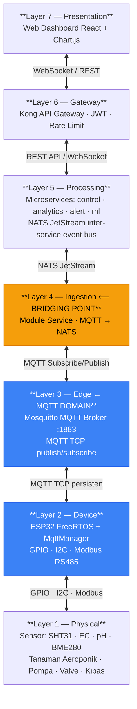
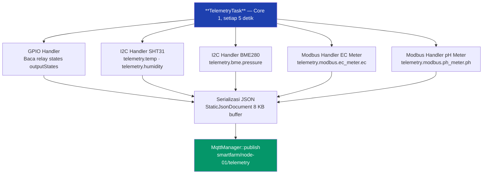
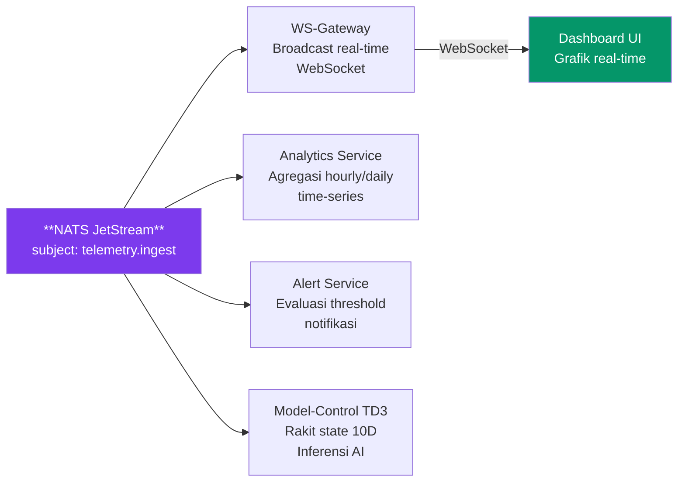
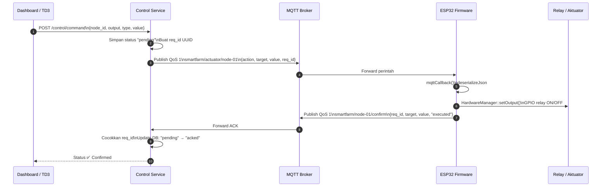
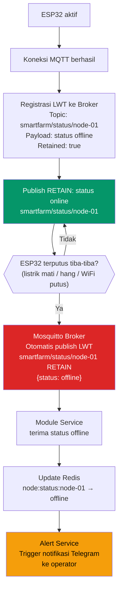
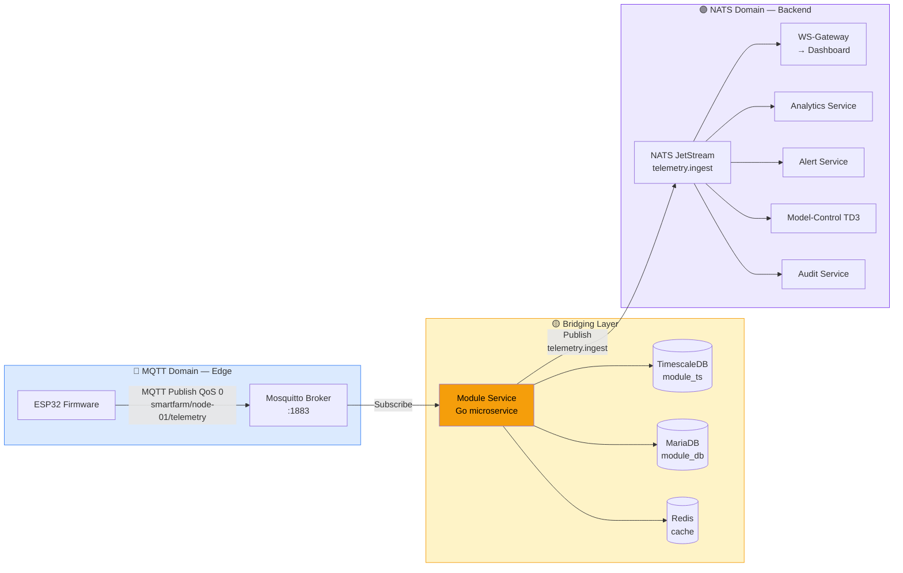
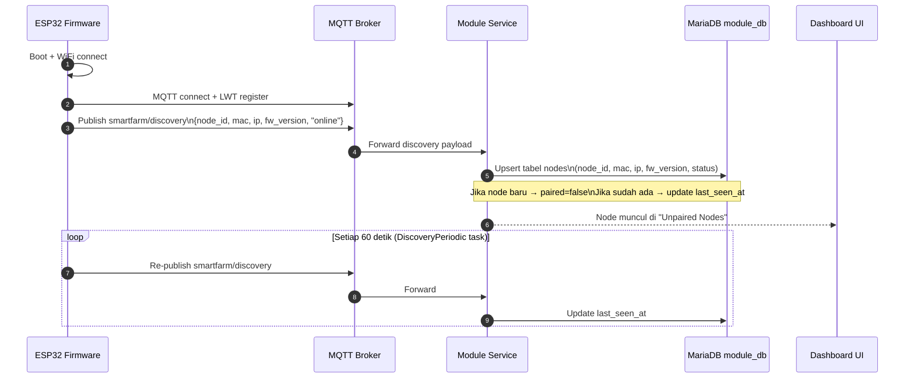
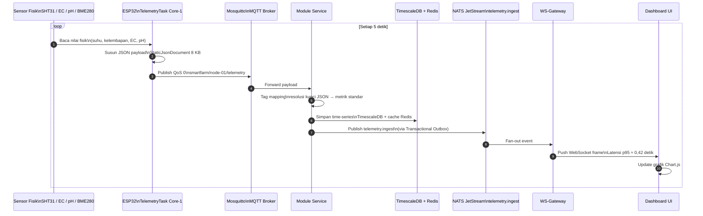
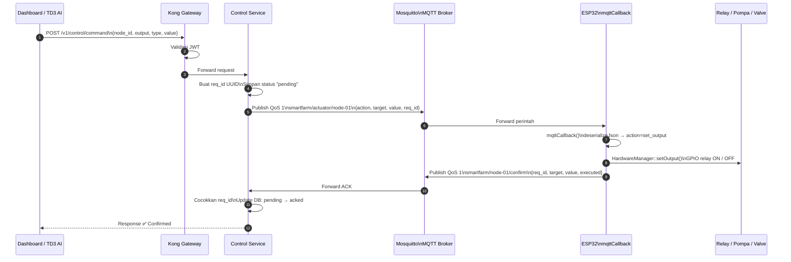

# Standar Komunikasi MQTT pada Firmware Aeroponic Node

> **Konteks Dokumen:** Bagian ini menjelaskan standar dan konvensi protokol komunikasi MQTT yang diterapkan pada firmware mikrokontroler ESP32 (aeroponic node) dalam sistem monitoring dan kontrol aeroponik berbasis arsitektur microservice. Penjelasan disusun secara runtut mengikuti perjalanan data dari sumber fisik (sensor) hingga ke titik akhir konsumsi (backend microservice dan dashboard), sekaligus mencakup alur balik perintah aktuasi.

---

## Daftar Isi

1. [Landasan Konseptual — Mengapa MQTT?](#1-landasan-konseptual--mengapa-mqtt)
2. [Posisi MQTT dalam Arsitektur Sistem](#2-posisi-mqtt-dalam-arsitektur-sistem)
3. [Identitas dan Konfigurasi Koneksi](#3-identitas-dan-konfigurasi-koneksi)
4. [Hierarki dan Kontrak Topik MQTT](#4-hierarki-dan-kontrak-topik-mqtt)
5. [Alur Lengkap: Dari Sensor Fisik ke Backend (Uplink)](#5-alur-lengkap-dari-sensor-fisik-ke-backend-uplink)
6. [Spesifikasi Payload JSON Telemetri](#6-spesifikasi-payload-json-telemetri)
7. [Alur Balik: Dari Backend ke Aktuator (Downlink)](#7-alur-balik-dari-backend-ke-aktuator-downlink)
8. [Mekanisme Konfirmasi dan Korelasi (ACK)](#8-mekanisme-konfirmasi-dan-korelasi-ack)
9. [Last Will and Testament (LWT) — Deteksi Kegagalan Otomatis](#9-last-will-and-testament-lwt--deteksi-kegagalan-otomatis)
10. [Mekanisme Bridging MQTT ke NATS JetStream](#10-mekanisme-bridging-mqtt-ke-nats-jetstream)
11. [QoS, Retensi, dan Keandalan Pengiriman](#11-qos-retensi-dan-keandalan-pengiriman)
12. [Mekanisme Discovery Perangkat Baru](#12-mekanisme-discovery-perangkat-baru)
13. [Topik Alert Lokal](#13-topik-alert-lokal)
14. [Benang Merah: Siklus Data End-to-End](#14-benang-merah-siklus-data-end-to-end)
15. [Referensi Teknis](#15-referensi-teknis)

---

## 1. Landasan Konseptual — Mengapa MQTT?

Sebelum membahas implementasi teknis, penting untuk memahami mengapa MQTT dipilih sebagai protokol komunikasi di lapisan paling bawah sistem ini — lapisan yang menghubungkan dunia fisik tanaman aeroponik dengan dunia digital backend microservice.

Sistem aeroponik beroperasi di lingkungan yang memiliki keterbatasan unik: perangkat sensor dipasang di lapangan (greenhouse), sering kali dengan catu daya terbatas dari baterai atau panel surya, dan bergantung pada koneksi WiFi yang tidak selalu stabil. Di sisi lain, data sensor harus dikirim secara periodik dan tepat waktu agar sistem kontrol dapat membuat keputusan yang akurat.

Protokol HTTP, yang lazim digunakan pada aplikasi web, tidak cocok untuk skenario ini. Setiap permintaan HTTP membawa *overhead* header yang besar (±3,2 KB per transaksi) dan memerlukan koneksi TCP baru yang mahal secara komputasional bagi mikrokontroler. Bandingkan dengan MQTT yang hanya membutuhkan ~388 byte per paket dengan koneksi persisten TCP yang dibuka sekali dan dipertahankan selama perangkat aktif (HiveMQ, 2026).

MQTT (Message Queuing Telemetry Transport), yang telah distandarisasi sebagai **ISO/IEC 20922:2016**, menggunakan paradigma **publish/subscribe**. Paradigma ini memisahkan produsen data (sensor/firmware) dari konsumen data (microservice), sehingga keduanya tidak perlu mengetahui keberadaan satu sama lain secara langsung. Cukup ada perantara tunggal — **MQTT Broker** (dalam sistem ini adalah Mosquitto) — yang mengelola distribusi pesan.

Karakteristik teknis MQTT yang relevan untuk sistem aeroponik ini adalah:

| Karakteristik | HTTP | MQTT | Relevansi untuk Aeroponik |
|---------------|------|------|---------------------------|
| Model komunikasi | Request/Response | Publish/Subscribe | Sensor tidak perlu menunggu respons; cukup kirim dan lanjutkan |
| Ukuran overhead | ~3,2 KB/transaksi | ~2 byte header minimum | Efisien untuk ESP32 dengan RAM terbatas |
| Persistensi koneksi | Tidak (per-request) | Ya (TCP persisten) | Koneksi tidak putus tiap pengiriman data |
| Deteksi kegagalan perangkat | Tidak ada | Last Will & Testament (LWT) | Broker otomatis mengumumkan node offline jika koneksi putus |
| Jaminan pengiriman | Tidak ada (bergantung lapisan atas) | QoS 0, 1, dan 2 | Fleksibel sesuai kebutuhan (telemetri vs perintah kritis) |

> **Justifikasi Dual-Protocol (MQTT + NATS):** MQTT dirancang untuk perangkat berdaya rendah di lapangan (edge), sementara NATS JetStream menjadi tulang punggung komunikasi antar-microservice di sisi cloud/server. Pemisahan ini menciptakan *edge-backend dichotomy* yang bersih: MQTT menangani heterogenitas hardware, sementara NATS menjamin konsistensi pengiriman event antar-layanan (Jeddou Sidna et al., 2020).

---

## 2. Posisi MQTT dalam Arsitektur Sistem

Untuk memahami peran MQTT secara menyeluruh, berikut adalah peta posisinya dalam arsitektur sistem 7-layer:



MQTT beroperasi secara eksklusif di antara **Layer 2 (Device)** dan **Layer 4 (Ingestion)**. Ini adalah wilayah yang secara arsitektural disebut sebagai **Edge Layer**. Tidak ada microservice lain yang berkomunikasi langsung dengan MQTT Broker selain Module Service — yang berfungsi sebagai *single ingress boundary* untuk semua data perangkat. Prinsip ini menjaga isolasi yang bersih dan mencegah ketergantungan silang antar-layanan.

---

## 3. Identitas dan Konfigurasi Koneksi

### 3.1 Identitas Perangkat (Client ID)

Setiap node ESP32 mengidentifikasi dirinya ke MQTT Broker menggunakan **Client ID** yang unik, dibentuk dari kombinasi prefix tetap dan `NODE_ID` yang berasal dari konfigurasi perangkat:

```
Client ID: "SmartFarmNode-{NODE_ID}"
Contoh:    "SmartFarmNode-node-01"
```

`NODE_ID` adalah pengidentifikasi unik perangkat yang dikonfigurasi melalui file `config.json` di flash storage (LittleFS) atau melalui captive web portal. Dalam implementasi nyata, `NODE_ID` biasanya berbasis alamat MAC perangkat untuk menjamin keunikan secara global tanpa koordinasi terpusat.

### 3.2 Parameter Koneksi

Seluruh parameter koneksi MQTT disimpan secara tersentralisasi dalam namespace `Config` dan dapat dimodifikasi tanpa kompilasi ulang firmware melalui mekanisme konfigurasi runtime:

```cpp
// Dari: firmware/aeroponic-node/src/core/Config.cpp
namespace Config {
    String MQTT_SERVER       = "";           // Diisi dari config.json (IP/hostname broker)
    int    MQTT_PORT         = 1883;         // Port MQTT standar (plain TCP)
    String MQTT_TOPIC_PREFIX = "smartfarm";  // Prefix namespace topik
    String MQTT_USER         = "";           // Username MQTT (opsional)
    String MQTT_PASS         = "";           // Password MQTT (opsional)
    bool   MQTT_USE_TLS      = false;        // Flag enkripsi TLS/SSL
}
```

> **Catatan Desain:** Nilai default dikompilasi ke dalam firmware, namun nilai operasional dimuat dari file `config.json` saat boot oleh `ConfigManager::init()`. Jika file konfigurasi tidak ditemukan (misalnya perangkat baru), ESP32 secara otomatis membuka *captive web portal* untuk memandu operator mengisi parameter koneksi melalui browser smartphone, tanpa memerlukan IDE atau kabel data.

### 3.3 Buffer Kapasitas

MQTT client pada firmware dikonfigurasi dengan ukuran buffer 8.192 byte (`mqttClient->setBufferSize(8192)`) untuk mengakomodasi payload JSON telemetri yang berpotensi besar — terutama saat banyak sensor Modbus terdaftar dalam registry dinamis.

---

## 4. Hierarki dan Kontrak Topik MQTT

### 4.1 Filosofi Penamaan Topik

MQTT menggunakan struktur topik berbasis hierarki dengan pemisah `/`. Konvensi penamaan yang diterapkan dalam sistem ini mengikuti pola:

```
{prefix}/{domain}/{node_id}
```

Di mana:
- **`{prefix}`** = `smartfarm` (configurable via `MQTT_TOPIC_PREFIX`)
- **`{domain}`** = kategori pesan (telemetry, actuator, confirm, status, discovery, dll.)
- **`{node_id}`** = identitas unik perangkat (misalnya: `node-01`, `node-02`)

Pola ini dipilih secara konsisten agar dapat menggunakan **wildcard MQTT** (`+` untuk satu level, `#` untuk multi-level) di sisi subscriber. Misalnya, Module Service dapat berlangganan ke `smartfarm/discovery` untuk menerima sinyal dari *semua* perangkat yang baru terhubung, atau `smartfarm/+/telemetry` untuk mengonsumsi telemetri dari seluruh node sekaligus.

### 4.2 Daftar Topik Resmi (Topic Registry)

Berikut adalah kontrak topik yang berlaku dalam sistem, beserta arah aliran dan tujuannya:

| Topik | Arah | Publisher | Subscriber | QoS | Retain | Deskripsi |
|-------|------|-----------|------------|-----|--------|-----------|
| `smartfarm/{node_id}/telemetry` | ↑ Uplink | ESP32 | Module Service | 0 | No | Payload telemetri periodik sensor + status output |
| `smartfarm/actuator/{node_id}` | ↓ Downlink | Control Service | ESP32 | 1 | No | Perintah kontrol aktuator dari backend |
| `smartfarm/{node_id}/confirm` | ↑ Uplink | ESP32 | Control Service | 1 | No | Konfirmasi eksekusi perintah (ACK) beserta `req_id` |
| `smartfarm/status/{node_id}` | ↑ Uplink | ESP32 | Module Service | 0 | **Yes** | Status online/offline node (retained, diperbarui saat koneksi & LWT) |
| `smartfarm/discovery` | ↑ Uplink | ESP32 | Module Service | 0 | No | Sinyal penemuan perangkat baru (dikirim periodik tiap 60 detik) |
| `smartfarm/{node_id}/alert` | ↑ Uplink | ESP32 | Module Service | 1 | No | Notifikasi kondisi darurat lokal (emergency shutdown, dll.) |

> **Catatan penting tentang konsistensi topik:** Topik `smartfarm/actuator/{node_id}` (domain `actuator` mendahului `node_id`) berbeda secara sengaja dari topik `smartfarm/{node_id}/telemetry` (domain setelah `node_id`). Pola ini memungkinkan wildcard subscription yang berbeda: `smartfarm/actuator/+` untuk semua perintah aktuasi, vs `smartfarm/+/telemetry` untuk semua telemetri.

### 4.3 Topik dalam Kode Firmware

```cpp
// Dari: firmware/aeroponic-node/src/core/Config.cpp
String TOPIC_TELEMETRY   = MQTT_TOPIC_PREFIX + "/" + NODE_ID + "/telemetry";
// Contoh: "smartfarm/node-01/telemetry"

String TOPIC_ACTUATOR    = MQTT_TOPIC_PREFIX + "/actuator/" + NODE_ID;
// Contoh: "smartfarm/actuator/node-01"

String TOPIC_ALERT       = MQTT_TOPIC_PREFIX + "/" + NODE_ID + "/alert";
// Contoh: "smartfarm/node-01/alert"
```

---

## 5. Alur Lengkap: Dari Sensor Fisik ke Backend (Uplink)

Bagian ini menjelaskan perjalanan data secara runtut dari saat sensor membaca kondisi fisik tanaman hingga data tersebut tiba di database backend dan layar dashboard pengguna.

### 5.1 Tahap 1 — Pembacaan Sensor oleh TelemetryTask

Di dalam ESP32, berjalan sebuah task FreeRTOS bernama `TelemetryTask` yang terpasang pada **Core 1** dengan prioritas 1. Task ini bertanggung jawab secara eksklusif untuk polling semua sensor yang terdaftar dalam registry hardware. Task ini berjalan dalam siklus periodik yang dikonfigurasi melalui `MQTT_PUBLISH_INTERVAL` (default **5.000 ms** atau setiap 5 detik).

Dalam setiap siklus, `TelemetryTask` melakukan:

1. **Mengakuisisi mutex** `handlersMutex` untuk akses eksklusif ke registry sensor
2. **Memanggil `handler->read(telemetry)`** pada setiap `ProtocolHandler` yang terdaftar — baik sensor GPIO, I2C (SHT31, BME280), maupun Modbus RS485 (EC meter, pH meter)
3. **Membaca status output** dari semua aktuator yang terdaftar (relay pompa, valve, kipas)
4. **Mengevaluasi aturan kontrol lokal** (histeresis lokal, misalnya: mematikan kipas otomatis jika suhu turun di bawah ambang batas rendah)
5. **Menyusun payload JSON** menggunakan `StaticJsonDocument<8192>` yang dialokasikan statik (bukan dinamis, menghindari fragmentasi heap)
6. **Mempublikasikan ke MQTT** via `MqttManager::publish()`



### 5.2 Tahap 2 — Transmisi melalui MQTT Broker (Mosquitto)

`MqttManager` berjalan di **Core 0** dalam task terpisah (`MqttTask`) yang terus-menerus mempertahankan koneksi TCP ke Mosquitto Broker. Saat `telemetryTask` memanggil `publish()`, payload JSON dikirimkan melalui koneksi TCP yang sudah terbuka — tidak perlu membangun koneksi baru setiap kali.

Mosquitto Broker menerima paket publish dan segera mendistribusikannya ke semua subscriber yang telah berlangganan ke topik `smartfarm/node-01/telemetry`. Dalam sistem ini, subscriber utama adalah **Module Service**.

### 5.3 Tahap 3 — Konsumsi oleh Module Service

Module Service (layanan Go) berjalan sebagai kontainer Docker dan berlangganan ke topik `smartfarm/{node_id}/telemetry` untuk semua node yang terdaftar. Saat menerima payload:

1. **Parsing JSON**: Payload didekode dan divalidasi strukturnya
2. **Resolusi tag mapping**: Kunci JSON (misalnya `telemetry.temp`) dipetakan ke nama metrik standar (misalnya `temperature`) berdasarkan konfigurasi `node_tags` di database `module_db`
3. **Persistensi ke TimescaleDB**: Setiap metrik disimpan sebagai baris time-series dalam hypertable `telemetry` di database `module_ts`
4. **Cache Redis**: Payload terbaru disimpan sementara di Redis dengan kunci `node:latest:{node_id}` (TTL 5 menit) untuk akses cepat tanpa query database
5. **Bridging ke NATS**: Payload dipublikasikan ke NATS JetStream subject `telemetry.ingest` — titik ini adalah transisi dari dunia MQTT ke dunia event bus internal microservice

### 5.4 Tahap 4 — Distribusi via NATS JetStream ke Layanan Downstream

Dari subject `telemetry.ingest`, data mengalir ke berbagai subscriber NATS sesuai kebutuhan masing-masing layanan:



Mekanisme NATS JetStream memastikan bahwa meskipun salah satu subscriber sedang down (misalnya karena restart container), pesan tetap tersimpan di log persisten NATS dan akan dikirim ulang saat subscriber kembali aktif (*at-least-once delivery*).

---

## 6. Spesifikasi Payload JSON Telemetri

### 6.1 Struktur Payload Lengkap

Berikut adalah struktur JSON lengkap yang dipublikasikan firmware ke topik `smartfarm/{node_id}/telemetry` setiap 5 detik:

```json
{
  "node_id": "node-01",
  "fw_version": "1.0.0",
  
  "network": {
    "ssid": "SmartFarm-Kebun-A",
    "ip_address": "192.168.1.105",
    "wifi_rssi": -62
  },
  
  "device_info": {
    "uptime_s": 3600,
    "cpu_freq_mhz": 240,
    "free_heap_kb": 182,
    "flash_size_mb": 4
  },
  
  "connection_stats": {
    "mqtt_connected": true,
    "uptime_s": 3600
  },
  
  "telemetry": {
    "outputs": {
      "pump":  0,
      "valve": 1,
      "fan":   0
    },
    "temp":     27.4,
    "humidity": 88.3,
    "bme": {
      "temperature": 26.8,
      "pressure":    1013.25
    },
    "modbus": {
      "ec_meter": { "ec": 1.82 },
      "ph_meter": { "ph": 6.3  }
    }
  }
}
```

### 6.2 Anotasi Field Kritis

| Field | Tipe | Sumber | Keterangan |
|-------|------|--------|------------|
| `node_id` | `string` | `Config::NODE_ID` | Pengidentifikasi unik perangkat |
| `fw_version` | `string` | `Config::FW_VERSION` | Versi firmware (untuk manajemen OTA) |
| `network.wifi_rssi` | `int` | `WiFi.RSSI()` | Kuat sinyal WiFi dalam dBm |
| `device_info.free_heap_kb` | `int` | `ESP.getFreeHeap() / 1024` | Monitoring kondisi memori firmware |
| `telemetry.outputs.*` | `int` (0/1) | `outputStates[]` | Status aktuator terakhir yang dieksekusi |
| `telemetry.temp` | `float` | I2C Handler (SHT31) | Suhu zona akar (°C) |
| `telemetry.humidity` | `float` | I2C Handler (SHT31) | Kelembapan zona akar (%) |
| `telemetry.modbus.ec_meter.ec` | `float` | Modbus Handler | Konduktivitas elektrik larutan nutrisi (mS/cm) |
| `telemetry.modbus.ph_meter.ph` | `float` | Modbus Handler | Keasaman larutan nutrisi |

### 6.3 Mekanisme Tag Mapping (Resolusi Kunci JSON)

Tidak semua firmware memiliki penamaan kunci JSON yang identik. Sistem ini menerapkan lapisan resolusi yang disebut **tag mapping** di Module Service: operator dapat mendeklarasikan bahwa kunci `telemetry.temp` dari firmware node tertentu harus dipetakan ke metrik standar `temperature` dalam database. Pemetaan ini tersimpan di tabel `node_tags` di MariaDB (`module_db`) dan dapat diperbarui melalui REST API tanpa memodifikasi firmware.

Ini adalah salah satu mekanisme kunci yang mendukung **modularitas firmware** — firmware tidak perlu menggunakan penamaan yang seragam karena pemetaan dilakukan oleh backend secara deklaratif.

---

## 7. Alur Balik: Dari Backend ke Aktuator (Downlink)

Jika alur uplink adalah perjalanan data dari bawah ke atas (sensor → broker → backend), maka alur **downlink** adalah perjalanan perintah dari atas ke bawah (dashboard → backend → firmware → aktuator fisik). Ini adalah alur yang sama pentingnya, karena inilah bagaimana pengguna (atau agen AI TD3) mengendalikan pompa misting, valve nutrisi, dan kipas sirkulasi.

### 7.1 Tahap 1 — Inisiasi Perintah dari Dashboard atau AI

Perintah kontrol dapat berasal dari dua sumber:

**a) Perintah Manual Pengguna (via Dashboard):**
Pengguna menekan tombol pada dashboard web → REST API call ke Kong Gateway → diteruskan ke Control Service.

**b) Perintah Otomatis dari Agen TD3:**
Model-Control Scheduler (setelah mengonsumsi data NATS dan memanggil TD3 inference) mengirim permintaan HTTP POST ke `/control/command` pada Control Service.

### 7.2 Tahap 2 — Control Service Merakit Perintah MQTT

Control Service menerima permintaan kontrol dan menyusun payload perintah MQTT standar:

```json
{
  "action":  "set_output",
  "target":  "pump",
  "value":   1,
  "req_id":  "cmd-uuid-f4a7c2e1-b93d-4a15"
}
```

| Field | Tipe | Keterangan |
|-------|------|------------|
| `action` | `string` | Selalu `"set_output"` untuk kontrol aktuator |
| `target` | `string` | Nama aktuator yang dituju, harus cocok dengan `Config::HardwareOutputs[].name` di firmware |
| `value` | `int` | `1` = ON, `0` = OFF, atau nilai PWM 0–255 untuk kontrol level |
| `req_id` | `string` | UUID unik untuk korelasi dengan ACK konfirmasi dari firmware |

### 7.3 Tahap 3 — Pengiriman via MQTT ke ESP32

Control Service mempublikasikan payload ke topik:

```
smartfarm/actuator/{node_id}
```

dengan **QoS 1** (at-least-once delivery) — memastikan pesan pasti diterima firmware meskipun ada gangguan jaringan sesaat.

### 7.4 Tahap 4 — Eksekusi di Firmware oleh mqttCallback

Di sisi firmware, `MqttManager::mqttCallback()` terpanggil secara otomatis oleh library PubSubClient saat pesan tiba di topik yang dilanggani:

```cpp
// firmware/aeroponic-node/src/protocols/MqttManager.cpp
void MqttManager::mqttCallback(char* topic, byte* payload, unsigned int length) {
    String msg;
    for (unsigned int i = 0; i < length; i++) msg += (char)payload[i];
    
    if (String(topic) == Config::TOPIC_ACTUATOR) {
        DynamicJsonDocument doc(16384);
        deserializeJson(doc, msg);
        
        String action = doc["action"] | "";
        String target = doc["target"] | "";
        int value     = doc["value"]  | 0;
        
        if (action == "set_output" && target.length() > 0) {
            HardwareManager::setOutput(target, value);  // Eksekusi relay/GPIO
        }
        
        // Kirim konfirmasi ACK
        if (doc.containsKey("req_id")) {
            String confirmTopic = Config::MQTT_TOPIC_PREFIX + "/" + Config::NODE_ID + "/confirm";
            String confirmPayload = "{\"req_id\":\"" + doc["req_id"].as<String>() +
                "\",\"target\":\"" + target +
                "\",\"value\":" + String(value) + ",\"status\":\"executed\"}";
            mqttClient->publish(confirmTopic.c_str(), confirmPayload.c_str());
        }
    }
}
```

`HardwareManager::setOutput(target, value)` menelusuri registry `activeOutputHandlers` untuk menemukan handler yang sesuai berdasarkan nama target, kemudian memanggil `handler->write(value)` yang akhirnya mengubah logika GPIO fisik — menyalakan atau mematikan relay yang terhubung ke pompa.

---

## 8. Mekanisme Konfirmasi dan Korelasi (ACK)

Salah satu aspek terpenting dalam sistem kontrol industri adalah **verifikasi bahwa perintah benar-benar dieksekusi**, bukan hanya terkirim. Sistem ini mengimplementasikan mekanisme *command lifecycle tracking* yang memungkinkan backend mengetahui apakah relay pompa benar-benar berubah setelah menerima perintah.

### 8.1 Alur Siklus Hidup Perintah



### 8.2 Payload Konfirmasi (ACK)

```json
{
  "req_id": "cmd-uuid-f4a7c2e1-b93d-4a15",
  "target": "pump",
  "value":  1,
  "status": "executed"
}
```

### 8.3 Penanganan Timeout

Jika Control Service tidak menerima ACK dalam batas waktu tertentu, status perintah diperbarui menjadi `"timeout"`. Kondisi ini mengindikasikan bahwa perintah mungkin tidak sampai ke firmware atau relay gagal dieksekusi — dan akan ditandai pada log audit serta dapat memicu notifikasi ke operator.

Korelasi dilakukan berdasarkan **`req_id`** yang unik (UUID) — Control Service menyimpan setiap `req_id` yang diterbitkan dan mencocokkannya dengan ACK yang masuk.

---

## 9. Last Will and Testament (LWT) — Deteksi Kegagalan Otomatis

Salah satu fitur terpenting MQTT untuk sistem IoT adalah **Last Will and Testament (LWT)**. Fitur ini memungkinkan MQTT Broker untuk secara otomatis mempublikasikan pesan yang telah ditetapkan sebelumnya ke topik tertentu, apabila klien (ESP32) terputus secara tidak terduga — misalnya karena kegagalan listrik, hang firmware, atau putusnya koneksi WiFi.

### 9.1 Registrasi LWT saat Koneksi

```cpp
// firmware/aeroponic-node/src/protocols/MqttManager.cpp
String lwtTopic   = Config::MQTT_TOPIC_PREFIX + "/status/" + Config::NODE_ID;
// Contoh: "smartfarm/status/node-01"

String lwtPayload = "{\"status\":\"offline\",\"mac\":\"AA:BB:CC:DD:EE:FF\"}";

mqttClient->connect(
    clientId.c_str(),    // SmartFarmNode-node-01
    username, password,
    lwtTopic.c_str(),    // Topik LWT
    0,                   // QoS LWT: 0
    true,                // Retained: true
    lwtPayload.c_str()   // Payload yang akan dikirim jika koneksi putus
);
```

### 9.2 Alur Deteksi Kegagalan



### 9.3 Status Online saat Koneksi Berhasil

Ketika ESP32 berhasil terhubung ke broker, ia segera menimpa pesan LWT dengan status `"online"` menggunakan **retained message** pada topik yang sama. Hal ini memastikan bahwa siapapun yang baru berlangganan ke topik status akan langsung mendapatkan status terkini tanpa harus menunggu pesan berikutnya:

```cpp
String onlinePayload = "{\"status\":\"online\",\"mac\":\"...\",\"ip\":\"...\",\"fw\":\"1.0.0\"}";
mqttClient->publish(lwtTopic.c_str(), onlinePayload.c_str(), true); // retained=true
```

---

## 10. Mekanisme Bridging MQTT ke NATS JetStream

Ini adalah salah satu titik arsitektural yang paling kritis: **bagaimana data yang tiba melalui MQTT (dunia edge/device) ditransformasikan menjadi event yang dapat dikonsumsi oleh seluruh ekosistem microservice (dunia backend)**?

### 10.1 Peran Module Service sebagai Bridge

Module Service adalah satu-satunya komponen dalam sistem yang duduk di kedua dunia sekaligus — ia berlangganan ke MQTT Broker dan juga mempublikasikan ke NATS JetStream. Inilah mengapa ia disebut sebagai **MQTT-to-NATS Bridge** atau *ingress boundary*.

### 10.2 Alur Bridging secara Detail



### 10.3 Transformasi Payload

Saat menerima payload MQTT mentah dari firmware, Module Service tidak hanya meneruskannya mentah-mentah ke NATS. Sebaliknya, ia melakukan transformasi:

1. **Resolusi tag mapping**: Kunci JSON mentah (`telemetry.temp`) diubah menjadi metrik standar (`temperature`) berdasarkan konfigurasi `node_tags`
2. **Pengayaan metadata**: Payload diperkaya dengan `module_id` dan timestamp resmi dari sisi server
3. **Normalisasi tipe data**: Nilai string dikonversi ke tipe numerik yang sesuai (`float`/`int`/`bool`)
4. **Penyimpanan outbox**: Sebelum dipublikasikan ke NATS, event dicatat terlebih dahulu di tabel `outbox` (Transactional Outbox Pattern — ADR-007) untuk menjamin konsistensi atomik antara penyimpanan database dan publikasi event

### 10.4 Jaminan Pengiriman Pasca-Bridge

NATS JetStream — berbeda dengan NATS core biasa — menyediakan persistensi berbasis file log. Ini berarti:

- Jika subscriber (misalnya Analytics Service) sedang restart saat telemetri tiba, pesan tidak hilang
- Saat subscriber kembali aktif, ia dapat *replay* pesan yang terlewat
- Semantik **at-least-once delivery** menjamin tidak ada data telemetri yang hilang dalam perjalanan dari MQTT ke layanan analitik

---

## 11. QoS, Retensi, dan Keandalan Pengiriman

### 11.1 Pemilihan Level QoS

MQTT mendefinisikan tiga tingkat jaminan pengiriman (*Quality of Service* — QoS):

| QoS | Nama | Jaminan | Overhead Jaringan |
|-----|------|---------|-------------------|
| **0** | At most once | Kirim sekali, tidak ada konfirmasi | Minimal |
| **1** | At least once | Kirim ulang sampai ACK diterima | Moderat (duplikasi mungkin terjadi) |
| **2** | Exactly once | Dijamin tepat sekali, protokol 4-tahap | Tinggi |

Pemilihan QoS yang diterapkan dalam sistem ini didasarkan pada karakteristik setiap jenis pesan:

**QoS 0 — Telemetri Periodik** (`smartfarm/{node_id}/telemetry`):
Data sensor dikirim setiap 5 detik. Kehilangan satu atau dua paket tidak berdampak fatal karena data baru akan tiba 5 detik kemudian. Overhead jaringan minimal diprioritaskan untuk efisiensi bandwidth, terutama karena jumlah node dapat mencapai puluhan perangkat yang mengirim secara bersamaan.

**QoS 1 — Perintah Aktuator** (`smartfarm/actuator/{node_id}`):
Perintah untuk menyalakan atau mematikan pompa harus tiba. Kehilangan perintah berarti pompa tidak menyala sesuai jadwal — berpotensi merusak tanaman jika terjadi berulang. QoS 1 memastikan pesan dikirim ulang jika tidak ada PUBACK dari broker.

**QoS 1 — Konfirmasi ACK** (`smartfarm/{node_id}/confirm`):
ACK berfungsi sebagai bukti eksekusi kepada Control Service. Jika ACK hilang, Control Service tidak dapat memperbarui status perintah menjadi `"acked"` dan akan menandai perintah sebagai `"timeout"` — memicu investigasi.

### 11.2 Retained Messages

Retained message adalah pesan MQTT yang disimpan oleh broker dan segera dikirim ke subscriber baru yang baru berlangganan ke topik tersebut, tanpa harus menunggu pesan berikutnya. Sistem ini menggunakan retained message untuk:

- **`smartfarm/status/{node_id}`**: Menyimpan status terakhir node (online/offline). Subscriber baru langsung mengetahui status node tanpa menunggu.

Topik telemetri dan perintah aktuator **tidak** menggunakan retain, karena data yang sudah lama (misalnya nilai suhu 5 menit lalu) tidak relevan dan bahkan dapat menyesatkan.

---

## 12. Mekanisme Discovery Perangkat Baru

Ketika sebuah ESP32 baru pertama kali dihidupkan dan berhasil terhubung ke broker, ia perlu dikenali oleh sistem backend agar data telemetrinya dapat diproses. Mekanisme ini disebut **node discovery**.

### 12.1 Alur Discovery



### 12.2 Discovery Periodik

Untuk mengantisipasi kondisi di mana Module Service baru dijalankan *setelah* ESP32 sudah aktif (misalnya saat restart backend), firmware juga mengirim ulang sinyal discovery secara periodik setiap **60 detik** melalui task FreeRTOS terpisah (`DiscoveryPeriodic`). Ini memastikan tidak ada perangkat yang "hilang" karena race condition pada saat startup.

### 12.3 Penanganan di Module Service

Saat Module Service menerima pesan di topik `smartfarm/discovery`:
1. Cek apakah `node_id` sudah ada di database `module_db`
2. Jika belum ada: buat entri baru di tabel `nodes` dengan status `discovered` dan `paired=false`
3. Jika sudah ada: perbarui field `last_seen_at`, `ip`, `fw_version`, dan `status`
4. Node yang baru ditemukan muncul di halaman "Unpaired Nodes" pada dashboard untuk dikonfirmasi oleh operator

---

## 13. Topik Alert Lokal

Topik `smartfarm/{node_id}/alert` adalah saluran khusus yang hanya aktif dalam kondisi darurat. Contoh kondisi yang memicu alert lokal:

```cpp
// Dari: firmware/aeroponic-node/src/core/HardwareManager.cpp
// Saat emergency stop interrupt terpicu:
String alertPayload = "{\"alert\":\"EMERGENCY_SHUTDOWN\","
                     "\"node_id\":\"" + Config::NODE_ID + "\","
                     "\"uptime_s\":" + String(millis() / 1000) + "}";
MqttManager::publish(Config::TOPIC_ALERT, alertPayload);
```

Alert ini menggunakan QoS 1 karena sifatnya yang kritis — kehilangan notifikasi darurat dapat mengakibatkan keterlambatan respons operator terhadap kondisi berbahaya di lapangan.

---

## 14. Benang Merah: Siklus Data End-to-End

Seluruh mekanisme yang telah dipaparkan di atas dapat dipahami sebagai dua siklus besar yang saling melengkapi: **siklus sensor (uplink)** dan **siklus kontrol (downlink)**. Keduanya terhubung melalui MQTT Broker sebagai titik pertemuan edge dan backend.

### 14.1 Diagram Siklus Lengkap

**Siklus 1 — Uplink: Sensor → Dashboard (tiap 5 detik)**



**Siklus 2 — Downlink: Dashboard / AI → Aktuator Fisik**



### 14.2 Rangkuman Benang Merah

Perjalanan data dalam sistem ini dapat dirangkum dalam satu narasi yang utuh:

1. **Sensor membaca kondisi fisik** tanaman aeroponik — suhu zona akar, kelembapan, konduktivitas elektrik larutan nutrisi, dan keasaman (pH).

2. **TelemetryTask di ESP32** mengumpulkan semua pembacaan sensor dalam siklus 5 detik, menyusunnya ke dalam struktur JSON yang terstandar, dan menyerahkannya ke MqttManager.

3. **MqttManager** mengirimkan payload JSON melalui koneksi TCP persisten ke Mosquitto MQTT Broker menggunakan topik `smartfarm/{node_id}/telemetry` dengan QoS 0.

4. **MQTT Broker** mendistribusikan paket ke semua subscriber yang terdaftar. Module Service menjadi satu-satunya jembatan yang mengonsumsi pesan dari sisi MQTT.

5. **Module Service** menyimpan data ke TimescaleDB untuk rekam jejak historis, ke Redis untuk akses cepat status terkini, dan mempublikasikan event ke NATS JetStream subject `telemetry.ingest` — inilah titik **bridging** yang mengubah data edge menjadi event backend.

6. **Layanan-layanan downstream** (WS-Gateway, Analytics, Alert, TD3 Scheduler) secara independen berlangganan ke NATS dan mengolah data sesuai fungsinya masing-masing — WS-Gateway mendorong data ke dashboard real-time, Analytics mengagregasi data historis, Alert mengevaluasi threshold, dan TD3 menyusun keputusan kontrol cerdas.

7. **Jika perlu kontrol aktuator**, keputusan (dari pengguna atau AI) dikirim mundur melalui jalur sebaliknya: Control Service mempublikasikan perintah ke topik `smartfarm/actuator/{node_id}` dengan QoS 1, ESP32 mengeksekusi perintah dan mengoperasikan relay, lalu mengirim konfirmasi ACK ke topik `smartfarm/{node_id}/confirm` sehingga Control Service dapat memutakhirkan status perintah dari `"pending"` menjadi `"acked"`.

Dua siklus ini — uplink dan downlink — berjalan secara bersamaan dan independen, membentuk sistem *closed-loop* yang lengkap: data dari tanaman mempengaruhi keputusan kontrol, dan keputusan kontrol kembali mempengaruhi kondisi tanaman.

---

## 15. Referensi Teknis

### Dokumen Internal Proyek

| Dokumen | Relevansi |
|---------|-----------|
| [`firmware/aeroponic-node/src/protocols/MqttManager.cpp`](file:///home/almuzky/TA/Microservices/firmware/aeroponic-node/src/protocols/MqttManager.cpp) | Implementasi MQTT Client, LWT, callback aktuator, publish telemetri |
| [`firmware/aeroponic-node/src/core/Config.cpp`](file:///home/almuzky/TA/Microservices/firmware/aeroponic-node/src/core/Config.cpp) | Definisi topik MQTT, parameter koneksi default |
| [`firmware/aeroponic-node/include/Config.h`](file:///home/almuzky/TA/Microservices/firmware/aeroponic-node/include/Config.h) | Deklarasi variabel konfigurasi namespace `Config` |
| [`firmware/aeroponic-node/src/core/HardwareManager.cpp`](file:///home/almuzky/TA/Microservices/firmware/aeroponic-node/src/core/HardwareManager.cpp) | TelemetryTask, konstruksi payload JSON, setOutput (aktuator) |
| [`docs/integration-guides/module.md`](file:///home/almuzky/TA/Microservices/docs/integration-guides/module.md) | Kontrak MQTT Module Service, NATS downstream subscription |
| [`docs/integration-guides/control.md`](file:///home/almuzky/TA/Microservices/docs/integration-guides/control.md) | Payload perintah aktuator, format ACK, lifecycle perintah |

### Referensi Akademis dan Teknis

| Referensi | Relevansi |
|-----------|-----------|
| ISO/IEC 20922:2016 — *Information technology — Message Queuing Telemetry Transport (MQTT) v3.1.1* | Standar protokol MQTT internasional |
| HiveMQ (2026). *MQTT Essentials: Complete Series.* hivemq.com | Panduan teknis MQTT komprehensif (QoS, LWT, Retain) |
| Jeddou Sidna, M., et al. (2020). *Comparison of IoT Protocols: MQTT, CoAP, and HTTP.* ACM | Perbandingan efisiensi protokol IoT: justifikasi pemilihan MQTT |
| Matic, M., et al. (2021). *Analysis of MQTT Protocol for IoT Applications.* IEEE ICCE | Analisis karakteristik performa MQTT di lingkungan embedded |
| Espressif Systems (2023). *ESP-IDF Programming Guide: FreeRTOS Tasks and Queues.* | Panduan resmi pemrograman FreeRTOS pada ESP32 |
| Knolleary (2023). *PubSubClient MQTT Library Documentation.* | Dokumentasi library MQTT C++ untuk Arduino/ESP32 |
