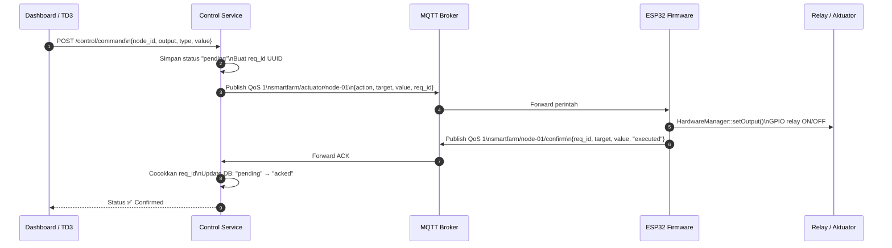
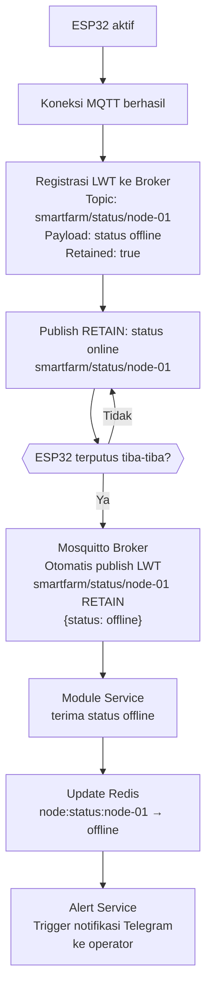
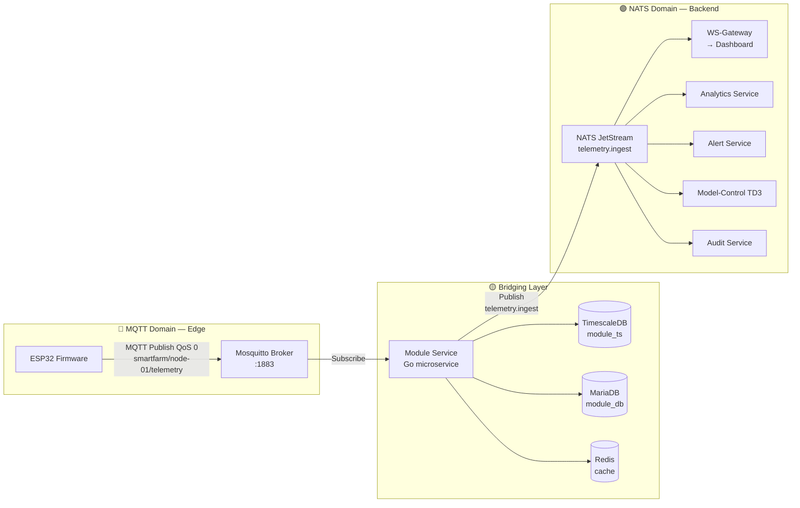
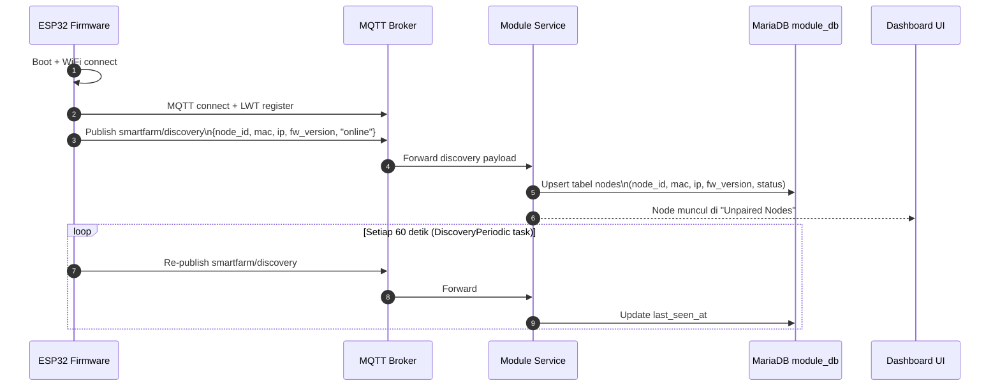

# Standar Komunikasi MQTT pada Firmware Aeroponic Node

> **Konteks Dokumen:** Standar dan konvensi protokol komunikasi MQTT yang diterapkan pada firmware mikrokontroler ESP32 (aeroponic node) dalam sistem monitoring dan kontrol aeroponik berbasis arsitektur microservice.

---

## Hierarki dan Kontrak Topik MQTT

### 4.1 Filosofi Penamaan Topik

```
{prefix}/{domain}/{node_id}
```

- **`{prefix}`** = `smartfarm` (configurable via `MQTT_TOPIC_PREFIX`)
- **`{domain}`** = kategori pesan (telemetry, actuator, confirm, status, discovery, dll.)
- **`{node_id}`** = identitas unik perangkat

Pola ini memungkinkan **wildcard MQTT** (`+` untuk satu level, `#` untuk multi-level) di sisi subscriber. Module Service dapat berlangganan ke `smartfarm/discovery` untuk menerima sinyal dari *semua* perangkat, atau `smartfarm/+/telemetry` untuk mengonsumsi telemetri dari seluruh node.

### 4.2 Daftar Topik Resmi (Topic Registry)

| Topik | Arah | Publisher | Subscriber | QoS | Retain | Deskripsi |
|-------|------|-----------|------------|-----|--------|-----------|
| `smartfarm/{node_id}/telemetry` | ↑ Uplink | ESP32 | Module Service | 0 | No | Payload telemetri periodik sensor + status output |
| `smartfarm/actuator/{node_id}` | ↓ Downlink | Control Service | ESP32 | 1 | No | Perintah kontrol aktuator dari backend |
| `smartfarm/{node_id}/confirm` | ↑ Uplink | ESP32 | Control Service | 1 | No | Konfirmasi eksekusi perintah (ACK) beserta `req_id` |
| `smartfarm/status/{node_id}` | ↑ Uplink | ESP32 | Module Service | 0 | **Yes** | Status online/offline node (retained) |
| `smartfarm/discovery` | ↑ Uplink | ESP32 | Module Service | 0 | No | Sinyal penemuan perangkat baru (dikirim periodik tiap 60 detik) |
| `smartfarm/{node_id}/alert` | ↑ Uplink | ESP32 | Module Service | 1 | No | Notifikasi kondisi darurat lokal |

> **Catatan penting:** Topik `smartfarm/actuator/{node_id}` (domain `actuator` mendahului `node_id`) berbeda secara sengaja dari topik `smartfarm/{node_id}/telemetry` (domain setelah `node_id`). Pola ini memungkinkan wildcard subscription yang berbeda: `smartfarm/actuator/+` untuk semua perintah aktuasi, vs `smartfarm/+/telemetry` untuk semua telemetri.

### 4.3 Topik dalam Kode Firmware

```cpp
String TOPIC_TELEMETRY   = MQTT_TOPIC_PREFIX + "/" + NODE_ID + "/telemetry";
String TOPIC_ACTUATOR    = MQTT_TOPIC_PREFIX + "/actuator/" + NODE_ID;
String TOPIC_ALERT       = MQTT_TOPIC_PREFIX + "/" + NODE_ID + "/alert";
```

---

## Spesifikasi Payload JSON Telemetri

### 6.1 Struktur Payload Lengkap

```json
{
  "node_id": "node-01",
  "fw_version": "1.0.0",
  "network": { "ssid": "SmartFarm-Kebun-A", "ip_address": "192.168.1.105", "wifi_rssi": -62 },
  "device_info": { "uptime_s": 3600, "cpu_freq_mhz": 240, "free_heap_kb": 182, "flash_size_mb": 4 },
  "connection_stats": { "mqtt_connected": true, "uptime_s": 3600 },
  "telemetry": {
    "outputs": { "pump": 0, "valve": 1, "fan": 0 },
    "temp": 27.4, "humidity": 88.3,
    "bme": { "temperature": 26.8, "pressure": 1013.25 },
    "modbus": { "ec_meter": { "ec": 1.82 }, "ph_meter": { "ph": 6.3 } }
  }
}
```

### 6.2 Anotasi Field Kritis

| Field | Tipe | Keterangan |
|-------|------|------------|
| `node_id` | `string` | Pengidentifikasi unik perangkat |
| `fw_version` | `string` | Versi firmware (untuk manajemen OTA) |
| `network.wifi_rssi` | `int` | Kuat sinyal WiFi dalam dBm |
| `device_info.free_heap_kb` | `int` | Monitoring kondisi memori firmware |
| `telemetry.temp` | `float` | Suhu zona akar (°C) |
| `telemetry.humidity` | `float` | Kelembapan zona akar (%) |
| `telemetry.modbus.ec_meter.ec` | `float` | Konduktivitas elektrik larutan nutrisi (mS/cm) |
| `telemetry.modbus.ph_meter.ph` | `float` | Keasaman larutan nutrisi |

---

## Alur Balik: Dari Backend ke Aktuator (Downlink)

### Payload Perintah Aktuator

```json
{
  "action":  "set_output",
  "target":  "pump",
  "value":   1,
  "req_id":  "cmd-uuid-f4a7c2e1-b93d-4a15"
}
```

| Field | Tipe | Keterangan |
|-------|------|------------|
| `action` | `string` | Selalu `"set_output"` untuk kontrol aktuator |
| `target` | `string` | Nama aktuator yang dituju, harus cocok dengan `Config::HardwareOutputs[].name` |
| `value` | `int` | `1` = ON, `0` = OFF, atau nilai PWM 0–255 |
| `req_id` | `string` | UUID unik untuk korelasi dengan ACK konfirmasi dari firmware |

### Kode `mqttCallback()` — Eksekusi Perintah

```cpp
void MqttManager::mqttCallback(char* topic, byte* payload, unsigned int length) {
    String msg;
    for (unsigned int i = 0; i < length; i++) msg += (char)payload[i];
    if (String(topic) == Config::TOPIC_ACTUATOR) {
        DynamicJsonDocument doc(16384);
        deserializeJson(doc, msg);
        String action = doc["action"] | "";
        String target = doc["target"] | "";
        int value     = doc["value"]  | 0;
        if (action == "set_output" && target.length() > 0) {
            HardwareManager::setOutput(target, value);
        }
        if (doc.containsKey("req_id")) {
            String confirmTopic = Config::MQTT_TOPIC_PREFIX + "/" + Config::NODE_ID + "/confirm";
            String confirmPayload = "{\"req_id\":\"" + doc["req_id"].as<String>() +
                "\",\"target\":\"" + target +
                "\",\"value\":" + String(value) + ",\"status\":\"executed\"}";
            mqttClient->publish(confirmTopic.c_str(), confirmPayload.c_str());
        }
    }
}
```

---

## Mekanisme Konfirmasi dan Korelasi (ACK)

### Alur Siklus Hidup Perintah



### Payload Konfirmasi (ACK)

```json
{
  "req_id": "cmd-uuid-f4a7c2e1-b93d-4a15",
  "target": "pump",
  "value":  1,
  "status": "executed"
}
```

### Penanganan Timeout

Jika Control Service tidak menerima ACK dalam batas waktu tertentu, status perintah diperbarui menjadi `"timeout"`. Korelasi dilakukan berdasarkan **`req_id`** yang unik (UUID).

---

## Last Will and Testament (LWT) — Deteksi Kegagalan Otomatis

### Registrasi LWT saat Koneksi

```cpp
String lwtTopic   = Config::MQTT_TOPIC_PREFIX + "/status/" + Config::NODE_ID;
String lwtPayload = "{\"status\":\"offline\",\"mac\":\"AA:BB:CC:DD:EE:FF\"}";
mqttClient->connect(
    clientId.c_str(), username, password,
    lwtTopic.c_str(), 0, true, lwtPayload.c_str()
);
```

### Alur Deteksi Kegagalan



### Status Online saat Koneksi Berhasil

```cpp
String onlinePayload = "{\"status\":\"online\",\"mac\":\"...\",\"ip\":\"...\",\"fw\":\"1.0.0\"}";
mqttClient->publish(lwtTopic.c_str(), onlinePayload.c_str(), true); // retained=true
```

---

## Mekanisme Bridging MQTT ke NATS JetStream

Module Service adalah satu-satunya komponen yang duduk di kedua dunia — berlangganan ke MQTT Broker dan mempublikasikan ke NATS JetStream. Inilah mengapa ia disebut sebagai **MQTT-to-NATS Bridge** atau *ingress boundary*.



### Transformasi Payload

Saat menerima payload MQTT, Module Service melakukan transformasi:
1. **Resolusi tag mapping**: Kunci JSON mentah diubah menjadi metrik standar
2. **Pengayaan metadata**: Payload diperkaya dengan `module_id` dan timestamp resmi
3. **Normalisasi tipe data**: Nilai string dikonversi ke tipe numerik
4. **Penyimpanan outbox**: Sebelum dipublikasikan ke NATS, event dicatat di tabel `outbox` (Transactional Outbox Pattern — ADR-007)

### Jaminan Pengiriman Pasca-Bridge

NATS JetStream menyediakan persistensi berbasis file log — jika subscriber sedang restart saat telemetri tiba, pesan tidak hilang dan akan *replay* saat subscriber kembali aktif (*at-least-once delivery*).

---

## QoS, Retensi, dan Keandalan Pengiriman

### 11.1 Pemilihan Level QoS

| QoS | Nama | Jaminan | Overhead Jaringan |
|-----|------|---------|-------------------|
| **0** | At most once | Kirim sekali, tidak ada konfirmasi | Minimal |
| **1** | At least once | Kirim ulang sampai ACK diterima | Moderat (duplikasi mungkin) |
| **2** | Exactly once | Dijamin tepat sekali, protokol 4-tahap | Tinggi |

**QoS 0 — Telemetri Periodik:** Data sensor dikirim setiap 5 detik. Kehilangan satu paket tidak berdampak fatal. Overhead minimal diprioritaskan.

**QoS 1 — Perintah Aktuator & ACK:** Perintah harus tiba. Kehilangan perintah berarti pompa tidak menyala sesuai jadwal. ACK berfungsi sebagai bukti eksekusi.

### 11.2 Retained Messages

Sistem menggunakan retained message untuk:
- **`smartfarm/status/{node_id}`**: Menyimpan status terakhir node (online/offline). Subscriber baru langsung mengetahui status tanpa menunggu.

Topik telemetri dan perintah aktuator **tidak** menggunakan retain, karena data yang sudah lama tidak relevan.

---

## Mekanisme Discovery Perangkat Baru

### Alur Discovery



### Penanganan di Module Service

Saat menerima pesan di topik `smartfarm/discovery`:
1. Cek apakah `node_id` sudah ada di database `module_db`
2. Jika belum ada: buat entri baru di tabel `nodes` dengan status `discovered` dan `paired=false`
3. Jika sudah ada: perbarui field `last_seen_at`, `ip`, `fw_version`, dan `status`
4. Node yang baru ditemukan muncul di halaman "Unpaired Nodes" pada dashboard

---

## Topik Alert Lokal

Topik `smartfarm/{node_id}/alert` adalah saluran khusus yang hanya aktif dalam kondisi darurat:

```cpp
String alertPayload = "{\"alert\":\"EMERGENCY_SHUTDOWN\","
                      "\"node_id\":\"" + Config::NODE_ID + "\","
                      "\"uptime_s\":" + String(millis() / 1000) + "}";
MqttManager::publish(Config::TOPIC_ALERT, alertPayload);
```

Alert ini menggunakan QoS 1 karena sifatnya yang kritis.

---

## Referensi Teknis

### Dokumen Internal Proyek

| Dokumen | Relevansi |
|---------|-----------|
| [`firmware/aeroponic-node/src/protocols/MqttManager.cpp`](file:///home/almuzky/TA/Microservices/firmware/aeroponic-node/src/protocols/MqttManager.cpp) | Implementasi MQTT Client, LWT, callback aktuator, publish telemetri |
| [`firmware/aeroponic-node/src/core/Config.cpp`](file:///home/almuzky/TA/Microservices/firmware/aeroponic-node/src/core/Config.cpp) | Definisi topik MQTT, parameter koneksi default |
| [`firmware/aeroponic-node/include/Config.h`](file:///home/almuzky/TA/Microservices/firmware/aeroponic-node/include/Config.h) | Deklarasi variabel konfigurasi namespace `Config` |
| [`firmware/aeroponic-node/src/core/HardwareManager.cpp`](file:///home/almuzky/TA/Microservices/firmware/aeroponic-node/src/core/HardwareManager.cpp) | TelemetryTask, konstruksi payload JSON, setOutput (aktuator) |
| [`docs/integration-guides/module.md`](file:///home/almuzky/TA/Microservices/docs/integration-guides/module.md) | Kontrak MQTT Module Service, NATS downstream subscription |
| [`docs/integration-guides/control.md`](file:///home/almuzky/TA/Microservices/docs/integration-guides/control.md) | Payload perintah aktuator, format ACK, lifecycle perintah |

### Referensi Akademis dan Teknis

| Referensi | Relevansi |
|-----------|-----------|
| ISO/IEC 20922:2016 — *Information technology — Message Queuing Telemetry Transport (MQTT) v3.1.1* | Standar protokol MQTT internasional |
| HiveMQ (2026). *MQTT Essentials: Complete Series.* hivemq.com | Panduan teknis MQTT komprehensif (QoS, LWT, Retain) |
| Jeddou Sidna, M., et al. (2020). *Comparison of IoT Protocols: MQTT, CoAP, and HTTP.* ACM | Perbandingan efisiensi protokol IoT: justifikasi pemilihan MQTT |
| Espressif Systems (2023). *ESP-IDF Programming Guide: FreeRTOS Tasks and Queues.* | Panduan resmi pemrograman FreeRTOS pada ESP32 |
| Knolleary (2023). *PubSubClient MQTT Library Documentation.* | Dokumentasi library MQTT C++ untuk Arduino/ESP32 |
