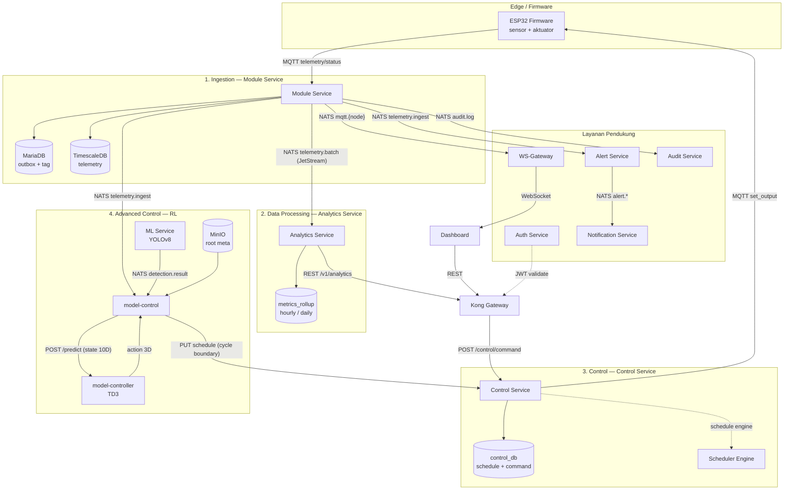

# Modularitas Sisi Server: Arsitektur Microservice untuk Sistem Monitoring Aeroponik

> **Dokumen ini membahas** perancangan dan implementasi sisi server (*backend*) dari sistem monitoring dan kontrol tanaman aeroponik — mulai dari bagaimana data sensor diterima, diolah, hingga bagaimana perintah kontrol dikirimkan kembali ke perangkat, semuanya melalui layanan-layanan mandiri yang dapat tumbuh secara independen.
>
> **Referensi teknis:** [planning.md](file:///home/almuzky/TA/Microservices/docs/planning.md) · [bab3.md](file:///home/almuzky/TA/Microservices/docs/bab3.md) · [adr.md](file:///home/almuzky/TA/Microservices/docs/adr.md) · [guide ta claude.md](file:///home/almuzky/TA/Microservices/docs/guide%20ta%20claude.md)

---

## Alur Berpikir Dokumen Ini

Dokumen ini bercerita mengikuti perjalanan satu paket data dari sensor hinggaaktuator:



Setiap bagian saling terhubung: keluaran Module Service menjadi masukan Analytics Service; keluaran Analytics Service menjadi input dashboard; dan RL Controller menghasilkan jadwal yang disimpan di Control Service. Dokumen ini menjelaskan setiap titik itu — dan bagaimana modularitas teruji pada setiap pertukaran.

---

## 1. Ingestion Data — Module Service

Module Service adalah **gerbang pertama (edge ingress)** dari seluruh sistem. Ia satu-satunya layanan yang berlangganan ke broker MQTT Mosquitto milik firmware ESP32. Tidak ada layanan lain (Analytics, Control, Alert, ML) yang membaca MQTT secara langsung — mereka semua menerima data yang sudah diteruskan Module Service melalui NATS. Pemisahan ini adalah kunci modularitas: firmware hanya mengenal satu kontrak MQTT, dan setiap layanan hilir hanya mengenal kontrak NATS.

Tanggung jawab utama Module Service:

| Fungsi | Mekanisme |
|---|---|
| Menerima telemetri & status firmware | Subscriber MQTT (`smartfarm/<node>/telemetry`, `/status/<node>`) |
| Mendaftarkan node otomatis | Discovery upsert idempoten |
| Menyimpan deret waktu | TimescaleDB `telemetry` hypertable |
| Menerbitkan event ke layanan lain | Transactional Outbox → relay → NATS |

---

### 1.1 Setup: Module → Node → Tag Mapping

Sebelum satu byte pun data disimpan, operator menyelesaikan rantai konfigurasi berikut. Tanpa urutan ini, pesan MQTT masuk tetapi **dibuang** (node belum `paired` atau belum punya tag):

1. **Buat Module** (`POST /v1/modules`) — wadah logis, misal `"Bedeng A"`.
2. **Discovery Node** — saat ESP32 menyala, firmware menembak `smartfarm/discovery`. Module Service melakukan *upsert* idempoten sehingga node muncul tanpa intervensi manual.
3. **Pairing** (`POST /v1/nodes/{id}/pair`) — operator mengikat node ke sebuah module.
4. **Tag Mapping** (`PUT /v1/nodes/{id}/tags`) — operator memetakan *source key* JSON MQTT (mis. `telemetry.temp`) ke nama metrik standar (`temperature`).

```go
// internal/service/service.go — Pair memvalidasi module dulu, lalu mengikat
func (s *ModuleService) Pair(ctx context.Context, nodeID string, req model.PairRequest) (*model.Node, error) {
    if req.ModuleID == "" {
        return nil, ErrModuleNotFound
    }
    exists, err := s.repo.ModuleExists(ctx, req.ModuleID)
    if err != nil {
        return nil, err
    }
    if !exists {
        return nil, ErrModuleNotFound
    }
    n, err := s.repo.Pair(ctx, nodeID, req.ModuleID, req.Name)
    if errors.Is(err, repository.ErrNotFound) {
        return nil, ErrNodeNotFound
    }
    if err != nil {
        return nil, err
    }
    s.invalidateMeta(nodeID) // cache tag mapping direset agar konsisten
    s.publishAudit("node.paired", map[string]string{"node_id": nodeID, "module_id": req.ModuleID})
    return n, nil
}
```

Setelah *pair*, tag mapping di-*save* melalui `SaveNodeTags`. Setiap baris memasangkan `source_key` (nama di payload firmware) ke `tag_name` (nama metrik di database). Ini yang membuat akuisisi sensor **modular**: menambah sensor baru hanya berarti menambah satu baris tag mapping, tanpa mengubah kode ingest sama sekali.

---

### 1.2 Runtime: Alur Pesan Masuk

Setiap 5 detik ESP32 menembak `smartfarm/{node_id}/telemetry`. Subscriber berlangganan seluruh prefix (`smartfarm/#`) dengan satu *handler* tunggal yang merutekan tiap topik:

```go
// internal/mqtt/subscriber.go — satu handler untuk semua topik per-node
func (s *Subscriber) onMessage(_ mqtt.Client, m mqtt.Message) {
    topic := m.Topic()
    payload := m.Payload()

    nodeID, _ := s.nodeIDFromTopic(topic, payload)
    if nodeID != "" && (strings.HasSuffix(topic, "/telemetry") || strings.Contains(topic, "/status/")) {
        s.svc.TouchNode(nodeID)                       // tandai node hidup (di-batch)
        if strings.HasSuffix(topic, "/telemetry") {
            s.svc.PublishLive(nodeID, topic, payload) // teruskan ke live stream dashboard
        }
    }

    switch {
    case strings.HasSuffix(topic, "/discovery"):
        s.onDiscovery(nil, m)
    case strings.Contains(topic, "/status/"):
        s.onStatus(nil, m)
    case strings.HasSuffix(topic, "/telemetry") && nodeID != "":
        s.svc.IngestTelemetry(context.Background(), nodeID, payload)
    }
}
```

Tiga aksi berjalan saat telemetri tiba:
1. `TouchNode(nodeID)` — mencatat node masih hidup (di-batch, bukan langsung `UPDATE`).
2. `PublishLive(...)` — meneruskan payload mentah ke `mqtt.{node_id}` untuk WebSocket dashboard.
3. `IngestTelemetry(...)` — jalur penyimpanan & publikasi utama (dijelaskan di bawah).

#### 1.2.1 IngestTelemetry — inti penyimpanan

`IngestTelemetry` melakukan empat langkah secara berurutan. Keseluruhan fungsi dirancang *lock-free* di hot path berkat cache in-memory untuk tag mapping:

```go
// internal/service/service.go
func (s *ModuleService) IngestTelemetry(ctx context.Context, nodeID string, payload []byte) {
    s.cache.SetLatest(ctx, nodeID, payload, latestTTL) // (1) cache Redis payload mentah (TTL 5 mnt)

    if s.ts == nil {
        return
    }
    var data map[string]interface{}
    if err := json.Unmarshal(payload, &data); err != nil {
        return
    }

    tags, moduleIDStr, err := s.getNodeMeta(ctx, nodeID) // (2) resolusi tag dari cache
    if err != nil {
        log.Printf("[svc] list node tags failed node=%s: %v", nodeID, err)
        return
    }
    var moduleIDPtr *string
    if moduleIDStr != "" {
        moduleIDPtr = &moduleIDStr
    }

    for _, t := range tags {
        if !t.Enabled {
            continue
        }
        val, ok := resolvePath(data, t.SourceKey) // (3a) dot-path ke nilai JSON
        if !ok {
            continue
        }
        f, ok := toFloat(val, t.DataType)         // (3b) koersi ke numerik
        if !ok {
            continue
        }
        if err := s.ts.WriteReading(ctx, nodeID, moduleIDPtr, t.TagName, f, payload); err == nil {
            s.publishTelemetry(nodeID, t.TagName, f)            // (4a) -> outbox telemetry.ingest
            s.batch.add(nodeID, moduleIDStr, t.TagName, f, time.Now().UnixMilli()) // (4b) agregasi batch
        }
    }
}
```

#### 1.2.2 Resolusi Tag — tanpa query per-reading

`getNodeMeta` adalah kunci efisiensi. Tanpa cache, setiap reading memicu dua query MariaDB (`ListNodeTags` + `GetModuleIDByNode`). Dengan cache ber-TTL 2 menit, hot path menyentuh database **hampir nol kali** di antara refresh:

```go
// internal/service/service.go — cache in-memory ber-TTL untuk tag mapping
func (s *ModuleService) getNodeMeta(ctx context.Context, nodeID string) ([]model.NodeTag, string, error) {
    s.metaMu.Lock()
    if e, ok := s.metaCache[nodeID]; ok && time.Now().Before(e.expires) {
        tags, moduleID := e.tags, e.moduleID
        s.metaMu.Unlock()
        return tags, moduleID, nil // HIT: tanpa query DB
    }
    s.metaMu.Unlock()

    tags, err := s.repo.ListNodeTags(ctx, nodeID)   // MISS: baca DB sekali
    if err != nil {
        return nil, "", err
    }
    moduleIDStr := ""
    if mid, err2 := s.repo.GetModuleIDByNode(ctx, nodeID); err2 == nil && mid != nil {
        moduleIDStr = *mid
    }
    s.metaMu.Lock()
    s.metaCache[nodeID] = &nodeMeta{tags: tags, moduleID: moduleIDStr, expires: time.Now().Add(nodeMetaTTL)}
    s.metaMu.Unlock()
    return tags, moduleIDStr, nil
}
```

Setiap tag bisa berupa *dot-path* ke JSON bersarang, misal `"telemetry.modbus.cwt1.temp"`. `resolvePath` menelusuri path tersebut:

```go
// internal/service/service.go — walk dot-path ke nilai bersarang
func resolvePath(data map[string]interface{}, path string) (interface{}, bool) {
    cur := interface{}(data)
    for _, p := range strings.Split(path, ".") {
        m, ok := cur.(map[string]interface{})
        if !ok {
            return nil, false
        }
        v, ok := m[p]
        if !ok {
            return nil, false
        }
        cur = v
    }
    return cur, true
}
```

#### 1.2.3 WriteReading — penyimpanan TimescaleDB

Setiap nilai yang lolos resolusi & koersi ditulis ke hypertable `telemetry` via pool `pgx`. `module_id` boleh `NULL` (node belum di-pair tetap bisa disimpan sebagai raw):

```go
// internal/tsdb/tsdb.go — satu INSERT per metrik
func (s *Store) WriteReading(ctx context.Context, nodeID string, moduleID *string, metric string, value float64, raw json.RawMessage) error {
    if len(raw) == 0 {
        raw = json.RawMessage("{}")
    }
    _, err := s.pool.Exec(ctx,
        `INSERT INTO telemetry (time, node_id, module_id, metric, value, raw)
         VALUES ($1, $2, $3, $4, $5, $6)`,
        time.Now().UTC(), nodeID, moduleID, metric, value, raw,
    )
    if err != nil {
        log.Printf("[tsdb] write reading failed node=%s metric=%s: %v", nodeID, metric, err)
    }
    return err
}
```

#### 1.2.4 Telemetry Batch — `telemetry.batch` untuk Analytics

Menerbitkan tiap reading satu-per-satu ke Analytics akan membanjiri NATS. Sebagai gantinya, Module Service mengagregasi reading per `(node, metric)` dalam jendela 1 menit di memory, lalu menerbitkan **satu** pesan `telemetry.batch`:

```go
// internal/service/batch.go — akumulasi min/max/avg/last per jendela
func (b *telemetryBatcher) add(nodeID, moduleID, metric string, value float64, ts int64) {
    b.mu.Lock()
    defer b.mu.Unlock()
    key := nodeID + "\x00" + metric
    e, ok := b.entries[key]
    if !ok {
        e = &batchEntry{NodeID: nodeID, ModuleID: moduleID, Metric: metric, Min: value, Max: value, FirstTS: ts}
        b.entries[key] = e
    }
    e.Count++
    e.Sum += value
    if value < e.Min { e.Min = value }
    if value > e.Max { e.Max = value }
    e.Last = value
    e.LastTS = ts
}
```

`StartBatchPublisher` men-flush jendela tiap 1 menit dan menerbitkan melalui **JetStream** (bukan core NATS) agar batch bisa di-replay jika Analytics mati:

```go
// internal/service/batch.go — flush + publish via JetStream (durable)
func (s *ModuleService) flushAndPublish(interval time.Duration) {
    entries := s.batch.flush()
    if len(entries) == 0 {
        return
    }
    rows := make([]map[string]interface{}, 0, len(entries))
    for _, e := range entries {
        avg := 0.0
        if e.Count > 0 { avg = e.Sum / float64(e.Count) }
        rows = append(rows, map[string]interface{}{
            "node_id": e.NodeID, "module_id": e.ModuleID, "metric": e.Metric,
            "count": e.Count, "sum": e.Sum, "min": e.Min, "max": e.Max,
            "avg": avg, "last": e.Last, "first_ts": e.FirstTS, "last_ts": e.LastTS,
        })
    }
    payload, _ := json.Marshal(map[string]interface{}{
        "window": interval.String(), "rows": rows, "row_count": len(rows), "ts": time.Now().UnixMilli(),
    })
    if s.js != nil {
        s.js.Publish("telemetry.batch", payload) // JetStream → replay-able
        return
    }
    if s.nats != nil {
        s.nats.Publish("telemetry.batch", payload) // fallback core NATS
    }
}
```

Format pesan `telemetry.batch` (satu baris per `(node, metric)`):

```json
{
  "window": "1m0s",
  "rows": [
    { "node_id": "esp32-001", "module_id": "mod-a", "metric": "temperature",
      "count": 60, "sum": 1590.0, "min": 24.5, "max": 27.0, "avg": 26.5,
      "last": 26.8, "first_ts": 1689999000000, "last_ts": 1690000000000 }
  ],
  "row_count": 1, "ts": 1690000000000
}
```

#### 1.2.5 Transactional Outbox — jaminan "tidak ada event hilang"

Setiap event (`telemetry.ingest`, `mqtt.{node}`, `audit.log`) **tidak** diterbitkan langsung ke NATS dari dalam `IngestTelemetry`. Ia ditulis ke tabel `outbox` MariaDB dalam transaksi tersendiri. Sebuah *relay worker* terpisah mem-poll tabel itu tiap 2 detik dan menerbitkannya. Pola ini (ADR-007) menjamin **at-least-once delivery**: jika NATS mati, baris tetap ada dan dikirim saat koneksi pulih.

```go
// internal/service/service.go — tulis outbox, BUKAN publish langsung
func (s *ModuleService) publishTelemetry(nodeID, metric string, value float64) {
    envelope := fmt.Sprintf(`{"node_id":%q,"metric":%q,"value":%v,"ts":%d}`,
        nodeID, metric, value, time.Now().UnixMilli())
    s.enqueueOutbox("telemetry.ingest", envelope)
}

func (s *ModuleService) enqueueOutbox(subject, payload string) {
    msgID := outbox.NewMsgID()
    if err := s.repo.Transact(context.Background(), func(tx *sql.Tx) error {
        return s.repo.InsertOutboxTx(context.Background(), tx, subject, payload, msgID)
    }); err != nil {
        log.Printf("[outbox] enqueue failed subject=%s: %v", subject, err)
    }
}
```

Relay menerbitkan tiap baris dengan header `Nats-Msg-Id` (deduplikasi sisi publisher) lalu menandainya `sent`:

```go
// internal/outbox/outbox.go — relay: drain outbox → publish → mark sent
func (r *Relay) drain(ctx context.Context) {
    if r.nc == nil {
        return
    }
    rows, err := r.repo.ListUnsentOutbox(ctx, r.batch)
    if err != nil || len(rows) == 0 {
        return
    }
    for _, row := range rows {
        if err := r.publish(ctx, row); err != nil {
            return // sisakan baris unsent → retry poll berikutnya
        }
        if err := r.repo.MarkOutboxSent(ctx, row.ID); err != nil {
            return
        }
    }
}

func (r *Relay) publish(ctx context.Context, row repository.OutboxRow) error {
    enriched, _ := withMsgID([]byte(row.Payload), row.MsgID)
    return r.nc.PublishMsg(&nats.Msg{
        Subject: row.Subject,
        Data:    enriched,
        Header:  nats.Header{r.header: []string{row.MsgID}}, // "Nats-Msg-Id"
    })
}
```

Ringkasan subject yang diterbitkan Module Service:

| Subject NATS | Konsumen | Durabilitas |
|---|---|---|
| `telemetry.ingest` | Alert, WS-Gateway, model-control | Core NATS (per-reading) |
| `telemetry.batch` | Analytics Service | JetStream (per-menit, replay-able) |
| `mqtt.{node_id}` | WS-Gateway (live stream) | Core NATS |
| `audit.log` | Audit Service | Core NATS |

---

### 1.3 Status Lifecycle — tanpa membanjiri database

Node mengirim telemetri tiap 5 detik. Jika setiap pesan langsung menulis `last_seen_at` ke MariaDB, beban UPDATE akan sangat tinggi. Module Service menangani ini dengan dua goroutine *batched*:

- **TouchFlusher** — `TouchNode` hanya menambah nodeID ke map `touchPending`; flusher menulis `UPDATE last_seen_at` untuk semua node sekaligus tiap 30 detik.
- **OfflineSweeper** — tiap 30 detik menandai node dengan `last_seen_at > 3 menit` sebagai `offline`.

```go
// internal/service/service.go — TouchNode cuma menandai, flusher yang menulis
func (s *ModuleService) TouchNode(nodeID string) {
    if nodeID == "" {
        return
    }
    s.touchMu.Lock()
    s.touchPending[nodeID] = struct{}{}
    s.touchMu.Unlock()
}

func (s *ModuleService) flushTouch() {
    s.touchMu.Lock()
    if len(s.touchPending) == 0 {
        s.touchMu.Unlock()
        return
    }
    nodes := make([]string, 0, len(s.touchPending))
    for id := range s.touchPending {
        nodes = append(nodes, id)
    }
    s.touchPending = make(map[string]struct{})
    s.touchMu.Unlock()

    ctx, cancel := context.WithTimeout(context.Background(), 10*time.Second)
    defer cancel()
    for _, id := range nodes {
        if err := s.repo.TouchNode(ctx, id); err != nil { // satu UPDATE per node
            log.Printf("[svc] batched touch node %s failed: %v", id, err)
        }
    }
}
```

Hasilnya: node yang mengirim telemetri tiap 5 detik hanya memicu **satu** `UPDATE` setiap 30 detik — penghematan 6× tulisan database per node.

---

## 2. Data Processing — Analytics Service

Analytics Service mengubah telemetri mentah (yang dikirim Module Service sebagai `telemetry.batch`) menjadi statistik yang bisa di-query dashboard. Ia **tidak pernah** memanggil Module Service secara HTTP — hanya berlangganan NATS. Ini memperkuat modularitas: Analytics memiliki database sendiri (`timescaledb-analytics`); jika Module Service di-redeploy, Analytics tetap jalan selama kontrak `telemetry.batch` tak berubah.

Arsitektur layanan ini tipis secara bisnis karena seluruh beban ada di TimescaleDB:

| Komponen | Peran |
|---|---|
| `nats.SubscribeBatch` | Consumer JetStream durable untuk `telemetry.batch` |
| `service.Service` | Teruskan (proxy) ingest & query ke `Store` |
| `tsdb.Store` | Upsert rollup + query agregat (hypertable + continuous aggregate) |

---

### 2.1 Konsumsi JetStream Durable — replayable & at-least-once

Analytics berlangganan `telemetry.batch` via **JetStream Durable Consumer** dalam *queue group* `analytics`. Karena stream-nya `FileStorage` (retensi 24 jam), bila Analytics mati tepat di tik menit ke-1, jendela itu **di-replay** saat Analytics hidup kembali — tidak hilang. Handler hanya meng-`Ack` setelah upsert sukses, sehingga ingest gagal akan di-redeliver:

```go
// internal/nats/subscriber.go — durable consumer + ack setelah sukses
func SubscribeBatch(nc *nats.Conn, svc *service.Service) error {
    js, err := nc.JetStream()
    // ...
    sub, err := js.QueueSubscribe(batchSubject, batchQueueGroup,
        func(m *nats.Msg) {
            if m.Data == nil { _ = m.Ack(); return }
            var bm model.BatchMessage
            if err := json.Unmarshal(m.Data, &bm); err != nil {
                _ = m.Ack() // poison pill: payload rusak tdk di-redeliver
                return
            }
            if len(bm.Rows) == 0 { _ = m.Ack(); return }
            if err := svc.IngestBatch(context.Background(), bm.Rows); err != nil {
                return // no ack -> JetStream redelivers
            }
            _ = m.Ack()
        },
        nats.Durable(batchDurable),   // "analytics-batch"
        nats.DeliverAll(),
        nats.ManualAck(),
        nats.AckExplicit(),
    )
    // ...
}
```

Stream dibuat idempoten di awal supaya urutan start layanan tak masalah:

```go
// internal/nats/subscriber.go — idempotent stream creation
func ensureBatchStream(js nats.JetStreamContext) error {
    _, err := js.AddStream(&nats.StreamConfig{
        Name:      batchStream,     // TELEMETRY_BATCH
        Subjects:  []string{batchSubject},
        Retention: nats.LimitsPolicy,
        Storage:   nats.FileStorage,
        MaxAge:    24 * time.Hour,
        MaxMsgs:   1_000_000,
    })
    return err
}
```

---

### 2.2 IngestBatch → UpsertRollup (idempoten)

Service meneruskan tiap baris ke `store.UpsertRollup`. Satu baris gagal **tidak** membatalkan sisa batch (log lalu lanjut):

```go
// internal/service/service.go
func (s *Service) IngestBatch(ctx context.Context, rows []model.BatchRow) error {
    for i := range rows {
        if err := s.store.UpsertRollup(ctx, rows[i]); err != nil {
            log.Printf("[svc] ingest rollup failed node=%s metric=%s: %v", rows[i].NodeID, rows[i].Metric, err)
        }
    }
    return nil
}
```

`UpsertRollup` menyejajarkan timestamp ke awal menit (UTC) berdasarkan `last_ts`, mengklem jam perangkat yang meleset ke depan ( agar telemetri terbaru tak tersembunyi di window query pendek), dan menulis secara **idempoten** via `ON CONFLICT` — sehingga redelivery NATS tidak menduplikasi data:

```go
// internal/tsdb/tsdb.go — idempotent upsert ke metrics_rollup
func (s *Store) UpsertRollup(ctx context.Context, row model.BatchRow) error {
    now := time.Now().UTC()
    bucket := now.Truncate(time.Minute)
    if row.LastTS != 0 {
        bucket = time.UnixMilli(row.LastTS).UTC().Truncate(time.Minute)
        if bucket.After(now.Add(5 * time.Minute)) { // klem jam perangkat meleset
            bucket = now.Truncate(time.Minute)
        }
    }
    // ...
    _, err := s.pool.Exec(ctx,
        `INSERT INTO metrics_rollup
           (time, node_id, module_id, metric, count, sum, min, max, avg, last, first_ts, last_ts)
         VALUES ($1,$2,$3,$4,$5,$6,$7,$8,$9,$10,$11,$12)
         ON CONFLICT (time, node_id, metric) DO UPDATE SET
           count = EXCLUDED.count, sum = EXCLUDED.sum,
           min = EXCLUDED.min, max = EXCLUDED.max, avg = EXCLUDED.avg,
           last = EXCLUDED.last, first_ts = EXCLUDED.first_ts, last_ts = EXCLUDED.last_ts`,
        bucket, row.NodeID, moduleID, row.Metric, row.Count,
        row.Sum, row.Min, row.Max, row.Avg, row.Last, row.FirstTS, row.LastTS,
    )
    return err
}
```

---

### 2.3 Agregasi Bertingkat (Continuous Aggregate)

`metrics_rollup` adalah tabel 1-menit (retensi 30 hari). Di atasnya, TimescaleDB **continuous aggregate** menghitung otomatis:

| Tabel | Resolusi | Retensi | Sumber query |
|---|---|---|---|
| `metrics_rollup` | 1 menit | 30 hari | window ≤ 1 jam |
| `metrics_hourly` | 1 jam | 1 tahun | 1 jam < window ≤ 1 hari |
| `metrics_daily` | 1 hari | 10 tahun | window > 1 hari |

Pemilihan tabel sumber otomatis lewat `sourceForDuration` agar payload tetap kecil:

```go
// internal/tsdb/tsdb.go — pilih materialized view sesuai durasi
func sourceForDuration(d time.Duration) string {
    switch {
    case d <= time.Hour:
        return "metrics_rollup"
    case d <= 24*time.Hour:
        return "metrics_hourly"
    default:
        return "metrics_daily"
    }
}
```

---

### 2.4 Query ke Dashboard (auto-resolution + fallback)

Lapisan `Store` (interface) dipisah dari service agar bisa diuji dengan fake in-memory. Service murni meneruskan:

```go
// internal/service/service.go — thin proxy ke Store
type Store interface {
    UpsertRollup(ctx context.Context, row model.BatchRow) error
    QuerySeriesMulti(ctx, nodeIDs, metrics []string, from, to time.Time, interval string, discreteSet map[string]bool) (map[string]map[string][]model.SeriesPoint, error)
    QuerySummary(ctx, nodeID, metric string, from, to time.Time) (*model.SummaryResponse, error)
    ListNodes(ctx context.Context) ([]model.NodeMetric, error)
    ExportSeries(ctx, nodeID, metric string, from, to time.Time, resolution string) ([]model.ExportRow, error)
}
```

`QuerySeriesMulti` mengambil banyak (node, metrik) dalam satu round-trip dan **selalu menghasilkan chart**: bila tak ada data di window, window dilebarkan progresif (×6, ×24, ×7d, ×30d); bila tetap kosong (node nonaktif lama), diambil bucket terbaru via `queryLatest` agar node tetap menampilkan telemetri terakhir, bukan chart kosong:

```go
// internal/tsdb/tsdb.go — fallback bertingkat agar dashboard tak pernah blank
func (s *Store) QuerySeriesMulti(ctx context.Context, nodeIDs, metrics []string, from, to time.Time, interval string, discreteSet map[string]bool) (map[string]map[string][]model.SeriesPoint, error) {
    // ...
    for _, n := range nodeIDs {
        for _, m := range metrics {
            pts, err := s.queryRange(ctx, n, m, from, to, base, discreteSet[m])
            // ...
            if len(pts) == 0 {
                for _, mult := range []time.Duration{6, 24, 24 * 7, 24 * 30} {
                    wPts, _ := s.queryRange(ctx, n, m, to.Add(-base*mult), to, base*mult, discreteSet[m])
                    if len(wPts) > 0 { pts = wPts; break }
                }
            }
            if len(pts) == 0 {
                if latest, lErr := s.queryLatest(ctx, n, m, discreteSet[m], 120); lErr == nil {
                    pts = latest // last-resort: telemetry terakhir node
                }
            }
            perNode[m] = pts
        }
        out[n] = perNode
    }
    return out, nil
}
```

Metrik digital (0/1, misal status valve) dipertahankan di resolusi 1-menit via `discreteStep` agar transisi on/off tetap terlihat (tidak dirata-rata). `QuerySummary` memakai `COALESCE` + `last()` dan mengembalikan ringkasan kosong (bukan 500) bila tak ada data, sehingga chart render bersih. `ExportSeries` membaca `count/sum/min/max/avg/last` penuh pada resolusi `raw`/`hour`/`day` untuk kebutuhan CSV penelitian.

Dashboard memanggil endpoint REST Analytics via Kong:

| Endpoint | Fungsi |
|---|---|
| `GET /v1/analytics/metrics` | Time-series multi-node/metrik, auto-resolution + fallback |
| `GET /v1/analytics/summary` | Ringkasan statistik (min, max, avg, last) satu metrik |
| `GET /v1/analytics/nodes` | Daftar node + metrik tersedia (`ListNodes`) |
| `GET /v1/analytics/export` | CSV export penelitian (`ExportSeries`) |

Kunci modularitas: Analytics berdiri sendiri di database `timescaledb-analytics`, hanya terikat pada kontrak pesan `telemetry.batch` dari Module Service.

---

## 3. Control Management — Control Service

Control Service adalah **bidang kontrol (control plane)**. Ia menerima perintah dari dashboard (manual) atau dari penjadwal internal, menerjemahkannya menjadi pesan MQTT `set_output`, lalu melacak seluruh siklus hidup perintah hingga firmware membalas konfirmasi (ACK). Firmware **hanya** pernah menerima `set_output` — seluruh logika otomatis (interval, jadwal, threshold, ramp, window-pulse) dieksekusi di sisi server, bukan di ESP32. Ini membuat kontrol terpusat dan mudah diuji.

| Komponen | Peran |
|---|---|
| `service.ControlService` | Penerima perintah, arbitration mode, dispatch, tracking status |
| `scheduler.Engine` | Jalankan jadwal aktif sebagai goroutine independen |
| `mqtt.Client` | Publish `set_output` QoS 1 + subscribe `/confirm` (ACK) & `/telemetry` |

---

### 3.1 Sumber Perintah

Perintah masuk dari dua sumber, keduanya berakhir di fungsi `dispatch` yang sama:

| Sumber | Masuk via | Contoh |
|---|---|---|
| Dashboard (manual) | REST `POST /v1/control/command` → `HandleManualCommand` | Operator nyalakan pompa |
| Scheduler internal | Goroutine `scheduler.Engine` → `Dispatch` | Jadwal otomatis ON/OFF |

Sebelum meneruskan, Control Service memverifikasi node terdaftar di Module Service (via `ActuatorSource` = tag-mapping Module Service) dan melakukan *mode arbitration*.

---

### 3.2 Mode Arbitration (MANUAL / AUTO / EMERGENCY)

Tiap node punya mode kontrol. `HandleManualCommand` menolak perintah manual bila node berada di `AUTO` (jadwal yang memegang output) atau `EMERGENCY` (semua output dipaksa OFF), kecuali `Bypass=true` (diperbolehkan bagi layanan otomasi seperti RL):

```go
// internal/service/service.go — arbitration sebelum eksekusi
func (s *ControlService) HandleManualCommand(ctx context.Context, req model.CommandRequest, issuedBy string, src ActuatorSource) ([]model.Command, error) {
    if req.NodeID == "" {
        return nil, ErrNodeRequired
    }
    nodeMode := s.GetNodeMode(ctx, req.NodeID)
    if req.Type != model.TypeEmergencyStop && !req.Bypass {
        if nodeMode == model.ModeEmergency {
            return nil, ErrNodeEmergency
        }
        if nodeMode == model.ModeAuto {
            return nil, ErrNodeAutoMode
        }
    }
    // ... switch req.Type -> dispatch(...)
}
```

Mode diubah via `SetNodeMode`/`SetMode`. `EMERGENCY` menyimpan mode sebelumnya (`prevMode`) agar `ResumeNode` bisa mengembalikannya — scheduler dan override manual kembali normal:

```go
// internal/service/service.go — default AUTO; EMERGENCY simpan mode lama
func (s *ControlService) GetNodeMode(ctx context.Context, nodeID string) string {
    m, err := s.repo.GetNodeMode(ctx, nodeID)
    if err != nil || m == "" {
        return model.ModeAuto // default
    }
    return m
}
```

| Mode | Perilaku |
|---|---|
| `MANUAL` | Hanya perintah manual yang dieksekusi |
| `AUTO` | Scheduler aktif; perintah manual ditolak (kecuali `bypass: true`) |
| `EMERGENCY` | Semua output dipaksa OFF; `ResumeNode` mengembalikan mode sebelumnya |

---

### 3.3 Dispatch ke MQTT

Fungsi `dispatch` (low-level) membuat baris perintah, mem-publish `set_output` QoS 1, lalu memperbarui status `pending → sent → failed`:

```go
// internal/service/service.go — inti dispatch + tracking status
func (s *ControlService) dispatch(ctx context.Context, nodeID, target, tagName string, value int, controlType, source string, scheduleID *string, issuedBy string) (*model.Command, error) {
    cmd := &model.Command{
        ID: uuid.New().String(), ReqID: uuid.New().String(),
        NodeID: nodeID, Target: target, TagName: tagName,
        ControlType: controlType, Value: value, Source: source,
        ScheduleID: scheduleID, Status: model.StatusPending, IssuedBy: issuedBy,
    }
    if err := s.repo.CreateCommand(ctx, cmd); err != nil {
        return nil, err
    }
    if s.pub == nil || !s.pub.IsConnected() {
        _ = s.repo.UpdateCommandStatus(ctx, cmd.ID, model.StatusFailed) // broker mati
        return cmd, ErrMQTTUnavailable
    }
    if err := s.pub.PublishSetOutput(nodeID, target, value, cmd.ReqID); err != nil {
        _ = s.repo.UpdateCommandStatus(ctx, cmd.ID, model.StatusFailed)
        return cmd, err
    }
    _ = s.repo.UpdateCommandStatus(ctx, cmd.ID, model.StatusSent)
    s.setState(nodeID, target, value)
    return cmd, nil
}
```

Di level MQTT, `PublishSetOutput` mengirim JSON QoS 1 ke `smartfarm/actuator/{node_id}`. `req_id` adalah UUID yang nanti dibalas firmware pada ACK:

```go
// internal/mqtt/mqtt.go — publish set_output QoS 1
func (c *Client) PublishSetOutput(nodeID, target string, value int, reqID string) error {
    if !c.IsConnected() {
        return fmt.Errorf("mqtt not connected")
    }
    topic := c.topicPrefix + "/actuator/" + nodeID
    payload := fmt.Sprintf(`{"action":"set_output","target":%q,"value":%d,"req_id":%q}`,
        target, value, reqID)
    tok := c.client.Publish(topic, 1, false, payload)
    tok.Wait()
    return tok.Error()
}
```

---

### 3.4 Siklus Hidup Perintah (ACK Correlation)

Firmware membalas ke `smartfarm/{node_id}/confirm` membawa `req_id` yang sama. `OnConfirm` mengaitkannya kembali ke baris perintah lalu menandai `acked`:

```go
// internal/service/service.go — korelasi ACK via req_id
func (s *ControlService) OnConfirm(nodeID, reqID, target string, value int) {
    if reqID == "" {
        return
    }
    ctx, cancel := context.WithTimeout(context.Background(), 5*time.Second)
    defer cancel()
    if ok, _ := s.repo.MarkAckedByReqID(ctx, reqID); ok {
        s.publishAudit("control.command.acked", map[string]string{"node_id": nodeID, "target": target, "req_id": reqID})
    }
}
```

| Status | Makna |
|---|---|
| `pending` | Baris dibuat, akan dipublikasikan ke MQTT |
| `sent` | MQTT publish berhasil, tunggu ACK firmware |
| `acked` | `/confirm` diterima dan dikorelasikan via `req_id` |
| `timeout` | Tak ada ACK dalam 8 detik (diubah oleh sweep) |
| `failed` | MQTT broker tidak tersedia |

Goroutine `TimeoutStale` berjalan berkala memindahkan perintah `sent` tua ke `timeout`, mencegah status "limbo" bila firmware offline:

```go
// internal/service/service.go — sweep perintah tak ter-ACK
func (s *ControlService) TimeoutStale(ctx context.Context, olderThan time.Duration) {
    n, err := s.repo.TimeoutStaleCommands(ctx, time.Now().Add(-olderThan))
    if err != nil { log.Printf("[svc] timeout sweep failed: %v", err); return }
    if n > 0 { log.Printf("[svc] marked %d command(s) as timeout", n) }
}
```

---

### 3.5 Jadwal Otomatis — Scheduler Engine

Seluruh kontrol otomatis dijalankan oleh `scheduler.Engine` sebagai goroutine per-jadwal. `reconcile` memuat jadwal aktif tiap 15 detik (atau segera via `NotifyScheduleChanged`), memulai/menghentikan *runner* sesuai perubahan definisi:

```go
// internal/scheduler/scheduler.go — reconcile: start/stop runner per jadwal
func (e *Engine) reconcile(ctx context.Context) {
    list, err := e.disp.EnabledSchedules(ctx)
    // ...
    seen := make(map[string]bool, len(list))
    for _, sc := range list {
        seen[sc.ID] = true
        sig := sc.Type + "|" + sc.OutputName + "|" + string(sc.Params)
        if r, ok := e.runners[sc.ID]; ok {
            if r.sig == sig { continue } // tak berubah
            r.cancel()                   // definisi berubah → restart
            delete(e.runners, sc.ID)
        }
        rctx, cancel := context.WithCancel(ctx)
        e.runners[sc.ID] = &runner{cancel: cancel, sig: sig}
        go e.runSchedule(rctx, sc)
    }
    for id, r := range e.runners { // jadwal di-disable/dihapus
        if !seen[id] { r.cancel(); delete(e.runners, id) }
    }
}
```

`runSchedule` memilih implementasi berdasarkan tipe. Contoh `interval` (ON `on_sec`/OFF `off_sec` berulang) dan `threshold` (histeresis berbasis sensor):

```go
// internal/scheduler/scheduler.go — interval: siklus ON/OFF berulang
func (e *Engine) runInterval(ctx context.Context, sc model.Schedule) {
    var p model.IntervalParams
    json.Unmarshal(sc.Params, &p)
    if p.OnSec <= 0 || p.OffSec <= 0 { return }
    valOn, valOff := p.ValueOn, p.ValueOff
    if valOn == 0 { valOn = 1 }
    for {
        e.dispatch(ctx, sc, valOn)
        if !sleep(ctx, time.Duration(p.OnSec)*time.Second) { return }
        e.dispatch(ctx, sc, valOff)
        if !sleep(ctx, time.Duration(p.OffSec)*time.Second) { return }
    }
}
```

```go
// internal/scheduler/scheduler.go — threshold: histeresis nilai sensor
func (e *Engine) runThreshold(ctx context.Context, sc model.Schedule) {
    var p model.ThresholdParams
    json.Unmarshal(sc.Params, &p)
    t := time.NewTicker(5 * time.Second)
    state := p.ValueOff
    e.dispatch(ctx, sc, state)
    for {
        select {
        case <-ctx.Done():
            return
        case <-t.C:
            v, ok := e.disp.SensorValue(sc.NodeID, p.SourceKey)
            if !ok { continue }
            if state == p.ValueOff && v >= p.ThresholdHigh {
                state = p.ValueOn; e.dispatch(ctx, sc, state)
            } else if state == p.ValueOn && v <= p.ThresholdLow {
                state = p.ValueOff; e.dispatch(ctx, sc, state)
            }
        }
    }
}
```

Setiap `dispatch` diamankan oleh penjaga mode: bila node keluar dari `AUTO` (ke `MANUAL`/`EMERGENCY`), tick yang sedang berjalan segera dilewati tanpa menyalakan output kembali — menutup celah balapan dengan reconcile berikutnya:

```go
// internal/scheduler/scheduler.go — guard: hanya dispatch saat node AUTO
func (e *Engine) dispatch(ctx context.Context, sc model.Schedule, value int) {
    bg, cancel := context.WithTimeout(context.Background(), 10*time.Second)
    defer cancel()
    if m := e.disp.GetNodeMode(bg, sc.NodeID); m == model.ModeManual || m == model.ModeEmergency {
        return
    }
    id := sc.ID
    e.disp.Dispatch(bg, sc.NodeID, sc.OutputName, sc.TagName, value, sc.Type, model.SourceSchedule, &id)
}
```

Enam tipe jadwal yang didukung engine:

| Tipe | Trigger |
|---|---|
| `interval` | Siklus ON/OFF berulang (`on_sec`/`off_sec`) |
| `schedule` | Waktu hari tertentu (`on_at`–`off_at`, hari) |
| `threshold` | Nilai sensor + histeresis (`threshold_high`/`threshold_low`) |
| `duration` | ON selama `total_sec` sekali, lalu OFF (one-shot) |
| `ramp` | Linear PWM `from → to` selama `duration_sec` |
| `window_pulse` | Pulse ON/OFF hanya di dalam jendela waktu (`on_at`–`off_at`) |

Mutasi jadwal (create/enable/disable/update/delete) memicu `notifyScheduler()` → `NotifyScheduleChanged()` agar berlaku **seketika**, tanpa menunggu tick 15 detik berikutnya:

```go
// internal/service/service.go — trigger reconcile segera
func (s *ControlService) notifyScheduler() {
    if s.sched != nil {
        s.sched.NotifyScheduleChanged()
    }
}
```

Kunci modularitas: Control Service berdiri sendiri di database `control_db` dan hanya berbicara ke firmware lewat MQTT. Layanan eksternal (termasuk RL di §4) mengubah kontrol murni lewat endpoint standar yang sama — tanpa kode khusus.

---

## 4. Advanced Control with RL

Model kontrol Reinforcement Learning (TD3) menggantikan jadwal statis dengan penyesuaian adaptif berdasarkan kondisi tanaman nyata. Integrasi ini merupakan bukti modularitas: dua layanan Python ditambahkan tanpa mengubah satu baris pun kode pada Module Service atau Control Service yang sudah berjalan.

Alur keseluruhan terdiri dari **dua tahap**: (1) *Fase Pelatihan* — model dilatih secara offline di dalam simulator hingga "tahu" cara mengontrol, lalu (2) *Fase Layanan* — model yang sudah jadi ditempelkan sebagai dua microservice yang memperbarui jadwal Control Service saat runtime.

---

### 4.1 Konsep Umum: AI sebagai "Otak" Penjadwal

Reinforcement Learning (RL) adalah cara melatih AI lewat **percobaan dan kesalahan**, persis seperti manusia belajar. Ada tiga pemain:

- **Agent (kebijakan TD3)** — si "otak" yang mengambil keputusan: kapan menyemprot, berapa lama, dan apakah valve dibuka.
- **Environment (simulator aeroponik)** — "dunia" tanaman yang meniru fisika nyata: suhu, kelembapan, nutrisi, dan pertumbuhan akar.
- **Reward** — "skor" tiap keputusan: pertumbuhan akar naik → skor positif; tanaman layu/mati → skor negatif.

Agent mencoba banyak kombinasi, melihat skor yang didapat, lalu menyempurnakan keputusannya. Setelah jutaan percobaan, ia menemukan pola penyemprotan yang paling menyehatkan tanaman. Model jadi inilah yang nanti dijalankan sebagai layanan (§4.5–§4.6), **bukan** simulatornya.

---

### 4.2 Fase Pelatihan (Training Offline)

Semua pelatihan berjalan di folder `control-model-training/`. Tidak ada hardware ESP32 yang terlibat — cukup simulator + model, sehingga pelatihan bisa diulang berulang kali secara murah.

#### 4.2.1 Environment Simulator (Digital Twin)

`AeroponicSimulatorEnv` adalah **kembaran digital** sistem aeroponik: ia menghitung dinamika fisik tiap 1 menit (`dt = 60 s`). Satu episode = 1 hari (`episode_duration = 86400 s`), dan pertumbuhan akar hanya diukur tiap 3 jam (capture) agar tidak terlalu cepat. Simulator juga menyuntikkan **noise sensor & aktuator** serta **cuaca acak** (gelombang panas, kemarau, badai) agar model kuat terhadap kondisi nyata:

```python
# control-model-training/aeroponic_simulator.py
class AeroponicSimulatorEnv:
    def __init__(self):
        self.dt = 60.0               # 1 menit per substep
        self.state = [0.0] * 10      # vektor state 10D
        self.episode_duration = 86400.0   # 24 jam per episode training
        # ...dinamika T_in, H_in, EC, pH, T_nut, T_root, L_root...
    def step(self, action):
        # action = [D_mist, interval_sec, A_valve]
        # jalankan fase ON lalu OFF, update dinamika, hitung reward
        return obs_state, reward, terminated, truncated, info
```

#### 4.2.2 State Space (10D) — "Apa yang dilihat AI"

Agent melihat **10 angka** tiap langkah (observasi). Ini persis vektor yang nanti dirakit `model-control` saat produksi (§4.4):

| Indeks | Variabel | Arti | Sumber (saat produksi) |
|---|---|---|---|
| 0 | `L_root` (root length) | Panjang akar | MinIO metadata `root_length_cm` |
| 1 | `U_status` (alive) | Kondisi hidup tanaman | MinIO metadata `condition` |
| 2 | `T_in` | Suhu dalam grow box | Telemetri |
| 3 | `H_in` | Kelembapan dalam | Telemetri |
| 4 | `T_out` | Suhu luar/ghouse | Telemetri |
| 5 | `H_out` | Kelembapan luar | Telemetri |
| 6 | `EC` | Konsentrasi nutrisi | Telemetri |
| 7 | `pH` | Keasaman nutrisi | Telemetri |
| 8 | `T_nut` | Suhu nutrisi | Telemetri |
| 9 | `I_day` | Indeks siang/malam (0/1) | Dihitung lokal |

```python
# control-model-training/aeroponic_simulator.py — definisi state 10D
# [L_root, U_status, T_in, H_in, T_out, H_out, EC, pH, T_nut, I_day]
```

#### 4.2.3 Action Space (3D) — "Apa yang bisa dilakukan AI"

Agent mengeluarkan **3 angka** yang menentukan siklus penyemprotan. Di training, aksi dinormalisasi ke `[-1, 1]` lalu dipetakan ke rentang fisik realistis (2–10 menit):

| Action | Rentang fisik | Arti |
|---|---|---|
| `D_mist` | 120–600 dtk (2–10 mnt ON) | Durasi semprotan (misting) nyala |
| `interval_sec` | 120–600 dtk (2–10 mnt OFF) | Jeda antar semprotan |
| `A_valve` | 0 atau 1 | Buka/tutup valve dasar (tambahan O₂/kelembapan) |

```python
# control-model-training/train_td3.py — pemetaan aksi normalized → fisik
def _map_action(self, action):
    a_01 = (action + 1.0) / 2.0
    D_mist   = 120.0 + a_01[0] * (600.0 - 120.0)
    interval = 120.0 + a_01[1] * (600.0 - 120.0)
    A_valve  = 1.0 if action[2] >= 0.0 else 0.0
    return [D_mist, interval, A_valve]
```

#### 4.2.4 Fungsi Reward — "Skor Keputusan"

Reward dirancang dengan **prioritas**: Pertumbuhan > Stabilitas > Efisiensi > Eksplorasi (sesuai prinsip reward proyek). Model hanya menang jika tanaman tumbuh *dan* stabil *dan* hemat. Komponennya:

| Komponen | Tanda | Arti |
|---|---|---|
| `R_growth` (w=100) | + | Pertumbuhan akar aktual (faktor pembatas H_in, T_in, O₂) |
| `R_state` | +/− | Penalti/deviasi pH (target 6.0), EC (1.6), H_in (≥85%), T_in, T_root, O₂ |
| `R_efficiency` | + | Bonus bila menyemprot efisien (D_mist kecil, interval besar) |
| `C_resource` | − | Biaya valve/listrik saat menyala |
| `P_env` | − | Deviasi pH/EC/H_in dari zona sehat |
| `P_hypoxia` | − | Kekurangan O₂ (terlalu lama menyemprot terus) |
| `P_shrink` / `P_death` | − | Akar menyusut / tanaman mati |
| Survival bonuses | + | Hadiah bertahan 3j/6j/12j/18j + per 30 menit |

```python
# control-model-training/aeroponic_simulator.py — total reward
# R_total = R_growth + R_state + R_efficiency + ...
#           - C_resource - P_env - P_hypoxia - P_shrink - P_death
```

Batas `terminated` jika pH < 4.5 / > 8.5 atau EC < 0.5 / > 3.0 (tanaman "mati"); episode selesai (`truncated`) setelah 24 jam.

#### 4.2.5 Model Algorithm: TD3 (bukan PPO)

Model menggunakan **TD3 (Twin Delayed DDPG)**, dipilih menggantikan PPO karena cocok untuk kontrol deterministik (nyalakan/matikan valve):

- **Off-policy + Replay Buffer** — pengalaman lama bisa dipakai ulang (efisien di lingkungan deterministik).
- **Twin Critics** — ambil `min(Q1, Q2)` untuk mengurangi *overestimation bias*.
- **Delayed Policy Update** (`policy_delay=2`) — actor diperbarui lebih jarang dari critic (stabil).
- **Target Policy Smoothing** — menambah noise ke aksi target agar pembelajaran halus.
- **Deterministic Policy + Action Noise** — cocok untuk kontrol ambang (threshold) valve.

```python
# control-model-training/train_td3.py — TD3 (Stable-Baselines3), device=cpu
model = TD3(
    policy='MlpPolicy', env=vec_norm,
    learning_rate=lambda r: 1e-4 * r,     # decay linear
    buffer_size=2_000_000, learning_starts=100_000,
    batch_size=256, tau=0.005, gamma=0.995,
    policy_delay=2, target_policy_noise=0.2, target_noise_clip=0.3,
    device='cpu',
)
```

#### 4.2.6 Alur Proses Training

Satu siklus pelatihan (`train_td3.py`):

1. **Bungkus simulator** ke antarmuka Gymnasium (`AeroponicGymnasiumEnv`) dengan observation 10D dan action `[-1,1]`.
2. **Normalisasi** observasi & reward via `VecNormalize` (clip 10) agar skala belajar stabil.
3. **Curriculum learning** — cuaca diperkenalkan bertahap (`CurriculumWeatherScaleCallback`, 0→1 kuadratik) supaya agent belajar dasar dulu sebelum menghadapi ekstrem.
4. **Latih 2.000.000 timesteps** — agent mencoba jutaan siklus, tiap langkah: lihat state → pilih action → simulator balas reward baru → simpan ke replay buffer → TD3 belajar dari batch acak.
5. **Logging** — komponen reward dicatat ke TensorBoard (`RewardLoggingCallback`) untuk memantau apakah ia benar-benar belajar menumbuhkan akar.
6. **Simpan hasil** — `aeroponic_td3.zip` (bobot model) + `vec_normalize_td3.pkl` (statistik normalisasi). Inilah artefak yang nanti dimuat layanan produksi.

```
train_td3.py
   ├─ Gymnasium wrapper (obs 10D, act [-1,1])
   ├─ VecNormalize (obs+reward)
   ├─ TD3 agent (replay buffer 2 juta)
   ├─ loop 2.000.000 step: agent ↔ simulator ↔ reward
   └─ simpan  aeroponic_td3.zip + vec_normalize_td3.pkl
```

#### 4.2.7 Curriculum Learning — Pemberian Noise Cuaca

Agar model tidak langsung "pusing" diajarkan cuaca nyata yang berisik, pelatihan menggunakan **kurikulum**: lingkungan dibuat tenang dulu, lalu variasinya dinaikkan bertahap sampai setara greenhouse asli. Ini dilakukan lewat satu tombol `curriculum_weather_scale` (0 → 1).

**Lapis 1 — cuaca latar (yang dikontrol kurikulum).** Callback `CurriculumWeatherScaleCallback` menaikkan skala secara *kuadratik* (mulai lambat) seiring progress training, lalu menyuntikannya ke simulator:

```python
# train_td3.py — CurriculumWeatherScaleCallback._on_step()
progress = min(1.0, self.num_timesteps / self.total_timesteps)
scale = self.start_scale + (self.end_scale - self.start_scale) * (progress ** 2)
base_env.sim.curriculum_weather_scale = scale
```

Di simulator, skala ini **mengalikan simpangan (stddev) Gaussian** pada suhu/kelembapan luar dasar tiap jam (`_update_state_dynamics`):

```python
# aeroponic_simulator.py — iklim dasar per jam (cuaca "tenang" harian)
self._cached_T_out_base = self._cached_T_in_base + 2.0 + self._normal(0.0, 0.5 * self.curriculum_weather_scale)
self._cached_H_out_base = 70.0 - (self._cached_T_out_base - 28.0) * 2.0 + self._normal(0.0, 2.0 * self.curriculum_weather_scale)
```

- `scale = 0` (awal) → `_normal(0,0)` → `T_out`/`H_out` tetap → agent belajar aturan dasar (growth/stabilitas) tanpa gangguan.
- `scale = 1` (akhir) → `T_out` bergetar ±0.5 °C, `H_out` ±2 % → greenhouse realistis → agent kebal fluktuasi harian.

**Lapis 2 — event ekstrem acak (selalu ada).** Terlepas dari skala, tiap episode `_generate_random_events()` menyuntikkan kejadian diskrit berprobabilitas tetap: gelombang panas (+3–5 °C), *cold snap*, hujan, kemarau, badai, hingga *extreme heat/cold* (+6–10 °C) dalam jendela waktu tertentu. Event ini aktif lewat pemeriksaan `_is_event_active(...)` dan langsung menambah `T_out_base`/`H_out_base`/`H_in`. Ia **selalu mungkin sejak episode pertama** sehingga agent mengenal kasus langka, sementara kurikulum hanya mengatur variasi "tenang" sehari-hari.

```
training mulai (scale=0)          training akhir (scale=1)
  ├─ cuaca latar: deterministik     ├─ cuaca latar: ±noise penuh
  └─ event ekstrem: tetap acak        └─ event ekstrem: tetap acak
        │  (progress↑, scale→1, kurva²)        ▼
        └──────────────►  policy jadi kokoh (robust)
```

> **Pembeda:** jangan campur dengan `_t_in_target_width` di `_compute_reward` — itu kurikulum *terpisah* pada **target kenyamanan suhu** (zona T_in melebar [12,30] → menyempit [18,24] per *phase* episode 1/2/3), bukan noise cuaca. `curriculum_weather_scale` mengontrol *seberapa berisik* lingkungan; `_t_in_target_width` mengontrol *seberapa ketat* syarat skor.

Setelah model jadi, barulah ia dijadikan layanan (§4.3 ke bawah) — pelatihan tidak berjalan di produksi, hanya **inferensi** (menjalankan model terhadap data nyata).

---

### 4.3 Dua Layanan, Satu Kontrak

Model yang sudah dilatih dijalankan sebagai dua microservice terpisah. Keduanya hanya berkomunikasi lewat kontrak HTTP/REST standar — tidak ada kode khusus di Control Service:

| Layanan | Peran |
|---|---|
| `model-controller` (`:8080`) | Inferensi murni — muat model TD3 + `vec_normalize`, terima state 10D, kembalikan action 3D |
| `model-control` (`:8081`) | Scheduler loop — konsumsi telemetri, rakite state, panggil inferensi, update jadwal di Control Service |

> **Catatan algoritma:** layanan ini menjalankan **TD3** — `model-controller` memuat `aeroponic_td3.zip` (+ `vec_normalize_td3.pkl`). Penamaan kode sengaja dibuat **algoritma-agnostik** (tidak memakai `ppo`/`td3`): berkas `control_loop.py` (kelas `ControlLoop`) dan `inference_client.py` (kelas `ModelControllerClient`). Jika suatu hari diganti ke algoritma lain, nama file/ kelas tetap berlaku.

---

### 4.4 State Assembly (10D) — Produksi

Saat runtime, `model-control` membangun vektor observasi 10D yang **sama persis** dengan yang dipakai saat training (§4.2.2), namun dirakit dari data nyata: metadata akar dari MinIO, metrik dari cache telemetri (hasil subscribe NATS), dan indeks siang/malam dihitung lokal:

| Indeks | Sumber | Contoh |
|---|---|---|
| 0–1 | MinIO metadata | `root_length_cm`, `condition` |
| 2–8 | NATS `telemetry.ingest` | `T_in`, `H_in`, `T_out`, `H_out`, `EC`, `pH`, `T_nut` |
| 9 | Perhitungan lokal | Indeks matahari siang/malam (`I_day`) |

```python
# services/model-control/app/control_loop.py — assemble_state() (produksi)
def assemble_state() -> list[float]:
    meta = MinIOClient().get_latest_metadata(settings.MODULE_ID)
    L_root   = float(meta.get("root_length_cm", settings.DEFAULT_L_ROOT))
    U_status = _condition_to_u_status(float(meta.get("condition", settings.DEFAULT_U_STATUS)))
    T_in  = cache.get_metric(node_id, "telemetry.modbus.cwt2.temp")
    H_in  = cache.get_metric(node_id, "telemetry.modbus.cwt2.hum")
    T_out = cache.get_metric(node_id, "telemetry.modbus.cwt1.temp")
    H_out = cache.get_metric(node_id, "telemetry.modbus.cwt1.hum")
    EC    = cache.get_metric(node_id, "telemetry.modbus.npk.ec_nutrisi")
    pH    = cache.get_metric(node_id, "telemetry.modbus.npk.ph_nutrisi")
    T_nut = cache.get_metric(node_id, "telemetry.modbus.npk.temp_nutrisi")
    I_day = _sunlight_index()   # 0.0 malam, (hour-6)/12 siang 06–18
    return [_clamp(v, lo, hi) for v, lo, hi in [...]]   # 10 nilai ternormalisasi
```

---

### 4.5 Inference Loop

Setiap `PREDICTION_INTERVAL_SEC` (default 5 detik), `model-control` mengirim `POST /predict` ke `model-controller` dengan state 10D. `model-controller` menormalkan observasi via `VecNormalize` lalu menjalankan **policy TD3** dan mengembalikan action 3D:

```python
# services/model-control/app/inference_client.py — POST /predict ke model-controller
class ModelControllerClient:
    def predict(self, state: list[float]) -> dict[str, float] | None:
        resp = httpx.post(f"{self.base_url}/predict", json={"state": state}, timeout=...)
        return resp.json().get("data")   # action 3D
```

```python
# services/model-controller/app/main.py — endpoint inferensi (TD3)
@app.post("/predict")
def predict(req: PredictRequest):
    action = model_loader.predict(req.state)   # jalankan TD3 policy (VecNormalize)
    return JSONResponse(content=predict_success(action))
```

| Action | Rentang | Makna |
|---|---|---|
| `D_mist` | 10–240 detik | Durasi semprotan |
| `interval_sec` | 60–540 detik | Interval antar semprotan |
| `A_valve` | 0 atau 1 | Buka/tutup valve |

---

### 4.6 Cycle-Boundary Schedule Update

Model TD3 **tidak** mengirim perintah langsung ke MQTT. Ia hanya memperbarui jadwal di Control Service **pada batas siklus** — saat `elapsed >= D_mist + interval_sec` — mencegah reset timer yang menghalangi penyelesaian siklus ON/OFF. Logika ini ada di `ControlLoop._tick()`:

```python
# services/model-control/app/control_loop.py — _tick(): prediksi → update di batas siklus
def _tick(self) -> None:
    state  = assemble_state()
        action = self.rl.predict(state)          # POST /predict → model-controller (TD3)
    if action:
        self.pending_action = action

    elapsed    = time.time() - self.last_schedule_update
    cycle_done = self.last_schedule_update == 0.0 or elapsed >= (self.current_D_mist + self.current_interval)
    if not cycle_done or not self.pending_action:
        return                                  # tunggu siklus selesai

    D_mist      = int(_clamp(round(self.pending_action["D_mist"]), 10, 240))
    interval    = int(_clamp(round(self.pending_action["interval_sec"]), 60, 540))
    A_valve     = 1 if self.pending_action["A_valve"] >= 0 else 0

    self.ctrl.update_schedule(settings.PUMP_SCHEDULE_ID, on_sec=D_mist, off_sec=interval)  # PUT
    self.ctrl.send_valve_command(settings.NODE_ID, A_valve)                                  # POST
```

Dua pangkilan terakhir adalah **aksi ke Control Service** lewat `ControlClient` (HTTP + JWT). `update_schedule` melakukan `PUT /control/schedules/{id}`; `send_valve_command` melakukan `POST /control/command` dengan `bypass: true` (diizinkan meng-override mode AUTO, lihat §3.2):

```python
# services/model-control/app/control_client.py — HTTP client ke Control Service
def update_schedule(self, schedule_id, on_sec, off_sec) -> bool:
    payload = {"params": {"on_sec": on_sec, "off_sec": off_sec, "value_on": 1, "value_off": 0}}
    data = self._request("PUT", f"{self.base_url}/control/schedules/{schedule_id}", payload)
    return bool(data.get("success")) if data else False

def send_valve_command(self, node_id, value) -> bool:
    payload = {"node_id": node_id, "type": "set_state",
               "output": settings.VALVE_OUTPUT_NAME, "value": value, "bypass": True}
    data = self._request("POST", f"{self.base_url}/control/command", payload)
    return bool(data.get("success")) if data else False
```

Alur end-to-end layanan (runtime):

```
model-control (loop 5 s)
   ├─ assemble_state()  → 10D (MinIO + telemetry cache + I_day)
   ├─ POST /predict ───► model-controller → TD3 policy → action 3D
   └─ at cycle boundary:
          ├─ PUT    /control/schedules/{pump_schedule_id}   (on_sec/off_sec)
          └─ POST   /control/command  (valve, bypass=true)
                     │
                     ▼
              Control Service (§3) → MQTT set_output → ESP32
```

Control Service menerima update melalui endpoint standar yang sama — tidak ada endpoint khusus untuk AI.

---

## 5. Layanan Pendukung

Delapan layanan pendukung menangani domain lintas-potong di luar alur utama (ingest, analitik, kontrol). Tiap layanan berdiri sendiri dengan database/bucketnya sendiri:

| Layanan | Peran | Masukan → Keluaran | Penyimpanan |
|---|---|---|---|
| **Auth Service** | JWT (HS256) + RBAC (`admin`/`operator`/`viewer`); validasi token lokal di tiap layanan | — | `auth_db` (MariaDB) |
| **Alert Service** | Evaluasi threshold sensor real-time (latensi minimal) | `telemetry.ingest` (Core NATS) → `alert.triggered` / `alert.resolved` | Redis (cache threshold) |
| **Notification Service** | Antre & kirim notifikasi (Telegram/Email/push) | `alert.*` → kanal eksternal | Redis `DB2` (queue) |
| **Stream Service** | Kamera RTSP (MediaMTX), snapshot & rekam video | RTSP → MinIO bucket `stream` | MinIO `stream` |
| **ML Service (YOLOv8)** | Deteksi kondisi tanaman dari snapshot | MinIO `stream` → `detection.result` (NATS) | — |
| **Audit Service** | Simpan event audit (append-only) | `audit.log` (NATS) → `audit_db` | `audit_db` (MariaDB) |
| **DLQ Service** | Tangkap event gagal setelah N percobaan | advisory JetStream `MAX_DELIVERIES.*` | — |
| **Export Service** | Ekspor CSV penelitian | request dashboard → baca `module_ts` (read-only) | TimescaleDB `module_ts` |

Kunci modularitas: layanan ini saling terhubung hanya lewat subject NATS/MQTT dan bucket bersama (MinIO), tanpa memanggil satu sama lain secara langsung.

---

## 6. Backbone Komunikasi — NATS JetStream

Semua komunikasi antar layanan backend melalui NATS JetStream. Tidak ada HTTP langsung antar layanan untuk data sensor.

| Subject | Publisher | Subscriber | Jenis |
|---|---|---|---|
| `telemetry.ingest` | Module Service | Alert, WS-Gateway, model-control | Core NATS |
| `telemetry.batch` | Module Service | Analytics Service | JetStream (durable) |
| `alert.triggered` | Alert Service | Notification, WS-Gateway | Core NATS |
| `alert.resolved` | Alert Service | Notification, WS-Gateway | Core NATS |
| `detection.result` | ML Service | model-control | Core NATS |
| `audit.log` | Semua layanan | Audit Service | Core NATS |

Prinsip publish/subscribe memastikan: menambah layanan baru hanya memerlukan satu langkah — **subscribe ke subject yang relevan**. Tidak ada perubahan pada publisher.

---

## 7. API Gateway — Kong

Kong adalah titik masuk tunggal untuk semua permintaan REST dan WebSocket dari dashboard atau klien eksternal. Ia menangani:

- **Routing** — memetakan `/v1/{service}/*` ke layanan yang sesuai
- **Validasi JWT** — memverifikasi signature sebelum request menyentuh layanan
- **Rate Limiting** — membatasi 100 request/menit per klien
- **CORS** — mengizinkan akses dari domain dashboard
- **WebSocket Proxy** — meneruskan `/ws` ke WS-Gateway

WS-Gateway menjembatani NATS (event bus internal) dan WebSocket (protokol browser). Saat data telemetri baru dipublikasikan ke NATS, WS-Gateway secara otomatis mem-*push* frame ke semua klien dashboard yang terhubung — tanpa polling.

---

## 8. Observabilitas

Setiap layanan mengekspos `/metrics` (Prometheus) dan `/health`. Observabilitas sistem terbagi menjadi:

| Pilar | Implementasi |
|---|---|
| **Metrics** | Prometheus scrape 32 target + Grafana dashboard health |
| **Logs** | `audit.log` via NATS + `X-Correlation-ID` per request |
| **Traces** | `X-Correlation-ID` dipropagasikan ke header HTTP dan payload NATS |

Konsolidasi exporter: 11 container eksporter independen (per-database) dikonsolidasikan menjadi 3 container (`mysqld-exporter-all`, `postgres-exporter-all`, `redis-exporter`) dengan label per-database yang tetap dipertahankan di Prometheus.

---

## 9. Orkestrasi

Seluruh ekosistem — 15 layanan microservice, 12 instance database, NATS, Mosquitto, Kong, Prometheus, Grafana, MediaMTX — dikelola oleh satu file `docker-compose.yml`. Menjalankan seluruh sistem:

```bash
docker compose up -d
```

Dalam waktu **< 45 detik**, seluruh ekosistem aktif dengan migrasi skema database yang berjalan otomatis (*schema migration on boot*). Setiap layanan hanya memiliki kredensial untuk database miliknya sendiri; isolasi jaringan Docker memastikan `auth-service` secara fisik tidak bisa mengakses `control_db`.

---

## 10. Skalabilitas

Modularitas memungkinkan pertumbuhan selektif:

- **Horizontal scaling** — jika `analytics-service` menjadi bottleneck, cukup tambah instance-nya. Layanan lain tidak perlu disentuh.
- **Penambahan layanan baru** — prasyarat minimal: (1) subscribe ke subject NATS yang relevan, (2) daftar di Kong, (3) eksposes `/health` dan `/metrics`. Tidak ada perubahan pada layanan yang sudah berjalan.
- **Penambahan node sensor** — node ESP32 baru hanya memerlukan konfigurasi via captive web portal, tanpa kompilasi ulang firmware. `module-service` mendaftarkannya secara otomatis.

---

## 11. Ringkasan — Modularitas yang Terukur

| Klaim Modularitas | Mekanisme | Bukti |
|---|---|---|
| **Layanan mandiri dan terisolasi** | Database-per-Service + Bounded Context | 12 instance database terisolasi; kegagalan satu layanan tidak merambat |
| **Layanan baru dapat ditambah tanpa menghentikan yang lama** | Event bus NATS + kontrak terbuka | `ml-service`, `model-control`, `model-controller` di-deploy tanpa perubahan kode pada layanan lama |
| **Kinerja tidak terdegradasi signifikan** | NATS overhead < 5 ms antar-layanan | Latensi telemetri end-to-end 0.42 detik; REST API 68 ms |

Arsitektur ini menjawab rumusan masalah: **sistem backend modular memungkinkan layanan baru — termasuk modul kecerdasan buatan — untuk diintegrasikan secara independen tanpa mempengaruhi layanan yang sudah berjalan**.

---

## 12. Antarmuka Pengguna (Dashboard)

Dashboard adalah satu-satunya layar yang digunakan pengguna untuk berinteraksi dengan sistem. Semua data mengalir dari dashboard ke backend lewat **Kong** (REST + WebSocket) — dashboard tidak pernah menyentuh layanan secara langsung.

- **Real-time tanpa polling** — telemetry dan status di-push via WebSocket (WS-Gateway, §7), sehingga grafik ikut bergerak saat data baru tiba.
- **Fitur utama** — monitoring (grafik telemetri hidup), analitik (riwayat & ekspor CSV), kontrol (perintah manual, jadwal otomatis, tombol *emergency stop*), galeri (snapshot/kamera), dan profil.
- **Peran (RBAC)** — `admin`/`operator` boleh mengontrol; `viewer` hanya boleh memantau analitik, galeri, dan profil (tidak bisa mengirim perintah).
- **Satu bahasa** — semua teks antarmuka dan respons API menggunakan Bahasa Inggris agar seragam dengan API.

Dengan pemisahan ini, backend (§1–§11) bisa diganti atau diperluas tanpa mengubah tampilan dashboard, asal kontrak REST/WebSocket di Kong tetap sama.

---

## Referensi

- Richardson, C. (2018). *Microservices Patterns: With examples in Java*. Manning Publications.
- Newman, S. (2021). *Building Microservices (2nd Ed.)*. O'Reilly Media.
- Garcia-Molina, H., & Salem, K. (1987). Sagas. *Proceedings of the ACM SIGMOD International Conference on Management of Data*.
- European Journal of Computer Science and Information Technology, 13(14), 48–54 (2025). *Microservices Transformation: Architecture, Patterns, and Enterprise Adoption*.
- Fujimoto, S., van Hoof, H., & Meger, D. (2018). Addressing Function Approximation Error in Actor-Critic Methods. *ICML*.
- Ali, A.J.M. (2024). Exploring Database design patterns of Microservices. *Journal of Artificial Intelligence, Machine Learning and Data Science*, 2(1), 1732–1735.
- HiveMQ (2026). *MQTT Vs. HTTP for IoT*. https://www.hivemq.com/blog/mqtt-vs-http-protocols-in-iot-iiot
- i-flow (2026). *NATS vs MQTT: Which Protocol Fits Best in a Unified Namespace*. https://i-flow.io
